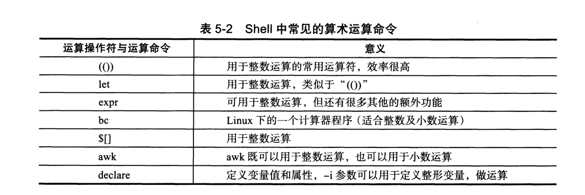
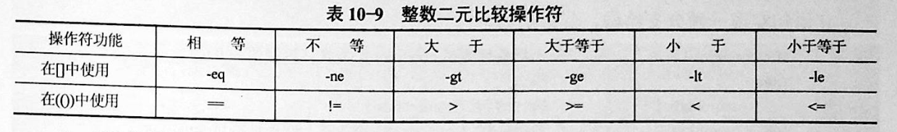
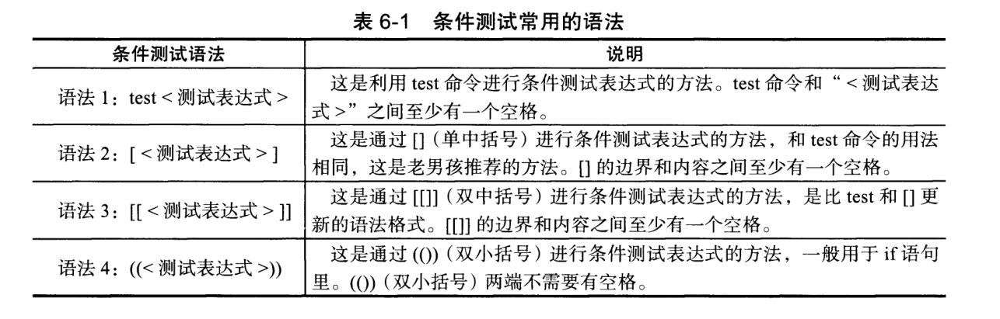
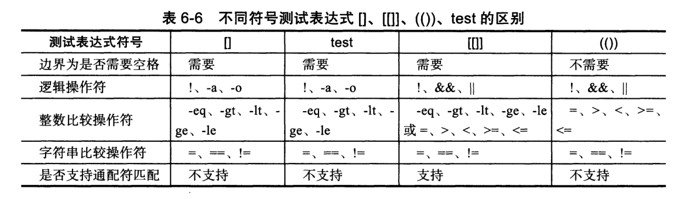
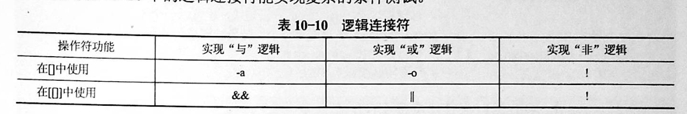
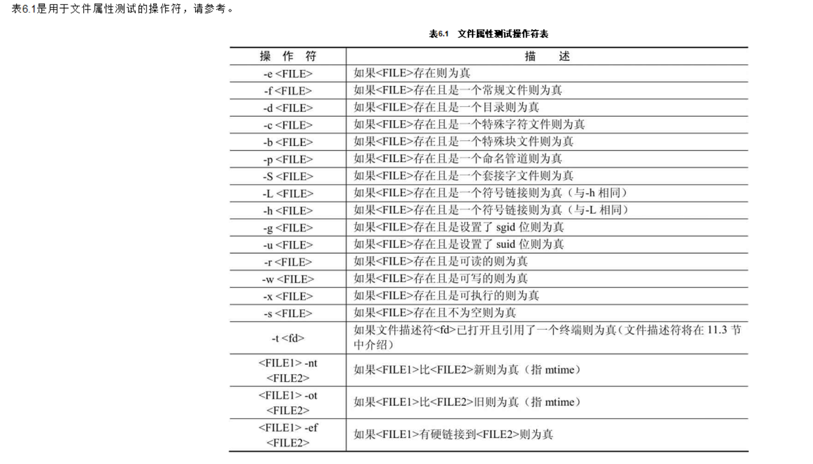
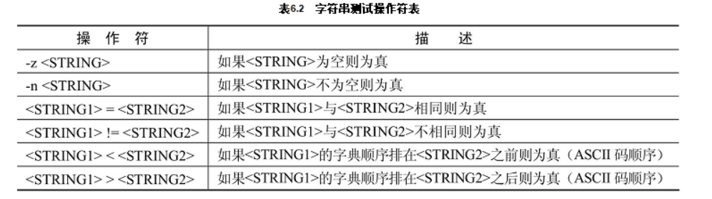
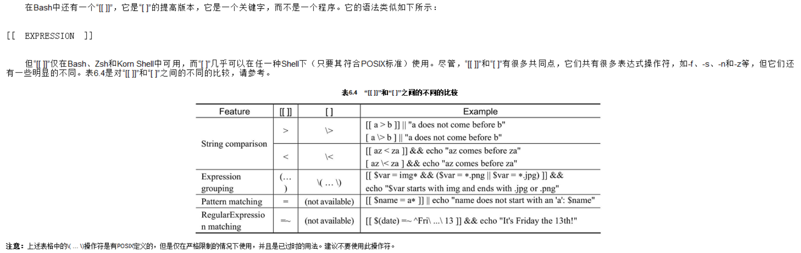

# 3 运算符

整数运算的4种方式



①
``` 
expr 2 + 3
expr $num1 + $num2

hujianli=`expr $num1 + $num2`
echo $hujianli

#r=`expr 4 + 5`
```


②
``` 

echo $[3+4]

sum=$[3+4]
echo $sum

echo $[$num1+$num2]

$[算术式]		     #r=$[4+5]

sum=$[sum+1]
echo $sum
```

③
``` 
$(( ))        	             		# 整数运算   #r=$((2+5*8))

r=$((2+5*8))
echo $r

sum2=$((num1+num2))
或者
sum3=$(($num1+$num2))


echo $((sum++))
echo $((sum--))


```

④
``` 
let 算术式 	             #let r=8+16


let sum=1+1
echo $sum


i=0
let i++
echo $i

let    let # 运算      let x=16/4    let x=5**5
```


awk实现计算
```
[root@k8s-master ~]# echo "7.7 3.8"|awk '{print ($1-$2)}'
3.9

[root@k8s-master ~]# echo "358 113"|awk '{print ($1-3)/$2}'
3.14159

[root@k8s-master ~]# echo "3 9"|awk '{print ($1+3)*$2}'
54
```
declare(同typeset)命令的用法
``` 
# 使用declare -i参数可以将变量定义为整形
[root@k8s-master ~]# declare -i A=30 B=7
# 因为是整形了可以直接进行运算了
[root@k8s-master ~]# A=A+B
[root@k8s-master ~]# echo $A
37
```


```
declare -i 变量=算术式        #declare -i r=8+16
+ - * / **                   # 分別为 "加、減、乘、除、密运算"
& | ^ !                      # 分別为 "AND、OR、XOR、NOT" 运算
%                            # 余数运算


算术代换：$(())
用于算术计算，$(())中的Shell变量取值将转换成整数，同样含义的$[]等价例如：

itcast$ VAR=45
itcast$ echo $(($VAR+3))
$(())中只能用+-*/和()运算符，并且只能做整数运算。

$[base#n],其中base表示进制,n按照base进制解释，后面再有运算数，按十进制解释。

echo $[2#10+11]
echo $[8#10+11]
echo $[10#10+11]

expr

    expr 14 % 9                    # 整数运算
    SUM=`expr 2 \* 3`              # 乘后结果赋值给变量
    LOOP=`expr $LOOP + 1`          # 增量计数(加循环即可) LOOP=0
    expr length "bkeep zbb"        # 计算字串长度
    expr substr "bkeep zbb" 4 9    # 抓取字串
    expr index "bkeep zbb" e       # 抓取第一个字符数字串出现的位置
    expr 30 / 3 / 2                # 运算符号有空格
    expr bkeep.doc : '.*'          # 模式匹配(可以使用expr通过指定冒号选项计算字符串中字符数)
    expr bkeep.doc : '\(.*\).doc'  # 在expr中可以使用字符串匹配操作，这里使用模式抽取.doc文件附属名

数值测

    #如果试图计算非整数，则会返回错误
    rr=3.4
    expr $rr + 1
    expr: non-numeric argument
    rr=
    expr $rr + 1
    6


bc

    echo "m^n"|bc            # 次方计算
    seq -s '+' 1000 |bc      # 从1加到1000
    seq 1 1000 |tr "\n" "+"|sed 's/+$/\n/'|bc   # 从1加到1000

#浮点数计算方法
#----------------------------------------------------
#方法1
#----------------------------------------------------
n=`echo "scale=2;172 / 2"| bc`
echo $n


#---------------------------------------------------
#方法2
#---------------------------------------------------
product=`awk 'BEGIN {x=5.3;y=6; printf "%.2f %.3f",x*y,x/y;}'`
echo $product

```


## 1 Shell表达式

## 1.1 整数测试

整数测试有两种形式的语法：

```
test number1 op number2
```

或者

```
[ number1 op number2 ]
```


```
比较符                              描述                           示例

-eq，equal                          等于            [ 1 -eq 1 ]为 true
-ne，not equal                     不等于           [ 1 -ne 1 ]为 false
-gt，greater than                   大于            [ 2 -gt 1 ]为 true
-lt，lesser than                    小于            [ 2 -lt 1 ]为 false
-ge，greater or equal            大于或等于         [ 2 -ge 1 ]为 true
-le，lesser or equal             小于或等于         [ 2 -le 1 ]为 false


```
· 整数二元比较操作符



```
[root@monitor ~]# [ 1 -gt 1 ] && echo true || echo false
false
[root@monitor ~]# [ 1 -ne 1 ] && echo true || echo false
false
[root@monitor ~]# [ 1 -eq 1 ] && echo true || echo false
true
[root@monitor ~]# [ 1 -ne 1 ] && echo true || echo false
false
[root@monitor ~]# [ 1 -gt 1 ] && echo true || echo false
false
[root@monitor ~]# [ 2 -gt 1 ] && echo true || echo false
true
[root@monitor ~]# [ 2 -lt 1 ] && echo true || echo false
false
[root@monitor ~]# [ 2 -le 1 ] && echo true || echo false
false
```

举例
``` shell
#!/usr/bin/env bash
#usage:xxx
#scripts_name:${NAME}.sh
# author：xiaojian
read -p "How old are you? " age

# 使用Shell算术运算符(())进行条件判断
if ((age<0||age>120)); then
    echo "Out of range!"
    exit 1
fi

# 使用多分支if语句
if ((age>=0&&age<13)); then
    echo "Child!"
elif ((age>=13&&age<20));then
    echo "Callan!"
elif ((age>=20&&age<30));then
    echo "P III!"
elif ((age>=30&&age<40));then
    echo "P IV!"
else
    echo "Sorry I asked."
fi

```


## 1.2 算术运算符

```
假定变量 a 为 10，变量 b 为 20：
注意：运算符两边有空格
```

|    运算符    | 说明 |举例|
| ---------- | --- | --- |
| '+' |  加法 | `expr $a + $b` 结果为 30|
| '-' |  减法 | `expr $a - $b` 结果为 -10|
| * |  乘法 | `expr $a \* $b` 结果为  200|
| / |  除法 | `expr $b / $a` 结果为 2|
| % |  取余 | `expr $b % $a` 结果为 0|
| = |  赋值 | a=$b 将把变量 b 的值赋给 a|
| ==|  相等 | 用于比较两个数字，相同则返回 true [ $a == $b ] 返回 false |
| !=|  不相等 | 用于比较两个数字，不相同则返回 true。	[ $a != $b ] 返回 true |


```shell
A=3
B=6
1、let 算术运算表达式
let C=$A+$B
2、$[算术运算表达式]
C=$[$A+$B]
3、$((算术运算表达式))
C=$(($A+$B))
4、expr 算术运算表达式，表达式中各操作数及运算符之间要有空格，而且要使用命令引用
C=`expr $A + $B`

```

#### * 使用expr外部程序

expr是一个Shell命令，可以计算某个表达式的值，其基本语法如下：

```
expr expression
```

---

```shell
# 计算 2 和 100 的和，即 102
result='expr 2 + 100'
echo "$result"
# 计算 2 和 5 的乘积，即 10
result='expr 2 \* 5'
echo "$result"
# 计算 24 和 8 的商，即 3
result='expr 24 / 8'
echo "$result"
```

#### * 使用$((…))

使用这种形式来进行算术运算写法比较自由，无需对运算符和括号做转义处理，可以采用松散或者紧凑的

```shell
# 紧凑格式，计算 3 和 6 的和
result=$((3+6))
echo "$result"
# 松散格式，计算 3 和 9 的和
result=$(( 3 + 9 ))
echo "$result"
# 计算 3 和 6 的乘积
reuslt=$(( 3 * 6 ))
```

#### * 使用$[…]

使用一个方括号同样可以执行算术运算，这种语法的特点与使用两个圆括号相同，无论是采用紧凑格式还是松散格式，都可以得到正确的结果。另外，算术表达式中的星号和圆括号也无需转义处理。

```shell
# 加法运算
result=$[4+5]
echo "$result"
# 复合运算
result=$[(1+2)*3]
echo "$result"
# 幂运算
result=$[ 2 ** 4 ]
echo "$result"
```

#### * 使用let命令

使用let命令可以执行一个或者多个算术表达式，其中的变量名无需使用$符号。如果表达式中含有空格或者其他特殊字符，则必须将其引用起来。

```
# 加法运算
let n=n+1
echo "$n"
# 乘法运算
let n=n*10
echo "$n"
# 幂运算
let n=n**2
echo "$n"
```

## 2 复合算术运算符

常用位运算符

```

运算符	说　明	举　例
<<	左移	4 << 2，将4左移2位，结果为16
>>	右移	8 >> 2，将8右移2位，结果为2
&	按位与	8 && 4，将8和4进行按位与运算，结果为0
|	按位或	8 | 4，将8和4进行按位或运算，结果为12
～	按位非	～8，将8进行按位非运算，结果为-9
^	按位异或	10 ^ 6，将10和6进行按二进制位异或运算，结果为12
```

## 3 自增/自减运算符

```

运算符								说　明
++variable			先将变量variable的值加1，然后再赋给variable
--variable			先将变量variable的值减1，然后再赋给variable
variable++			先使用variable的值，然后再将该变量的值加1
variable--			先使用variable的值，然后再将该变量的值减1
```

---

```
#! /bin/sh
# 定义变量 x
x=5
# 将变量 x 先自增，然后再计算表达式的值
x=$[ x + (++x) ]
echo "$x"
# 将变量先自减，然后再计算表达式的值
x=$[ --x ]
echo "$x"
# 先计算表达式的值，然后再自增
x=$((x++))
echo "$x"
# 先计算表达式的值，然后再自减
x=$(( x-- ))
echo "$x"
```

## 4 数字常量的进制

默认情况下，Shell总是以十进制来表示数字。但是，用户也可以在Shell中使用其他进制来表示数字，例如二进制、八进制和十六进制。在Shell中，用户可以使用两种语法来表示不同的进制，首先是增加前缀，例如以0开头的数字表示八进制，以0x开头的数字表示十六进制。第二种语法是使用井号“#”，例如2#1000表示二进制，8#42表示八进制。

```shell
#! /bin/sh
# 十进制 20
((x=20))
echo "$x"
# 八进制 20
((x=020))
echo "$x"
# 十六进制 20
((x=0x20))
echo "$x"
```


## 5 条件测试



``` 
整数的关系运算，可以使用Shell的算术运算符(())
```




## 6 布尔运算符

```
运算符             说明                                                   举例

!      非运算，表达式为 true 则返回 false，否则返回 true      [ ! false ] 返回 true 
-o 	   或运算，有一个表达式为 true 则返回 true                [ $a -lt 20 -o $b -gt 100 ] 返回 true 
-a 	   与运算，两个表达式都为 true 才返回 true                [ $a -lt 20 -a $b -gt 100 ] 返回 false 
```

## 7 逻辑运算符



```
运算符	       说明 	                     举例

&&	     逻辑的 AND            [[ $a -lt 100 && $b -gt 100 ]] 返回 false
||           逻辑的 OR	           [[ $a -lt 100 \|\| $b -gt 100 ]] 返回 true

  [ condition ] && action; #  如果 condition 为真，则执行 action
  [ condition ] || action; #  如果 condition 为假，则执行 action

```


## 8 文件测试
```

操作符	说　明
-a file	文件是否存在。如果文件file存在，则结果为0
-b file	文件是否存在，且为块文件。如果文件file是一个已经存在的块文件，则结果为0
-c file	文件是否存在，且为字符文件。如果file是一个已经存在的字符文件，则结果为0
-d file	文件是否存在，且为目录。如果文件file是一个已经存在的目录，则结果为0
-e file	同-a操作符
-s file	文件的长度是否大于0或者文件为非空文件。如果file是一个非空文件，则结果为0
-f file	文件存在，并且为常规文件。如果file是一个已经存在的常规文件，则结果为0
-w file	文件是否存在且可写。如果文件file是一个可写文件则结果为0
-L file	文件是否存在，并且为符号链接。如果文件file是一个已经存在的符号链接，则结果为0
-u file	文件是否设置suid位。如果文件file已经设置了suid位，则结果为0
-r file	文件是否存在，并且可读。如果文件file是一个已经存在的可读文件，则结果为0
-x file	文件是否存在，并且可执行。如果文件file是一个已经存在的可执行文件，则结果为0


[ -d DIR ]              如果DIR存在并且是一个目录则为真
[ -f FILE ]             如果FILE存在且是一个普通文件则为真
[ -z STRING ]           如果STRING的长度为零则为真
[ -n STRING ]           如果STRING的长度非零则为真
[ STRING1 = STRING2 ]   如果两个字符串相同则为真
[ STRING1 != STRING2 ]  如果字符串不相同则为真
[ ARG1 OP ARG2 ]        ARG1和ARG2应该是整数或者取值为整数的变量，OP是-eq（等于）-ne（不等于）-lt（小于）-le（小于等于）-gt（大于）-ge（大于等于）之中的一个

```



示例
``` 
#!/usr/bin/env bash
# 文件是否存在
test -e /bin/cp && echo "The command $_ found." || echo "The command $_ not found."

# 是否是一个普通文件
test -f /etc/hosts && echo "The command $_ found." || echo "The command $_ not found."

# 是否是一个目录
test -d /local && echo "The command $_ exist." || echo "The command $_ not exist."

# 是否是一个软连接
test -h /bin/sh && echo "The file $_ is a symbolic link." || echo "The file $_ not a symbolic link."

# 是否是可执行文件
test -x /bin/cp && echo "The file $_ is executable." || echo "The file $_ is not executable."
```


## 9 字符串测试
```
假定变量 a 为 "abc"，变量 b 为 "efg"：

在进行字符串比较时，最好使用双中括号 [[ ]]. 因为单中括号可能会导致一些错误，因此最好避开它们。

检查两个字符串是否相同：

[[ $str1 = $str2 ]]


测试两个字符串是否相同。
● [[ $str1 = $str2 ]] ：当 str1 等于 str2 时，返回真。也就是说， str1 和 str2 包
含的文本是一模一样的。
● [[ $str1 == $str2 ]] ：这是检查字符串是否相同的另一种写法

● [[ $str1 > $str2 ]] ：如果 str1 的字母序比 str2 大，则返回真。
● [[ $str1 < $str2 ]] ：如果 str1 的字母序比 str2 小，则返回真
● [[ $str1 != $str2 ]] ：如果 str1 和 str2 不相同，则返回真。

● [[ -z $str1 ]] ：如果 str1 为空串，则返回真。
● [[ -n $str1 ]] ：如果 str1 不为空串，则返回真。


运算符 	               说明 	                                 举例

=	          检测两个字符串是否相等，相等返回 true。 	         [ $a = $b ] 返回 false。
!= 	        检测两个字符串是否相等，不相等返回 true。 	     [ $a != $b ] 返回 true。
-z	         检测字符串长度是否为0，为0返回 true。	           [ -z $a ] 返回 false。
-n	         检测字符串长度是否为0，不为0返回 true。 	        [ -n "$a" ] 返回 true。
str	        检测字符串是否为空，不为空返回 true。 	         [ $a ] 返回 true。
```



## 10 Shell 中的中括号用法总结
http://www.runoob.com/w3cnote/shell-summary-brackets.html

### 举例说明
```
#!/usr/bin/env bash

# && 和 || 多用于 [[ ]]结构
# -a  和 -o 多用于 []结构

#例如
str1="Not empty"
str2=""
if [[ -n $str1 ]] && [[ -z $str2 ]];
then
  echo str1 is nonempty and str2 is empty string.
fi


test $(id -u) -eq 0 && echo "You?are?root" || echo "You?are?NOT?root"
#&&
command1 && command2
#只有当command1返回一个退出状态码0时，command2才会执行。
[[ `id -u` -eq 0 ]] || { echo "you are not root!!"; exit 1; }
#使用grep进行判断
grep "^yantaol" /etc/passwd && echo "The?account?found?in?/etc/passwd"


#方式1
if [[ -n $var && -e $var ]];then
    echo "\$var?is?not?null?and?a?file?named?$var?exists."
fi

if [[ $num -ge 90 && $num -le 100 ]]
then
    echo "Excellent!"
elif [[ $num -ge 80 && $num -lt 90 ]]
then
    echo "Good!"

fi

#方式2
if [ -n $var ] && [ -e $var ]
then
    echo "\$var?is?not?null?and?a?file?named?$var?exists."
fi


num=$1
#-a 和 -o的使用
#?如果$num的值大于等于90且小于100，
if [ "$num" -ge 90 -a "$num" -lt 100 ]; then
    :
elif [ "$num" -ge 80 -a "$num" -lt 90 ];then
    :
elif [ "$num" -ge 60 -a "$num" -lt 80 ];then
    :
fi


if [ "$var" -eq 98 -o "$var" -eq 47 -o "$var" -eq 68 ]
then
    echo "Test?succeeds."
else
    echo "Test?fails."
fi

[ ! -d /home/yantaol ] && mkdir /home/yantaol || echo "The?directory?is?exist."

```



## 11 字符串判断中x的作用
```
范例
if [ "x${var}" == "x" ]
if [ x"$DPVS_TYPE" == x"SNAT" ]

目的
防止出现语法错误。

[ x$1 = x ] is true if $1 is unset/null/empty or not.

Try yourself with:
TEST= ;[ x$TEST = x] && echo "TEST is unset"
and
TEST=lolz ;[ x$TEST = x ] && echo "TEST is unset"

类似于[ -z "${1:+x}" ]操作，当$1为空时，赋值给x，避免判断直接报错。
```
