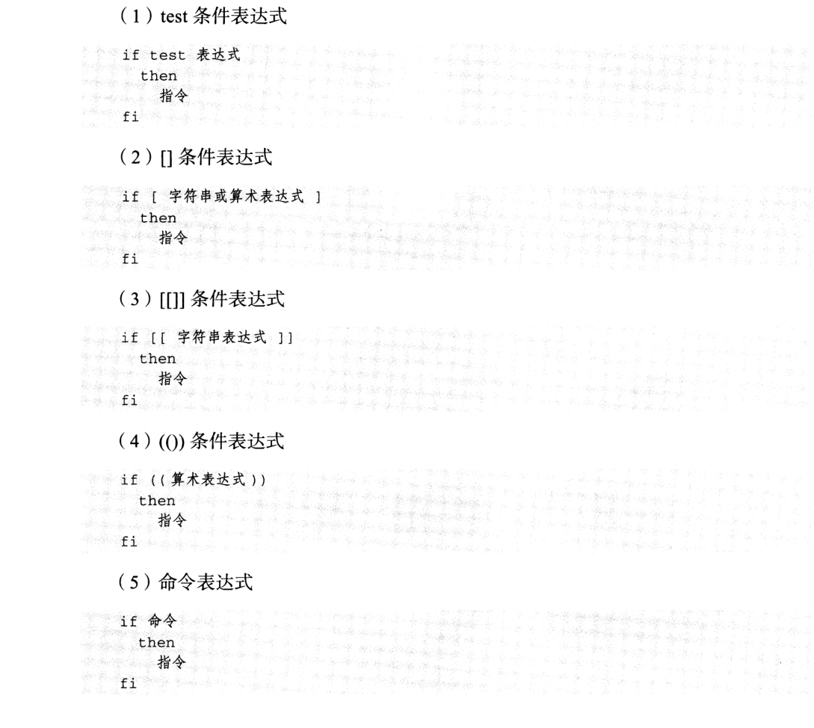
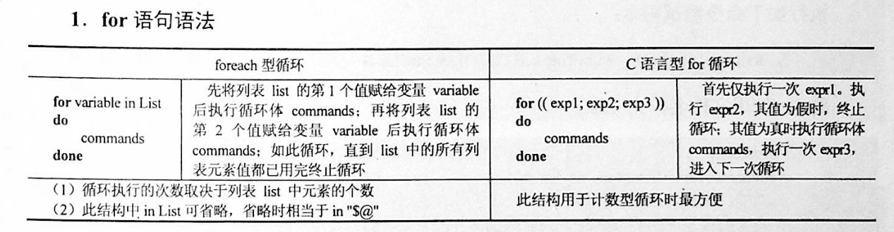
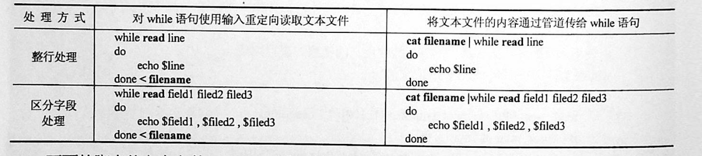
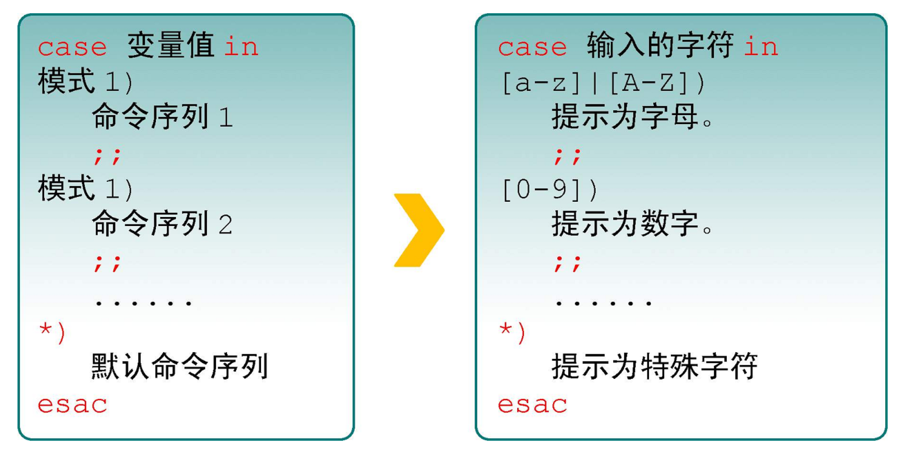

# 4 流程控制

## 1 if语句

#### 1.1 单分支




```
if condition
then
    command1
    command2
    ...
    commandN
fi
```

##### NOT
``` 
if ! condition:
then
    commad1
fi
```

举例说明
```shell
#!/bin/bash
echo "非空时候 if判断的返回"
if [ 0 ];then
    echo "Not None"
else
    echo "None"
fi

echo "为空时 if判断的返回"

if [ "" ];then
    echo "Not None"
else
    echo "None"
fi

echo "使用！取反空 if判断的返回"

if [ ! "" ];then
    echo "Not None"
else
    echo "None"
fi

echo "使用！取反非空 if判断的返回"

if [ ! 1 ];then
    echo "Not None"
else
    echo "None"
fi
```


##### AND
```
if condition1 && condition2:
then
    command1
else
    command2
fi
```

``` 
if [ -r $file ] && [ -w $file ] && [ -x $file ]:
then
    echo "You have read、write and execute permission on $file"
fi
```

##### OR
```

if condition1 || condition2:
then
    command1
fi
```

eg:

```
if [ `ps -ef |grep /usr/sbin/sshd|grep -v grep|wc -l` -eq 1 ];then echo "sshd server exist";fi
```

#### 1.2 双分支

```
if condition
then
    command1
    command2
    ...
    commandN
else
    command
fi
```


eg:

```
if [ `ps -ef |grep /usr/sbin/sshd|grep -v grep|wc -l` -eq 0 ];then echo "sshd server exist";else echo "sshd server not exist";fi
```

#### 1.3 多分支

```
if condition1
then
    command1
elif condition2
then
    command2
else
    commandN
fi
```

eg:

```
#! /bin/bash

cmd=`rpm -q centos-release|cut -d- -f3`

if [ $cmd -eq 6 ];then
	echo "sysversion is $cmd"
elif [ $cmd -eq 7 ];then
	echo "sysversion is $cmd"
else
	echo "sysversion is `rpm -q centos-release`"
fi
```


- if不一定要使用test

```shell
#!/usr/bin/env bash
dir=/home/bozo

//"2>/dev/null"会隐藏错误的信息
if cd "$dir" 2>/dev/null;then
    echo "Now in $dir"
else
    echo "Can't change to $dir"
fi
```

```shell
#!/bin/bash
#测试计算机的CPU品牌是AMD还是Intel。
#grep的-q选项，可以让grep进入静默模式，不管过滤到数据还是没有，都不显示输出结果。
#if命令会通过grep命令的返回值自动判断是否过滤到数据。

if grep -q AMD /proc/cpuinfo; then
echo "AMD CPU"
fi
if grep -q Intel /proc/cpuinfo; then
echo "Intel CPU"
fi
```


通过读取位置变量,实现分区管理工作

```shell
#!/bin/bash
#功能描述(Description):通过读取位置变量,实现分区管理工作.

#测试位置变量的个数
if [ $# -ne 2 ];then
    echo -e "\033[91m\t参数有误...\033[0m"
    echo "用法:$0 <磁盘名称> <create|new|remove|query>"
    exit
fi

#测试磁盘是否存在
if [ ! -b $1 ];then
    echo -e "\033[91m磁盘不存在!\033[0m"
    exit
fi

#根据不同的指令对磁盘进行分区管理
if [[ $2 == create ]];then
    parted -s $1 mklabel gpt
elif [[ $2 == new ]];then 
    parted -s $1 mkpart primary  1 100%
elif [[ $2 == remove ]];then
    parted -s $1 rm 1
elif [[ $2 == query ]];then
    parted -s $1 print
else
    clear
    echo -e "\033[91m\t操作指令有误...\033[0m"
    echo "可用指令:[create|new|remove|query]."
fi
```


## 2 for循环



```
for var in item1 item2 ... itemN
do
    command1
    command2
    ...
    commandN
done
```

### 2.1 带列表的for循环语句

eg1:

```
for i in /*;
do
    echo -e "   \c";
    find $i |wc -l|sort -nr;
done
```

eg2:

```shell
#!/bin/bash
for i in {1..10};
do
    echo $i
done

或者

for i in {a..z};do;echo $i;done

#!/bin/bash
#功能描述(Description):打印各种色块形状.
#练习循环嵌套

for i in $(seq 10)
do
    for j in $(seq $i)
    do
        echo -ne "\033[101m  \033[0m"
    done
    echo
done
```

eg3:

```shell
#!/bin/bash
for i in "$@"; 	# $@是将位置参数作为单个来处理
echo $i


也可以这样写：
$ for FILENAME in `ls chap?`; do mv $FILENAME $FILENAME~; done
```

### 2.2 for 循环C 语言风格的语法

常用于计数、打印数字序列：


    for (( expr1 ; expr2 ; expr3 )) ; do list ; done
```shell
#!/bin/bash
for ((i=1;i<=5;i++));    # 也可以 i--
do
    echo $i
done

for ((i=1,j=5;i<=5;i++,j--))
do
    echo "$i $j"
done
```

- for 打印99乘法表
```shell
#!/usr/bin/env bash
for ((i=1; i<=9; i++))
do
    for ((j=1; j<=9; j++));do
        let sum=${i}*${j}
        echo -n "${i}*${j}=${sum} "
    done
done
```


默认 for 循环的取值列表是以空白符分隔，也就是第一章讲系统变量里的$IFS:

```
#!/bin/bash
OLD_IFS=$IFS
IFS=":"
for i in $(head -1 /etc/passwd); do
echo $i
done
```

```
#!/bin/bash

for ip in 192.168.1.{1..254}; do

    if ping -c 1 $ip >/dev/null; then

        echo "$ip OK."

    else

        echo "$ip NO!"

    fi

done
```

### 2.3 for循环的死循环写法

`可用于监控`

示例1
```bash
#!/usr/bin/env bash
#usage:xxx
#scripts_name:xxx.sh
for ((;1;)); do
    echo "infinite loop........"
    sleep 1
done

```

示例2
```bash
#!/bin/bash
for ((i=0; i<1; i+=0))
do
        echo "infinite loop"
        sleep 1
done 
```

读取文件,判断url可用性

```
#!/bin/bash
#function:check url
filename=urllist.txt
for url in $(cat $filename)
do
status=`curl -I $url -s|awk '/HTTP/{print $2}'`
if [ $status == "200" ];then
	echo "Url:$url is ok!status is $status"
else
	echo "Url:$url is error!status is $status"
fi
done

```

### 2.4 不带列表的for循环语句

```shell
#! /bin/bash
# 不带条件列表
for arg
do
   # 输出每个参数
   echo "$arg"
done
```

### 2.5 使用for循环语句处理数组

使用for循环遍历数组非常方便

```shell
for variable in ${array[*]}
do
   statement1
   statement2
   ...
done
```

eg:

```shell
#! /bin/bash

# 定义数组
array=(Monday Tuesday Wednesday Thursday Friday Saturday Sunday)
# 通过 for 循环遍历数组元素
for day in ${array[*]}
do
   # 输出每个数组元素的值
   echo $day
done
```

## 3 while语句

格式：

```
while 条件表达式:do
    command
done
```

eg

```shell
#!/bin/bash
N=0
while [ $N -lt 5 ]; do
    let N++
    echo $N
done

下面的例子通过算术运算控制循环的次数：

#!/bin/sh

COUNTER=1
while [ "$COUNTER" -lt 10 ]; do
  echo "Here we go again"
  COUNTER=$(($COUNTER+1))
done
```


eg

```shell
#!/bin/bash
#功能描述(Description):while基本语法演示.
#通过grep过滤httpd，检测httpd服务是否为启动状态.

while ps aux | grep -v grep | grep -q httpd
do
    clear
    echo "      httpd运行状况:              "
    echo "----------------------------------"
    echo -e "\033[32mhttpd 正在运行中...\033[0m"
    echo "----------------------------------"
    sleep 0.5
done
    echo "httpd 被关闭"
```


- 无限循环，可以将脚本放到后台做deam

```shell
#!/bin/bash
while true
do
        HTTPD_STATUS=`service httpd status| grep running`
        if [ -z "$HTTPD_STATUS" ]; then
                echo "HTTPD is stopped, try to restart"
                service httpd restart
        else
                echo "HTTPD is running, wait 5 sec until next check"
        fi
        sleep 5
done
```


**死循环的三种写法**


```shell
#!/usr/bin/env bash
while :; do
    echo "ctrl +c to stop...."
    sleep 1
done


while ((1)); do
    echo "ctrl +c to stop...."
    sleep 1
done


while true; do
    echo "ctrl +c to stop...."
    sleep 1
done
```


选择菜单，小例子

```shell
#!/bin/sh

conntinue(){
    read -p "Press [Enter] key to continue ...." readEnterKey
}

while :; do
    clear

    echo "======================================="
    echo "          MAIN  -  MENU               "
    echo "======================================="
    echo "1. Display date and  time "
    echo "2. Display system     information"
    echo "3. Display what users are doing.  "
    echo "4. Exit"

    read -p "Enter your choice [ 1-4]:" choice  #从标准输入中读取用户的输入，赋值给choice
    case $choice in
        1 )
            echo "Today is $(date +%Y-%m-%d)" #打印当前日期
            echo "Current time: $(date +%H:%M:%S)"
            conntinue
            ;;
        2 )
            uname -a
            conntinue
            ;;
        3 )
            w
            conntinue
            ;;
        4 )
            echo "Bye!"
            exit 0
            ;;
        * )
            echo "Error :INVALID OPTION!!"
            conntinue
            ;;
    esac

done

```


条件表达式为 true，将会产生死循环,利用此可以将脚本一直放在后台进行执行
eg

```shell
#!/bin/bash
IP=10.75.128.8
dir="/DATA/oracle/netdir/"
if [ ! -d ${dir} ];then
	mkdir -p ${dir}
fi
echo 1 > ${dir}ping.lock
while true
do
	Time=`date +%F`
	TIME="${Time} 23:59"
	if [ "${data}" == "${TIME}" ];then
		mkdir ${dir}${Time} && mv ${dir}ping2.log ${dir}${Time}-ping2.log
		mv ${dir}${Time}-ping2.log ${dir}${Time}
	fi
	find ${dir} -mtime +7 -name "*-ping2.log" -exec rm -rf {} \;
	find ${dir} -mtime +7 -type d -exec rm -rf {} \;

	data=`date +%F' '%H:%M`
	data1=`date +%F' '%H:%M:%S`
	echo "------------${data1}---------------">>${dir}ping2.log
	ping -c 10 ${IP} >>${dir}ping2.log
	if [ $? -eq 1 ];then
		STAT=`cat ${dir}ping.lock`
		if [ ${STAT} -eq 1 ];then
			/usr/bin/python /DATA/oracle/netdir/GFweixin.py xuel GLP-VPN "GLP from PDC(172.16.6.1
50) ping 金融云(10.75.128.8)中断，请检查深信服VPN！ \n TIME:${data1}"			echo 0 > ${dir}ping.lock
		else
			continue
		fi
	else
		STAT=`cat ${dir}ping.lock`
		if [ ${STAT} -eq 0 ];then
			/usr/bin/python /DATA/oracle/netdir/GFweixin.py xuel GLP-VPN "GLP from PDC(172.16.6.1
50) ping 金融云(10.75.128.8)恢复！ \n TIME:${data1}"			echo 1 > ${dir}ping.lock
		else
			continue
		fi
	fi


done
```


文件处理

eg3:

```shell
#!/bin/bash
#function:check url
filename=urllist.txt
cat $filename | while read url;do
status=`curl -I $url -s|awk '/HTTP/{print $2}'`
if [ $status == "200" ];then
        echo "Url:$url is ok!status is $status"
else
        echo "Url:$url is error!status is $status"
fi
done
```

或

```shell
#!/bin/bash
#function:check url
filename=urllist.txt
while read url;
do
status=`curl -I $url -s|awk '/HTTP/{print $2}'`
if [ $status == "200" ];then
        echo "Url:$url is ok!status is ${status}"
else
        echo "Url:$url is error!status is ${status}"
fi
done <$filename
```


while读取文件的3种方法

· 使用while循环处理文本文件


```shell
#!/bin/sh
# @Author: huxiaojian
# @Date:   2018-09-28 15:38:08
# @Last Modified by:   huxiaojian
# @Last Modified time: 2018-09-28 15:43:04

# 读取文件方法1
count=1
cat test | while  read line ; do
	echo "Line $count: $line"
	count=$[ $count + 1 ]
done
echo "Finished processing the file"


# 读取文件方法2
[root@localhost ~]# cat while04.sh 
#!/bin/bash 
while read LINE do
 NAME=`echo $LINE | awk '{print $1}'`
 AGE=`echo $LINE | awk '{print $2}'` 
 Sex=`echo $LINE | awk '{print $3}'` 
 echo "My name is $NAME, I'm $AGE years old, I'm a $Sex" 
 done < student_info.txt
 
 
 
举例
#!/bin/sh
file=$1 
if [ $# -lt ]; then
	echo "Usage: $0 FILEPATH" 
	exit 
fi 
while read -r f1 f2 f3 
do 
	echo "Field 1: $f1 ===> Field2:$f2===>Field3:$f3" 
done <"$file"


## 读取文件3，使用for循环的方式
$ cat example.sh
#!/bin/bash
for i in `cat users.txt`
do
        #echo "$i"
id $i &>/dev/null
if [ "$?" -eq 0 ];then
        echo "$i already exists...."
else
        echo "add $i .... && create $i...."
fi
done
```


## 4 until语句

until循环也是运行前测试，但是until采用的是测试假值的方式，当测试结果为假时才继续执行循环体，直到测试为真时才停止循环。其语法如下：
``` shell
until expression
do
       command
done
```


until的无限循环
```shell
#方法一
until ((0))
do
       command
done


#方法二
until false
do
       command
done
```

until循环语句来批量地增加用户示例

```shell
#! /bin/bash
# 定义变量 i
i=1
# 一直循环到变量 i 的值为 21
until [ "$i" -eq 21 ]
do
   # 执行 useradd 命令添加用户
   useradd user$i
   # 修改用户密码
   echo "password" | passwd --stdin user$i > /dev/null
   # 循环变量自增
   let "i++"
done
```


## 5 break 和 continue 语句

break跳出循环

```shell
#!/bin/bash
#功能描述(Description):break基本语法演示.

for i in {1..5}
do
    [ $i -eq 3 ] && break
    echo $i
done
echo "game over."
```

continue

```shell
#!/bin/bash
N=0
while [ $N -lt 5 ]; do
    let N++
    if [ $N -eq 3 ]; then
        continue
    fi
    echo $N
done
```

## 6 case语句

语句

```
case 模式名	in
    模式 1)
        命令
        ;;
    模式 2)
        命令
        ;;
    *)
        不符合以上模式执行的命令
esac
```


eg

```shell
#!/bin/bash
case $1 in
    start)
        echo "start."
        ;;
    stop)
        echo "stop."
        ;;
    restart)
        echo "restart."
        ;;
    *)
      echo "Usage: nfs-kernel-server {start|stop|status|reload|force-reload|restart}"
      exit 1
esac
```

eg
```shell
#!/usr/bin/env bash
case $ANSWER in
    y|Y|YES|yes|Yes|yEs|yeS|YEs|yES?)
     echo "You input Yes..."
     ;;
    *)
     echo
     echo "Because?the?account,?$USER_ACCOUNT,?is?not?"
     echo "the?one?you?wish?to?delete,?we?are?leaving?the?script..."
     echo
     exi
     ;;
esac

```

eg
``` shell
$ cat checkkeys.sh
#!/bin/bash
read -p "请输入一个字符，并按enter键确认：" key
case "$key" in
  [a-z]|[A-Z])
    echo "您输入的是字母。"
;;
  [[:digit:]] )
    echo "您输入的是数字。"
;;
  *)
    echo "您输入的是空格、功能键或其他控制字符."
 esac

```


eg

```shell
shopt -s extglob
read -p "请输入任意字符:" key
case $key in
+([[:lower:]]))
    echo "您输入的是小写字母.";;
+([[:upper:]]))
    echo "您输入的是大写字母.";;
+([0-9]))
    echo "您输入的是数字.";;
*)
    echo "您输入的是其他特殊符号.";;
esac
```


eg 

``` shell
#!/usr/bin/env bash
#usage:xxx
#scripts_name:xxx.sh
# author：xiaojian

case $1 in
*.jpg)
    echo "$1 is jpg file"
   ;;
*.txt)
    echo "$1 is txt file"
   ;;
*.avi | *.wmv)
    echo "$1 is mplayer file"
   ;;
*.pdf)
    echo "$1 is pdf file"
   ;;
*.py)
    echo "$1 is python file"
   ;;
*)
    echo "don't know how to read this file;"
   ;;  
esac

```


eg
```shell
#!/bin/sh
# @Author: hujianli
# @Date:   2018-11-18 16:03:29
# @Last Modified by:   hujianli
# @Last Modified time: 2018-11-18 22:10:54
YES_NO_choice(){
read -t 10 -p "Please input you commit ,wait 5.....to exit: " input

case $input in
    [yY]|[yY][eE][sS] )
        echo "YES!!!!!"
        ;;
    [nN]|[nN][oO] )
        echo "NO  Error!!!!!"
        ;;
        *)
        echo "============================"
        ;;

esac


read -p "您确定需要执行该操作吗(y|n)?" key
case $key in
[Yy]|[Yy][Ee][Ss])
    echo "注意:您选择的是yes.";;
[Nn]|[Nn][Oo])
    echo "您选择的是no.";;
*)
    echo "无效的输入";;
esac


case/esac
case命令可类比C语言的switch/case语句，esac表示case语句块的结束。
C语言的case只能匹配整型或字符型常量表达式，而Shell脚本的case可以匹配字符串和Wildcard，
每个匹配分支可以有若干条命令，末尾必须以;;结束，
执行时找到第一个匹配的分支并执行相应的命令，然后直接跳到esac之后，不需要像C语言一样用break跳出。

#! /bin/sh

echo "Is it morning? Please answer yes or no."
read YES_OR_NO
case "$YES_OR_NO" in
yes|y|Yes|YES)
  echo "Good Morning!";;
[nN]*)
  echo "Good Afternoon!";;
*)
  echo "Sorry, $YES_OR_NO not recognized. Enter yes or no."
  exit 1;;
esac
exit 0


read -p "请输入任意字符:" key
case $key in
[a-z])
    echo "您输入的是小写字母.";;
[A-Z])
    echo "您输入的是大写字母.";;
[0-9])
    echo "您输入的是数字.";;
*)
    echo "您输入的是其他特殊符号.";;
esac
```

演示通配符的作用

```shell
#!/bin/bash
#演示扩展通配符的作用.

shopt -s extglob
read -p "请输入任意字符:" key
case $key in
+([Yy]))
    echo "您输入了至少1个[Yy]";;
?([Nn])o)
    echo "您输入的是[Nn]o或仅为o.";;
t*(o))
    echo "您输入的是t或to或too...";;
@([0-9]))
    echo "您输入的是单个数字.";;
!([[:punct:]]))
    echo "您输入的不是标点符号.";;
*)
    echo "您输入的是其他符号.";;
esac
```


## 7 select语句

- 制作一个选择菜单

  eg:
```shell
#!/bin/sh
# @Author: hujianli
# @Date:   2018-11-13 13:17:13
# @Last Modified by:   hujianli
# @Last Modified time: 2018-11-13 13:22:57
PS3="Run command: "

select choice in date w hostname "uname -a" Exit
do
    case $choice in
        date )
            echo "Current system date and time: "
            echo "======================================="
            $choice
            ;;
        w )
            echo "========================================"
            echo "Who is logged on and what they are doing"
            echo "========================================"
            $choice
            ;;
        hostname )
            echo "========================================"
            echo "Hostname: "
            echo "========================================"
            $choice

            ;;
        "uname -a" )
            echo "========================================"
            echo "System information"
            echo "========================================"
            $choice

            ;;
        Exit )
            echo "Bye!"
            exit
            ;;

    esac

done
```
