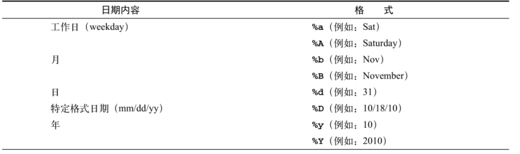

# shell技巧与杂项

## echo和printf打印

### echo

```bash
#!/bin/bash
#version:1.0
#这个脚本仅演示菜单输出，没有具体的功能实现

echo "这是一个打印菜单的例子"

echo "1.查看网卡信息"
echo "2.查看内存信息"
echo "3.查看磁盘信息
4.查看CPU信息
5.查看账户信息"

#!/bin/bash
#Version:2.0
clear
echo -e "\033[42m---------------------------------\033[0m"
echo -e "\e[2;10H这里是菜单\t\t#"
echo -e "#\e[32m 1.查看网卡信息\e[0m                #"
echo -e "#\e[33m 2.查看内存信息\e[0m                #"
echo -e "#\e[34m 3.查看磁盘信息\e[0m                #"
echo -e "#\e[35m 4.查看CPU信息\e[0m                 #"
echo -e "#\e[36m 5.查看账户信息\e[0m                #"
echo -e "\033[42m---------------------------------\033[0m"
echo
```

### printf

```shell
#!/bin/bash
#Version:1.0
clear
printf  "\e[42m%s\n\e[0m" "---------------------------------"
printf  "\e[2;10H%s\t\t\n" "这里是菜单" 
printf  "\e[32m%s\e[0m\n"  "1.查看网卡信息" 
printf  "\e[35m%s\e[0m\n"  "2.查看内存信息" 
printf  "\e[36m%s\e[0m\n"  "3.查看磁盘信息" 
printf  "\e[34m%s\e[0m\n"  "4.查看CPU信息" 
printf  "\e[33m%s\e[0m\n"  "5.查看账户信息" 
printf  "\e[42m%s\n\e[0m" "---------------------------------"
echo
```

```shell
#!/bin/bash

printf "%-5s %-10s %-4s\n" NO Name Mark
printf "%-5s %-10s %-4.2f\n" 01 Tom 90.3456
printf "%-5s %-10s %-4.2f\n" 02 Jack 89.2345
printf "%-5s %-10s %-4.2f\n" 03 Jeff 98.4323

# %-5s 格式为左对齐且宽度为5的字符串代替（-表示左对齐），不使用则是又对齐。
# %-4.2f 格式为左对齐宽度为4，保留两位小数。
```

## cron

```shell
crontab -e     	 # 编辑计划任务
crontab -l		# 查看当前计划任务
crontab -r		# 删除某条计划任务

# 在crontab命令中加上-u参数来编辑他人的计划任务
```

示例

```shell
25 3 * * 1,3,5  /usr/bin/tar -czvf backup.tar.gz /home/wwwroot 
0 1 * * 1-5     /usr/bin/rm -rf /tmp/*


0 */3 * * * /usr/local/apache2/apachectl restart
#表示每隔3个小时重启apache服务一次。

30 3 * * 6 /webdata/bin/backup.sh
#表示每周六的3点30分执行/webdata/bin/backup.sh脚本的操作。

0 0 1,20 * *  fsck /dev/sdb8
#表示每个月的1号和20号检查/dev/sdb8磁盘设备。

10 5 */5 * *  echo "">/usr/local/apache2/log/access_log
#表示每个月的5号、10号、15号、20号、25号、30号的5点10分执行清理apache日志操作。

*  */1  *  *  * service httpd restart
#每小时重启httpd 进程

23-3/1  *  *  *      service httpd restart
# 从23点开始到3点，每小时重启httpd 进程

30 23 *  *  *   service httpd restart
#每天晚上23点30分重启httpd进程

30 23 1  *  *   service httpd restart
#每月的第一天晚上23点30分重启httpd进程

30 23 1  1  *   service httpd restart
#每年1月1日的晚上23点30分重启httpd

30 23 *  *  0   service httpd restart
#每周日晚上23点30分重启httpd进程
```


## 标准输入输出重定向

一般情况下，每个 Unix/Linux 命令运行时都会打开三个文件：

```shell
标准输入文件(stdin)：stdin的文件描述符为0，Unix程序默认从stdin读取数据。
标准输出文件(stdout)：stdout 的文件描述符为1，Unix程序默认向stdout输出数据。
标准错误文件(stderr)：stderr的文件描述符为2，Unix程序会向stderr流中写入错误信息。
默认情况下，command > file 将 stdout 重定向到 file，command < file 将stdin 重定向到 file。


cmd > file             把标准输出重定向到新文件中
cmd >> file            追加
cmd > file 2>&1        标准出错也重定向到1所指向的file里
cmd >> file 2>&1
cmd < file1 > file2    输入输出都定向到文件里
cmd < &fd              把文件描述符fd作为标准输入
cmd > &fd              把文件描述符fd作为标准输出
cmd < &-               关闭标准输入


如果希望 stderr 重定向到 file，可以这样写：
$ command 2 > file


如果希望 stderr 追加到 file 文件末尾，可以这样写：
$ command 2 >> file
#2 表示标准错误文件(stderr)。


如果希望将 stdout 和 stderr 合并后重定向到 file，可以这样写：
$ command &>file
或者将错误输出转为标准输出，然后一同定向到一个文件
$ command > file 2>&1
或者
如果希望对 stdin 和 stdout 都重定向，可以这样写：
$ command >> file 2>&1

command 命令将 stdin 重定向到 file1，将 stdout 重定向到 file2。
$ command < file1 >file2
```


如果希望屏蔽 stdout 和 stderr，可以这样写：

```
同时重定向命令的标准输出和标准错误的信息到/dev/null的语法如下所示：
command &> /dev/null

command >& /dev/null

command > /dev/null 2>&1

command 2>&1 > /dev/null 
```


* /dev/tty

```
/dev/tty是一个很实用的文件，当程序打开这个文件时，Uninx/Linux会自动将它重定向到当前所处的终端，
输出到此的信息只会显示在当前工作的显示器上。当某些时候（指定了脚本输出到/dev/null）时，而又想在当前终端上
显示一些很重要的信息，就可以调用这个设备,写入信息，这样做可以强制信息到终端。

$ a=`tty`
$ echo "aaa" >/dev/null > $a
aaa
```

```
$ tty
/dev/pty0

$ echo "aaa" > /dev/tty0
$ echo "aaa" > /dev/pty0
aaa
```

举例

```shell
#!/usr/bin/env bash
#usage:xxx
#scripts_name:xxx.sh
# author：xiaojian
#  设置用户和密码

printf "Enter User:"
read user
printf "Enter new passwd:"

#关闭自动打印输入字符的功能
stty -echo

read pass < /dev/tty            #读取密码
echo
printf "Enter again:"
read pass2 < /dev/tty           #再次读取密码
stty echo                       #打开输入字符的功能


if [[ "$pass" != "$pass2" ]]; then
    echo "Two passwords do not match!"
else
    echo $pass2 | passwd $user --stdin
    echo "Passwd is Successful setup!"
fi
```


* /dev/null 

```shell
如果希望执行某个命令，但又不希望在屏幕上显示输出结果，那么可以将输出重定向到 /dev/null：

$ command > /dev/null
/dev/null 是一个特殊的文件，写入到它的内容都会被丢弃；如果尝试从该文件读取内容，那么什么也读不到。但是 /dev/null 文件非常有用，将命令的输出重定向到它，会起到"禁止输出"的效果。
```


* 从文件输入

```shell
#!/usr/bin/env bash
if [ $# -ne 1 ]; then
    echo "Usage: $0 FILEPATH"
    exit
fi

file=$1

#第一个参数为输入文件，并读取2行内容
{
    read line1
    read line2
} < $file

echo "First line in $file is $line1"
echo "Second line in $file is $line2"
exit 0
```


* exec命令分配文件描述符

用户在命令后面使用重定向操作符的时候，重定向只对当前的命令有效。用户可以使用exec命令创建新的文件描述符，并且将文件描述符绑定到文件或者另外一个文件描述符或者文件

常用的重定向操作

```shell
重定向					说　明
exec 2> file		将所有命令的标准错误重定向到文件file
exec n< file		只读的方式打开名称为file的文件，并且使用文件描述符n，n是大于3的整数
exec n> file		以写入的方式打开名称为file的文件，并且使用文件描述符n，n是大于3的整数
exec n<> file		以读写方式打开文件file，并且使用文件描述符n，n是大于3的整数
exec n>&-			关闭文件描述符n
exec n>&m			使得文件描述符n成为文件描述符m的副本，即将文件描述符m复制到n
exec n>&-			关闭文件描述符n
```

exec 3文件输出例子

```shell
exec 3<input.txt # 使用文件描述符3

$ echo this is a test line > input.txt
$ exec 3<input.txt
现在你就可以在命令中使用文件描述符 3 了。例如：
$ cat<&3
this is a test line

#创建一个用于写入（截断模式）的文件描述符：
$ exec 4>output.txt
$ echo newline >&4
$ cat output.txt
newline


#创建一个用于写入（追加模式）的文件描述符:
$ exec 5>>input.txt
$ echo appended line >&5
$ cat input.txt
newline
appended line
```

示例

```
#!/bin/sh
# @Author: huxiaojian
# @Date:   2018-11-08 17:17:26
# @Last Modified by:   hujianli
# @Last Modified time: 2018-11-09 13:45:07
NOW=$(date + %Y%m%d)

#定义输出文件
UTPUT="/tmp/sysinfo.${NOW}.log"

#定义文件描述符
exec 3> $OUTPUT


echo "**********************************************" >&3
echo "************* File System Disk Space Usage ****" >&3
echo "**********************************************" >&3
df -H >&3


echo "**********************************************" >&3
echo "************* Operating System Info  ****" >&3
echo "**********************************************" >&3
uname -a >&3

[ -x /usr/bin/lsb_release ] && /usr/bin/lsb_release -a >&3 
echo "/usr/bin/lsb_release not found"


echo "**********************************************" >&3
echo "************* Amount of Free And Used Memory ****" >&3
echo "**********************************************" >&3

free -m >&3

echo "**********************************************" >&3
echo "************* Top 10 CPU Eating Process ****" >&3
echo "**********************************************" >&3
ps auxf | sort -nr -k 3 | head -10 >&3


echo "**********************************************" >&3
echo "************* Network DEVICE information [eth0] ****" >&3
echo "**********************************************" >&3
netstat -i | grep -q eth0 && /sbin/ifconfig eth0 >&3

echo "**********************************************" >&3
exec 3> $OUTPUT


echo "---------------------------------------------" >&3
echo "System Info run @-@ $(date) for $(hostname)"   >&3
echo "---------------------------------------------" >&3

echo "**********************************************" >&3
echo "************** Install Hared Disk ************" >&3
echo "**********************************************" >&3

fdisk -l | egrep "Disk /dev" >&3

echo "**********************************************" >&3
echo "************** CPU information ************" >&3
echo "**********************************************" >&3

grep 'mode name' /proc/cpuinfo| uniq >&3

echo "**********************************************" >&3
echo "************* File System Disk Space Usage ****" >&3
echo "**********************************************" >&3
df -H >&3


echo "**********************************************" >&3
echo "************* Operating System Info  ****" >&3
echo "**********************************************" >&3
uname -a >&3

[ -x /usr/bin/lsb_release ] && /usr/bin/lsb_release -a >&3 
echo "/usr/bin/lsb_release not found"


echo "**********************************************" >&3
echo "************* Amount of Free And Used Memory ****" >&3
echo "**********************************************" >&3

free -m >&3


echo "**********************************************" >&3
echo "************* Top 10 Memory Eating Process ****" >&3
echo "**********************************************" >&3
ps auxf | sort -nr -k 4 | head -10 >&3


echo "**********************************************" >&3
echo "************* Top 10 CPU Eating Process ****" >&3
echo "**********************************************" >&3
ps auxf | sort -nr -k 3 | head -10 >&3


#关闭文件描述符3
exec 1>&3	#恢复标准输出
exec 3> &-
```

### 文件IO标识符

```
#!/usr/bin/env bash

标准输入（stdin）、标准输出（stdout）、标准错误输出（stderr），分别用文件标识符0、1、2来标识
如果要为进程打开其他的输入输出，则需要从整数3开始标识。
默认情况下，标准输入为键盘，标准输出和错误输出为显示器。


exec 5>file
#使用文件描述符5的命令
exec 5>&-
# 接下来的命令不再需要使用文件描述符5

#在文件描述符4上打开用于读写的文件/tmp/file
exec 4<> /tmp/file
#从文件描述符4读取前3个字符
read -n 3 var <& 4
echo $var

echo -n + tow >& 4
exec 4>&-
cat /tmp/file
one+two

#要将标准输出和标准错误同时定向到同一个文件中，可使用如下命令：
COMMAND > stdout_stderr.txt 2>&1
or
COMMAND &> stdout_stderr.txt

COMMAND > stdout.txt &> /dev/null                       #屏幕上不显示任何输出
find / -type f -name *.txt > /dev/null 2>&1             #屏幕上不显示任何输出


#使用块记录日志		
{
	...
	...
} > $LOGFILE 2>&1


#将file文件作为标准输出
$ exec > 1.txt

huxiaojian@DESKTOP-EKCVIQ7 ~
$ echo "aa"

huxiaojian@DESKTOP-EKCVIQ7 ~
$ whoami

huxiaojian@DESKTOP-EKCVIQ7 ~
$ ps aux

huxiaojian@DESKTOP-EKCVIQ7 ~
$ exec >/dev/tty

huxiaojian@DESKTOP-EKCVIQ7 ~
$ ps aux
      PID    PPID    PGID     WINPID   TTY         UID    STIME COMMAND
    10684   11620   10684      16140  pty0      197609 12:44:23 /usr/bin/ps
    11620    8952   11620       8128  pty0      197609 11:56:23 /usr/bin/bash
     8952       1    8952       8952  ?         197609 11:56:23 /usr/bin/mintty

huxiaojian@DESKTOP-EKCVIQ7 ~
$ cat 1.txt
aa
huxiaojian
      PID    PPID    PGID     WINPID   TTY         UID    STIME COMMAND
    16616   11620   16616      11180  pty0      197609 12:44:10 /usr/bin/ps
    11620    8952   11620       8128  pty0      197609 11:56:23 /usr/bin/bash
     8952       1    8952       8952  ?         197609 11:56:23 /usr/bin/mintty


#aaa.txt文件并指定标识符为3，
huxiaojian@DESKTOP-EKCVIQ7 ~
$ cat aaa.txt
b
d
c
e
f
g

huxiaojian@DESKTOP-EKCVIQ7 ~
$ exec 3<aaa.txt

huxiaojian@DESKTOP-EKCVIQ7 ~
$ sort <&3
b
c
d
e
f
g

#-----------------------------------------------------------------------------
#将写入指定文件标识符的内容写入指定文件
#-----------------------------------------------------------------------------
#打开/关闭文件标识符
$ exec 3>aaa.txt

huxiaojian@DESKTOP-EKCVIQ7 /home
$ cat aaa.txt

huxiaojian@DESKTOP-EKCVIQ7 /home
$ echo "hello word11 " >&3

huxiaojian@DESKTOP-EKCVIQ7 /home
$ echo "hello word12 " >&3

huxiaojian@DESKTOP-EKCVIQ7 /home
$ echo "hello word13 " >&3

huxiaojian@DESKTOP-EKCVIQ7 /home
$ exec 3>&-         #关闭文件标识符

huxiaojian@DESKTOP-EKCVIQ7 /home
$ cat aaa.txt
hello word11
hello word12
hello word13


#------------------------------------------------------------
#创建文件标识符的拷贝 标识符3和4都指向同一个文件
#------------------------------------------------------------
[root@iZuf6i0q7nfqv3ii5lhz0mZ home]# exec 3>aaa.sh
[root@iZuf6i0q7nfqv3ii5lhz0mZ home]# exec 4<3&

[root@iZuf6i0q7nfqv3ii5lhz0mZ home]# echo "this is &3" >&3
[root@iZuf6i0q7nfqv3ii5lhz0mZ home]# echo "this is &4" >&4
[root@iZuf6i0q7nfqv3ii5lhz0mZ home]# echo "this is &34" >&4
[root@iZuf6i0q7nfqv3ii5lhz0mZ home]# echo "this is &34(2)" >&3

[root@iZuf6i0q7nfqv3ii5lhz0mZ home]# exec 3>&-
[root@iZuf6i0q7nfqv3ii5lhz0mZ home]# cat aaa.sh
this is &3
this is &4
this is &34
this is &34(2)


root@iZuf6i0q7nfqv3ii5lhz0mZ home]# exec 3>hujianli.log
[root@iZuf6i0q7nfqv3ii5lhz0mZ home]# exec 4<&3
[root@iZuf6i0q7nfqv3ii5lhz0mZ home]# echo "&3 input " > &3
-bash: syntax error near unexpected token `&'
[root@iZuf6i0q7nfqv3ii5lhz0mZ home]# echo "&3 input "  >&3
[root@iZuf6i0q7nfqv3ii5lhz0mZ home]# echo "&4 input "  >&3
[root@iZuf6i0q7nfqv3ii5lhz0mZ home]# echo "&3-1 input "  >&3
[root@iZuf6i0q7nfqv3ii5lhz0mZ home]# echo "&4-2 input "  >&3
[root@iZuf6i0q7nfqv3ii5lhz0mZ home]# exec 3>&-
[root@iZuf6i0q7nfqv3ii5lhz0mZ home]# exec 4>&-
[root@iZuf6i0q7nfqv3ii5lhz0mZ home]# cat hujianli.log
&3 input
&4 input
&3-1 input
&4-2 input


#-------------------------------------------------------
# 同时读取和写入数据到文件中
#-------------------------------------------------------

#!/usr/bin/env bash
#usage:xxx
#scripts_name:xxx.sh

#开启描述符3，用于读取信息
exec 3< test.txt

#卡其描述符4，用于写入信息
exec 4> output.txt

# 读取描述符3中的2行数据
read -u 3 a
read -u 3 b

# 屏幕上输出读取的数据
echo "Data read from fd # 3:"

# 打印变量a和b的值
echo $a
echo $b


echo "Writing data read from fd 3 to fd 4....."

# 在文件描述符4上向文件/temp/output.txt写入数据
echo "Field #1 - $a " >&4
echo "Field #2 - $b " >&4

# 关闭文件描述符3
exec 3<&-
#关闭文件描述符4
exec 4<&-


#-----------------------------------------------------------
# 创建文件标识符的拷贝
#-----------------------------------------------------------

[root@iZuf6i0q7nfqv3ii5lhz0mZ home]# cd /dev/fd/
[root@iZuf6i0q7nfqv3ii5lhz0mZ fd]# ll
total 0
lrwx------ 1 root root 64 Nov 22 10:55 0 -> /dev/pts/1
lrwx------ 1 root root 64 Nov 22 10:55 1 -> /dev/pts/1
lrwx------ 1 root root 64 Nov 22 10:55 2 -> /dev/pts/1
lrwx------ 1 root root 64 Nov 22 13:05 255 -> /dev/pts/1
[root@iZuf6i0q7nfqv3ii5lhz0mZ fd]# exec 3</home/hujianli.log
[root@iZuf6i0q7nfqv3ii5lhz0mZ fd]# exec 4<&3
[root@iZuf6i0q7nfqv3ii5lhz0mZ fd]# ll
total 0
lrwx------ 1 root root 64 Nov 22 10:55 0 -> /dev/pts/1
lrwx------ 1 root root 64 Nov 22 10:55 1 -> /dev/pts/1
lrwx------ 1 root root 64 Nov 22 10:55 2 -> /dev/pts/1
lrwx------ 1 root root 64 Nov 22 13:05 255 -> /dev/pts/1
lr-x------ 1 root root 64 Nov 22 10:55 3 -> /home/hujianli.log
lr-x------ 1 root root 64 Nov 22 13:05 4 -> /home/hujianli.log
[root@iZuf6i0q7nfqv3ii5lhz0mZ fd]# cat 3
&3 input
&4 input
&3-1 input
&4-2 input
[root@iZuf6i0q7nfqv3ii5lhz0mZ fd]# cat 4
&3 input
&4 input
&3-1 input
&4-2 input
```

**小结**

```
#------------------------------------------------------------
# 小结
#-----------------------------------------------------------
给一个输入文件指定一个文件描述符的语法是：exec [n]< file。 
给一个输出文件指定一个文件描述符的语法是：$ exec [n]> file。 
关闭文件描述符的语法是：[n]<&- 或 [n]>&-。

符号“<>”是Bash中的菱形操作符，这个操作符用于打开一个可读写的操作符。
$ cat exec_read_write.sh
#!/bin/bash
echo "one two " >/tmp/file

#开启/tmp/file的读写，描述符4
exec 4<> /tmp/file

#读取文件描述符前3个字符给var变量
read -n 3 var <&4
echo $var

echo -n + >&4
echo 4>&-
```


### tree

```
# tee命令把结果输出到标准输出，另一个副本输出到相应文件。
df -k | awk '{print $1}' | grep -v "文件系统" | tee a.txt


# tee -a a.txt表示追加操作。
df -k | awk '{print $1}' | grep -v "文件系统" | tee -a a.txt
```


### Here Document

#### 输出提示信息

```
# 输出提示信息
cat <<End-of-message
   8 -------------------------------------
   9 This is line 1 of the message.
  10 This is line 2 of the message.
  11 This is line 3 of the message.
  12 This is line 4 of the message.
  13 This is the last line of the message.
  14 -------------------------------------
End-of-message
```

#### 抑制输出时前边的tab

```
# <<-LimitString可以抑制输出时前边的tab(不是空格). 这可以增加一个脚本的可读性.	
cat <<-ENDOFMESSAGE
	This is line 1 of the message.
	This is line 2 of the message.
	This is line 3 of the message.
	This is line 4 of the message.
	This is the last line of the message.
ENDOFMESSAGE
```

#### 关闭参数替换	

```
# 关闭参数替换
NAME="John Doe"
RESPONDENT="the author of this fine script"

cat <<'Endofmessage'
Hello, there, $NAME.
Greetings to you, $NAME, from $RESPONDENT.
Endofmessage


或者
cat <<\Endofmessage
Hello, there, $NAME.
Greetings to you, $NAME, from $RESPONDENT.
Endofmessage
```

#### 举例说明

```bash
#!/bin/bash
cat > file.txt <<EOF
context
EOF

ls aa >/dev/null 2>&1


cat > /tmp/test.txt << HERE
该文件为测试文件。
测试完后，记得将该文件删除。
Welcome to Earth.
HERE


#创建文件			
cat << EOF > foo.sh
   printf "%s was here" "$name"
EOF

cat >> foo.sh <<EOF
   printf "%s was here" "$name"
EOF


#重定向到文件			
sudo mkdir -p /etc/docker
sudo tee /etc/docker/daemon.json <<-'EOF'
{
  "registry-mirrors": ["https://du8c1in9.mirror.aliyuncs.com"]
}
EOF
sudo systemctl daemon-reload
sudo systemctl restart docker


#不能屏蔽Tab键,缩进将作为内容的一部分被输出
#注意hello和world前面是tab键
cat << EOF
	hello
	world
EOF

#Tab键将被忽略,仅输出数据内容
cat <<- EOF
	hello
	world
EOF
```


一个Here Document用于说明文档的示例

```
usage() {

cat <<-EOF

  usage: command [-x] [-v] [-z] [file ...]

  A short explanation of the operation goes here.

  It might be a few lines long, but shouldn't be excessive.

EOF

}
```

使用Here Document进行硬盘分区

```shell
#!/bin/bash
#本脚本会自动将vdb整个磁盘分成一个区,将将该分区格式化.
#注意:所有数据均将丢失!!!
#n(新建分区),p(新建主分区),1(主分区编号为1)
#回车(从磁盘哪个位置开始分区,默认从第1个扇区)
#回车(分区到哪个扇区结束,回车代表最后,将整个磁盘分1个区)
#wq(保存退出),mkfs.xfs(格式化命令)
fdisk /dev/vdb << EOF
n
p
1


wq
EOF

mkfs.xfs /dev/vdb1

[ ! -d /data ] && mkdir /data
cat >> /etc/fstab << EOF
/dev/vdb1  /data   xfs   defaults  0 0
EOF
mount -a
```

自动发送邮件，使用Here Document

```bash
mail -s warning root@localhost << EOF
This is content.
This is a test mail for redirect.
EOF
```


## 常见小技巧

### stty关闭回显

```
#!/usr/bin/env bash
#usage:xxx
#scripts_name:xxx.sh
echo -e "Enter password:"
# 在读取密码前禁止回显
stty -echo
read password
# 重新允许回显
stty echo
echo
echo -e "$password"
echo Password read.
```

### 计算运行时间

```
#!/bin/bash
# 文件名: time_take.sh
start=$(date +%s)
commands;
statements;
end=$(date +%s)
difference=$(( end - start))
echo Time taken to execute commands is $difference seconds.

或者
$ cat test3.sh
#!/bin/bash
start=$(date +%s)
sleep 3
end=$(date +%s)
echo -e "speed $((end - start)) times....."
```


### date的常见用法




date使用示例

```
时间加减：
显示前 30 秒：date -d '-30 second' +'%F %T'
显示前一分钟：date -d '-1 minute' +'%F %T'
显示前一个时间：date -d '-1 hour' +'%F %T'
显示前一个天：date -d '-1 day' +'%F %T'
显示上一周：date -d '-1 week' +'%F %T'
显示上一个月日期：date -d '-1 month' +%F
显示上一年日期：date -d '-1 year' +%F
或
显示前一天日期：date -d yesterday +%F
显示后一天日期：date -d tomorrow +%F
```


### 持续执行命令直至成功才退出

```
repeat() { while :; do $@ && return; sleep 30; done }


# 间隔30s就去下载tar.gz包，直至下载成功。
repeat wget -c http://www.example.com/software-0.1.tar.gz
```

### tr:替换或删除字符

```
tr: 转换字符或删除字符
    tr '集合1' '集合2'
    tr -d '字符集合'
    
# 压缩重复字符
result='tr -s "[a-z]" < demo9.txt'

# 删除空白行
result='cat demo10.txt | tr -s ["\n"]'

# 将当前目录在的所有文件的文件名转为大写
for file in 'ls';do
   echo "$file" | tr 'a-z' 'A-Z'
done

# 删除数字和冒号
result='tr -d "[0-9][:]" < demo11.txt'

$ tr 'a-z' 'A-Z' <a.txt >a1.txt  # 将文本内容转换为大写
$ tr '{}' '()' <test.txt >newfile.txt   # 将文本的大括号转为小括号
$ tr '{}' '\[]' <test.txt >newfile.txt  # 将文本的大括号转为中括号
```

### screen

```
* screen -ls
* screen -r
* screen -wipe
```


### 脚本编写注意事项

```
1）开头加解释器：#!/bin/bash
2）语法缩进，使用四个空格；多加注释说明。
3）命名建议规则：变量名大写、局部变量小写，函数名小写，名字体现出实际作用。
4）默认变量是全局的，在函数中变量 local 指定为局部变量，避免污染其他作用域。
5）有两个命令能帮助我调试脚本：set -e 遇到执行非 0 时退出脚本，set -x 和 set +x 打印执行过程。set-x 和set+x常用于调试函数。

set -x
function(){
}
set +x

6）写脚本一定先测试再到生产上。


set 的一些用法：
	shopt -s -o nounset  		#强调变量必须先声明才能使用
	
	set x y z 				# 将x,y,z的值赋予位置参数1,2,3
			
	#把 set -u 或 set -o nounset 插入到脚本中, 并运行它, 就会在每个试图使用未声明变量的地方给出一个unbound variable错误信息.
	#set -e 	# 遇到执行非 0 时退出脚本，set -x 打印执行过程
		
	set -o pipefail	#在这个设置执行后，其后面的代码，包括管道命令的返回值，为最后一个非零的命令的返回值，或者当管道内的所有命令都执行成功后返回零。
	
	set -o nounset  	#未声明变量就报错，强制退出
	set +o nounset		# set -/+u,简写 

	set -o errexit		# 脚本只要发生错误，执行出现非0的结果,当脚本发生第一个错误时退出脚本
	set +o errexit  	# set -/+e,简写	
	
	set -o xtrace 		# 表示跟踪脚本的执行过程，有利于调试,运行结果之前，先输出执行的那一行命令,比set -v更加完整详细
	set +o xtrace 		# set -/+x,简写
	
	set -o noclobber	# 防止文件覆盖，文件存在就报错，不存在就正常创建
	set +o noclobber	# set -/+C,简写
	
	set -o allexport	# export 所有已定于的变量
	set +o allexport	# set -/+a,简写
	
	set -o noexec		# 读取脚本命令，不执行，进行语法检查 
	set +o noexec		# set -/+n,简写
	
	set -o verbose		# 执行一个命令前打印出这个命令
	set +o verbose		# set -/+v,简写
	 
	
	
	set -x
	uname -a
	......
	set +x    			#调试某一个区域  打印执行过程,用于调试函数居多
```

脚本开头执行时，执行如下命令，
在执行过程中若遇到使用了未定义的变量或命令返回值为非零，将直接报错退出：

```
set -eu
set -euo pipefail
```


## Shell脚本的调试技术

### 使用echo命令调试脚本

echo命令是Shell编程中最简单的调试技术。当用户需要验证程序中某个变量的值时，就可以直接使用echo命令将该变量的值输出到屏幕。

```
#! /bin/bash
# 定义变量 a
a=1
# 当 a 的值等于 1 时
if [ "$a" -eq 1 ]
then
   b=2
else
   b=1
fi
c=3

echo "a=$a"
echo "b=$b"
echo "c=$c"
```

### 使用trap命令调试Shell脚本

trap命令可以捕获指定的信号，并且执行预定的命令，其基本语法如下：

```
trap 'command' signal
```

其中，参数command表示捕获指定的信号后要执行的命令，而参数signal表示指定的信号。

`在Shell脚本执行的时候，会产生3个所谓的伪信号，分别为EXIT、ERR以及DEBUG。`其中，EXIT信号在退出某个函数或者某个脚本执行完成时触发，ERR信号在某条命令返回非0状态时触发，DEBUG信号在脚本的每一条命令执行之前触发。


演示使用trap命令输出发生错误的行号以及退出状态码，代码如下：

```
#! /bin/bash
# 定义信号处理函数
ERRTRAP()
{
   echo "[LINE:$1] Error:Command or function exited with status code $?"
}
# 定义函数
func()
{
   # 返回值为 1
   return 1
}

# 使用 trap 命令捕获 ERR 信号
trap 'ERRTRAP $LINENO' ERR
# 调用错误的命令
abc
# 调用函数
func
```

```
[root@192 chapter5]# sh sample01.sh 
sample01.sh:行17: abc: 未找到命令
[LINE:17] Error:Command or function exited with status code 127
[LINE:11] Error:Command or function exited with status code 1
```

演示通过捕获DEBUG信号来进行程序调试的方法，代码如下：

```
#! /bin/bash
# 捕获 DEBUG 信号
trap 'echo "before execute line:$LINENO,a=$a,b=$b,c=$c"' DEBUG

# 定义变量 a
a=1
# 根据变量 a 的值初始化变量 b
if [ "$a" -eq 1 ]
then
   b=2
else
   b=1
fi
# 定义变量 c
c=3

echo "end"
```

### 使用tee命令调试shell脚本

在普通的语句中，用户使用echo和trap命令就可以非常轻松地完成调试，但是对于管道或者重定向来说，使用上面两种方法就显得心有余而力不足，因为在管道的作用下，一些命令的输出结果将会直接成为下一个命令的输入，中间结果并不会显示在屏幕上，因此给程序调试带来了困难。

由于在实际开发过程中，管道和重定向在Shell脚本中使用得非常多。所以必须找到能够输出中间结果的方法。在这种情况下，tee命令就可以轻松地完成任务。tee命令会从标准输入读取数据，将其内容输出到标准输出设备，同时又可将内容保存成文件。

```
#! /bin/bash
# 将文件名转换为大写
list='ls -l | tee list.txt | awk '{print toupper($7)}'''
echo "$list"
```

### 使用钩子函数，调试shell脚本

在许多程序设计语言中，用户在调试程序的时候都可以设定一个开关变量，当该变量的值为真时，才输出调试信息；否则，不输出调试信息。例如用户可以设计以下代码：

```
if [ "$DEBUG" = "true" ]; then
    输出调试信息
fi
```

只有当变量DEBUG的值为true时，才输出调试信息。这样的代码块称为调试钩子。在调试钩子中，用户可以输出任何调试信息。使用调试钩子，用户可以通过开关变量控制是否输出调试信息。这样的话，在开发过程中，可以将开关变量的值设置为真，便于程序的调试。当调试完成，需要发布脚本的时候，将开关变量的值设置为flase即可，无需再一条条地删除程序中的调试代码。

演示使用调试钩子调试程序的方法，代码如下：

```
#! /bin/bash

# 定义调试开关
export DEBUG=true

# 调试函数
DEBUG()
{
   if [ "$DEBUG" == "true" ];then
      $@
   fi
}

a=1
# 调用调试函数
DEBUG echo "a=$a"

if [ "$a" -eq 1 ]
then
     b=2
else
     b=1
fi
# 调用调试函数
DEBUG echo "b=$b"
c=3
# 调用调试函数
DEBUG echo "c=$c"
```

从上面的执行结果可以得知，因为开关变量DEBUG的值为true，所以输出了相应的调试信息。如果将DEBUG变量的值设置为false，则上面的程序没有任何输出，用户可以自行验证。

```
[root@k8s-node1 centos]# _DEBUG=on ./gouzi.sh 
I is 1
I is 2
I is 3
I is 4
I is 5
I is 6
I is 7
I is 8
I is 9
I is 10
[root@k8s-node1 centos]# ./gouzi.sh 


[root@k8s-node1 centos]# cat gouzi.sh 
#!/bin/bash
DEBUG() {
[ "$_DEBUG" == "on" ] && $@ || :

}
for i in {1..10};do
    #set -x
    DEBUG echo -e "I is $i"
   #set +x
done
```

### shell自带的调试选项

Shell提供了一些用于调试脚本的选项，如下所示：

| 参数 | 说明                                                   |
| ---- | ------------------------------------------------------ |
| -n   | 读一遍脚本中的命令但不执行，用于检查脚本中的语法错误   |
| -v   | 一边执行脚本，一边将执行过的脚本命令打印到标准错误输出 |
| -x   | 提供跟踪执行信息，将执行的每一条命令和结果依次打印出来 |


使用这些选项有三种方法，一是在命令行提供参数

    $ sh -x ./script.sh

二是在脚本开头提供参数

    #! /bin/sh -x

第三种方法是在脚本中用set命令启用或禁用参数

    #! /bin/sh
    if [ -z "$1" ]; then
      set -x
      echo "ERROR: Insufficient Args."
      exit 1
      set +x
    fi


```
set -e    #若指令传回值不等于0，则立即退出shell。
set -n    #只读取指令，而不实际执行。  

set -u 　     #当执行时使用到未定义过的变量，则显示错误信息。
set -v 　     #显示shell所读取的输入值。


set -x
......
set +x
#分别表示启用和禁用-x参数，这样可以只对脚本中的某一段进行跟踪调试。
```

## 信号的名称和值

每个信号都有以“SIG”开头的名称，并定义为唯一的正整数。在Shell命令行提示符下，输入“kill -l”命令，将显示所有信号的信号值和相应的信号名，类似如下所示：

```
$ kill -l
 1) SIGHUP       2) SIGINT       3) SIGQUIT      4) SIGILL       5) SIGTRAP
 6) SIGABRT      7) SIGEMT       8) SIGFPE       9) SIGKILL     10) SIGBUS
11) SIGSEGV     12) SIGSYS      13) SIGPIPE     14) SIGALRM     15) SIGTERM
16) SIGURG      17) SIGSTOP     18) SIGTSTP     19) SIGCONT     20) SIGCHLD
21) SIGTTIN     22) SIGTTOU     23) SIGIO       24) SIGXCPU     25) SIGXFSZ
26) SIGVTALRM   27) SIGPROF     28) SIGWINCH    29) SIGPWR      30) SIGUSR1
31) SIGUSR2     32) SIGRTMIN    33) SIGRTMIN+1  34) SIGRTMIN+2  35) SIGRTMIN+3
36) SIGRTMIN+4  37) SIGRTMIN+5  38) SIGRTMIN+6  39) SIGRTMIN+7  40) SIGRTMIN+8
41) SIGRTMIN+9  42) SIGRTMIN+10 43) SIGRTMIN+11 44) SIGRTMIN+12 45) SIGRTMIN+13
46) SIGRTMIN+14 47) SIGRTMIN+15 48) SIGRTMIN+16 49) SIGRTMAX-15 50) SIGRTMAX-14
51) SIGRTMAX-13 52) SIGRTMAX-12 53) SIGRTMAX-11 54) SIGRTMAX-10 55) SIGRTMAX-9
56) SIGRTMAX-8  57) SIGRTMAX-7  58) SIGRTMAX-6  59) SIGRTMAX-5  60) SIGRTMAX-4
61) SIGRTMAX-3  62) SIGRTMAX-2  63) SIGRTMAX-1  64) SIGRTMAX
```

实例1：发送SIGKILL信号到PID是123的进程。

```bash
kill -9 123 
或是
kill -KILL 123
```

POSIX标准信号表


### 捕获信号

Bash的内部命令trap，让我们可以在Shell脚本内捕获特定的信号并对它们进行处理。trap命令的语法如下所示：

``` 
$ trap command signal [ signal … ]
```

**示例 1：按 CTRL+C 不退出循环**

``` shell
#!/bin/bash
trap "" 2 # 不指定 arg 就不做任何操作，后面也可以写多个信号，以空格分隔
    for i in {1..10}; do
    echo $i
    sleep 1
done
```

**示例 2：循环打印数字，按 CTRL+C 退出，并打印退出提示**

```bash
#!/bin/bash
# Testing signal trapping
#
trap "echo ' Sorry! I have trapped Ctrl-C'" SIGINT
#
echo This is a test script
#
count=1
while [ $count -le 10 ]
do
    echo "Loop #$count"
    sleep 1
    count=$[ $count + 1 ]
done
#
echo "This is the end of the test script"
```


**示例 3：让用户选择是否终止循环**

```bash
#!/bin/bash
trap "func" 2
func() {
read -p "Terminate the process? (Y/N): " input
if [ $input == "Y" ]; then
exit
fi
}
for i in {1..10}; do
echo $i
sleep 1
done
# bash a.sh
1
2
3
^CTerminate the process? (Y/N): Y
# bash a.sh
1
2
3
```

**示例4：捕获退出**

```bash
#!/bin/bash
#捕获退出状态0
trap 'echo "Exit 0 signal detected..."' 0
# 打印信息
echo "This script is used for testing trap command."

# 以状态（信号）0退出此Shell脚本
exit
```

**示例5：捕获中断或kill**

```bash
#!/bin/bash
#捕获信号SIGINT，然后打印相应信息
trap "echo 'You hit control+C! I am ignoring you.'" SIGINT
#捕获信号SIGTERM，然后打印相应信息
trap "echo 'You tried to kill me! I am ignoring you.'" SIGTERM

#循环5次
for i in {1..5}; do
  echo "Iteration $i of 5"
  #暂停5秒
  sleep 5
#结束for循环
done
```

`如果敲击CTRL+C组合键，将会中断sleep命令，进入下一次循环，此脚本并不会被终结，并看到输出信息“You hit control+C! I am ignoring you.”`

`如果我们同时在另一个终端窗口尝试使用kill命令终结此脚本，此脚本并不会被终结，而是会显示信息“You tried to kill me! I am ignoring you.”`


## Shell脚本的参数解析工具

https://www.escapelife.site/posts/9b814911.html


https://www.yuque.com/fcant/linux/yu9cx5

### while+case命令行参数传递

https://blog.csdn.net/zhoudatianchai/article/details/113984286

实现对输入参数的分析，但是下面的使用case表达式的例子
```shell
#!/bin/bash
 
help()
{
   cat &lt;&lt; HELP
   This is a generic command line parser demo.
   USAGE EXAMPLE: cmdparser -l hello -f -- -somefile1 somefile2
HELP
   exit 0
}
  
while [ -n "$1" ]; do
case "$1" in
   -h) help;shift 1;; # function help is called
   -f) opt_f=1;shift 1;; # variable opt_f is set
   -l) opt_l=$2;shift 2;; # -l takes an argument -&gt; shift by 2
   --) shift;break;; # end of options
   -*) echo "error: no such option $1. -h for help";exit 1;;
   *) break;;
esac
done
 
echo "opt_f is $opt_f"
echo "opt_l is $opt_l"
echo "first arg is $1"
echo "2nd arg is $2"
```
你可以这样运行该脚本：
```shell
cmdparser -l hello -f -- -somefile1 somefile2
```

Shell编程基础参考

https://wiki.ubuntu.org.cn/Shell%E7%BC%96%E7%A8%8B%E5%9F%BA%E7%A1%80#Shell.E9.87.8C.E7.9A.84.E5.87.BD.E6.95.B0


### getopts处理多命令行选项

例如，下面的命令告诉getopts查找-f、-A和-x选项： 

```
$ getopts fAx VARNAME   
```

下面的命令表示告诉getopts命令，-A选项后面会有一个参数：

```
$ getopts fA:x VARNAME
```

当你希望以专业的方式解析命令行选项和参数时，getopts将是一个很好的工具。它是Bash的内部命令。它的优势在于：

```
* 你不需要通过一个外部程序来处理位置参数。
* getopts可以很容易地设置你可以用来解析的Shell变量（对于一个外部进程是不可能的）。
* getopts定义在POSIX中。
```

因为当没有内容可解析时，getopts会设置一个退出状态FALSE，所以它很容易在while循环中使用：

```
while getopts …; do
  …
done
```

getopts会使用到以下3个变量。

```
OPTIND：存放下一个要处理的参数的索引。这是getopts在调用过程中记住自己状态的方式。同样可以用于移位使用getopts处理后的位置参数。OPTIND初始被设为1，并且如果你想再次使用getopts解析任何内容，需要将其重置为1。
OPTARG：这个变量被设置为由getopts找到的选项所对应的参数。
OPTERR：它的值为0或1。指示Bash是否应该显示由getopts产生的错误信息。在每个Shell启动时，它的值被初始化为1。如果你不想看烦人的信息，请确保将它设置为0。
```

**代码示例**

```
# 使用getopts解析命令行选项，这里仅解析-a选项，选项字符串中的第一个字符为冒号(:)，表示抑制错误报告
while getopts ":a" opt
do
  case $opt in
                # 匹配-a选项
        a)
                  echo "The option -a was triggered!"
                  ;;
                # 匹配其他选项
        \?)
                  echo "Invalid option: -${OPTARG}"
                  ;;
          esac
done
$ sh test_getopts_1.sh

$ sh test_getopts_1.sh -a
The option -a was triggered!

$ sh test_getopts_1.sh -b
Invalid option: -b
```

**代码示例2** 这个脚本稍微复杂一些，它可以接收多个命令行选项和参数

```
#!/bin/bash 

# 定义变量vflag
vflag=off

# 定义变量filename
filename=""

# 定义变量output
output=""


# 定义函数usage
function usage() {
  echo "USAGE:"
  echo "    myscript [-h] [-v] [-f <filename>] [-o <filename>]"
  exit -1
}


# 在while循环中使用getopts解析命令行选项
# 要解析的选项有-h、-v、-f和-o，其中-f和-o选项带有参数
# 字符串选项中第一个冒号表示getopts使用抑制错误报告模式
while getopts :hvf:o: opt
do
  case "$opt" in

    v)

        vflag=on

    ;;
    f)
      # 将-f选项的参数赋值给变量filename
          filename=$OPTARG

          # 如果文件不存在，则显示提示信息，并退出脚本的执行
          if [ ! -f $filename ]
          then
            echo "The source file $filename doesn't exist!"
            exit
          fi
          ;;

    o)
        # 将-o选项的参数赋值给变量output
        output=$OPTARG
        # 如果指定的输出文件的目录不存在，则显示提示信息，并退出脚本的执行
        if [ ! -d `dirname $output` ]
            then
            echo "The output path `dirname $output` doesn't exist!"
            exit
        fi
    
        ;;

    h)
      # 显示脚本的使用信息
          usage
          exit
          ;;
    :)

         # 如果没有为需要参数的选项指定参数，则显示提示信息，并退出脚本的运行
          echo "The option -$OPTARG requires an argument."
          exit 1
          ;;

    ?)
        # 若指定的选项为无效选项，则显示提示信息，及脚本的使用方法信息，并退出脚本的运行
          echo "Invalid option: -$OPTARG"
          usage
          exit 2
          ;;
      esac
done
$ sh test_getopts_2.sh -h
USAGE:
    myscript [-h] [-v] [-f <filename>] [-o <filename>]

$ sh test_getopts_2.sh -vf
The option -f requires an argument.

$ sh test_getopts_2.sh -q
Invalid option: -q
USAGE:
    myscript [-h] [-v] [-f <filename>] [-o <filename>]

$ sh test_getopts_2.sh -vf /etc/networks -o /tmp/out.log/aaa
The output path /tmp/out.log doesn't exist!

```


**getopt 参数解析**

```
ARGS=`getopt -o u:j: -al user:,job: -- "$@"`
eval set -- "$ARGS"
while [ -n "$1" ]; do
    case "$1" in
        -j|--job) job=$2; shift 2;;
        -u|--user) user=$2; shift 2;;
        *) break;;
    esac
done
```

注：

​     -o 短变量名

​     -al 长变量名

​     ： 需要复制


getopt：命令行选项、参数处理

参考如下文献

https://blog.csdn.net/tdmyl/article/details/24714297?utm_medium=distribute.pc_relevant.none-task-blog-BlogCommendFromMachineLearnPai2-2.control&depth_1-utm_source=distribute.pc_relevant.none-task-blog-BlogCommendFromMachineLearnPai2-2.control

https://blog.csdn.net/hanlizhong85/article/details/78008845


[Linux常用命令工具箱](https://linuxtools-rst.readthedocs.io/zh_CN/latest/tool/index.html)


## 子shell

### 在子shell中执行命令

#### 1．圆括号结构

当一组命令放在圆括号中时，该组命令会在一个子Shell环境中执行，其语法如下：

```
(command1;command2;command3;...)
```

在上面的语法中，command1、command2，以及command3等都是Shell命令，这些命令写在一行中，它们之间用分号隔开。

如果每一行只有一条命令，则可以省略分号，变成以下语法形式：

```
(
   command1
   command2
   command3
   ...
)
```

演示子shell的使用

```shell
#!/bin/bash
echo
# 输出子 Shell 的层次
echo "Subshell level OUTSIDE subshell = $BASH_SUBSHELL"
echo
# 定义子 Shell 外面的变量
outer_variable=Outer
# 圆括号开始
(
   # 输出子 Shell 的层次
   echo "Subshell level INSIDE subshell = $BASH_SUBSHELL"
   # 定义子 Shell 内的变量
   inner_variable=Inner
   # 在子 Shell 内输出圆括号里面定义的变量
   echo "From subshell, \"inner_variable\" = $inner_variable"
   # 在子 Shell 内输出圆括号外面定义的变量
   echo "From subshell, \"outer\" = $outer_variable"
)

echo
# 输出子 Shell 级别
echo "Subshell level OUTSIDE subshell = $BASH_SUBSHELL"
echo
# 判断 inner_variable 变量是否已经定义
if [ -z "$inner_variable" ]
then
  echo "inner_variable undefined in main body of shell"
else
  echo "inner_variable defined in main body of shell"
fi
# 输出圆括号内定义的变量
echo "From main body of shell, \"inner_variable\" = $inner_variable"
```

演示将脚本中的部分代码放在后台执行的方法

```shell
#!/bin/bash
# 输出开始提示信息
echo "Before starting subshell"
# 圆括号结构开始
(
   count=1
   while [ $count -le 10 ]
   do
       echo "$count"
       sleep 1
       # 在 Shell 中修改循环变量的值
       (( count++ ))
   done
) &
echo "Finished"
```

#### 2．后台执行或异步执行

在某些情况下，Shell命令需要较长的时间来执行，尤其是在处理大量的数据的时候。在这种情况下，用户可以将命令置于后台执行，而不必等待命令执行结束。

将命令置于后台执行的语法如下：

```
command&
```

其中，command表示要执行的命令，&操作符表示将前面的命令置于后台执行。在命令末尾追加&操作符之后，当前命令会由一个子Shell在后台执行。当前的Shell会立即获得控制权并且返回到命令行提示符。后台命令和当前的Shell是并行的，相互之间没有依赖及等待关系。这意味着，后台命令和当前Shell是异步的并行。

#### 3．命令替换

命令替换的语法如下：

```
'command'
```

或者

```
$(command)
```

其中，command表示要执行的命令。command会在一个子Shell中执行，不会影响当前的Shell环境。

## 自动化

### 开机自启动脚本

```
如果要添加为开机启动执行的脚本文件，可先将脚本复制或者软连接到/etc/init.d/目录下，然后用：

    update-rc.d xxx defaults NN命令(NN为启动顺序)，
将脚本添加到初始化执行的队列中去。

注意如果脚本需要用到网络，则NN需设置一个比较大的数字，如99。

1) 将你的启动脚本复制到 /etc/init.d目录下,以下假设你的脚本文件名为 test。

2) 设置脚本文件的权限

    $ sudo chmod 755 /etc/init.d/test
3) 执行如下命令将脚本放到启动脚本中去：

    $ cd /etc/init.d
    $ sudo update-rc.d test defaults 95
```

## Shell脚本实战

更多示例可参考：[shell 脚本示例](https://github.com/redhatxl/scripts)


## 服务脚本的基本语法

在Linux系统中，服务脚本有固定的语法，通常情况下，服务脚本应该包括处理服务启动、服务停止、服务重新启动，以及查看服务状态的函数。另外，服务脚本还可以接受某些特定的参数，例如start、stop，以及restart等，并且根据这些参数调用不同的函数。

下面给出的是某个Linux系统中的Apache Web服务器的服务脚本，为了节省篇幅，省略了部分无关紧要的代码。

```shell
# 在当前 Shell 中执行定义公共函数的脚本
. /etc/rc.d/init.d/functions

#Apache 各组件的路径
apachectl=/usr/sbin/apachectl
httpd=${HTTPD-/usr/sbin/httpd}
prog=httpd
pidfile=${PIDFILE-/var/run/httpd/httpd.pid}
lockfile=${LOCKFILE-/var/lock/subsys/httpd}

# 脚本执行结果
RETVAL=0
# 停止服务的超时时间
STOP_TIMEOUT=${STOP_TIMEOUT-10}

# 定义启动服务的函数
start() {
        echo -n $"Starting $prog: "
        LANG=$HTTPD_LANG daemon --pidfile=${pidfile} $httpd $OPTIONS
        RETVAL=$?
        echo
        [ $RETVAL = 0 ] && touch ${lockfile}
        return $RETVAL
}

# 定义停止服务的函数
stop() {
   echo -n $"Stopping $prog: "
        killproc -p ${pidfile} -d ${STOP_TIMEOUT} $httpd
        RETVAL=$?
        echo
        [ $RETVAL = 0 ] && rm -f ${lockfile} ${pidfile}
}
# 定义重新加载配置文件的函数
reload() {
    echo -n $"Reloading $prog: "
    if ! LANG=$HTTPD_LANG $httpd $OPTIONS -t >&/dev/null; then
        RETVAL=6
        echo $"not reloading due to configuration syntax error"
        failure $"not reloading $httpd due to configuration syntax error"
    else
        # Force LSB behaviour from killproc
        LSB=1 killproc -p ${pidfile} $httpd -HUP
        RETVAL=$?
        if [ $RETVAL -eq 7 ]; then
            failure $"httpd shutdown"
        fi
    fi
    echo
}

# 根据用户传递的参数执行不同的操作
case "$1" in
      # 启动服务
      start)
           start
           ;;
      # 停止服务
      stop)
           stop
           ;;
      # 查看服务状态
      status)
           status -p ${pidfile} $httpd
           RETVAL=$?
           ;;
      # 重新启动服务
      restart)
           stop
           start
           ;;
      # 强制重新启动
      force-reload|reload)
           reload
           ;;
      # 处理其他情况
      *)
           echo $"Usage: $prog {start|stop|restart|condrestart|try-restart|force-reload|reload|status|fullstatus|graceful|help|configtest}"
          RETVAL=2
  esac

  exit $RETVAL
```

编写MySQL服务脚本

```shell
#!/bin/sh
#
# MySQL 服务脚本
#  指定运行级别以及优先级
# chkconfig: - 64 36
# description:  MySQL database server.

#MySQL 服务主程序的路径
mysql="/usr/bin/mysqld_safe"

#MySQL 管理工具路径
mysqladmin="/usr/bin/mysqladmin"

# 定义获取 MySQL 选项的函数
get_mysql_option()
{
   # 使用 my_print_defaults 命令输出各个选项
   result='/usr/bin/my_print_defaults "$1" | sed -n "s/^--$2=//p" |tail -n 1'
   # 如果文件不存在，则使用默认值
   if [ -z "$result" ]; then
      result="$3"
   fi
}
# 数据库文件路径
get_mysql_option mysqld datadir "/var/lib/mysql"

datadir="$result"

#Socket 文件路径
get_mysql_option mysqld socket "$datadir/mysql.sock"
socketfile="$result"

# 日志文件路径
get_mysql_option mysqld_safe log-error "/var/log/mysqld.log"
errlogfile="$result"

# 进程 ID 文件路径
get_mysql_option mysqld_safe pid-file "/var/run/mysqld/mysqld.pid"
mypidfile="$result"

# 服务启动函数
start(){
   # 如果程序不可执行，则直接退出
   [ -x $mysql ] || exit 5
   #  判断服务进程是否存在
   /usr/bin/mysqladmin --socket="$socketfile" --user=mysql ping 2>&1
   if [ $? = 0 ]; then
      echo "mysql has been already running."
      ret=0
   else
      if [ ! -d "$datadir/mysql" ] ; then
         echo "mysql database does not exists."
         exit 1
      fi

      $mysql --datadir="$datadir" --socket="$socketfile" --pid-file="$mypidfile" --basedir=/usr --user=mysql >/dev/null 2>&1 &

      ret=$?

      if [ $ret -eq 0 ]; then
         touch $lockfile
      else
         echo "starting mysql failed."
      fi
   fi
   return $ret
}

stop(){
   # 如果进程文件不存在，则直接退出
   if [ ! -f "$mypidfile" ]; then
      echo "mysql is not running."
      return 0
   fi
   # 从进程文件中获取进程 ID
   mysqlpid='cat "$mypidfile"'
   # 如果进程 ID 为整数，则调用 mysqladmin 停止 mysql 服务
   if [ -n "$mysqlpid" ]; then
      $mysqladmin --socket="$socketfile" --user=root shutdown

      ret=$?
      # 如果停止成功，则删除锁定文件和 Socket 文件
      if [ $ret -eq 0 ]; then
         rm -f $lockfile
         rm -f "$socketfile"
         echo "mysql stopped."
         ret=0
      else
         echo "stopping mysql failed."
         ret=1
      fi

      return $ret
}

restart(){
    stop
    start
}

# 根据参数值执行相应的操作
case "$1" in
   # 启动服务
   start)
      start
      ;;
   # 停止服务
   stop)
      stop
    ;;
   # 查看状态
   status)
      if [ -n pidof "$procname" ]; then
         echo "mysql is running."
      fi
      ;;
   # 重新启动
   restart)
      restart
      ;;
   *)
      echo $"Usage: $0 {start|stop|status|restart}"
      exit 2
esac

exit $?
```

在上面的代码中，第6行需要特别说明一下。该行的作用是告诉chkconfig命令，当前的服务脚本可以在哪些运行级别下面执行。其中连字符-表示当前脚本适用于所有的运行级别。如果只想在某些运行级别下面执行，则可以直接用数字指定，例如：

```
# chkconfig: 345 64 36
```

表示当前脚本可以在3、4和5这3个运行级别下面运行。后面的2个数字分别表示当前脚本在启动和停止时的优先级。数值越小，优先级越高；反之，优先级越低。

当整个mysql脚本都编写完成之后，将其复制到/etc/init.d目录中，并且赋予可执行权限，命令如下：

```
[root@linux chapter15]# cp mysql /etc/init.d/
[root@linux chapter15]# chmod +x /etc/init.d/mysqld
```

接下来使用chkconfig命令更新系统服务，如下所示：

```
[root@linux chapter15]# chkconfig mysql on
```

最后，用户就可以使用service命令来启动、停止或者查看运行状态了，代码如下：

```
[root@linux chapter15]# service mysql start
[root@linux chapter15]# service mysql status
```

### 1. Apache服务器日志管理

```shell
#! /bin/bash

# 归档文件名生成函数
function filename()
{
   timestamp=$(date +%Y%m%d%H%M%S)
   echo "$1".$timestamp."tar"
}


# 过期日志归档函数
function archivelog()
{
   archivefile='filename httpd_log'

   archivedest=$1

   if [ ! -d archivedest ];then
      mkdir -p $archivedest
   fi

   cd /var/log/httpd

   find . -mtime +1 -exec tar -rf $archivedest$archivefile {} \;

   zip $archivedest$archivefile".zip" $archivedest$archivefile

   if [ "$?" -eq 0 ]
   then
      rm -f $archivedest$archivefile
   fi

   return $?
}


# 已归档日志删除函数
function removearchivedlog()
{
   cd /var/log/httpd

   find . -mtime +1 -exec rm -f $archivedest$archivefile {} \;
}

# 将过期日志归档
archivelog "/root/chapter15/"


# 删除已归档日志
if [ "$?" -eq 0 ]
then
   removearchivedlog
fi

exit 0
```

定时运行日志归档脚本

通常情况下，用户可以使用两种方法来实现脚本的定时运行。一种方法是使用sleep命令，另外一种方法是使用cron工具。

```shell
# 无限循环
while true
do
   # 归档过期日志
   archivelog "/root/chapter15/"

   if [ "$?" -eq 0 ]
   then
      # 删除过期日志
      removearchivedlog
   fi
   # 休眠 1 天
   sleep 86400
done
```

为了使得归档操作能够不断地重复执行，将archivelog()和removearchivedlog()这两个函数的调用都放在了一个无限循环结构中。第13行使用sleep命令使进程每天执行一次，其中sleep命令以秒为单位。

修改完成之后，用户可以使用以下命令执行归档脚本：

```
[root@linux chapter15]# ./archivelog.sh &
```

Cron计划任务的方式

```shell
[root@linux log]# crontab -l
0 * * * * /root/chapter15/archivelog.sh
```


### 2 文件扫描校验

```shell
#!/bin/bash
#func:scan file
#md5sum -c $SCAN_FILE


SCAN_DIR=`echo $PATH |sed 's/:/ /g'`
SCAN_CMD=`which md5sum`
SCAN_FILE_FALL="/tmp/scan_$(date +%F%H%m)_fall.txt"
SCAN_FILE_BIN="/tmp/scan_$(date +%F%H%m)_bin.txt"

scan_fall_disk() {
		echo "正在全盘扫描，请稍等！文件路径:$SCAN_FILE_FALL"
		find / -type f -exec $SCAN_CMD \{\} \;>> $SCAN_FILE_FALL 2>/dev/null
}

scan_bin() {
	echo "正在扫描PATH可执行文件，请稍等，文件路径：$SCAN_FILE_BIN"
	for file in $SCAN_DIR
	do
		find $filae -type f -exec $SCAN_CMD \{\} \;>> $SCAN_FILE_BIN 2>/dev/null
	done
}

main() {
	[ $# -lt 1 ] && echo "请使用参数，1表示全盘扫描，2表示二进制可执行文件扫描"
	read number
	case $number in
	1)
		scan_fall_disk;;
	2)
		scan_bin;;
	*)
		echo "参数错误，1，表示全盘扫描，2表示二进制文件扫描"
	esac
}


main

```

### 3 自定义垃圾回收

```shell
#!/bin/bash
# function:自定义rm命令，每天晚上定时清理

CMD_SCRIPTS=$HOME/.rm_scripts.sh
TRASH_DIR=$HOME/.TRASH_DIR
CRON_FILE=/var/spool/cron/root
BASHRC=$HOME/.bashrc

[ ! -d ${TRASH_DIR} ] && mkdir -p ${TRASH_DIR}
cat > $CMD_SCRIPTS <<EOF
PARA_CNT=\$#
TRASH_DIR=$TRASH_DIR

for i in \$*; do
     DATE=\$(date +%F%T)
     fileName=\$(basename \$i)
     mv \$i \$TRASH_DIR/\$fileName.\$DATE
done
EOF

sed -i "s@$(grep 'alias rm=' $BASHRC)@alias rm='bash ${CMD_SCRIPTS}'@g" $BASHRC
source $HOME/.bashrc

echo "0 0 * * * rm -rf $TRASH_DIR/*" >> $CRON_FILE
echo "删除目录:$TRASH_DIR"
echo "删除脚本:$CMD_SCRIPTS"
echo "请执行:source $BASHRC 来加载文件或退出当前shell重新登录"
```

### 4 Linux系统检测

```shell
#!/bin/bash
# auth:kaliarch
# func:sys info check
# version:v1.0
# sys:centos6.x/7.x

[ $(id -u) -gt 0 ] && echo "请用root用户执行此脚本！" && exit 1
sysversion=$(rpm -q centos-release|cut -d- -f3)
line="-------------------------------------------------"


[ -d logs ] || mkdir logs

sys_check_file="logs/$(ip a show dev eth0|grep -w inet|awk '{print $2}'|awk -F '/' '{print $1}')-`date +%Y%m%d`.txt"

# 获取系统cpu信息
function get_cpu_info() {
    Physical_CPUs=$(grep "physical id" /proc/cpuinfo| sort | uniq | wc -l)
    Virt_CPUs=$(grep "processor" /proc/cpuinfo | wc -l)
    CPU_Kernels=$(grep "cores" /proc/cpuinfo|uniq| awk -F ': ' '{print $2}')
    CPU_Type=$(grep "model name" /proc/cpuinfo | awk -F ': ' '{print $2}' | sort | uniq)
    CPU_Arch=$(uname -m)
cat <<EOF | column -t
CPU信息:

物理CPU个数: $Physical_CPUs
逻辑CPU个数: $Virt_CPUs
每CPU核心数: $CPU_Kernels
CPU型号: $CPU_Type
CPU架构: $CPU_Arch
EOF
}

# 获取系统内存信息
function get_mem_info() {
    check_mem=$(free -m)
    MemTotal=$(grep MemTotal /proc/meminfo| awk '{print $2}')  #KB
    MemFree=$(grep MemFree /proc/meminfo| awk '{print $2}')    #KB
    let MemUsed=MemTotal-MemFree
    MemPercent=$(awk "BEGIN {if($MemTotal==0){printf 100}else{printf \"%.2f\",$MemUsed*100/$MemTotal}}")
    report_MemTotal="$((MemTotal/1024))""MB"        #内存总容量(MB)
    report_MemFree="$((MemFree/1024))""MB"          #内存剩余(MB)
    report_MemUsedPercent="$(awk "BEGIN {if($MemTotal==0){printf 100}else{printf \"%.2f\",$MemUsed*100/$MemTotal}}")""%"   #内存使用率%

cat <<EOF
内存信息：

${check_mem}
EOF
}

# 获取系统网络信息
function get_net_info() {
    pri_ipadd=$(ip a show dev eth0|grep -w inet|awk '{print $2}'|awk -F '/' '{print $1}')
    pub_ipadd=$(curl ifconfig.me -s)
    gateway=$(ip route | grep default | awk '{print $3}')
    mac_info=$(ip link| egrep -v "lo"|grep link|awk '{print $2}')
    dns_config=$(egrep -v "^$|^#" /etc/resolv.conf)
    route_info=$(route -n)
cat <<EOF | column -t
IP信息:

系统公网地址: ${pub_ipadd}
系统私网地址: ${pri_ipadd}
网关地址: ${gateway}
MAC地址: ${mac_info}

路由信息:
${route_info}

DNS 信息:
${dns_config}
EOF
}

# 获取系统磁盘信息
function get_disk_info() {
    disk_info=$(fdisk -l|grep "Disk /dev"|cut -d, -f1)
    disk_use=$(df -hTP|awk '$2!="tmpfs"{print}')
    disk_inode=$(df -hiP|awk '$1!="tmpfs"{print}')

cat <<EOF
磁盘信息:

${disk_info}
磁盘使用:

${disk_use}
inode信息:

${disk_inode}
EOF


}

# 获取系统信息
function get_systatus_info() {
    sys_os=$(uname -o)
    sys_release=$(cat /etc/redhat-release)
    sys_kernel=$(uname -r)
    sys_hostname=$(hostname)
    sys_selinux=$(getenforce)
    sys_lang=$(echo $LANG)
    sys_lastreboot=$(who -b | awk '{print $3,$4}')
    sys_runtime=$(uptime |awk '{print  $3,$4}'|cut -d, -f1)
    sys_time=$(date)
    sys_load=$(uptime |cut -d: -f5)

cat <<EOF | column -t
系统信息:

系统: ${sys_os}
发行版本:   ${sys_release}
系统内核:   ${sys_kernel}
主机名:    ${sys_hostname}
selinux状态:  ${sys_selinux}
系统语言:   ${sys_lang}
系统当前时间: ${sys_time}
系统最后重启时间:   ${sys_lastreboot}
系统运行时间: ${sys_runtime}
系统负载:   ${sys_load}
EOF
}

# 获取服务信息
function get_service_info() {
    port_listen=$(netstat -lntup|grep -v "Active Internet")
    kernel_config=$(sysctl -p 2>/dev/null)
    if [ ${sysversion} -gt 6 ];then
        service_config=$(systemctl list-unit-files --type=service --state=enabled|grep "enabled")
        run_service=$(systemctl list-units --type=service --state=running |grep ".service")
    else
        service_config=$(/sbin/chkconfig | grep -E ":on|:启用" |column -t)
        run_service=$(/sbin/service --status-all|grep -E "running")
    fi
cat <<EOF
服务启动配置:

${service_config}
${line}
运行的服务:

${run_service}
${line}
监听端口:

${port_listen}
${line}
内核参考配置:

${kernel_config}
EOF
}


function get_sys_user() {
    login_user=$(awk -F: '{if ($NF=="/bin/bash") print $0}' /etc/passwd)
    ssh_config=$(egrep -v "^#|^$" /etc/ssh/sshd_config)
    sudo_config=$(egrep -v "^#|^$" /etc/sudoers |grep -v "^Defaults")
    host_config=$(egrep -v "^#|^$" /etc/hosts)
    crond_config=$(for cronuser in /var/spool/cron/* ;do ls ${cronuser} 2>/dev/null|cut -d/ -f5;egrep -v "^$|^#" ${cronuser} 2>/dev/null;echo "";done)
cat <<EOF
系统登录用户:

${login_user}
${line}
ssh 配置信息:

${ssh_config}
${line}
sudo 配置用户:

${sudo_config}
${line}
定时任务配置:

${crond_config}
${line}
hosts 信息:

${host_config}
EOF
}


function process_top_info() {

    top_title=$(top -b n1|head -7|tail -1)
    cpu_top10=$(top b -n1 | head -17 | tail -10)
    mem_top10=$(top -b n1|head -17|tail -10|sort -k10 -r)

cat <<EOF
CPU占用top10:

${top_title}
${cpu_top10}

内存占用top10:

${top_title}
${mem_top10}
EOF
}


function sys_check() {
    get_cpu_info
    echo ${line}
    get_mem_info
    echo ${line}
    get_net_info
    echo ${line}
    get_disk_info
    echo ${line}
    get_systatus_info
    echo ${line}
    get_service_info
    echo ${line}
    get_sys_user
    echo ${line}
    process_top_info
}


sys_check > ${sys_check_file}
```

### 5 自动化安装lnmp，安装提示菜单

```
#!/bin/sh
# @Author: hujianli
# @Date:   2018-11-15 16:39:51
# @Last Modified by:   hujianli
# @Last Modified time: 2018-11-15 16:59:47
Hu_File=httpd-2.0.1.tar.gz
Hu_File_dir=http-2.0.1
Hu_Mysql=mysql-2.0.1.tar.gz
Hu_Mysql_Dir=mysql-2.0.1
Hu_Url=http://mirrors.cnnic.cn/apache/httpd
Hu_http_PREFIX=/usr/local/apache/
Hu_mysql_PREFIX=/usr/local/mysql
Php_FILE=php-5.3.28.tar.bz2
Php_FIle_dir=php-5.3.28
P_URL=http://mirrors.cnnic/php/
Php_PREFIX=/usr/local/php/
echo -e "\033[32m-----------------------------------------\033[0m"
echo
if [[ -z "$1" ]]; then
    echo -e "\033[36mPlease Select Install Menu follow: \033[0m "
    echo -e "\033[32m1) 编译安装apache服务器 \033[1m"
    echo -e "2) 编译安装mysql服务器"
    echo -e "3) 编译安装 PHP 服务器"
    echo -e "4) 配置php服务，并启动LNMP服务"
    echo
    echo -e "\033[32m-----------------------------------------\033[0m"
    echo -e "\033[31mUsage: [/bin/sh $0 1|2|3|4|help \033[0m]"
    echo -e "\033[32m-----------------------------------------\033[0m"
    exit
fi

if [[ "$1" -eq "--help" ]]; then
cat <<EOF
    1) 编译安装apache服务器
    2) 编译安装mysql服务器
    3) 编译安装 PHP 服务器
    4) 配置php服务，并启动LNMP服务
EOF

fi
```

### 6 选择菜单 2

```
#!/bin/sh
# @Author: hujianli
# @Date:   2018-11-15 15:49:22
# @Last Modified by:   hujianli
# @Last Modified time: 2018-11-15 16:31:16
echo -e "\033[32m --------------------------\033[0m"
File=http-2.2.3.tar.bz2
URL=http://mirrors.cnnic.cn/apache/httpd
PREFIX=/usr/local/apache2/

echo -e "\033[32m Please Select Install Menu: \033[0m"
echo
echo "1)下载apache安装包"
echo "2)解压apache安装包"
echo "3)编译apache安装包"
echo "4)启动httpd服务"

echo -e "\033[32m --------------------------\033[0m"
read -p "Please input you choice: " choice

case $choice in
    1 )
        echo "开始下载apache安装包......."
        sleep 2
        echo '下载apache安装包finsh！！'
        ;;
    2 )

        echo "开始解压apache安装包......."
        sleep 2
        echo '解压apache安装包finsh！！'
        ;;
    3 )
        echo "开始编译apache安装包......."
        sleep 2
        echo '编译apache安装包finsh！！'
        ;;
    4 )
        echo "开始启动httpd服务......."
        sleep 2
        echo '启动httpd服务finsh！！'
        ;;
    * )
        echo "输入错误！"
        ;;
esac
```

### 7 启动脚本示例

```shell
#!/usr/bin/env bash
#?$Id:?gmond.init?180?2003-03-07?20:38:36Z?sacerdoti $
# chkconfig:?2345?70?40
# description:?gmond?startup?script

#定义变量GMOND，指定gmond守护进程路径
GMOND=/usr/sbin/gmond

#读取并执行文件 /etc/rc.d/init.d/functions的内容
. /etc/rc.d/init.d/functions

#定义变量RETVAL
RETVAL=0

#使用case语句来根据指定的不同参数，执行不同的行为
case $1 in
    start)
    echo -n "Starting GANGLIA gmond: "
    #如果gmond守护进程不存在，则退出脚本的执行，退出状态码为1
    [ -f $GMOND ] || exit 1
    #将gmond守护进程放在后台运行，daemon是function中的函数
    daemon $GMOND
    #将上一命令的退出状态码赋值给变量RETVAL
    RETVAL=$?
    echo
    ##若gmond守护进程成功运行，则创建一个lock文件/var/lock/subsys/gmond
    [ $RETVAL -eq 0 ] && touch /var/lock/subsys/gmond
   ;;
    stop)
        #显示停止ganglia gmond的信息
        echo -n "Shutting down GANGLIA gmond: "
        #停止gmond守护进程，killproc是functions中定义的函数
        killproc gmond
        #将上一命令的退出状态码赋值给变量RETVAL
        RETVAL=$?
        echo
        #若gmond守护进程成功停止，则删除lock文件 /var/lock/subsys/gmond
        [ $RETVAL -eq 0 ] && rm -rf /var/lock/subsys/gmond
   ;;
    restart|reload)
        #重新调用此脚本，命令行参数为stop
        $0 stop
        #重新调用此脚本，命令行参数为start
        $0 start
        RETVAL=$?
   ;;
    status)
        #显示gmond守护进程的运行状态，其中status是functions 定义的函数
        status gmond
        RETVAL=$?
   ;;
    *)
        #显示脚本的使用方法信息到标准输出
        echo "Usage: $0 {start|stop|restart|status}"
        #退出脚本的运行，退出状态码为1
        exit 1
   ;;
esac

#退出脚本的运行，退出状态码为变量RETVAL的值
exit $RETVAL
```

### 8 备份24小时被修改的文件

```shell
#!/usr/bin/env bash

#备份当前目录下所有前24小时被修改的文件为一个归档压缩包
BACKUPFILE=back-$(date +%m-%d-%Y)   #备份文件中嵌入日期
archive=${1:-$BACKUPFILE}   #如果没有在命令行上指定备份的归档文件名，默认以"back-xxxx作为默认的文件名"

tar cvf - $(find . -mtime -1 -type f -print) >${archive}.tar
gzip ${archive}.tar
echo "Directory $PWD backed up in archive file \"$archive.tar.gz\"."

#建议使用xagrs或者-exec
find . -mtime -1 -type f -print0 | xargs -0 tar rvf "$archive.tar"
find . -mitime -1 -type f -exec tar rvf "$archive.tar" '{}' \ ;
```

### 9 卸载相关的rpm包、检查rpm包的方法

```shell
#!/usr/bin/env bash
File_1=unstall.txt
rpm -qa | grep ssh > $File_1

while read -r line
do
    rpm -e $line
    [ $? -eq 0 ] && echo "unstall is successful!!" || exit 1
done < $File_1

```

```shell
#!/usr/bin/env bash
if rpm -qa sysstat &> /dev/null; then
    echo "sysstat is already  install"
else
    echo "sysstat is not  install"
fi
```

### 10 检查软件状态

```shell
#!/usr/bin/env bash
PORT_C=$(ss -anu| grep -c 123)
PS_C=$(ps -aux| grep ntp| grep -vc grep)
if [ $PORT_C -eq 0 -o $PS_C -eq 0 ]; then
    echo "Server is fail,restart !!"
    :
fi
```

### 11 color_print输出

```shell
#!/usr/bin/env bash
#方法1
color_printf1(){
    if [[ $1 == "red" ]]; then
        echo -e "\033[32;40m$2\033[0m"
    elif [[ $1 == "green" ]];then
        echo -e "\033[31;40m$2\033[0m"
    fi
}

#方法2
color_printf2(){
    case "$1" in
    "red")
       echo -e "\033[32;40m$2\033[0m"
       ;;
    "green")
       echo -e "\033[31;40m$2\033[0m"
       ;;
    *)
       echo -e "Example: color_printf2 red xxxxxx"
       ;;
    esac

}

function echo_r (){
    # Color red: Error, Failed
    [ $# -ne 1 ] && return 1
    echo -e "\033[31m$1\033[0m"
}

function echo_g (){
    # Color green: Success
    [ $# -ne 1 ] && return 1
    echo -e "\033[32m$1\033[0m"
}
```

### 12 Linux下function函数库

```shell
#!/usr/bin/env bash
# -*-Shell-script-*-
#
# functions This file contains functions to be used by most or all
#       shell scripts in the /etc/init.d directory.
#

:<<EOF

checkpid():检查是否已存在pid，如果有一个存在，返回0（通过查看/proc目录）

daemon():启动某个服务。/etc/init.d目录部分脚本的start使用到这个

killproc():杀死某个进程。/etc/init.d目录部分脚本的stop使用到这个

pidfileofproc():寻找某个进程的pid

pidofproc():类似上面的，只是还查找了pidof命令

status():返回一个服务的状态

echo_success():打印OK

echo_failure():打印FAILED

echo_passed():打印PASSED

echo_warning():打印WARNING

success():打印OK并记录日志

failure():打印FAILED并记录日志	

passed():打印PASSED并记录日志

action():打印某个信息并执行给定的命令，它会根据命令执行的结果来调用 success,failure方法

strstr():判断$1是否含有$2

confirm():提示是否启动某个服务

is_ignored_file():检查$1文件是否是*.bak、*.orig、*.rpmnew....等文件

is_true()/is_false():交互式yes|no的选项

apply_sysctl()应用sysctl设置，包括/etc/sysctl.d中的文件

EOF


TEXTDOMAIN=initscripts

# Make sure umask is sane
umask 022

# Set up a default search path.
PATH="/sbin:/usr/sbin:/bin:/usr/bin"

#导出环境变量
export PATH


#判断PPID和字符串否为空
if [ $PPID -ne 1 -a -z "$SYSTEMCTL_SKIP_REDIRECT" ] && \
        [ -d /run/systemd/system ] ; then
    case "$0" in
    /etc/init.d/*|/etc/rc.d/init.d/*)
        _use_systemctl=1
        ;;
    esac
fi

systemctl_redirect () {
    local s
    local prog=${1##*/}
    local command=$2
    local options=""

    case "$command" in
    start)
        s=$"Starting $prog (via systemctl): "
        ;;
    stop)
        s=$"Stopping $prog (via systemctl): "
        ;;
    reload|try-reload)
        s=$"Reloading $prog configuration (via systemctl): "
        ;;
    restart|try-restart|condrestart)
        s=$"Restarting $prog (via systemctl): "
        ;;
    esac

    if [ -n "$SYSTEMCTL_IGNORE_DEPENDENCIES" ] ; then
        options="--ignore-dependencies"
    fi

    if ! systemctl show "$prog.service" > /dev/null 2>&1 || \
            systemctl show -p LoadState "$prog.service" | grep -q 'not-found' ; then
        action $"Reloading systemd: " /bin/systemctl daemon-reload
    fi

    action "$s" /bin/systemctl $options $command "$prog.service"
}

# Get a sane screen width
[ -z "${COLUMNS:-}" ] && COLUMNS=80

if [ -z "${CONSOLETYPE:-}" ]; then
    if [ -c "/dev/stderr" -a -r "/dev/stderr" ]; then
        CONSOLETYPE="$(/sbin/consoletype < /dev/stderr 2>/dev/null)"
    else
        CONSOLETYPE="serial"
    fi
fi

if [ -z "${NOLOCALE:-}" ] && [ -z "${LANGSH_SOURCED:-}" ] && \
        [ -f /etc/sysconfig/i18n -o -f /etc/locale.conf ] ; then
    . /etc/profile.d/lang.sh 2>/dev/null
    # avoid propagating LANGSH_SOURCED any further
    unset LANGSH_SOURCED
fi

# Read in our configuration
if [ -z "${BOOTUP:-}" ]; then
    if [ -f /etc/sysconfig/init ]; then
        . /etc/sysconfig/init
    else
        # This all seem confusing? Look in /etc/sysconfig/init,
        # or in /usr/share/doc/initscripts-*/sysconfig.txt
        BOOTUP=color
        RES_COL=60
        MOVE_TO_COL="echo -en \\033[${RES_COL}G"
        SETCOLOR_SUCCESS="echo -en \\033[1;32m"
        SETCOLOR_FAILURE="echo -en \\033[1;31m"
        SETCOLOR_WARNING="echo -en \\033[1;33m"
        SETCOLOR_NORMAL="echo -en \\033[0;39m"
        LOGLEVEL=1
    fi
    if [ "$CONSOLETYPE" = "serial" ]; then
        BOOTUP=serial
        MOVE_TO_COL=
        SETCOLOR_SUCCESS=
        SETCOLOR_FAILURE=
        SETCOLOR_WARNING=
        SETCOLOR_NORMAL=
    fi
fi

# Check if any of $pid (could be plural) are running
checkpid() {
    local i

    for i in $* ; do
        [ -d "/proc/$i" ] && return 0
    done
    return 1
}

__kill_pids_term_kill_checkpids() {
    local base_stime=$1
    shift 1
    local pid=
    local pids=$*
    local remaining=
    local stat=
    local stime=

    for pid in $pids ; do
        [ ! -e  "/proc/$pid" ] && continue
        read -r line < "/proc/$pid/stat" 2> /dev/null

        stat=($line)
        stime=${stat[21]}

        [ -n "$stime" ] && [ "$base_stime" -lt "$stime" ] && continue
        remaining+="$pid "
    done

    echo "$remaining"
    [ -n "$remaining" ] && return 1

    return 0
}

__kill_pids_term_kill() {
    local try=0
    local delay=3;
    local pid=
    local stat=($(< /proc/self/stat))
    local base_stime=${stat[21]}

    if [ "$1" = "-d" ]; then
        delay=$2
        shift 2
    fi

    local kill_list=$*

    kill_list=$(__kill_pids_term_kill_checkpids $base_stime $kill_list)

    [ -z "$kill_list" ] && return 0

    kill -TERM $kill_list >/dev/null 2>&1
    usleep 100000

    kill_list=$(__kill_pids_term_kill_checkpids $base_stime $kill_list)
    if [ -n "$kill_list" ] ; then
        while [ $try -lt $delay ] ; do
            sleep 1
            kill_list=$(__kill_pids_term_kill_checkpids $base_stime $kill_list)
            [ -z "$kill_list" ] && break
            let try+=1
        done
        if [ -n "$kill_list" ] ; then
            kill -KILL $kill_list >/dev/null 2>&1
            usleep 100000
            kill_list=$(__kill_pids_term_kill_checkpids $base_stime $kill_list)
        fi
    fi

    [ -n "$kill_list" ] && return 1
    return 0
}

# __proc_pids {program} [pidfile]
# Set $pid to pids from /var/run* for {program}.  $pid should be declared
# local in the caller.
# Returns LSB exit code for the 'status' action.
__pids_var_run() {
    local base=${1##*/}
    local pid_file=${2:-/var/run/$base.pid}
    local pid_dir=$(/usr/bin/dirname $pid_file > /dev/null)
    local binary=$3

    [ -d "$pid_dir" -a ! -r "$pid_dir" ] && return 4

    pid=
    if [ -f "$pid_file" ] ; then
            local line p

        [ ! -r "$pid_file" ] && return 4 # "user had insufficient privilege"
        while : ; do
            read line
            [ -z "$line" ] && break
            for p in $line ; do
                if [ -z "${p//[0-9]/}" ] && [ -d "/proc/$p" ] ; then
                    if [ -n "$binary" ] ; then
                        local b=$(readlink /proc/$p/exe | sed -e 's/\s*(deleted)$//')
                        [ "$b" != "$binary" ] && continue
                    fi
                    pid="$pid $p"
                fi
            done
        done < "$pid_file"

            if [ -n "$pid" ]; then
                    return 0
            fi
        return 1 # "Program is dead and /var/run pid file exists"
    fi
    return 3 # "Program is not running"
}

# Output PIDs of matching processes, found using pidof
__pids_pidof() {
    pidof -c -m -o $$ -o $PPID -o %PPID -x "$1" || \
        pidof -c -m -o $$ -o $PPID -o %PPID -x "${1##*/}"
}


# A function to start a program.
daemon() {
    # Test syntax.
    local gotbase= force= nicelevel corelimit
    local pid base= user= nice= bg= pid_file=
    local cgroup=
    nicelevel=0
    while [ "$1" != "${1##[-+]}" ]; do
        case $1 in
        '')
            echo $"$0: Usage: daemon [+/-nicelevel] {program}" "[arg1]..."
            return 1
            ;;
        --check)
            base=$2
            gotbase="yes"
            shift 2
            ;;
        --check=?*)
            base=${1#--check=}
            gotbase="yes"
            shift
            ;;
        --user)
            user=$2
            shift 2
            ;;
        --user=?*)
            user=${1#--user=}
            shift
            ;;
        --pidfile)
            pid_file=$2
            shift 2
            ;;
        --pidfile=?*)
            pid_file=${1#--pidfile=}
            shift
            ;;
        --force)
            force="force"
            shift
            ;;
        [-+][0-9]*)
            nice="nice -n $1"
            shift
            ;;
        *)
            echo $"$0: Usage: daemon [+/-nicelevel] {program}" "[arg1]..."
            return 1
            ;;
      esac
    done

    # Save basename.
    [ -z "$gotbase" ] && base=${1##*/}

    # See if it's already running. Look *only* at the pid file.
    __pids_var_run "$base" "$pid_file"

    [ -n "$pid" -a -z "$force" ] && return

    # make sure it doesn't core dump anywhere unless requested
    corelimit="ulimit -S -c ${DAEMON_COREFILE_LIMIT:-0}"

    # if they set NICELEVEL in /etc/sysconfig/foo, honor it
    [ -n "${NICELEVEL:-}" ] && nice="nice -n $NICELEVEL"

    # if they set CGROUP_DAEMON in /etc/sysconfig/foo, honor it
    if [ -n "${CGROUP_DAEMON}" ]; then
        if [ ! -x /bin/cgexec ]; then
            echo -n "Cgroups not installed"; warning
            echo
        else
            cgroup="/bin/cgexec";
            for i in $CGROUP_DAEMON; do
                cgroup="$cgroup -g $i";
            done
        fi
    fi

    # Echo daemon
    [ "${BOOTUP:-}" = "verbose" -a -z "${LSB:-}" ] && echo -n " $base"

    # And start it up.
    if [ -z "$user" ]; then
       $cgroup $nice /bin/bash -c "$corelimit >/dev/null 2>&1 ; $*"
    else
       $cgroup $nice runuser -s /bin/bash $user -c "$corelimit >/dev/null 2>&1 ; $*"
    fi

    [ "$?" -eq 0 ] && success $"$base startup" || failure $"$base startup"
}

# A function to stop a program.
killproc() {
    local RC killlevel= base pid pid_file= delay try binary=

    RC=0; delay=3; try=0
    # Test syntax.
    if [ "$#" -eq 0 ]; then
        echo $"Usage: killproc [-p pidfile] [ -d delay] {program} [-signal]"
        return 1
    fi
    if [ "$1" = "-p" ]; then
        pid_file=$2
        shift 2
    fi
    if [ "$1" = "-b" ]; then
        if [ -z $pid_file ]; then
            echo $"-b option can be used only with -p"
            echo $"Usage: killproc -p pidfile -b binary program"
            return 1
        fi
        binary=$2
        shift 2
    fi
    if [ "$1" = "-d" ]; then
        delay=$(echo $2 | awk -v RS=' ' -v IGNORECASE=1 '{if($1!~/^[0-9.]+[smhd]?$/) exit 1;d=$1~/s$|^[0-9.]*$/?1:$1~/m$/?60:$1~/h$/?60*60:$1~/d$/?24*60*60:-1;if(d==-1) exit 1;delay+=d*$1} END {printf("%d",delay+0.5)}')
        if [ "$?" -eq 1 ]; then
            echo $"Usage: killproc [-p pidfile] [ -d delay] {program} [-signal]"
            return 1
        fi
        shift 2
    fi


    # check for second arg to be kill level
    [ -n "${2:-}" ] && killlevel=$2

    # Save basename.
    base=${1##*/}

    # Find pid.
    __pids_var_run "$1" "$pid_file" "$binary"
    RC=$?
    if [ -z "$pid" ]; then
        if [ -z "$pid_file" ]; then
            pid="$(__pids_pidof "$1")"
        else
            [ "$RC" = "4" ] && { failure $"$base shutdown" ; return $RC ;}
        fi
    fi

    # Kill it.
    if [ -n "$pid" ] ; then
        [ "$BOOTUP" = "verbose" -a -z "${LSB:-}" ] && echo -n "$base "
        if [ -z "$killlevel" ] ; then
            __kill_pids_term_kill -d $delay $pid
            RC=$?
            [ "$RC" -eq 0 ] && success $"$base shutdown" || failure $"$base shutdown"
        # use specified level only
        else
            if checkpid $pid; then
                kill $killlevel $pid >/dev/null 2>&1
                RC=$?
                [ "$RC" -eq 0 ] && success $"$base $killlevel" || failure $"$base $killlevel"
            elif [ -n "${LSB:-}" ]; then
                RC=7 # Program is not running
            fi
        fi
    else
        if [ -n "${LSB:-}" -a -n "$killlevel" ]; then
            RC=7 # Program is not running
        else
            failure $"$base shutdown"
            RC=0
        fi
    fi

    # Remove pid file if any.
    if [ -z "$killlevel" ]; then
        rm -f "${pid_file:-/var/run/$base.pid}"
    fi
    return $RC
}

# A function to find the pid of a program. Looks *only* at the pidfile
pidfileofproc() {
    local pid

    # Test syntax.
    if [ "$#" = 0 ] ; then
        echo $"Usage: pidfileofproc {program}"
        return 1
    fi

    __pids_var_run "$1"
    [ -n "$pid" ] && echo $pid
    return 0
}

# A function to find the pid of a program.
pidofproc() {
    local RC pid pid_file=

    # Test syntax.
    if [ "$#" = 0 ]; then
        echo $"Usage: pidofproc [-p pidfile] {program}"
        return 1
    fi
    if [ "$1" = "-p" ]; then
        pid_file=$2
        shift 2
    fi
    fail_code=3 # "Program is not running"

    # First try "/var/run/*.pid" files
    __pids_var_run "$1" "$pid_file"
    RC=$?
    if [ -n "$pid" ]; then
        echo $pid
        return 0
    fi

    [ -n "$pid_file" ] && return $RC
    __pids_pidof "$1" || return $RC
}

status() {
    local base pid lock_file= pid_file= binary=

    # Test syntax.
    if [ "$#" = 0 ] ; then
        echo $"Usage: status [-p pidfile] {program}"
        return 1
    fi
    if [ "$1" = "-p" ]; then
        pid_file=$2
        shift 2
    fi
    if [ "$1" = "-l" ]; then
        lock_file=$2
        shift 2
    fi
    if [ "$1" = "-b" ]; then
        if [ -z $pid_file ]; then
            echo $"-b option can be used only with -p"
            echo $"Usage: status -p pidfile -b binary program"
            return 1
        fi
        binary=$2
        shift 2
    fi
    base=${1##*/}

    if [ "$_use_systemctl" = "1" ]; then
        systemctl status ${0##*/}.service
        ret=$?
        # LSB daemons that dies abnormally in systemd looks alive in systemd's eyes due to RemainAfterExit=yes
        # lets adjust the reality a little bit
        if systemctl show -p ActiveState ${0##*/}.service | grep -q '=active$' && \
        systemctl show -p SubState ${0##*/}.service | grep -q '=exited$' ; then
            ret=3
        fi
        return $ret
    fi

    # First try "pidof"
    __pids_var_run "$1" "$pid_file" "$binary"
    RC=$?
    if [ -z "$pid_file" -a -z "$pid" ]; then
        pid="$(__pids_pidof "$1")"
    fi
    if [ -n "$pid" ]; then
        echo $"${base} (pid $pid) is running..."
        return 0
    fi

    case "$RC" in
    0)
        echo $"${base} (pid $pid) is running..."
        return 0
        ;;
    1)
        echo $"${base} dead but pid file exists"
        return 1
        ;;
    4)
        echo $"${base} status unknown due to insufficient privileges."
        return 4
        ;;
    esac
    if [ -z "${lock_file}" ]; then
        lock_file=${base}
    fi
    # See if /var/lock/subsys/${lock_file} exists
    if [ -f /var/lock/subsys/${lock_file} ]; then
        echo $"${base} dead but subsys locked"
        return 2
    fi
    echo $"${base} is stopped"
    return 3
}

echo_success() {
    [ "$BOOTUP" = "color" ] && $MOVE_TO_COL
    echo -n "["
    [ "$BOOTUP" = "color" ] && $SETCOLOR_SUCCESS
    echo -n $"  OK  "
    [ "$BOOTUP" = "color" ] && $SETCOLOR_NORMAL
    echo -n "]"
    echo -ne "\r"
    return 0
}

echo_failure() {
    [ "$BOOTUP" = "color" ] && $MOVE_TO_COL
    echo -n "["
    [ "$BOOTUP" = "color" ] && $SETCOLOR_FAILURE
    echo -n $"FAILED"
    [ "$BOOTUP" = "color" ] && $SETCOLOR_NORMAL
    echo -n "]"
    echo -ne "\r"
    return 1
}

echo_passed() {
    [ "$BOOTUP" = "color" ] && $MOVE_TO_COL
    echo -n "["
    [ "$BOOTUP" = "color" ] && $SETCOLOR_WARNING
    echo -n $"PASSED"
    [ "$BOOTUP" = "color" ] && $SETCOLOR_NORMAL
    echo -n "]"
    echo -ne "\r"
    return 1
}

echo_warning() {
    [ "$BOOTUP" = "color" ] && $MOVE_TO_COL
    echo -n "["
    [ "$BOOTUP" = "color" ] && $SETCOLOR_WARNING
    echo -n $"WARNING"
    [ "$BOOTUP" = "color" ] && $SETCOLOR_NORMAL
    echo -n "]"
    echo -ne "\r"
    return 1
}

# Inform the graphical boot of our current state
update_boot_stage() {
    if [ -x /bin/plymouth ]; then
        /bin/plymouth --update="$1"
    fi
    return 0
}

# Log that something succeeded
success() {
    [ "$BOOTUP" != "verbose" -a -z "${LSB:-}" ] && echo_success
    return 0
}

# Log that something failed
failure() {
    local rc=$?
    [ "$BOOTUP" != "verbose" -a -z "${LSB:-}" ] && echo_failure
    [ -x /bin/plymouth ] && /bin/plymouth --details
    return $rc
}

# Log that something passed, but may have had errors. Useful for fsck
passed() {
    local rc=$?
    [ "$BOOTUP" != "verbose" -a -z "${LSB:-}" ] && echo_passed
    return $rc
}

# Log a warning
warning() {
    local rc=$?
    [ "$BOOTUP" != "verbose" -a -z "${LSB:-}" ] && echo_warning
    return $rc
}

# Run some action. Log its output.
action() {
    local STRING rc

    STRING=$1
    echo -n "$STRING "
    shift
    "$@" && success $"$STRING" || failure $"$STRING"
    rc=$?
    echo
    return $rc
}

# returns OK if $1 contains $2
strstr() {
    [ "${1#*$2*}" = "$1" ] && return 1
    return 0
}

# Check whether file $1 is a backup or rpm-generated file and should be ignored
is_ignored_file() {
    case "$1" in
    *~ | *.bak | *.orig | *.rpmnew | *.rpmorig | *.rpmsave)
        return 0
        ;;
    esac
    return 1
}

# Evaluate shvar-style booleans
is_true() {
    case "$1" in
    [tT] | [yY] | [yY][eE][sS] | [tT][rR][uU][eE] | 1)
        return 0
        ;;
    esac
    return 1
}

# Evaluate shvar-style booleans
is_false() {
    case "$1" in
    [fF] | [nN] | [nN][oO] | [fF][aA][lL][sS][eE] | 0)
        return 0
        ;;
    esac
    return 1
}

# Apply sysctl settings, including files in /etc/sysctl.d
apply_sysctl() {
    if [ -x /lib/systemd/systemd-sysctl ]; then
    /lib/systemd/systemd-sysctl
    else
        for file in /usr/lib/sysctl.d/*.conf ; do
            is_ignored_file "$file" && continue
            [ -f /run/sysctl.d/${file##*/} ] && continue
            [ -f /etc/sysctl.d/${file##*/} ] && continue
            test -f "$file" && sysctl -e -p "$file" >/dev/null 2>&1
        done
        for file in /run/sysctl.d/*.conf ; do
            is_ignored_file "$file" && continue
            [ -f /etc/sysctl.d/${file##*/} ] && continue
            test -f "$file" && sysctl -e -p "$file" >/dev/null 2>&1
        done
        for file in /etc/sysctl.d/*.conf ; do
            is_ignored_file "$file" && continue
            test -f "$file" && sysctl -e -p "$file" >/dev/null 2>&1
        done
        sysctl -e -p /etc/sysctl.conf >/dev/null 2>&1
    fi
}

# A sed expression to filter out the files that is_ignored_file recognizes
__sed_discard_ignored_files='/\(~\|\.bak\|\.orig\|\.rpmnew\|\.rpmorig\|\.rpmsave\)$/d'

if [ "$_use_systemctl" = "1" ]; then
        if  [ "x$1" = xstart -o \
              "x$1" = xstop -o \
              "x$1" = xrestart -o \
              "x$1" = xreload -o \
              "x$1" = xtry-restart -o \
              "x$1" = xforce-reload -o \
              "x$1" = xcondrestart ] ; then

        systemctl_redirect $0 $1
        exit $?
    fi
fi

strstr "$(cat /proc/cmdline)" "rc.debug" && set -x
return 0
```

