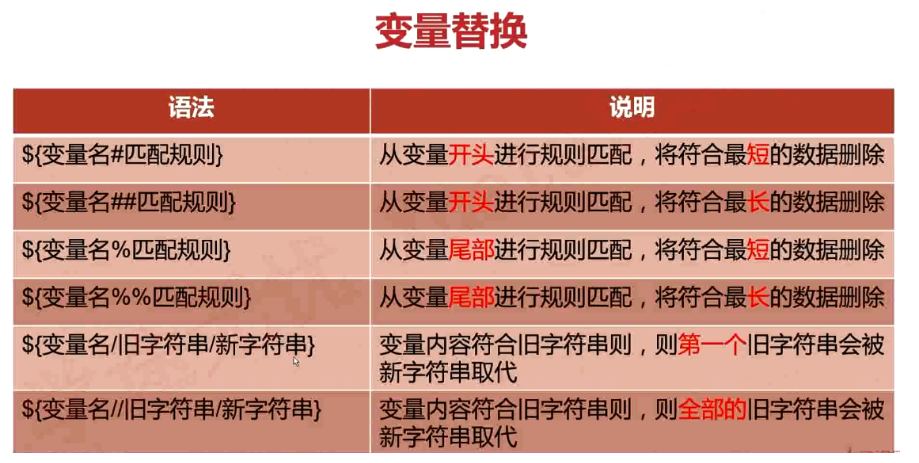
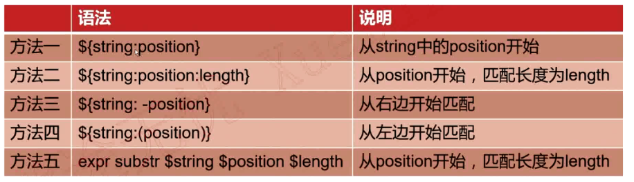

# example(字符串处理)

## 变量替换的六种形式


## 字符串处理
* 计算字符串长度
```
方法一

${#string}
方法二

string有空格，则必须加双引号

expr length "$string"    
```

* 获取子串在字符串中的索引位置
```
expr index $string $substring
```

* 计算子串长度
```
expr match $string substr
```
eg
``` 
[root@VM_0_9_centos shell_learn]# var1="quickstart is a app"
[root@VM_0_9_centos shell_learn]# len=`expr match "$var1" quic`
[root@VM_0_9_centos shell_learn]# echo $len
4
[root@VM_0_9_centos shell_learn]# len=`expr match "$var1" app`
[root@VM_0_9_centos shell_learn]# echo $len
0
[root@VM_0_9_centos shell_learn]# len=`expr match "$var1" quic.*`
[root@VM_0_9_centos shell_learn]# echo $len
19
[root@VM_0_9_centos shell_learn]# 

```

## 抽取子串



## 字符串处理完整脚本 example.sh
``` 
#!/bin/bash

string="Bigdata process framework is Hadoop,Hadoop is an open source project"

function print_tips
{
    echo "******************************"
    echo "(1)打印string长度"
    echo "(2)删除字符串中所有的Hadoop"
    echo "(3)替换第一个Hadoop为Mapreduce"
    echo "(4)替换全部Hadoop为Mapreduce"
    echo "*******************************"        
}

function len_of_string
{
    echo "${#string}"    
}

function del_hadoop
{
    echo "${string//Hadoop/}"
}

function rep_hadoop_mapreduce_first
{
    echo "${string/Hadoop/Mapreduce}"
}

function rep_hadoop_mapreduce_all
{
        echo "${string//Hadoop/Mapreduce}"
}

while true
do
    echo "[string=$string]"
    echo
    print_tips
    read -p "Pls input your choice(1|2|3|4|q|Q): " choice
    
    case $choice in
        1)
            len_of_string
            ;;
        2)
            del_hadoop
            ;;
        3)
            rep_hadoop_mapreduce_first
            ;;
        4)
            rep_hadoop_mapreduce_all
            ;;
        q|Q)
            exit
            ;;
        *)
            echo "Error,input only in {1|2|3|4|q|Q|}"
            ;;
    esac
done


```


参考文献：

http://shouce.jb51.net/shellbook/zh/chapters/01-chapter4.html

https://www.cnblogs.com/derek1184405959/p/11086759.html
