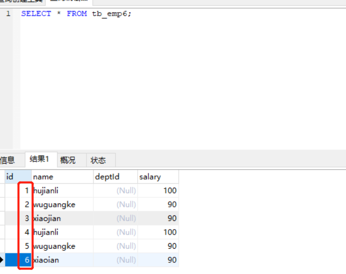

# mysql入门到精通


## MySQL版本
针对不同的用户，MySQL分为两个不同的版本
    
    1. MySQL Community Server(社区版):完全免费，官方不提供技术支持
    2. Mysql Enterprise Server（企业服务器）：能很高性价比为企业提供数据仓库应用，支持ACID事务处理，提供完整的提交、回滚、崩溃恢复和行级锁定功能，但是该版本需要付费，官方提供电话技术支持。

## Mysql的优势
    MySQL的主要优势如下：
    (1) 速度： 运行速度快。
    (2) 价格： MySQL 对多数个人来说是免费的。
    (3) 容易使用： 与其他大型数据库的设置和管理相比， 其复杂程度较低， 易于学习。
    (4) 可移植性： 能够工作在众多不同的系统平台上， 例如： Windows 、Linux 、Unix 、Mac OS 等。
    (5) 丰富的接口： 提供了用于C 、C++ 、Eiffel 、Java 、PerI 、PHP 、Python 、Ruby 和Tcl等语言的API 。
    (6) 支持查询语言： MySQL 可以利用标准SQL 语法和支持ODBC （ 开放式数据库连接）的应用程序。
    (7) 安全性和连接性： 十分灵活和安全的权限和密码系统， 允许基于主机的验证。连接到服务器时，所有的密码传输均采用加密形式，从而保证了密码安全
    并且由于MySQL是网络化的，因此可以在因特网上的任何地方访问，提高书记共享的效率


​    

## SQL包含以下4个部分
	 (1)数据定义语言(DDL):DROP、CREATE、ALTER等语句
	 (2)数据操作语言(DML):INSERT(插入)、UPDATE(修改)、DELETE(删除)语句
	 (3)数据查询语言(DQL):SELECT语句
	 (4)数据控制语言(DCL):GRANT、REVOKE、COMMIT、ROLLBACK等语句		


## Mysql-5.6二进制部署
一.准备环境
```
环境：centos-7.3 一台
软件版本：mysql-5.6.39
```

``` 
1.安装依赖
yum -y install autoconf libaio bison ncurses-devel

2.创建用户
groupadd mysql
useradd -g mysql -s /sbin/nologin mysql

3.清理centos7 默认自带数据库
yum -y remove mariadb mariadb-server
```


二.部署
```
1.下载MySQL
wget https://dev.mysql.com/get/Downloads/MySQL-5.6/mysql-5.6.39-linux-glibc2.12-x86_64.tar.gz

2.安装
tar -xf mysql-5.6.39-linux-glibc2.12-x86_64.tar.gz

mv mysql-5.6.39-linux-glibc2.12-x86_64 /usrlocal/mysql
mkdir /var/log/mysql
mkdir /usr/local/mysql/data
```

mysql即使root启动还是mysql用户运行的，所以要给权限
``` 
chown -R mysql:mysql /usr/local/mysql/
chown -R mysql:mysql /var/log/mysql/

```
3.修改配置，具体再根据性能和需求修改
`vim /etc/my.cnf`

``` 
[mysql]
default-character-set=utf8
socket=/usr/local/mysql/mysql.sock
[mysqld]
skip-name-resolve
port = 3306
socket=/usr/local/mysql/mysql.sock
basedir=/usr/local/mysql
datadir=/usr/local/mysql/data
max_connection=200
character-set-server=utf8
default-storage-engine=INNODB
lower_case_table_name=1
max_allowed_packet=16M
log-error=/var/log/mysql/mysql.log
pid-file=/var/log/mysql/mysql.pid
bind-address = 0.0.0.0

```
4.启动服务
```
cd /usr/local/mysql

进行初始化操作

./scripts/mysql_install_db --user=mysql --basedir=/usr/local/mysql/ --datadir=/usr/local/mysql/data/

让mysql可以读
chown mysql:mysql /etc/my.cnf

```

5.加入systemctl

```
vim /usr/lib/systemd/system/mysql.service
```

``` 
[Unit]
Description=mysql
After=network.target remote-fs.target nss-lookup.target

[Service]
Type=forking
ExecStart=/usr/local/mysql/support-files/mysql.server start
ExecReload=/usr/local/mysql/support-files/mysql.server restart
ExecStop=/usr/local/mysql/support-files/mysql.server stop
PrivateTmp=true

[Install]
WantedBy=multi-user.target
```
6.设置环境变量
```
echo 'PATH=$PATH':/usr/local/mysql/bin >> /etc/profile
source /etc/profile
```
7.登陆
```
systemctl start mysql
systemctl enable mysql
```

8.设置mysql的密码
``` 
mysql -uroot -p
修改MySQL密码方式：

set password for root@'localhost'=password('admin#123!');
然后执行：
flush privileges;


#mysql-8.0.11-winx64初次修改密码
ALTER USER root@localhost IDENTIFIED  BY '123456';
	
# 重启mysql后生效
systemctl restart mysql
```


相关的参考文档：

<https://www.cnblogs.com/suoning/p/5742885.html>


## 数据库基础操作

###  windows 上启动关闭命令
	--启动mysql命令
	net start MYSQL 
	
	--关闭mysql命令
	net stop MYSQL 
	 
	--需要将mysql-8.0.13\bin\目录加入到环境变量中
	
	#my.cnf 配置文件
	[mysqld]
	# 设置3306端口
	port=3306
	# 设置mysql的安装目录
	basedir=D:\mysql\mysql-8.0.13-winx64
	# 设置mysql数据库的数据的存放目录
	datadir=D:\mysql\mysql-8.0.13-winx64\Data
	# 允许最大连接数
	max_connections=200
	# 允许连接失败的次数。
	max_connect_errors=10
	# 服务端使用的字符集默认为UTF8
	character-set-server=utf8
	# 创建新表时将使用的默认存储引擎
	default-storage-engine=INNODB
	# 默认使用“mysql_native_password”插件认证
	#mysql_native_password
	default_authentication_plugin=mysql_native_password
	[mysql]
	# 设置mysql客户端默认字符集
	default-character-set=utf8
	[client]
	# 设置mysql客户端连接服务端时默认使用的端口
	port=3306
	default-character-set=utf8
	
	[WindowsMySQLServer]
	
	Server=D:\mysql\mysql-8.0.13-winx64\bin\mysqld.exe


	#查看mysql的编码格式
	C:\Windows\system32>mysql -uroot -padmin#123
	
	mysql> status
	--------------
	mysql  Ver 8.0.13 for Win64 on x86_64 (MySQL Community Server - GPL)
	
	Connection id:          8
	Current database:
	Current user:           root@localhost
	SSL:                    Cipher in use is DHE-RSA-AES128-GCM-SHA256
	Using delimiter:        ;
	Server version:         8.0.13 MySQL Community Server - GPL
	Protocol version:       10
	Connection:             localhost via TCP/IP
	Server characterset:    utf8
	Db     characterset:    utf8
	Client characterset:    utf8
	Conn.  characterset:    utf8
	TCP port:               3306
	Uptime:                 3 min 14 sec

### mysql常用的图形管理工具
    ----
    1.MYSQL Workbench
    2.phpMyAdmin
    3.NAvicat   --Natvicat下载地址：链接：https://pan.baidu.com/s/1qXNggPY 密码：kq76
    4.MySQLDumper
    5.SQLyog


### 基础操作

    #查看当前时间
    select now();
    
    #查看mysql版本
    C:\Windows\system32>mysql -V
    mysql  Ver 8.0.13 for Win64 on x86_64 (MySQL Community Server - GPL)
    select version();


	#查看当前用户
	mysql>select user();
	+----------------+
	| user()         |
	+----------------+
	| root@localhost |
	+----------------+
	1 row in set (0.00 sec)


	#--连接mysql数据库
	mysql -h localhost -u root -p 密码
	mysql -h127.0.0.1 -uroot -padmin#123
	
	#修改命令提示符信息
	C:\Windows\system32>mysql -uroot -padmin#123 --prompt hu_mysql
	hu_mysql>
	
	#修改回原来的mysql>提示符
	hu_mysqlprompt mysql>
	PROMPT set to 'mysql>'
	mysql>


	#开启mysql操作日志保存
	mysql> \T D:\mysql.txt
	Logging to file 'D:\mysql.txt'


	#查看上一步命令的警告信息
	mysql> show warnings;
	Empty set (0.00 sec)
	
	#查看帮助手册
	help CREATE DATABASE
	或者
	
	mysql> \h CREATE DATABASE
	Name: 'CREATE DATABASE'
	Description:
	Syntax:
	CREATE {DATABASE | SCHEMA} [IF NOT EXISTS] db_name
	    [create_specification] ...
	
	create_specification:
	    [DEFAULT] CHARACTER SET [=] charset_name
	  | [DEFAULT] COLLATE [=] collation_name
	
	CREATE DATABASE creates a database with the given name. To use this
	statement, you need the CREATE privilege for the database. CREATE
	SCHEMA is a synonym for CREATE DATABASE.
	
	URL: http://dev.mysql.com/doc/refman/8.0/en/create-database.html
	
	mysql> \h TINYINT
	Name: 'TINYINT'
	Description:
	TINYINT[(M)] [UNSIGNED] [ZEROFILL]
	
	A very small integer. The signed range is -128 to 127. The unsigned
	range is 0 to 255.
	
	URL: http://dev.mysql.com/doc/refman/8.0/en/numeric-type-overview.html
### Linux下修改mysql的root密码

	/usr/bin/mysqladmin -u root -p password '123456' 

## 数据库操作命令

### 1.创建数据库
	create database hujianli default charset=utf8;
	
	mysql> create database IF NOT EXISTS hujianli2;
	Query OK, 1 row affected (0.07 sec)


	#查看所有的数据库信息
	mysql> show databases;
	或者
	mysql> show schemas;


	#查看数据库的创建语句和编码方式信息
	mysql> show create database hujianli2;
	+-----------+--------------------------------------------------------------------+
	| Database  | Create Database                                                    |
	+-----------+--------------------------------------------------------------------+
	| hujianli2 | CREATE DATABASE `hujianli2` /*!40100 DEFAULT CHARACTER SET utf8 */ |
	+-----------+--------------------------------------------------------------------+
	1 row in set (0.00 sec)
	
	#查看数据库字符集
	show variables like '%char%';
	
	#修改指定数据库的编码方式
	mysql> alter database hujianli2 default character set utf8;
	Query OK, 1 row affected, 1 warning (0.07 sec)
	
	#打开指定的数据库或者切换数据库
	mysql> use hujianli2
	Database changed
	
	#查看当前选择的数据库
	select database(); --查看当前使用的数据库


### 2.删除数据库
	drop database hujianli;
	drop database IF EXISTS hujianli_db2;


	#清空表内容
	delete from test01;


### 3.mysql忘记密码后，跳过密码进入数据库
	/usr/bin/mysqld_safe --user=mysql --skip-grant-tables &
	
	#修改mysql的root密码
		#第一种方式:
		　　mysql > set password for username@host = password( 'your_password');
		#第二种方法
		　　mysql > update user set password = password('your_password') where user = 'root';
		　　mysql > flush peivileges;
		#第三种方式:
		[root@yinzhengjie ~]#mysqladmin -u UserName -h Host password 'new_password' -p
		[root@yinzhengjie ~]#mysqladmin -u UserName -h Host -p flush-privileges


##### 举例：创建一张表，然后在表中插入一条数据

    CREATE TABLE students (
    student_id INT UNSIGNED,
    name VARCHAR(30),
    sex CHAR(1),
    birth DATE,
    PRIMARY KEY (student_id)
    );
    
    INSERT INTO `students` (`student_id`, `name`, `sex`, `birth`) VALUES (123, 'hujianli', '1', '1994-7-22');
    
    #查询语句
    mysql> SELECT name FROM students WHERE student_id=123;
    +----------+
    | name     |
    +----------+
    | hujianli |
    +----------+


##### 举例：创建一个数据库然后删除数据库
    mysql> create database zoo;
    
    mysql> show databases;
    
    mysql> use zoo
    
    mysql> show create database zoo\G;
    
    mysql> drop database zoo;


​    
​    

### MySQL查看和修改表的存储引擎

1 查看系统支持的存储引擎
```
    show ENGINES;
    或者
    show variables like '%storage_engine%';
```
2 查看表使用的存储引擎
```
两种方法：
a、show table status from db_name where name='table_name';
b、show create table table_name;
如果显示的格式不好看，可以用\g代替行尾分号
有人说用第二种方法不准确，我试了下，关闭掉原先默认的Innodb引擎后根本无法执行show create table table_name指令，因为之前建的是Innodb表，关掉后默认用MyISAM引擎，导致Innodb表数据无法被正确读取。
```
3 修改表引擎方法
```
alter table table_name engine=innodb;
```

4 关闭Innodb引擎方法
```
关闭mysql服务： net stop mysql
找到mysql安装目录下的my.ini文件：
找到default-storage-engine=INNODB 改为default-storage-engine=MYISAM
找到#skip-innodb 改为skip-innodb
启动mysql服务：net start mysql
```


## 数据库表的基本操作

### 创建数据库表

#### 创建表的语法形式：

        create TABLE <表名>
        (字段名1，数据类型 [列级别的约束条件] [默认值]
         字段名2， 数据类型 [列级别的约束条件] [默认值]
         ......
         [表级别的约束条件]
        )


​    
​    创建tb_empl表，SQL语句为：
​    CREATE TABLE tb_empl(
​    id INT(11),
​    name VARCHAR(25),
​    deptId INT(11),
​    salary FLOAT
​    );
​    
    #查看表
    mysql> show tables;

#### 使用主键约束   

##### 1.单字段主键
定义表tb_emp3，其主键为id，SQL语句如下：

    CREATE TABLE tb_emp3(
    id INT(11),
    name VARCHAR(25),
    deptId INT(11),
    salary FLOAT,
    PRIMARY KEY(id)
        );

 


##### 多字段联合主键

    PRIMARY KEY(字段1、字段2、........字段n)
    例如：把id和员工编号同时作为主键，就能唯一确定一个员工
    
    CREATE TABLE tb_emp4(
    id INT(11),
    name VARCHAR(25),
    deptId INT(11),
    salary FLOAT,
    PRIMARY KEY(id,deptid)
        );


​        
#### 使用外键约束
    外键用来在两个表的数据之间建立链接， 它可以是一列或者多列。一个表可以有一个或多个外键。
    
    外键对应的是参照完整性， 一个表的外键可以为空值， 若不为空值， 则每一个外键值必须等于另一个表中主键的某个值。
    
    外键： 首先它是表中的一个字段， 它可以不是本表的主键， 但对应另外一个表的主键。
    外键主要作用是保证数据引用的完整性， 定义外键后， 不允许删除在另一个表中具有关联关系的行。外键的作用是保持数据的一致性、完整性。例如， 部门表tb_dept 的主键是id ， 在员工表tb emp5 中有一个键deptld 与这个id 关联。


【举例】创建一个部门表tb_dept1，表结构如表

     CREATE TABLE tb_dept1
    (
    id INT(11) PRIMARY KEY,
    name VARCHAR(22) NOT NULL,
    location VARCHAR(50)
    );

 【举例】定义数据库tb_emp5，让它的键deptId作为外键关联到tb_dept1的主键id，SQL语句为：

     CREATE TABLE `tb_emp5` (
      `id` int(11) NOT NULL,
      `name` varchar(25) DEFAULT NULL,
      `deptId` int(11) DEFAULT NULL,
      `salary` float DEFAULT NULL,
      PRIMARY KEY (`id`),
      KEY `fk_emp_dept1` (`deptId`),
      CONSTRAINT `fk_emp_dept1` FOREIGN KEY (`deptId`) REFERENCES `tb_dept1` (`id`) ON DELETE RESTRICT ON UPDATE RESTRICT
    ) ENGINE=InnoDB DEFAULT CHARSET=utf8;
    
    以上语句执行成功之后，在表tb_emp5上添加了名称为fk_emp_dept1的外键约束，外键名称为deptId。其依赖于表tb_dept1的主键id


​    
#### 使用非空约束
非空约束的语法规则如下：
    
    字段名 数据类型 not null

【举例】 定义数据表tb_emp6 ，指定员工的名称不能为空，SQL语句如下：

    CREATE TABLE `tb_emp6` (
      `id` int(11) NOT NULL,
      `name` varchar(25) NOT NULL,
      `deptId` int(11) DEFAULT NULL,
      `salary` float DEFAULT NULL,
      PRIMARY KEY (`id`)
    ) ENGINE=InnoDB DEFAULT CHARSET=utf8;


​    
#### 使用唯一性约束

    唯一性约束要求该列唯一，允许为空，但只能出现一个空值，唯一约束可以确保一列或者几列不出现重复值。

定义唯一约束，语法如下：
    
    字段名 数据类型  UNIQUE
    [CONSTRAINT <约束名>] UNIQUE(<字段名>)


​    
* UNIQUE和PRIMARY KEY的区别： 


        一个表中可以有多个字段声明为UNIQUE ， 但只能有一个PRIMARY KEY 声明； 
        声明为PRIMAY KEY的列不允许有空值但是声明为UNIQUE的字段允许空值(NULL)的存在。

 【举例】定义数据库tb_dept3，指定部门的名称唯一，SQL语句如下：

    CREATE TABLE `tb_dept3` (
      `id` int(11) NOT NULL,
      `name` varchar(22) DEFAULT NULL,
      `location` varchar(50) DEFAULT NULL,
      PRIMARY KEY (`id`),
      UNIQUE KEY `name` (`name`) USING BTREE
    ) ENGINE=InnoDB DEFAULT CHARSET=utf8;


#### 使用默认约束
默认约束的语法规则如下：
    
    字段名 数据类型 DEFAULT 默认值

【举例】定义数据表tb_emp5，指定员工部门编号默认值为1111

    CREATE TABLE `tb_emp5` (
      `id` int(11) NOT NULL,
      `name` varchar(25) DEFAULT NULL,
      `deptId` int(11) DEFAULT '1111',
      `salary` float DEFAULT NULL,
      PRIMARY KEY (`id`),
      KEY `fk_emp_dept1` (`deptId`),
      CONSTRAINT `fk_emp_dept1` FOREIGN KEY (`deptId`) REFERENCES `tb_dept1` (`id`) ON DELETE RESTRICT ON UPDATE RESTRICT
    ) ENGINE=InnoDB DEFAULT CHARSET=utf8;


​    
#### 设置表的属性值自动增加
    在MYSQL中AUTO_INCREMENT的初始值是1，每新增一条记录，字段值自动加1，
    一个表只能有一个自动使用AUTO_INCREMENT约束，且该字段必须为主键的一部分，AUTO_INCREMENT约束的自动可以是任何整数类型
    （TINYINT、SMALLIN、INT、BIGINT等）

【举例】定义数据表tb_emp6，指定员工的标号自动递增，SQL语句如下：

    CREATE TABLE `tb_emp6` (
      `id` int(11) NOT NULL AUTO_INCREMENT,
      `name` varchar(25) NOT NULL,
      `deptId` int(11) DEFAULT NULL,
      `salary` float DEFAULT NULL,
      PRIMARY KEY (`id`)
    ) ENGINE=InnoDB AUTO_INCREMENT=4 DEFAULT CHARSET=utf8;
    
    INSERT INTO `tb_emp6`(name,salary)VALUES ("hujianli",100),("wuguangke",90),("xiaoian",90);




### 查看数据库表结构

#### 查看表基本结构语句 DESCRIBE
    desc 表名;

参考文档：

<https://www.cnblogs.com/suoning/p/5769141.html>


## Mysql数据库表锁解决方法

mysql查看被锁住的表

```
# 查询是否锁表
show OPEN TABLES where In_use > 0;
```

查看所有进程

```
# MySQL:
show processlist;

# mariadb:
show full processlist;
```

查询到相对应的进程===然后 kill id

```
# 杀掉指定mysql连接的进程号
# kill $pid


# 查看正在锁的事务
SELECT * FROM INFORMATION_SCHEMA.INNODB_LOCKS;
# 查看等待锁的事务
SELECT * FROM INFORMATION_SCHEMA.INNODB_LOCK_WAITS;


# 查看innodb引擎的运行时信息
# show engine innodb status\G;
# show engine innodb status;
```

查看造成死锁的sql语句，分析索引情况，然后优化sql语句；

```
# 查看服务器状态
show status like '%lock%';

# 查看超时时间：
show variables like '%timeout%';
```


参考文献：

https://www.cnblogs.com/wenxiaobin/p/8574296.html

https://www.cnblogs.com/wanghuaijun/p/5949934.html

