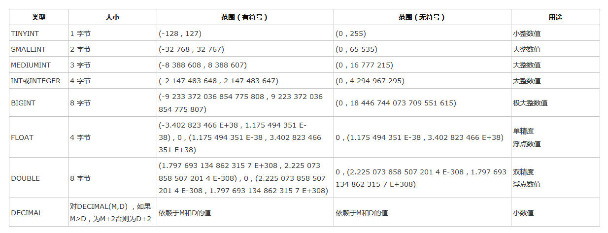
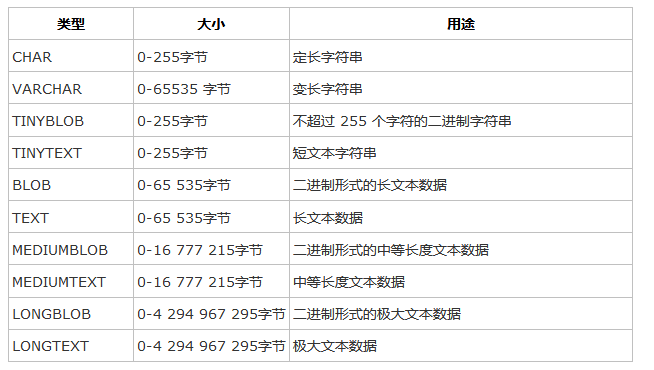
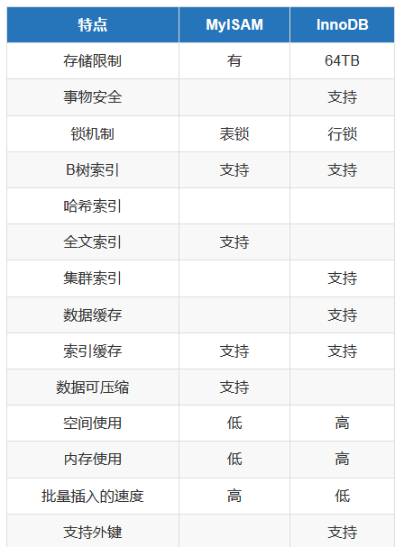
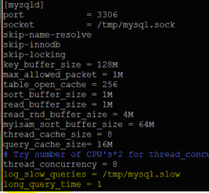

# Linux运维之mysql必会知识

## MySQL概述

### MySQL  简介

```
MySQL 是最流行的开放源码 SQL 数据库管理系统，它是由 MySQLAB 公司开发、发布并支持
的。它的插入式存储引擎可以让使用者根据实际应用使用不同的存储。
```
### MySQL  相关链接


```
MySQL 官方网站：http://www.mysql.com/
MySQL 社区版本下载地址：http://www.mysql.com/downloads/mysql/

MySQL 中文文档：http://dev.mysql.com/doc/refman/5.1/zh/index.html
MySQL 实用文档：http://www.unixhot.com/pdf/mysql.pdf
```

## Mysql数据库安装
`(1) YUM方式按MySQL的方法，执行命令详解如下：`
``` 
①yum install mysql-server mysql-devel mysql-libs -y        #Centos6.X YUM安装。

②yum install mariadb-server mariadb mariadb-libs -y        #Centos7X YUM安装。        
systemctl start mariadb.service       # 启动mariadb.db数据库
```


`(2) 源码安装方法`
```
一.环境准备
环境：centos-7.3 一台
软件版本：mysql-5.7.21
说明：使用二进制包进行初始化操作，并不进行make等编译操作。
```
1.安装依赖
```
yum -y install autoconf libaio bison ncurses-devel
```
2.创建用户
```
groupadd mysql
useradd -g mysql -s /sbin/nologin mysql
```
3.清理centos7 默认自带数据库
```
yum -y remove mariadb mariadb-server
```
二.部署
1.下载包
```
wget https://dev.mysql.com/get/Downloads/MySQL-5.7/mysql-5.7.21-linux-glibc2.12-x86_64.tar.gz

tar -xf mysql-5.7.21-linux-glibc2.12-x86_64.tar.gz

移动过去，后面是存放路径
mv mysql-5.7.21-linux-glibc2.12-x86_64 /usr/local/mysql
mkdir /var/log/mysql
mkdir /usr/local/mysql/data

mysql即使root启动还是mysql用户运行的，所以要给权限
chown -R mysql:mysql /usr/local/mysql
chown -R mysql:mysql /var/log/mysql
```
2.进去删除所有行，添加新的

可参考

[my.cnf生成器](http://imysql.com/my-cnf-wizard.html)
```
vim /etc/my.cnf

[client]
port = 3306
socket = /tmp/mysql.sock

[mysqld]
character_set_server=utf8
init_connect='SET NAMES utf8'
basedir=/usr/local/mysql
datadir=/usr/local/mysql/data
socket=/tmp/mysql.sock
log-error=/var/log/mysql/mysqld.log
pid-file=/usr/local/mysql/mysqld.pid
```

3.初始化
```
cd /usr/local/mysql/bin

#初始化数据库，没有反应则正确
/usr/local/mysql/bin/mysqld --initialize --user=mysql --basedir=/usr/local/mysql/ --datadir=/usr/local/mysql/data
```

4.加入systemctl
```
vim /usr/lib/systemd/system/mysql.service

[Unit]
Description=mysql
After=network.target remote-fs.target nss-lookup.target

[Service]
Type=forking
ExecStart=/usr/local/mysql/support-files/mysql.server start
ExecReload=/usr/local/mysql/support-files/mysql.server restart
ExecStop=/usr/local/mysql/support-files/mysql.server stop
PrivateTmp=true

[Install]
WantedBy=multi-user.target
5.设置环境变量
echo 'PATH=$PATH':/usr/local/mysql/bin >> /etc/profile
source /etc/profile
```

6.启动
```
systemctl daemon-reload
systemctl start mysql
systemctl enable mysql
```

```
#查看密码
cat /var/log/mysql/mysqld.log
最后一行：root@localhost: 这里就是初始密码

cp -rf mysql.server /etc/init.d/mysqld;chmod 755 /etc/init.d/mysqld
#修改mysql的登录密码
service mysqld stop

#使用 mysqld_safe 来启动mysql服务
[root@CentOS ~]# cd /usr/local/mysql/bin/
[root@CentOS bin]# ./mysqld_safe --user=mysql --skip-grant-tables &


########## 忘记Mysql密码后的办法，修改mysql的登录密码 ##########
service mysqld stop

#使用 mysqld_safe 来启动mysql服务
[root@CentOS ~]# cd /usr/local/mysql/bin/
[root@CentOS bin]# ./mysqld_safe --user=mysql --skip-grant-tables &


mysql -uroot -p
修改MySQL密码方式：
use mysql;
首先执行：
update user set authentication_string=password('admin#123!') where user='root';	

flush privileges;
然后执行：ALTER USER 'root'@'localhost' IDENTIFIED WITH mysql_native_password BY 'admin#123!';

#mysql-8.0.11-winx64初次修改密码
ALTER USER root@localhost IDENTIFIED  BY '123456';
	
# 重启mysql后生效
/etc/init.d/mysqld restart		
		
```

Mysql数据库安装 

参考文献
https://www.cnblogs.com/xiangsikai/p/8318965.html

## 1.基础操作

```
#查看当前时间
select now();

#查看mysql版本
C:\Windows\system32>mysql -V
mysql  Ver 8.0.13 for Win64 on x86_64 (MySQL Community Server - GPL)
select version();


#查看当前用户
mysql>select user();


#--连接mysql数据库
mysql -h localhost -u root -p 密码
mysql -h127.0.0.1 -uroot -padmin#123

#修改命令提示符信息
C:\Windows\system32>mysql -uroot -padmin#123 --prompt hu_mysql
hu_mysql>

#修改回原来的mysql>提示符
hu_mysqlprompt mysql>
PROMPT set to 'mysql>'
mysql>


#开启mysql操作日志保存
mysql> \T D:\mysql.txt
Logging to file 'D:\mysql.txt'


#查看上一步命令的警告信息
mysql> show warnings;

```


## 2.数据库操作

```
create database hujianli default charset=utf8;

create database IF NOT EXISTS hujianli2;


#查看所有的数据库信息
mysql> show databases;
或者
mysql> show schemas;


#查看数据库的创建语句和编码方式信息
mysql> show create database hujianli2;
+-----------+--------------------------------------------------------------------+
| Database  | Create Database                                                    |
+-----------+--------------------------------------------------------------------+
| hujianli2 | CREATE DATABASE `hujianli2` /*!40100 DEFAULT CHARACTER SET utf8 */ |
+-----------+--------------------------------------------------------------------+
1 row in set (0.00 sec)

#查看数据库字符集
show variables like '%char%';

#修改指定数据库的编码方式
mysql> alter database hujianli2 default character set utf8;
Query OK, 1 row affected, 1 warning (0.07 sec)

#打开指定的数据库或者切换数据库
mysql> use hujianli2
Database changed

#查看当前选择的数据库
select database(); --查看当前使用的数据库


# 选择数据库
use database_name

# 删除数据库
drop database hujianli;
drop database IF EXISTS hujianli_db2;

#清空表内容
delete from test01;
```


### 3.mysql忘记密码后，跳过密码进入数据库
```
/usr/bin/mysqld_safe --user=mysql --skip-grant-tables &

#修改mysql的root密码
	#第一种方式:
	　　mysql > set password for username@host = password( 'your_password');
	#第二种方法
	　　mysql > update user set password = password('your_password') where user = 'root';
	　　mysql > flush peivileges;
	#第三种方式:
	[root@yinzhengjie ~]#mysqladmin -u UserName -h Host password 'new_password' -p
	[root@yinzhengjie ~]#mysqladmin -u UserName -h Host -p flush-privileges
```


### 4.mysql的各种权限管理

```
用户权限管理主要有以下作用： 
1. 可以限制用户访问哪些库、哪些表 
2. 可以限制用户对哪些表执行SELECT、CREATE、DELETE、DELETE、ALTER等操作 
3. 可以限制用户登录的IP或域名 
4. 可以限制用户自己的权限是否可以授权给别的用户


一、用户授权
# 授权本地用户
#授权本地test用户能远程登录
grant all on test_db.* to test@localhost identified by '123456';  
grant all on *.*  to hujianli@'lcoalhost'  identified by '123123';
grant all on discuz.* to root@'localhost' identified by "123456";


# 授权远程用户
#授权所有用户通过test用户名和123456密码都能远程登录数据库
grant all privileges on *.* to test@"%" identified by '123456';	   
grant all privileges on *.* to 'yangxin'@'%' identified by 'yangxin123456' with grant option;

#刷新权限
flush  privileges;


## 举例本地和远程用户授权

#创建管理 cldera 的账户 cldera，密码 cldera.com；
grant all privileges on cldera.* to 'cldera'@'localhost' identified by 'cldera.com';
flush privileges;
#如需远程连接该账户,则使用
grant all privileges on cldera.* to 'cldera'@'%' identified by 'cldera.com'; 
flush privileges;


# 授权单台主机
# 授权192.168.111.118主机通过test用户和123456密码 能访问test_db数据库
grant all privileges on test_db.* to test@"192.168.111.118" identified by '123456';	

# 授权增删改查权限
grant select,insert,update,delete on *.* to test@”%”identified by '123456';
	 •all privileges：
	 --表示将所有权限授予给用户。也可指定具体的权限，如：SELECT、CREATE、DROP等。
	 •on：--表示这些权限对哪些数据库和表生效，格式：数据库名.表名，这里写“*”表示所有数据库，所有表。如果我要指定将权限应用到test库的user表中，可以这么写：test.user
	 •to：--将权限授予哪个用户。格式：”用户名”@”登录IP或域名”。%表示没有限制，在任何主机都可以登录。比如：”yangxin”@”192.168.0.%”，表示yangxin这个用户只能在192.168.0IP段登录
	 •identified by：
	 --指定用户的登录密码
	 •with grant option：
	 --表示允许用户将自己的权限授权给其它用户 
		 
		 
二、刷新权限
	flush privileges;


三、查看用户权限
	--赋权 
	grant select,create,drop,update,alter on *.* to 'yangxin'@'localhost' identified by 'yangxin0917' with grant option;
	--查看权限
	show grants for 'root'@'localhost';
	--删除用户和对应权限
	drop user test;
		
	
四、回收权限
	revoke create on *.* from 'yangxin@localhost';
	
	# 取消user3用户的查询权限
	revoke select on *.* FROM 'user3'@'localhost';
	
	flush privileges;

五、删除用户
	select host,user from user;
	drop user 'yangxin'@'localhost';

六、用户重命名
	rename user 'test3'@'%' to 'test1'@'%';
	
七、修改密码
--1> 更新mysql.user表
	mysql> use mysql;
	--mysql5.7之前
	mysql> update user set password=password('123456') where user='root';
	--mysql5.7之后
	mysql> update user set authentication_string=password('123456') where user='root';
	mysql> flush privileges;
	
--2> 用set password命令	
	语法：set password for ‘用户名'@'登录地址'=password(‘密码')
	
	mysql> set password for 'root'@'localhost'=password('123456');

--3> mysqladmin
	语法：mysqladmin -u用户名 -p旧的密码 password 新密码
	
	mysql> mysqladmin -uroot -p123456 password 1234abcd

八、忘记密码

--1> 添加登录跳过权限检查配置
	修改my.cnf，在mysqld配置节点添加skip-grant-tables配置
	[mysqld]
	skip-grant-tables

--2> 重新启动mysql服务
	service mysqld restart
--3> 还原登录权限跳过检查配置
	将my.cnf中mysqld节点的skip-grant-tables配置删除，然后重新启动服务即可。

```

​	

### 5.表的操作

```
格式：create table 表名(列及类型)
create table students2(id int auto_increment primary key,name varchar(20) not null,
age int not null ,gender bit default 1,address varchar(20),isDelete bit default 0);

auto_increment --自增长
primary key --主键
not null --表示不为空


(1) 创建表
create table table_name(
    属性名 数据类型，
    属性名 数据类型，
    ......
    属性名 数据类型，    
    );
    
    
(2) 创建类似旧表的新表
create table new_tab_name like old_tab_name;


(3) 查看选择数据库中的所有表
show tables;


(4) 查看表的定义
describe table_name;
或者
show columns from table_name;


(5)查看表的详细定义
 show create table table_name;
 
(6)删除表
drop table table_name;

(7) 修改表的名字
alter table table_name rename [to] new_table_name;


(8)增加字段
① 在表的最后一个位置增加字段
alter table table_name add 属性名 属性类型;


② 在表的第一个位置增加字段
alter table table_name add 属性名 属性类型 first ;


③ 在表的指定字段之后增加字段
alter table table_name add 属性名 属性类型 after 属性名;


(9) 删除字段
alter table table_name;
drop 属性名;

(10) 修改字段
① 修改字段的数据类型
alter table table_name modify 属性名 数据类型；


② 修改字段的名字
alter table table_name change 旧属性名 新属性名 旧数据类型;


③ 同时修改字段的名字和属性
alter table table_name change 旧属性名 新属性名 新数据类型


④ 修改字段的顺序
alter table table_name modify 属性名1 数据类型 first|after 属性名2；


(11) 设置非空约束
create table table_name(
    属性名 数据类型 not null,
    .........
    );


(12) 设置字段默认值
create table table_name(
    属性名 数据类型 default 默认值,
    .........
    );
    
    
(13) 设置唯一约束
create table table_name(
    属性名 数据类型 unique,
    .........
    );
或者
create table table_name(
    属性名 数据类型 ,
    .........
    [constraint 约束名] unique(属性名)
    );
    
    
    
(14) 设置单字段主键
    create table table_name(
    属性名 数据类型 primary key,
    .......
    );
    
    
(15) 设置多字段主键
    create table table_name(
    属性名 数据类型 ,
    .......
    [comnstraint 约束名] primary key(属性名，属性名....)
    )
    
(16)删除表的主键：
alter table table_name
    drop priimary key;


(17)增加表的主键：
alter table table_name
    add primary key(属性名);


(18)设置字段字段增加
create table table_name(
    属性名 数据类型 auto_increment,
    .......
    );
    
    
(19) 设置外键约束
create table table_name(
    属性名 数据类型
    ......
    constraint 外键约束名 foreign key(属性名1)
    references 表名(属性名2)
)
    

```

​	


#### 5.1 查看建表语句
``` 
show create table student2;
```

#### 5.2 重名名表名
```
rename table 原表名 to 新表名
rename table student2 to students2;
```

#### 5.3修改表名
```
alter table 表名 add|change|drop 列名 类型;
alter table students2 add isDelete bit default 1;


添加列：alter table 表名 add 列名 类型
删除列：alter table 表名 drop column 列名
修改列：
        alter table 表名 modify column 列名 类型;  -- 类型
        alter table 表名 change 原列名 新列名 类型; -- 列名，类型
   
添加主键：
        alter table 表名 add primary key(列名);
删除主键：
        alter table 表名 drop primary key;
        alter table 表名  modify  列名 int, drop primary key;
   
添加外键：alter table 从表 add constraint 外键名称（形如：FK_从表_主表） foreign key 从表(外键字段) references 主表(主键字段);
删除外键：alter table 表名 drop foreign key 外键名称
   
修改默认值：ALTER TABLE testalter_tbl ALTER i SET DEFAULT 1000;
删除默认值：ALTER TABLE testalter_tbl ALTER i DROP DEFAULT;

1.增加
mysql> alter table student add sex char(32);
Query OK, 0 rows affected (0.12 sec)

mysql> desc student;


2.删除
mysql> alter table student drop sex;

mysql> desc student;


3.修改表名
mysql> alter table student rename to students;


4.修改列名
mysql> alter table students change regiiter_date register_date DATE;

##change 字段名，类型都可以改，modify只能改类型
```


## 数据的操作

### 1.增
`语法：`

```
`INSERT INTO table_name ( field1, field2,...fieldN )
                       VALUES
                       ( value1, value2,...valueN );`

                   
a.全列插入：
格式:insert into 表名 values(....)
说明：主键列是自动增长，但是在全列插入时需要占位，
通常使用0，插入成功以后以实际数据为准
示例：insert into students2 values(0,'tom',19,1,'北京',0);
		

b.缺省插入：
	格式：insert into 表名(列1,列2,......) values(值1,值2,....)
	例子：insert into students2(name,age,address) values('hujianli',19,'shanghai')


c.同时插入多条数据:
	格式：insert into 表名 values(...),(...),...
	示例： insert into students2 values(0,'hom',22,1,'北京',0),(0,'hum',12,0,'北京',0);


insert into students(name, age, register_date) values ('hujianli', '24','2019-02-07');
insert into students(name, age, register_date) VALUES ('hujianli2','22','2019-02-08');
insert into students(name, age, register_date) VALUES ('hujianli3','21','2019-02-08');
insert into students(name, age, register_date) VALUES ('hujianli4','20','2019-02-08');

SELECT * FROM student;  -->看表里面的内容
```


### 2.删
	格式：delete from 表名;    ---删除表全部的内容,危险慎用！
		  delete from 表名 where 条件;
	示例：delete from students2 where id=6;
	
	Truncate tables_name;		  # 清空数据库表内容
	# TRUNCATE TABLE 删除表中的所有行，但表结构及其列、约束、索引等保持不变.


​	
### 3.改
	格式：update 表名 set 列1=值1,列2=值2,...... where 条件
	示例:update student2 set age=16 where id=5； 	---注意没有条件是全列修改，慎用！

### 4.查 
	格式：select * from students2;    ---查询表中的全部数据

`语法：
    SELECT column_name,column_name
    FROM table_name
    [WHERE Clause]
    [OFFSET M ][LIMIT N]`
```     
查询语句中你可以使用一个或者多个表，表之间使用逗号(,)分割，并使用WHERE语句来设定查询条件。
SELECT 命令可以读取一条或者多条记录。
你可以使用星号（*）来代替其他字段，SELECT语句会返回表的所有字段数据
你可以使用 WHERE 语句来包含任何条件。
你可以通过OFFSET指定SELECT语句开始查询的数据偏移量。默认情况下偏移量为0。
你可以使用 LIMIT 属性来设定返回的记录数。
```
```
select  * from students limit 2 offset 3;
    #limit： 查几条数据
    #offset: 从第几个开始查
    
select  * from students where id >1;
    #条件判断
    
select  * from students where id >1 and age < 22;
    #多个条件
 
select  * from students where name like "hujianli%";
    #like模糊查询
```


#### 4,1查操作，使用最多
	1.基本语法
		格式：select * from 表名 
			说明：
				a、from关键字后面是表名，表示数据来源于这张表
				b、select后面写表中的列名，如果是*表示在结果集中显示所有的列
				c、在select后面的列名部分可以使用as为列名起别名，这个别名显示在结果集中
				d、如果要查询多个列，之间使用逗号分隔
				
			示例：
				select * from students2;
				select name,age from students2;
				select name as a,age from students2;  ---别名name为a进行显示
				
	#查看索引
	第一种：show create table test;
	第二种：SHOW INDEX FROM test \G；
	
	#删除索引
	DROP INDEX index_name ON table；
	ALTER TABLE test DROP PRIMARY KEY;  -->删除主键


​	
​				
​	2.消除重复行
​		在select后面列前面使用distinct可以消除重复的行
​		示例：select distinct gender from students2;


​		
​	3.条件查询
​		a、语法
​			select * from 表名 where 条件 
​		
​		b、比较运算符
​			等于     	=
​			大于     	>
​			小于     	<
​			大于等于  	>=
​			小于等于  	<=
​			不等于		!=或<>
​			--查询id大于2的所有数据
​			select * from students2 where id>2;


​			
​		c、逻辑运算符
​			and			并且
​			or			或者
​			not 		非
​			--查询id值大于7的女同学
​			示例：SELECT * FROM students2 WHERE id>3 and gender=0;


​			
​		d、模糊查询
​			INSERT INTO students2 VALUES(0,'习近平',65,1,'北京',0);
​			INSERT INTO students2 VALUES(0,'习大大',66,1,'北京',0);
​			INSERT INTO students2 VALUES(0,'习大',64,1,'北京',0);
​			like 
​			% 表示任意多个任意字符
​			_表示一个任意字符
​			
​			--需求：查询姓习的同学
​			SELECT * FROM students2 WHERE name LIKE '习%';
​			SELECT * FROM students2 WHERE name LIKE '习_'; --查询name为习X的同学
​			
​		e、范围查询
​			in  表示在一个非连续的范围内
​			between ...and...  表示在一个连续的范围内
​			
			需求：查询编号为 8、10、12的学生
			示例：select * from students2 where id in(4,5,8);
			
			需求：查询编号为6到8的学生
			示例：select * from students2 where id between 4 and 8;


​			
​		f、空判断
​			注意：null与""是不同
​			判断空：is null
​			判断非空：is not null
​			
​			需求：查询没有地址的同学
​			示例：select * from students2 where address is null;
​			需求：查询有地址的同学
​			示例：select * from students2 where address is not null;
​			
​		g、优先级
​			小括号,not 比较运算符,逻辑运算符
​			and比or的优先级高,如果同时出现并希望先选or，需要结合()来使用


​	
​	4.聚合
​		为了快速等到统计数据，提供5个聚合函数
​		a、count(*) 表示计算总行数，括号中可以写*和列名
​		b、max(列)  表示求此列的最大值
​		c、min(列)  表示求此列的最小值
​		d、sum(列)	表示求此列的和
​		e、avg(列)	表示求此列的平均值
​		
​		需求：查询学生总数
​		示例：SELECT COUNT(*) from students2;
​		示例：SELECT COUNT(id) from students2;
​		
​		需求：查询女生的编号最大值
​		示例：SELECT MAX(id) FROM students2 WHERE gender=0;
​		
		需求：查询女生的编号最小值
		示例：SELECT MIN(id) FROM students2 WHERE gender=0;
		
		需求：查询所有学生的年龄和
		示例：SELECT SUM(age) FROM students2;
		
		需求：查询所有学生的年龄平均值
		示例：SELECT avg(age) FROM students2;


​		
​	5、分组
​		按照字段分组，表示此字段相同的数据会被放到一个集合中，分组后，只能
​		查询出相同的数据列，对于有差异的数据列，无法显示在结果集中，
​		可以对分组的数据进行统计，做聚合运算
​		
​		语法：select 列1,列2,聚合...... from 表名 group by 列1,
​		列2, 列3,.......
​		
​		需求：查询男女生统计的总数
​		示例：select gender,count(*) from students2 group by gender;
​		      select name,gender,count(*) from students2 group by gender,age;


​		
​		分组后的数据筛选：
​		select 列1,列2,聚合...... from 表名 group by 列1,
​		列2, 列3,..... having 列1,列2.....,聚合....
​		示例：select gender,count(*) from students2 group by gender having gender;
​			  select gender,count(*) from students2 group by gender having gender=0;
​			  
​		where 与having的区别
​		where是对from后面指定的表进行筛选，属于对原始数据的筛选。
​		having是对group by的结果进行筛选
​		
​	6.排序
​		语法：select * from 表名 order by 列1 asc|desc, 列2 asc|desc......
​		说明：
​			a、 将数据按照列1进行排序，如果某些列1的值相同，
​				则按照列2进行排序
​				
			b、默认安装从小到大的顺序排序
			c、asc 升序
			d、desc 降序
		需求：按照年龄排序
		示例:select * from students2 order by age;
		
		需求：将没有被删除的数据按年龄排序
		示例：SELECT * from students2 WHERE isDelete=0 ORDER BY age asc;  --升序
			  SELECT * from students2 WHERE isDelete=0 ORDER BY age DESC; --降序


​	
​	
​	7.分页
​		语法：select * from students2 limit start,count;  --start索引从0开始
​		示例：SELECT * FROM students2 LIMIT 0,3;
​			  SELECT * FROM students2 LIMIT 3,3;
​			  SELECT * from students2 WHERE gender=1 LIMIT 3;   --男生前3名
​			  
​	8.关联
​		建表语句
​				1、 CREATE TABLE `class` (
​		  `id` int(11) NOT NULL AUTO_INCREMENT,
​		  `name` varchar(20) NOT NULL,
​		  `stuNum` int(11) NOT NULL,
​		  PRIMARY KEY (`id`);


​		
​		2、
​			 CREATE TABLE `students3` (
​		  `id` int(11) NOT NULL AUTO_INCREMENT,
​		  `name` varchar(20) NOT NULL,
​		  `gender` bit(1) DEFAULT b'1',
​		  `classid` int(11) NOT NULL,
​		  PRIMARY KEY (`id`),
​		  KEY `classid` (`classid`),
​		  CONSTRAINT `students3_ibfk_1` FOREIGN KEY (`classid`) REFERENCES `class` (`id`);
​			
​		插入一些数据：
​		INSERT INTO class VALUES(0,'pyth8',65),(0,'python9',99),(0,'python12',12);
​		INSERT INTO students3 VALUES(0,'HU',1,4);
​		INSERT INTO students3 VALUES(0,'tom',1,2);
​		
​		关联查询：
​		SELECT students3.`name`,class.`name` FROM class inner JOIN students3 on class.id=students3.classid;
​		
		SELECT students3.`name`,class.`name` FROM class left JOIN students3 on class.id=students3.classid;
		
		SELECT students3.`name`,class.`name` FROM class right JOIN students3 on class.id=students3.classid;


​		
#### 其他操作
``` 

# mysql下创建授权用户
mysql> grant all on test.* to 'xsk'@'localhost' identified by '123456';

```

```
注:

GRANT          #命令

# 赋值权限
SELECT        #查
INSERT        #插入
UPDATE        #修改
DELETE        #删除
CREATE        #创建
DROP          #删除
ALL           #给所有权限

on            # 赋值给那个数据库
*.*           # 所有数据库.所有表
test.*        # 指定单个数据库下所有的表

to            # 权限赋值给哪个用户
'xsk'         # xsk 用户
@             # 可以在哪个机器上访问
'%'           # 所有机器
localhost     #本地

identified     # 设置用户密码
by             # 后面根密码
‘123456’;      # 设置密码  
```


```
# mysql下创建无授权用户
mysql>grant all on *.* to 用户名 identified by '密码';

# 更改密码
mysql> UPDATE 数据库.用户名 SET password=PASSWORD("新密码") WHETE user='username';

# 修改当前用户密码
mysql> SET PASSWORD = PASSWORD('mypass');

# 刷新
mysql> flush privileges;

# 进入数据库
mysql> use 数据库名;

# 修复表
mysql> repair table 表名;

# 删除用户权限
mysql> drop user 用户名@'权限'; 
```

#### 修改

    update students set name='hu' where id=1;

#### 删除
    delete from students where id >4;

#### 排序
    排序
        select * from 表 order by 列 asc              - 根据 “列” 从小到大排列
        select * from 表 order by 列 desc             - 根据 “列” 从大到小排列
        select * from 表 order by 列1 desc,列2 asc    - 根据 “列1” 从大到小排列，如果相同则按列2从小到大排
        
        select * from students order by id desc;        # 根据id进行倒叙排列

#### 分组
    1.按名字分组后，并且统计名字出现的次数
    select name,count(*) from students group by name;
    
    2.按名字分组后，把年龄加起来
    select name,sum(age) from students group by name;
    
    select name,sum(age) as rename_sumage from students group by name;
    #加as，可以自定义sum(age)的名字


#### 事务

    MySQL 事务主要用于处理操作量大，复杂度高的数据。
    
    特性：　
        1、事务的原子性：一组事务，要么成功；要么撤回。
        2、稳定性 ： 有非法数据（外键约束之类），事务撤回。
        3、隔离性：事务独立运行。一个事务处理后的结果，影响了其他事务，那么其他事务会撤回。事务的100%隔离，需要牺牲速度。
        4、可靠性：软、硬件崩溃后，InnoDB数据表驱动会利用日志文件重构修改。可靠性和高速度不可兼得， innodb_flush_log_at_trx_commit选项 决定什么时候吧事务保存到日志里。
        复制代码
        
    begin     -->开启
    
    insert into  ......    -->要写入的内容
    
    rollback;             -->回滚到原来状态
    
    commit;             -->确认提交

#### 外键
    MySQL支持外键的存储引擎只有InnoDB , 在创建外键的时候 ,
    要求父表必须有对应的索引 , 子表在创建外键的时候也会自动创建对应的索引


​    
 数据库操作

## 1.显示
```
mysql> show databases;


  默认数据库：

　　 mysql - 用户权限相关数据
　　 test - 用于用户测试数据
　　 information_schema - MySQL本身架构相关数据
```


## 2.创建
`create database 数据库名称 default charset utf8 collate utf8_general_ci;`

```
mysql> create database derek default charset utf8 collate utf8_general_ci;
Query OK, 1 row affected, 2 warnings (0.01 sec)

mysql> show databases;
```

## 3.删除
```
mysql> drop database derek;
Query OK, 0 rows affected (0.07 sec)

mysql> show databases;

```

## 4.使用
```
use derek;                  进入数据库
show tables;                查看表
select database();          查看当前使用的数据库
```

## 5.用户管理
```
mysql> use mysql;       #进入mysql数据库
mysql> select host,user from user;      ##查看目前的用户
+-----------+------------------+
| host      | user             |
+-----------+------------------+
| localhost | mysql.infoschema |
| localhost | mysql.session    |
| localhost | mysql.sys        |
| localhost | root             |
+-----------+------------------+
4 rows in set (0.00 sec)

创建用户
create user '用户名'@'IP地址' identified by '密码';
实例：create user 'zx'@'%' identified by '111';
账户名zx，ip地址任意（可以在任意ip下访问），密码‘’111‘’可以使用该用户

删除用户
    drop user '用户名'@'IP地址';
修改用户
    rename user '用户名'@'IP地址' to '新用户名'@'IP地址';
修改密码
    set password for '用户名'@'IP地址' = Password('新密码')
```

## 6.用户授权

```
查看权限：   show grants for '用户'@'IP地址'                               
授权：     grant 权限 on 数据库.表 to '用户'@'IP地址'         
取消权限：   revoke 权限 on 数据库.表 from '用户'@'IP地址'
flush privileges   将数据读取到内存中，从而立即生效
```


```
show grants for 'zx'@'%';

grant select on *.* to 'zx'@'%';

grant all privileges on *.* to 'zx'@'%';

revoke select on *.* from 'zx'@'%';

revoke all privileges on *.* from 'zx'@'%';
```

```
权限说明
all privileges  除grant外的所有权限
select          仅查权限
select,insert   查和插入权限
usage           无访问权限
alter           使用alter table
alter routine   使用alter procedure和drop procedure
create          使用create table
create routine  使用create procedure
create temporary tables 使用create temporary tables
create user     使用create user,drop user,rename user和revoke all privileges
create view     使用create view
delete          使用delete
drop            使用drop table
execute         使用call和存储过程
file            使用select into outfile 和 load data infile
grant option    使用grant 和 revoke
index           使用index
insert          使用insert
lock tables     使用lock table
process         使用show full processlist
select          使用select
show databases  使用show databases
show view       使用show view
update          使用update
reload          使用flush
shutdown        使用mysqladmin shutdown(关闭MySQL)
super           使用change master,kill,logs,purge,master和set global,还允许                    mysqladmin调试登陆
replication client      服务器位置的访问
replication slave       由复制从属使用
flush privileges　　　    　将数据读取到内存中,从而立即生效

```

## 7.忘记密码

```
# 启动免授权服务端
mysqld --skip-grant-tables
# 客户端
mysql -u root -p
# 修改用户名密码
update mysql.user set authentication_string=password('666') where user='root';
flush privileges;
```

## 8.Mysql数据类型

参考文献

Mysql 数据类型、约束类型

https://www.cnblogs.com/xiangsikai/p/8318973.html

**MySQL支持多种类型，大致可以分为三类：数值、日期/时间和字符串(字符)类型。**

### 1.数值


### 2.日期和时间类型


### 3.字符串类型


## 9.mysql存储引擎
```
创建新表时如果不指定存储引擎 , 那么系统就会使用默认存储引擎 , MySQL 5.5 之前的默认存储引擎是MyISAM , 5.5 之后改为了InnoDB

查看当前数据库支持的存储引擎类型；
SHOW ENGINES;
```



### 1.MyISAM 和 InnoDB的适用场景
```
MyISAM适合：
(1)做很多count 的计算；
(2)插入不频繁，查询非常频繁；
(3)没有事务。

InnoDB适合：
(1)可靠性要求比较高，或者要求事务；
(2)表更新和查询都相当的频繁，并且表锁定的机会比较大的情况。
```

### MyISAM 和 InnoDB的区别
```
1)MyISAM类型不支持事务处理等高级处理，而InnoDB类型支持
2)myisam表不支持外键
3)在执行数据库写入的操作（insert,update,delete）的时候，myisam表会锁表，而innodb表会锁行
4)当你的数据库有大量的写入、更新操作而查询比较少或者数据完整性要求比较高的时候就选择innodb表。当你的数据库主要以查询为主，相比较而言更新和写 入比较少，并且业务方面数据完整性要求不那么严格，就选择mysiam表。因为mysiam表的查询操作效率和速度都比innodb要快
```

### 如何选择存储引擎
``` 
InnoDB存储引擎：用于事务处理应用程序，具有众多特性

MyISAM存储引擎：主要用于管理费事务表，它提供高速存储和检索，以及全文搜索能力

MEMORY存储引擎：提供“内存中”表，MEMORY存储引擎的所有数据都在内存中，数据的处理速度快，但安全性不高（用于相对较小的数据库表）
```

### Mysql事务
#### 事务说明
　　MySQL 事务主要用于处理操作量大，复杂度高的数据。
比如说，在人员管理系统中，你删除一个人员，你即需要删除人员的基本资料，也要删除和该人员相关的信息，如信箱，文章等等，
这样，这些数据库操作语句就构成一个事务！
```
mysql引擎：MyIsam，Innodb默认启用innodb支持事务。
重构日志：数据可如果在处理多条命令时down机，如果命令，没有全不处理完，当数据库启动时会检测事件并通过重构日志重写取消命令。
在MySQL中只有使用了Innodb数据库引擎的数据库或表才支持事务
事务处理可以用来维护数据库的完整性，保证成批的SQL语句要么全部执行，要么全部不执行
事务用来管理insert,update,delete语句
```

　　一般来说，事务是必须满足4个条件（ACID）：
 Atomicity（原子性）、Consistency（稳定性）、Isolation（隔离性）、Durability（可靠性）
```
1、事务的原子性：一组事务，要么成功；要么撤回。
2、稳定性 ： 有非法数据（外键约束之类），事务撤回。
3、隔离性：事务独立运行。一个事务处理后的结果，影响了其他事务，那么其他事务会撤回。事务的100%隔离，需要牺牲速度。
4、可靠性：软、硬件崩溃后，InnoDB数据表驱动会利用日志文件重构修改。可靠性和高速度不可兼得， innodb_flush_log_at_trx_commit选项 决定什么时候吧事务保存到日志里。
```

#### 事务操作
```
# 开启一个事务
mysql> begin;
# 回滚事务，取消事务。
mysql> rollback;
# 保存事务
mysql> commit;
```

## Mysql 慢查询日志配置
查询日志

1、主配置文件下对添加参数、重启生效。

`vim /etc/my.cnf`




``` 
注：主要用于查看开发程序执行时间。

注：log_slow_queries = /tmp/mysql.slow    # 配置慢查询日志路径

注：long_query_time = 1　　　　　　　   # 慢查询日志测试时间 
```

```
查询慢日志开关是否开启

show variables like 'slow_query_log';
打开慢查询日志开关

set global slow_query_log=1
```


##  数据的备份与恢复

### 1.导入外部数据文本

1)执行外部的SQL脚本
``` 
mysql < input.sql;
```
2)在指定数据库上执行
``` 
mysql  [表名] < input.sql;
```

3) 数据传入命令
``` 
load data local infile "[文件名]" into table [表名];
```
### 2.备份数据库
(1) 备份数据库：
``` 
# 将数据库school备份到school.sql文件中。
mysqldump --opt school > school.sql;
```

(2) 备份：
``` 
mysqldump -u[user] -p[password] databasename > filename;
```

(3) 恢复：
``` 
mysql -u[user] -p[password] databasename < filename;
```


```shell
备份数据库
# 还原没有更改字符集会出现乱码需指定字符集--default-character=gbk。
mysqldump --default-character=gbk -uroot -p密码 数据库名 > 文件名.sql


# 备份所有数据库 --all-databases
mysqldump --default-character=gbk -uroot -p密码 --all-databases > 文件名.sql

# 压缩备份
mysqldump -uroot -p密码 --databases 库名 | gzip > xxx.sql.gz

还原数据库
# 如果两张表有用gbk与UTF-8与隔开备份。
mysql --default-character=gbk -uroot -p密码 数据库名 < 文件名.sql

# 解压缩还原
gunzip -c xxx.sql.gz |mysql -uroot -p密码 库名

# 还原：use数据库内
mysql > source /../../x.sql

备份表
mysqldump --default-character=gbk -uroot -p密码 数据库名 表名 > 文件名.sql

还原表
mysql --default-character=gbk -uroot -p密码 数据库名 < 文件名.sql
````

参考文献：

https://www.cnblogs.com/xiangsikai/p/8397494.html


### 3. 迁移MySQL用户及权限

> 迁移MySQL用户及权限
>
> https://blog.csdn.net/weixin_39542111/article/details/113129940
>
> MySQL 之迁移用户及权限
>
> https://www.cnblogs.com/EikiXu/p/9814705.html


## XtraBackup - MySQL备份工具

#### 软件简介

XtraBackup 是一个用来备份 [MySQL](http://www.oschina.net/p/mysql) 的
[InnoDB](http://www.oschina.net/p/innodb) 数据库的开源工具。

例如执行增量备份的命令是：

```shell
# ./xtrabackup --backup --target-dir=/backup/delta --incremental-basedir=/backup/base
```

参考

```
http://codingdict.com/os/software/86425
```


## Mysql 整理错误

参考文献
https://www.cnblogs.com/xiangsikai/p/8337434.html


## Mysql 主从复制搭建
参考文献
https://www.cnblogs.com/xiangsikai/p/8412970.html


## Mysql 主主复制
参考文献
https://www.cnblogs.com/xiangsikai/p/9051638.html

## Mysql 二进制日志备份还原
参考文献
https://www.cnblogs.com/xiangsikai/p/11608724.html

### Mysql数据库的优化

使用tuning-primer.sh脚本来调优mysql数据库

脚本下载链接：
```
https://github.com/BMDan/tuning-primer.sh
```


该脚本从中获取信息，SHOW STATUS LIKE...并SHOW VARIABLES LIKE...为调整服务器变量生成合理的建议。
它与MySQL 3.23和更高版本（包括5.x）的所有版本兼容。

当前，它处理以下方面的建议：
```
慢查询日志
最大连接数
工作线程
密钥缓冲区[仅适用于MyISAM]
Key 缓冲
排序缓冲区
Joins
临时表
表（打开和定义）缓存
表锁定
表扫描（read_buffer）[仅适用于MyISAM]
InnoDB状态
```


### Django访问数据库

在Django项目文件夹的目录下找到`setting.py`文件并打开，找到DATABASES这一项，更改数据库连接参数，格式如下：

``` 
DATABASES = {
    'default': {
        'ENGINE': 'django.db.backends.mysql',
        'NAME': 'mysite',
        'HOST': '192.168.1.1',
        'USER': 'root',
        'PASSWORD': 'pwd',
        'PORT': '3306',
    }
}
```