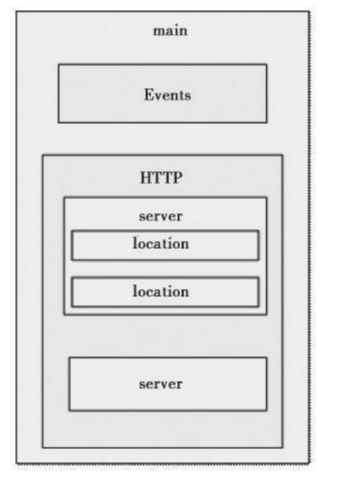

# nginx常用命令管理

## 1. 查看nginx进程
```
[root@iZbp13qhd2a20s0a3p6qzxZ src]# ps aux | grep nginx
root     10952  0.0  0.0  45932  1120 ?        Ss   23:28   0:00 nginx: master process /usr/local/nginx/sbin/nginx
www      10953  0.0  0.0  46380  2148 ?        S    23:28   0:00 nginx: worker process
root     10972  0.0  0.0 112708   980 pts/0    S+   23:32   0:00 grep --color=auto nginx
```

## 2. 平滑启动nginx
```
[root@iZbp13qhd2a20s0a3p6qzxZ logs]# kill -HUP `cat /usr/local/nginx/logs/nginx.pid`
nginx.pid（进程文件路径在配置文件nginx.conf中可以找到）
或者
nginx -s reload   （这里的nginx命令如果没做环境变量的话那么就得输入全路径）
注意：平滑启动的意思是在不停止nginx的情况下，重启nginx，重新加载配置文件，启动新的工作线程，完美停止旧的工作线程。

#完美停止nginx
kill -QUIT `cat /usr/local/nginx/logs/nginx.pid `

#启动nginx
nginx

#快速停止nginx
kill -TERM `cat /usr/local/nginx/logs/nginx.pid `
或者
kill -INT `cat /usr/local/nginx/logs/nginx.pid `

# 完美停止工作进程（主要用于平滑升级）
kill -WINCH `cat /usr/local/nginx/logs/nginx.pid `

#强制停止Nginx
pkill -9 nginx

#检查对nginx.conf文件的修改是否正常
[root@iZbp13qhd2a20s0a3p6qzxZ logs]# nginx -t -c /usr/local/nginx/conf/nginx.conf
nginx: the configuration file /usr/local/nginx/conf/nginx.conf syntax is ok
nginx: configuration file /usr/local/nginx/conf/nginx.conf test is successful

或者
[root@iZbp13qhd2a20s0a3p6qzxZ logs]# nginx -t
nginx: the configuration file /usr/local/nginx//conf/nginx.conf syntax is ok
nginx: configuration file /usr/local/nginx//conf/nginx.conf test is successful

#停止nginx的命令
[root@iZbp13qhd2a20s0a3p6qzxZ logs]# nginx -s stop

或者
[root@iZbp13qhd2a20s0a3p6qzxZ logs]# pkill nginx 

#查看nginx版本信息
[root@iZbp13qhd2a20s0a3p6qzxZ logs]# nginx -v
nginx version: JWS

#查看完整的nginx配置信息
[root@iZbp13qhd2a20s0a3p6qzxZ logs]# nginx -V
nginx version: JWS
built by gcc 4.8.5 20150623 (Red Hat 4.8.5-36) (GCC) 
built with OpenSSL 1.0.2k-fips  26 Jan 2017
TLS SNI support enabled
configure arguments: --user=www --group=www --prefix=/usr/local/nginx/ --with-http_stub_status_module --with-http_ssl_module
```

## 3.Nginx核心配置指令

Nginx配置文件解析Nginx默认编译安装后，配置文件都会保存在`/usr/local/nginx/conf`目录下，在配置文件目录下，Nginx默认的主配置文件是nginx.conf，这也是Nginx唯一的默认配置入口

```shell
$ ll /usr/local/nginx/conf/nginx.conf
```

Nginx配置文件在conf下，其默认的目录结构如下

```
[root@iZwz9dqad3hf5j7b2eprrfZ ~]# tree /usr/local/nginx/conf/
/usr/local/nginx/conf/
├── fastcgi.conf
├── fastcgi.conf.default
├── fastcgi_params
├── fastcgi_params.default
├── koi-utf
├── koi-win
├── mime.types
├── mime.types.default
├── nginx.conf
├── nginx.conf.default
├── scgi_params
├── scgi_params.default
├── uwsgi_params
├── uwsgi_params.default
└── win-utf
```

```
其中，以“.default”为扩展名的文件是Nginx配置文件的配置样例文件。各配置文件的说明如下。

·fastcgi_params：Nginx在配置FastCGI代理服务时会根据fastcgi_params文件的配置向FastCGI服务器传递变量，该配置文件现已由fastcgi.conf代替。

·fastcgi.conf：为了规范配置指令SCRIPT_FILENAME的用法，引入FastCGI变量传递配置。

·mime.types：MIME类型映射表，Nginx会根据服务端文件后缀名在映射关系中获取所属文件类型，将文件类型添加到HTTP消息头字段“Content-Type”中。

·nginx.conf：Nginx默认的配置入口文件。

·scgi_params：Nginx在配置SCGI代理服务时会根据scgi_params文件的配置向SCGI服务器传递变量。

·uwsgi_params：Nginx在配置uWSGI代理服务时会根据uwsgi_params文件的配置向uWSGI服务器传递变量。

·koi-utf、koi-win、win-utf：这3个文件是KOI8-R编码转换的映射文件，因为Nginx的作者是俄罗斯人，在Unicode流行之前，KOI8-R是使用最为广泛的俄语编码。
```

打开系统默认的nginx.conf文件，可以看到整个文件的结构如下。

```
#user  mwop mwop;

worker_processes  auto;

error_log  logs/error.log;

pid        logs/nginx.pid;

worker_rlimit_nofile 65535;

events {
    use epoll;
    worker_connections  10240;
}

########################## TCP 四层反向代理 #######################################
stream {
     server {
         listen 1883;
         proxy_connect_timeout 4s;
         proxy_pass 100.77.228.14:1883;

     }
	 
	 server {
         listen 2195;
         proxy_connect_timeout 4s;
         proxy_pass gateway.push.apple.com:2195;

     }
	 
    log_format proxy '$remote_addr [$time_local] '
                 '$protocol $status $bytes_sent $bytes_received '
                '$session_time "$upstream_addr" '
                 '"$upstream_bytes_sent" "$upstream_bytes_received" "$upstream_connect_time"';
 access_log logs/access_tcp.log proxy ;
}

http {
    include       mime.types;
    default_type  application/octet-stream;
    server_tokens off;
    
    gzip on;
    gzip_min_length 1k;
    gzip_buffers 16 8k;
    gzip_http_version 1.1;
    gzip_comp_level 2;
    gzip_types text/css text/xml application/javascript application/atom+xml application/rss+xml text/plain application/json application/x-javascript application/xml text/javascr
ipt;
    gzip_disable "MSIE [1-6]\.";
    gzip_vary on;
    client_max_body_size 100m;
    proxy_http_version 1.1;
    proxy_buffering on;
    proxy_buffer_size 4k; 
    proxy_buffers 8 1M;
    proxy_busy_buffers_size 2M;
    rewrite_log on;
    

    log_format access '$time_iso8601|$http_x_forwarded_for|$remote_addr|$http_host|$request_time|'
    '$upstream_response_time|"$request"|$status|$body_bytes_sent|$request_length|'
    '"$http_referer"|"$http_user_agent"|$upstream_addr|"$http_cookie"|';

    access_log  logs/access.log  access;

    sendfile        on;
    keepalive_timeout  120; 
    
############ http 七层 反向代理 ########################
    server {
        listen       0.0.0.0:8002;
        server_name  ng_fwjgj_prd_cmsk-dmz;
        
        location / {
            proxy_pass http://121.15.210.61:8002;
            proxy_set_header Host $http_host;
        } 
    } 
    server {
        listen       0.0.0.0:8004;
        server_name  ng_fwjgj_prd_cmsk-dmz;
        
        location / {
            proxy_pass http://121.15.210.61:8004;
            proxy_set_header Host $http_host;
        } 
    } 
    server {
        listen       0.0.0.0:8443;
        server_name  ng_fwjgj_prd_cmsk-dmz;
        
        location / {
            proxy_pass http://120.77.140.232:8443;
            proxy_set_header Host $http_host;
        } 
    } 
    server {
        listen       0.0.0.0:8080;
        server_name  ng_fwjgj_prd_cmsk-dmz;
    
        location = /crm {
            rewrite ^(.*)$ https://$host/crm/;
        }

        location / {
            proxy_pass http://100.77.228.14:8080;
            proxy_set_header Host $http_host;
			  proxy_connect_timeout 120;
			  proxy_read_timeout 120;
			  proxy_send_timeout 120;
			  proxy_buffer_size 16k;
			  proxy_buffers 4 64k;
			  proxy_busy_buffers_size 128k;
			  proxy_temp_file_write_size 128k;
			  proxy_ssl_verify off;
			  proxy_next_upstream error timeout invalid_header http_500 http_502 http_503 http_504;
			  proxy_max_temp_file_size 0;
        }
 
    } 

 ########## 正向代理 ########################
    server {
        listen  7001;
        resolver 100.65.168.1 100.65.168.2;
        proxy_connect;
        proxy_connect_allow all;
        proxy_connect_timeout 60s;
        proxy_connect_read_timeout 60s;
        proxy_connect_send_timeout 60s;

        location / {
            proxy_pass $scheme://$http_host$request_uri;
            proxy_set_header Host $http_host;
         }
    }

}
```


## 4.Nginx配置文件的结构

Nginx的配置文件是一个纯文本文件，它一般位于Nginx安装目录的conf目录下，整
个配置文件是以block的形式组织的。

每个block一般以一个大括号“{}”来表示，
block可以分为几个层次，整个配置文件中main指令位于最高层，在main层下面可
以有Events、HTTP等层级，而在HTTP层中又包含有server层，即serverblock,server block中又可分为location层，并且一个server block中可以包含多个location block。


一个完整的配置文件结构如图：



Nginx配置文件主要分为4部分：
- main（全局域）：`nginx.conf的整个文件内容都写在该指令域中`
- events（指令域）：`nginx事件相关的配置指令域`
- http(指令域)：`Nginx HTTP核心配置指令域，包含客户端完整HTTP请求过程中每个过程的处理方法的配置指令`
- server（主机设置）:`Nginx来定义服务IP、绑定端口及服务相关的指令区域`

- upstream（负载均衡服务器设置):`用于定义被代理服务器组的指令区域，也称“上游服务器”`
- location（URL匹配特定位置的设置）：`对用户URL进行访问路由处理的指令区域`
- stream(指令域):`Nginx 对TCP协议失效代理的配置指令域`
- types(指令域):`定义被请求文件扩展名与MIME类型映射表的指令区域`
- if(指令域)：`按照选择条件判断为真时使用的配置指令域`


1.main部分设置的指令将影响其他所有设置

2.server部分的指令主要用于指定主机和端口

3.upstream指令主要用于负载均衡，设置一系列的后端服务器

4.location部分用于匹配网页位置。

这四者之间的关系如下：
```
server继承main,location继承server,upstream既不会继承其他设置也不会被继承。
```


## 5.Nginx 配置文件解读

**nginx主配置文件**

**1**、备份Nginx配置文件，然后在清空后修改：` vim /usr/local/nginx/conf/nginx.conf`

```shell
# 以那个账户，账户组来运行nginx
user nobody nobody;
# 工作进程：数目。根据硬件调整，通常等于CPU数量或者2倍于CPU。
worker_processes 2;
# 错误日志存放路径
error_log /usr/local/nginx/logs/nginx_errer.log crit;
# PID存放路径
pid /usr/local/nginx/logs/nginx.pid;
# 指定进程可以打开的最大描述符：数目。
worker_rlimit_nofile 51200;

events
{
   # 使用epoll的I/O 模型 ，可或者选择pool，select
   use epoll;
   # 每个工作进程的最大连接数量
   worker_connections 6000;
}

# 设定http服务器，利用它的反向代理功能提供负载均衡支持
http
{
   # 设定mime类型,类型由mime.type文件定义
   include mime.types;
   default_type application/octet-stream;
   # 保存服务器名字的hash表是由指令hash_max_size和bucket_size所控制的。
   server_names_hash_bucket_size 3526;
   server_names_hash_max_size 4096;
   log_format combined_realip '$remote_addr $http_x_forwarded_for [$time_local]'
   '$host "$request_uri" $status'
   '"$http_referer" "$http_user_agent"';
   #　指定是否调用sendfile 函数（zero copy 方式）输出文件，普通应用，必须设为on
   sendfile on;
　 # 此选项允许或禁止使用socke的TCP_CORK的选项，此选项仅在使用sendfile的时候使用
   tcp_nopush on;
   # keepalive超时时间
   keepalive_timeout 30;
   client_header_timeout 3m;
   client_body_timeout 3m;
   send_timeout 3m;
   connection_pool_size 256;
   # 客户端请求头部的缓冲区大小
   client_header_buffer_size 1k;
   # 客户请求头缓冲大小
   large_client_header_buffers 8 4k;
   request_pool_size 4k;
   output_buffers 4 32k;
   postpone_output 1460;
   # 设定通过nginx上传文件的大小
   client_max_body_size 10m;
   # 把它设为较大数值，例256k，无论任意浏览器，提交小于256k图片都正常。
   client_body_buffer_size 256;
   client_body_temp_path /usr/local/nginx/client_body_temp;
   # proxy_temp_path和proxy_cache_path指定的路径必须在同一分区
   proxy_temp_path /usr/local/nginx/proxy_temp;
   fastcgi_temp_path /usr/local/nginx/fastcgi_temp;
   fastcgi_intercept_errors on;
   tcp_nodelay on;
   gzip on;
   gzip_min_length 1k;
   gzip_buffers 4 8k;
   gzip_comp_level 5;
   gzip_http_version 1.1;
   gzip_types text/plain application/x-javascript test/css text/htm application/xml;

# 虚拟主机配置文件
server

{
   # 监听端口 设置为默认虚拟主机
   listen 80 default;
   # 域名
   server_name localhost;
   # 网页索引类型
   index index.html index.htm index.php;
   # 网站url
   root /usr/local/url;
   # 为了安全起见第一个虚拟主机设置禁止访问
   deny all;

　　# 添加允许php访问
   location ~ \.php$ {
       include fastcgi_params;
       # 通信方式，使用socket
       # fastcgi_pass 127.0.0.1:9000; TCP/IP通信方式
       fastcgi_pass unix:/tmp/php-fcgi.sock;
       # 网页索引类型
       fastcgi_index index.php;
       # 网站根目录URL 
       fastcgi_param SCRIPT_FILENAME /usr/local/url$fastcgi_script_name;
   }
}
    # 虚拟主机目录
    # include vhosts/*.conf;
}
```

**2**、测试配置文件：`/usr/local/nginx/sbin/nginx -t`
**3**、重新加载nginx配置文件：`/usr/local/nginx/sbin/nginx -s reload`

 

> 注：tcp/ip：127.0.0.1:9000 更加稳定 。
> 注：socket：unix:/tmp/php-fcgi.sock 并发更高/稳定行没有tcp高。


## 6. Nginx启动脚本

`vim /etc/init.d/nginx`

```shell
#!/bin/bash
# chkconfig: - 30 21
# description: http service.
# Source Function Library
. /etc/init.d/functions
# Nginx Settings
NGINX_SBIN="/usr/local/nginx/sbin/nginx"
NGINX_CONF="/usr/local/nginx/conf/nginx.conf"
NGINX_PID="/usr/local/nginx/logs/nginx.pid"
RETVAL=0
prog="Nginx"
start() {
    echo -n $"Starting $prog: "
    mkdir -p /dev/shm/nginx_temp
    daemon $NGINX_SBIN -c $NGINX_CONF
    RETVAL=$?
    echo
    return $RETVAL
}
stop() {
    echo -n $"Stopping $prog: "
    killproc -p $NGINX_PID $NGINX_SBIN -TERM
    rm -rf /dev/shm/nginx_temp
    RETVAL=$?
    echo
    return $RETVAL
}
reload(){
    echo -n $"Reloading $prog: "
    killproc -p $NGINX_PID $NGINX_SBIN -HUP
    RETVAL=$?
    echo
    return $RETVAL
}
restart(){
    stop
    start
}
configtest(){
    $NGINX_SBIN -c $NGINX_CONF -t
    return 0
}
case "$1" in
    start)
        start
    ;;
    stop)
        stop
    ;;
    reload)
        reload
    ;;
    restart)
        restart
    ;;
    configtest)
        configtest
    ;;
    *)
    echo $"Usage: $0 {start|stop|reload|restart|configtest}"
    RETVAL=1
esac
exit $RETVAL
```

2、修改脚本权限

```shell
chmod 755 /etc/init.d/nginx
```

3、加入chkconfig

```shell
chkconfig --add nginx
```

4、设置开机自启

```shell
chkconfig nginx on
```


## 参考文献

nginx-config 常用配置，避坑记录 
https://ilovey.live/2021/09/09/nginx-config/
