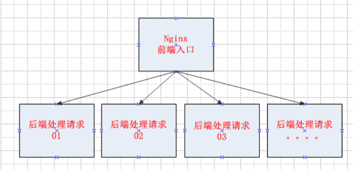

# nginx负载均衡配置+健康检查
## nginx负载均衡原理图




## 负载均衡
负载均衡是由多台服务器以对称的方式组成一个服务器集合，每台服务器都具有等价的地位，都可以单独对外提供服务而无须其他服务器的辅助。通过某种负载分担技术，将外部发送来的请求按照事先设定分配算法分配到对称结构中的某一台服务器上，而接收到请求的服务器独立地回应客户的请求。

均衡负载能够平均分配客户请求到服务器列阵，籍此提供快速获取重要数据，解决大量并发访问服务问题。

1. upstream块


        upstream name {...}
        配置块 http
        upstream块定义一个上游服务器的集群,便于反向代理中的proxy_pass使用
        
        upstream mynet{
            server www.wopai1.com;
            server www.wopai2.com;
            server www.wopai3.com;
        }
        server {
            location /{
                proxy_pass http://mynet;
            }
        }
        
2.server

    server name [paramenters]
    配置块upstream
    server配置项指定了一台上游服务器的名字,可以是域名 IP地址端口 UNIX句柄
    weight= number;设置向这台服务器转发的权重,默认为1
    max_fails=number;该选项域fail_timeout配合使用
            指在fail_timeout时间段内如果转发上游失败超过number次就认为当前的fail_timeout时间内
            这台服务器不可用,max_fails默认为1 如果设置为0 表示不检查失败次数
    fail_timeout=time; fail_timeout表示该时间内转发多少次失败后就认为上游不可用.默认10s
    down    表示上游服务器永久下线,只能在ip_hash配置时才有效
    backup  在ip_hash配置时无效.只有所有非备份机都失败,才向上游备份服务器转发请求.
    upstream mynet{
        server www.wopai1.com weight=5;
        server www.wopai2.com:8081 max_fails=3 fail_timeout=300s;
        server www.wopai2.com down;
    }
    
3.ip_hash
    
    配置块 upstream
    希望来自某一个用户的请求始终落在固定的一台服务器上进行处理.
    根据客户端的IP散列计算出一个key,将key按照upstream集群中的上游服务器进行取模,求得的值对应的主机接收转发请求.
    ip_hash不可以与weight同时使用
    如果upstream配置中有一台服务器暂时不可用,不能直接删除该配置,而应该使用down标识.
    
        upstream mynet{
            ip_hash;
            server www.wowpai1.top;
            server www.wowpai2.top;  
            server www.wowpai3.top down;
        }
        
例子,服务器负载均衡基本配置,nginx中可以进行负载均衡的相关设置:

        upstream my.net{    #my.net是自定义的命名 在server结构中引用即可

        #代理服务器为 两台机器192.168.22.136 192.168.22.147做负载均衡操作 
        #两台机器上 可以跑apache负载功能更为强大的网页相关任务

        #max_fails 表示尝试出错最大次数 即可认为该服务器 在fail_timeout时间内不可用
        # server servername:port   servername可以写主机名 或者点分式IP
        server 192.168.22.136:80 max_fails=1 fail_timeout=300s;
        server 192.168.22.147:80 max_fails=1 fail_timeout=300s;  
        }


        server {
        listen       80;
        server_name  localhost; 
        location / {
            #upstream 块名
            proxy_pass http://my.net;
            root   html;
            index  index.html index.htm;
        }
动手开始配置才能慢慢上手nginx配置和使用。


## 实践负载均衡+健康检查的方法
直接vim /usr/local/nginx/conf/nginx.conf   修改upstream 段配置文件：
```
http {
    include       mime.types;
    default_type  application/octet-stream;

    log_format  main 
                      '$remote_addr - $remote_user [$time_local] "$request" '
                      '$status $body_bytes_sent "$http_referer" '
                      '"$http_user_agent" "$http_x_forwarded_for"';

 
    sendfile        on;
 
    keepalive_timeout  65;
    upstream worldcup {
           server 10.124.25.28:8001;
           server 10.124.25.29:8001;
    }

```

## 实践示例，仅供参考：
``` 
worker_processes  1;

events {
    worker_connections  1024;
}
http {
    include       mime.types;
    default_type  application/octet-stream;

    #log_format  main  '$remote_addr - $remote_user [$time_local] "$request" '

    sendfile        on;
   
    keepalive_timeout  65;

upstream keep_one {
    server 192.168.1.1:8080 weight=1 max_fails=2 fail_timeout=30s;
    server 192.168.1.2:8080 weight=1 max_fails=2 fail_timeout=30s;
}

upstream keep_two {
    server 192.168.1.3:8081 weight=1 max_fails=2 fail_timeout=30s;
    server 192.168.1.4:8081 weight=1 max_fails=2 fail_timeout=30s;
}
server {
        listen       80;
        server_name  localhost;
location / {
            root   html;
            index  index.html index.htm;
        }

        location /one {
        root html;
        index index.html index.htm;
        proxy_pass http://keep_one/;
        proxy_set_header Host $http_host;
        proxy_set_header Cookie $http_cookie;
        proxy_set_header X-Real-IP $remote_addr;
        proxy_set_header X-Forwarded-For 
       $proxy_add_x_forwarded_for;
        proxy_set_header X-Forwarded-Proto $scheme;
        client_max_body_size 300m;
        }

       location /two {
        root html;
        index index.html index.htm;
        proxy_pass http://keep_two/;
        proxy_set_header Host $http_host;
        proxy_set_header Cookie $http_cookie;
        proxy_set_header X-Real-IP $remote_addr;
        proxy_set_header X-Forwarded-For $proxy_add_x_forwarded_for;
        proxy_set_header X-Forwarded-Proto $scheme;
        client_max_body_size 300m;
        }
  }
}
```

提供两个负载接口，同台服务器，同个IP，同个端口。


## nginx负载后端的监控检查
介绍两种健康检查的方式

### 方法一：

    添加upstream的时候，直接ip+port后接weight=1 max_fails=2 fail_timeout=30s;
    ###如以下代码
    upstream fastdfs_tracker {
        server 192.168.1.1:8080 weight=1 max_fails=2 fail_timeout=30s;
        server 192.168.1.2:8080 weight=1 max_fails=2 fail_timeout=30s;
    }
    解释：weight为配置的权重，在fail_timeout内检查max_fails次数，失败则剔除均衡。

### 方法二：

    添加upstream的时候，在最后一行添加
    
    ###如以下代码：
    
    复制代码
    upstream test{ #负载均衡配置，默认的策略，按时间先后，有其他按ip hash，权重
    
            server 192.168.1.1:8080;
    
            server 192.168.1.2:8080;
    
            server 192.168.1.3:8080;
    
            check interval=3000 rise=2 fall=3 timeout=3000 type=http port=7070;
                }
                
解释：# interval=3000：间隔3秒检查一次，rise=2：检查2次ok后端节点up，fall=3：三次检查失败后端节点down，timeout=3000：超时时间3秒，type=http：发http检查请求类型，port=8080检查端口，可省略，默认和server 192.168.1.1:8080中的端口一致。

至此关于nginx最常用的负载均衡+健康检查已经配置完成，后系列中还会介绍到相对常用的nginx的反向代理。


## nginx负载均衡的配置文件

cat conf/nginx.conf
``` 
worker_processes 1;
	events {
		worker_connections 1024;
	}
	http {
		include mime.types;
		default_type application/octet-stream;
		sendfile on;
		keepalive_timeout 65;
		upstream app_pool {
		server 192.168.10.18:80;
		server 192.168.10.19:80;
	}
	server {
		listen 80;
		server_name localhost;
		location / {
		root html;
		index index.html index.htm;
		proxy_pass http://app_pool;
	}
	error_page 500 502 503 504 /50x.html;
	location = /50x.html {
		root html;
			}
		}
}
```


可以参考如下文章

在路上的博客

http://www.haodaquan.com/topics/3###

https://www.cnblogs.com/xiangsikai/p/8432566.html
