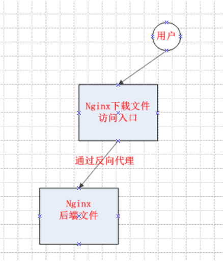

# nginx反向代理做下载文件

nginx的反向代理功能，具体流程图：


为了简单理解，画了一个最简单的图，以便理解，目的就是，当用户需要通过a服务器的nginx WEB下载后端B服务器上的文件，（有些时候生产环境上可能并不是每个服务器都可以外网访问。）

以下称接收请求的nginx为反向代理服务器，后端nginx为目标服务器。

先在目标服务器配置nginx：
``` 
location ^~ /phones/ {
            add_header X-Frame-Options DENY;
            alias /opt/qypay/call-show-manager/phoneFile/;
            proxy_set_header X-Client-Really-IP $remote_addr;
            index  index.html index.htm;
        }
```
简单配置一下location下载文件就OK了

然后在反向代理服务器配置nginx
``` 
 location /phones/ { 
        proxy_pass http://192.168.11.1:80;###192.168.11.1:80为目标服务器的Ip与nginx的端口
        add_header Access-Control-Allow-Origin *;
         }
```

至此就能实现，通过访问nginx反向代理服务器而去下载目标服务器上/opt/qypay/call-show-manager/phoneFile/路径下的文件了。


## nginx 反向代理

环境 ：
```
    master     【安装nginx用于反向代理】
    worker     【安装web应用服务，对外暴露80和443端口】
```

nginx.conf 文件配置
``` 
server {
        listen 80;
        index index.html index.htm index.php;
        
        location / {
            proxy_pass http://172.16.72.18:80;
            proxy_set_header X_Real_IP $remote_addr;
            proxy_set_header X-Forwarded-For $remote_addr;
            proxy_set_header X-Forwarded-For $proxy_add_x_forwarded_for;
            proxy_set_header Host $host;
        }


    }


server {
    listen 443;

     ssl on;
     ssl_certificate ming.com/ming.crt;
     ssl_certificate_key ming.com/ming.key;

        location / {
            proxy_pass http://172.16.72.18:443;
            proxy_set_header X_Real_IP $remote_addr;
            proxy_set_header X-Forwarded-For $remote_addr;
            proxy_set_header X-Forwarded-For $proxy_add_x_forwarded_for;
            proxy_set_header Host $host;
}
}
``` 

配置完毕，即可实现通过代理访问web应用，保证web应用程序的安全。

  