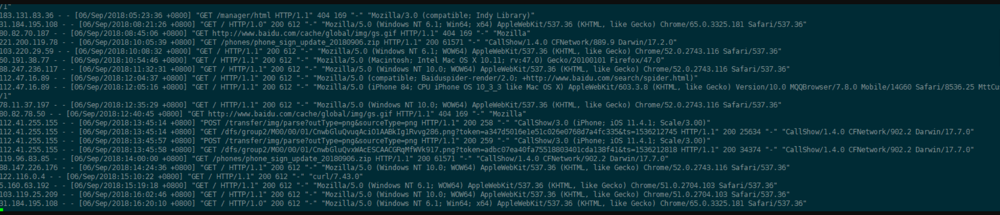

# Nginx日志格式、日志分析与切割


## 1. Nginx日志格式

**日志格式：常用日志格式**

```
log_format main '$remote_addr - $remote_user [stime_local] $request' '"$status" $body_bytes_sent "$http_referer"' '"$http_user_agent" "$http_x_forwarded_for"'
```

 

**日志：此日志格式为，ip不仅记录代理的IP还记录远程客户端真实IP。**

```
log_format main1 '$proxy_add_x_forwarded_for - $remote_user [$time_local]' '"$request" $status $body_bytes_sent' '"$http_referer" "$http_user_agent"';
```

 

**参数：**

```
$remote_addr：远程IP;
$remote_user：远程用户;
$stime_local：时间;
$request：用来记录请求的url与http协议;
$status：用来记录请求状态；成功是200;
$body_bytes_sent：记录发送给客户端文件主体内容大小;
$http_referer：用来记录从那个页面链接访问过来的;
$http_user_agent：记录客户浏览器的相关信息;
$http_x_forwarded_for：访问用户的真实 IP 地址;
```

```
通常web服务器放在反向代理的后面，这样就不能获取到客户的IP地址了，通过$remote_add拿到的IP地址是反向代理服务器的iP地址。反向代理服务器在转发请求的http头信息中，可以增加x_forwarded_for信息，用以记录原有客户端的IP地址和原来客户端的请求的服务器地址。
```

 

## 2. Nginx日志分析

其实在我们日常的运维工作中，只要有线上使用过Nginx服务器的人都知道，nginx正常运行后，我们都会经常密切关注Nginx访问日志的相关情况，发现有异常的日志信息需要进行及时处理。


那么我将跟大家一起来研究和分析Nginx日志，nginx一般默认日志路径为：`/usr/local/nginx/logs/access.log` 和`error.log`文件。如下图：



Nginx日志的格式一般在nginx.conf里面配置，常见的格式配置如下：
``` 
log_format  main  '$remote_addr - $remote_user [$time_local] "$request" '
                      '$status $body_bytes_sent "$http_referer" '
                      '"$http_user_agent" "$http_x_forwarded_for"';
                      
                      
access_log  logs/access.log  main;
```

格式解释：
``` 
$remote_addr, $http_x_forwarded_for 记录客户端IP地址
$remote_user 记录客户端用户名称
$request 记录请求的URL和HTTP协议
$status 记录请求状态
$body_bytes_sent 发送给客户端的字节数，不包括响应头的大小； 该变量与Apache模块mod_log_config里的“%B”参数兼容。
$bytes_sent 发送给客户端的总字节数。
$connection_requests 当前通过一个连接获得的请求数量。
$http_referer 记录从哪个页面链接访问过来的
$http_user_agent 记录客户端浏览器相关信息
$request_length 请求的长度（包括请求行，请求头和请求正文）。
$request_time 请求处理时间，单位为秒，精度毫秒； 从读入客户端的第一个字节开始，直到把最后一个字符发送给客户端后进行日志写入为止。
```


那么一般Nginx日志分析需求有如下几点：

1) 分析截止目前为止访问量最高的IP排行。

```
awk '{print $1}' /usr/local/nginx/logs/access.log|sort |uniq -c |sort -nr |head -20
```

2)找到当前日志中502或者404错误的页面并统计。
```
awk '{print $0}' /usr/local/nginx/logs/access.log|egrep "404|502"|awk '{print 1,7,$9}'|more
```
当然还有很多需求，只要你搞清楚了日志的格式与由来，并且有shell或者python基础的话，相信都不是问题的。

## 3. Nginx日志切割案例


**Nginx 日志切割案例1**

Nginx 是一个非常轻量的 Web 服务器，体积小、性能高、速度快等诸多优点。但不足的是也存在缺点，比如在产生的访问日志文件一直就是一个，不会自动地进行切割，如果访问量很大的话，将会导致日志文件容量非常大，不便于管理。当然了，我们也不希望看到这么庞大的一个访问日志文件，那需要手动对这个文件进行切割。那么这里就自然而然用到了shell+crontab 命令了。（当然是用python也是可以的）

脚本的功能，就是定时切割日志，这里切割的方法我们直接使用mv即可。

`nginx日志切割脚本`

如下：
``` 

#!/bin/bash
#auto mv nginx log shell
#by author wugk
S_LOG=/usr/local/nginx/logs/access.log
D_LOG=/data/backup/`date +%Y%m%d`
echo -e "\033[32mPlease wait start cut shell scripts...\033[1m"
sleep 2
if [ ! -d $D_LOG ];then

        mkdir -p  $D_LOG
fi

mv $S_LOG  $D_LOG

kill -USR1 `cat /usr/local/nginx/logs/nginx.pid`

echo "-------------------------------------------"
echo "The Nginx log Cutting Successfully!"
echo "You can access backup nginx log $D_LOG/access.log files."
```


最后在crontab中添加如下代码即可，每天晚上自动去切割日志：
```
0    0  * * *  /bin/sh /data/sh/auto_nginx_log.sh  >>/tmp/nginx_cut.log 2>&1
```


**Nginx 日志切割案例2**

1、编写日志切割脚本

`vim /usr/local/sbin/nginx_access_logrotate.sh`

```
#!/bin/bash
# 将>正确数出与2>错误输出都放到/dev/null内
exec >/dev/null 2>&1
# 配置切割文件名字
d='date -d"-1 day"+%y%m%d'
# 指令log位置
log=/tmp/access.log
# 改名
mv $log /tmp/$d-log
# 重新加载配置文，产生新的日志
/etc/init.d/nginx reload
# 删除30天前的日志文件
find /tmp/ -name "*log" -mtime +30 |xargs rm -f
```


## 使用Logrotate切割Nginx日志并用Goaccess进行分析展示

https://totoro.site/index.php/archives/120/