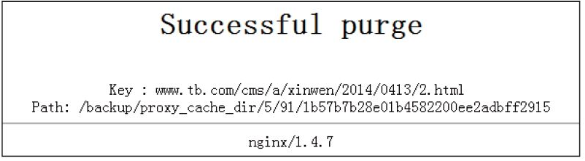

# 案例-Nginx作为Web缓存服务器应用

从0.7.48版本开始，Nginx支持类似Squid的缓存功能。Nginx的Web缓存服务主要由proxy_cache相关命令集和fastcgi_cache相关命令集构成，前者用于反向代理时对后端内容源服务器进行缓存，后者主要用于对FastCGI的动态程序进行缓存。此外，如果不想使用Nginx自带的缓存功能，也可以使用第三方模块ngx_slowfs_cache来实现缓存服务器配置。

## 1. 在Nginx下安装缓存服务器

这里使用Nginx自带的缓存模块，通过proxy_cache命令来实现数据的缓存。Nginx缓存服务器的安装过程基本与10.2节介绍的Nginx的安装过程一样，唯一不同的是，要在编译Nginx的时候加上一个ngx_cache_purge模块，这个第三方模块是清理Nginx缓存的一个插件。下面简单介绍下Nginx作为缓存服务器的安装步骤。

pcre的安装不再重复，首先从http://labs.frickle.com/nginx_ngx_cache_purge/下载ngx_cache_purge插件，这里下载的文件是ngx_cache_purge-2.1.tar.gz，然后解压即可，过程如下：

------

```
[root@ngxserver app]# wget http://labs.frickle.com/files/ngx_cache_purge-2.1.tar.gz
[root@ngxserver app]# tar zxvf -C /app/ngx_cache_purge-2.1.tar.gz
```

------

其次，开始编译安装Nginx，过程如下：

------

```
[root@ngxserver app]# tar zxvf nginx-1.4.7.tar.gz
[root@ngxserver app]# cd nginx-1.4.7/
[root@ngxserver app]# ./configure --user=www --group=www  --prefix=/usr/local/nginx \
> --add-module=/app/ngx_cache_purge-2.1 
> --with-http_stub_status_module --with-http_ssl_module
[root@ngxserver app]# make
[root@ngxserver app]# make install
```

------

最后，在完成安装后可以通过“/usr/local/nginx/sbin/nginx-V”命令查看已安装Nginx的版本和加载的模块信息。

## 2. 配置Nginx缓存服务器

Nginx缓存服务器的配置主要通过proxy_cache相关命令集来实现。下面给出nginx.cnf文件的内容，重点说明与缓存相关的参数，其他参数不再重复介绍。

/usr/local/nginx/conf/nginx.conf文件内容如下：

------

```
user  www www;
worker_processes 8;
error_log  /usr/local/nginx/logs/nginx_error.log  crit;
pid        /usr/local/nginx/nginx.pid;
worker_rlimit_nofile 65535;
events 
{
  use epoll;
  worker_connections 65535;
}
http 
{
  include       mime.types;
  default_type  application/octet-stream;
  charset  utf-8;
  server_names_hash_bucket_size 128;
  client_header_buffer_size 32k;
  large_client_header_buffers 4 32k;
  client_max_body_size 300m;
  sendfile on;
  tcp_nopush     on;
  keepalive_timeout 60;
  tcp_nodelay on;
  client_body_buffer_size  512k;
  proxy_connect_timeout    5;
  proxy_read_timeout       60;
  proxy_send_timeout       5;
  proxy_buffer_size        16k;
  proxy_buffers            4 64k;
  proxy_busy_buffers_size 128k;
  proxy_temp_file_write_size 128k;
  gzip on;
  gzip_min_length  1k;
  gzip_buffers     4 16k;
  gzip_http_version 1.1;
  gzip_comp_level 2;
  gzip_types text/plain application/x-javascript text/css application/xml;
  gzip_vary on;
proxy_cache_path /backup/proxy_cache_dir levels=1:2 keys_zone=cache_one:4096m inactive=1d max_size=3g;  


# proxy_cache_path：用于设置缓存的目录，后面跟缓存路径。最好将缓存目录放在一个独立的硬盘上

# levels=1:2：levels用来设置目录深度，这里是两层目录深度，第一层是一个字符，第二层是两个字符
        
# keys_zone：用来设置Web缓存区名称，这里是cache_one，后面的“4096m”

# 表示内存缓存空间大小为4GB

# inactive：表示自动清除缓存文件的时间，这里的“1d”表示1天没有被访
问的内容自动清除，还可以使用分钟或小时计时，例如“5m”表示5分钟后自
动清除，“5h”表示5小时后自动清除

# max_size：表示硬盘缓存空间可使用的最大值，默认情况下经访问的文件常将
被放到内存中进行缓存，而在内存缓存空间不足时，Nginx会将不经常访问的
数据从内存写到磁盘proxy_temp_path/backup/proxy_temp_dir;proxy_temp_path用于指定临时缓存文件的存储路径，这里需要注意的是，proxy_temp_path和proxy_cache_path
指定的路径必须在同一磁盘分区


server {
        listen       80;
        server_name  www.tb.com www.taob.com;
        charset UTF8;
        access_log  logs/cms.access.log  main;
        location / {
            proxy_cache cache_one; 
　
#反向代理缓存设置命令，语法为“proxy_cache zone|off”,
默认值为off，需要将proxy_cache命令放到location字段，这样匹配此location的url才能被缓存

proxy_cache_valid  200 304 12h;     
#对不同的HTTP状态码设置不同的缓存时间

proxy_cache_key $host$uri$is_args$args;
# 这个命令是设置以什么样的参数得到缓存的文件名，默认为“#$scheme$proxy_host$request_uri”，表示以协议、主机名、请求uri（包含参数)作MD5得出缓存的件文名。这里是以域名、URI、参数组合成

# Web缓存的Key值，Nginx根据Key值哈希，存储缓存内容到二级缓存目录内

        proxy_set_header Host  $host;
        proxy_set_header X-Forwarded-For  $remote_addr;
        proxy_pass http://127.0.0.1:8080
；
        expires      1d;
    }
　　
　　# 下面这段用于配置手动清除缓存策略，清除的方法为：如果一个URL为
　　# http://www.tb.com/2014/0413/3.html
，那么通过访问
　　# http://www.tb.com/purge/2014/0413/3.html
即可清除该URL的缓存


　　location ~ /purge(/.*)
   {
                allow 127.0.0.1;
　　#表示只允许指定的IP或IP段才可以清除URL缓存
                allow     192.168.88.0/24;
                deny all;
                proxy_cache_purge    cache_one   $host$1$is_args$args;
        }   
　　location ~ .*\.(jsp|php|jspx)?$     
　　#设置不做缓存的内容，这里设置扩展名以.jsp、.php、.jspx结尾的动态应用程序不缓存
　　
        {
                proxy_set_header Host  $host;
                proxy_set_header X-Forwarded-For  $remote_addr;
                proxy_pass http://http://127.0.0.1:8080
；
        }
　　access_log  off;
  }
}
```

------

10.5.3　测试proxy_cache实现的缓存功能

完成所有配置后，启动Nginx，然后查看Nginx的进程信息如下：

------

```
[root@haproxy-server conf]# ps -ef|grep nginx
root      2665     1  0 13:25 ?      00:00:00 nginx: master process ../sbin/nginx
nobody    2666  2665  0 13:25 ?      00:00:00 nginx: worker process
nobody    2667  2665  0 13:25 ?      00:00:00 nginx: cache manager process
```

------

从输出可知，Nginx进程多出了一个“cache manager”进程，这个进程就是用来管理缓存服务和文件的。

接着通过www.tb.com访问任意静态网页，在打开网页后，关闭网页再次打开同一个网页，测试访问速度是否加快。同时，在缓存目录查看是否已经生成缓存文件，如果已经生成缓存文件，表明Nginx的缓存服务搭建成功。

其实，还可以修改已经缓存的静态文件的内容，然后再次访问这个网页，看能否显示变动的内容，如果不能显示，那么表明这个网页是从缓存中读取的，等待缓存自动清理时间过后，再次访问这个页面，看看内容是否有变动，如果能够显示变动的网页内容，表明缓存服务器工作正常。

10.5.4　如何清除指定的URL缓存

有时候修改了网页内容，如果不想等到缓存文件过期后自动清理，还可以通过手动方式清理缓存文件，清理方式在上面介绍Nginx配置文件时已经做过说明，只需在清除缓存网页的URI地址前面增加purge即可。

例如，要清除http://www.tb.com/cms/a/xinwen/2014/0413/2.html这个页面的缓存文件，只需在浏览器重输入http://www.tb.com/purge/cms/a/xinwen/2014/0413/2.html地址即可，成功清理缓存文件的结果如图



手动清除Nginx的URL缓存