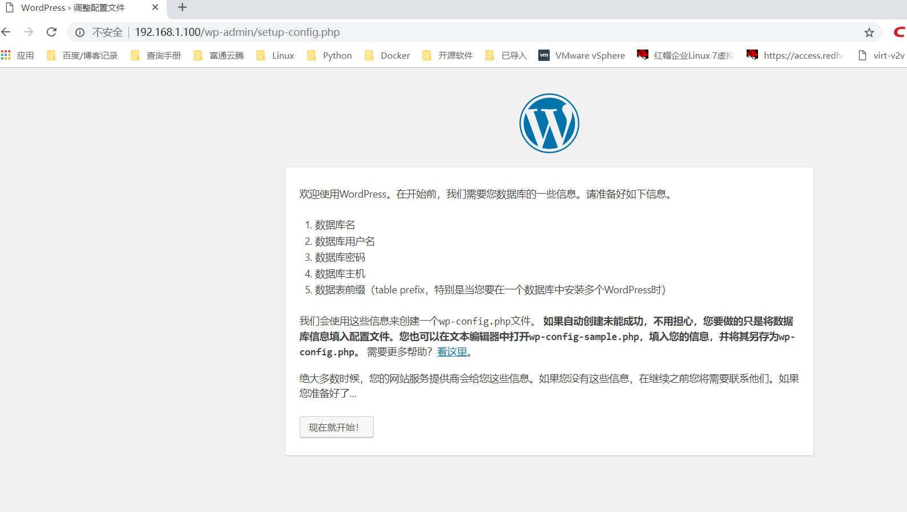
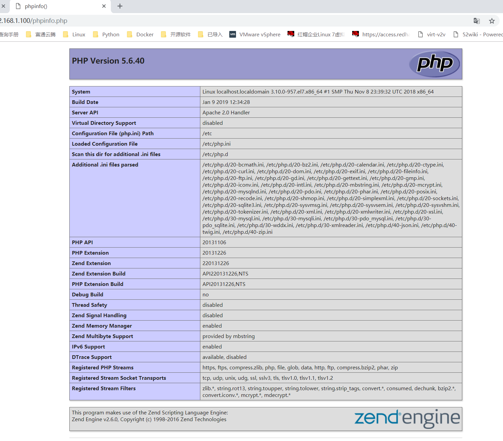

#  LAMP+WordPress环境
    LAMP = Linux + Apache + Mysql + PHP
    
    可以全部部署在1台服务器上
    也可以分离Mysql数据库进行部署
    Apache和PHP需要在同一台机器上，因为PHP是作为Apache的一个模块存在的

## 更多LAMP部署参考
[Lamp https://www.cnblogs.com/f-ck-need-u/p/7642992.html](https://www.cnblogs.com/f-ck-need-u/p/7642992.html)
[Lamp http://www.apelearn.com/study_v2/chapter17.html](http://www.apelearn.com/study_v2/chapter17.html)

## LAMP与WordPress概述
    LAMP是一组构建Web应用平台的开源软件解决方案，它是一个开源套件组合。
    其中，“L”指的是Linux（操作系统），“A”指的是Apache HTTP服务器，“M”指的是MySQL或者MariaDB，“P”指的是指Perl或Python。
    这些开源软件本身都是各自独立的程序，但是因为常放在一起使用，拥有了越来越高的兼容性，所以，就用 LAMP 这个术语代表一个 Web应用平台解决方案。
    在CentOS 7之前，LAMP就代表Linux、Apache、MySQL和PHP。
    而随着CentOS 7系列发布的发布，由于CentOS 7中MySQL被MariaDB了，那么LAMP随之就变为Linux、Apache、MariaDB和PHP。
    本节就在CentOS 7.1环境下介绍LAMP环境的搭建过程。
    WordPress是一个免费的开源项目，在GNU通用公共许可证下授权发布。它使用PHP语言和MySQL数据库开发，最初是一款个人博客系统，目前已逐步演化成一款内容管理系统软件。
    WordPress是世界上使用最广泛的博客系统，
    因为使用者众多，所以WordPress社区非常活跃，有丰富的插件模板资源，易于扩充功能，安装、使用都非常方便。
    这里我们想通过LAMP平台搭建一个WordPress网站系统，后台使用MariaDB数据库，并且使用phpMyAdmin管理数据库，
    同时使用独立域名www.ixdba.net进行访问。下面介绍这个过程。
    
### 1.安装并配置Apache
安装Apache的方法有很多种，这里选择通过yum方式进行安装，但需要Linux系统能够连接互联网，执行如下命令，安装Apache。
    
    [root@localhost ～]#yum install httpd
    默认安装的Apache版本为httpd-2.4.6-31.el7.centos.x86_64，
通过yum安装的Apache，安装完成后，
    
    默认配置文件主目录位于/etc/httpd下，
    Apache的主配置文件/etc/httpd/conf/httpd.conf
    Apache 模块位于/usr/lib64/httpd/modules 目录下，
    Apache 模块的配置文件位于/etc/httpd/conf.modules.d 目录下，
    Web 根目录位于/var/www/html/目录下，
    日志文件位于/var/log/httpd/目录下。
    
    
    在/usr/lib64/httpd/modules目录中，可以看到有很多Apache模块。
    这么多模块都是Apache默认安装的，但这些模块大部分并不是我们需要的，因而，要确保httpd高效、安全地工作，需要禁用其中一些模块，以提高 Apache 的性能，减少占用的内存。
    禁用方法很简单，编辑/etc/httpd/conf/conf.modules.d目录下的每个文件，删除或注释掉不需要的模块即可。
    这里重点关注/etc/httpd 目录。在这个目录下，有个 conf.d 目录。默认情况下，/etc/httpd/conf.d 目录下所有以“.conf”结尾的文件都会被读取。
    因此，很多情况下，根本不需要修改主配置文件/etc/httpd/conf/httpd.conf，而是在/etc/httpd/conf.d/下新建一个以“.conf”结尾的文件来完成各种配置。
    要实现独立域名访问，可通过配置 Apache 的虚拟主机来实现，这里在/etc/httpd/conf.d/目录下新建一个文件ixdba.conf，内容如下
    
    [root@localhost ~]# cat /etc/httpd/conf.d/ixdba.conf 
    <VirtualHost *:80>
    ServerAdmin  admin@ixdba.net
    ServerName  www.ixdba.net
    ServerAlias  www
    DocumentRoot /data/www/html/ixdba
    <Directory "/data/www/html/ixdba/">
        Options  FollowSymLinks
        AllowOverride  All
        Require  all  granted
    </Directory>
    ErrorLog /var/log/httpd/ixdba_error.log
    CustomLog /var/log/httpd/ixdba_access.log combined
    </VirtualHost>
    
然后创建虚拟主机的文件夹。
    
    [root@localhost ixdba]#mkdir -p  /data/www/html/ixdba/
这个文件夹就是用来存放WordPress主程序的目录。接着将Apache设置为开机自启动模式，执行如下命令。
    
    [root@localhost  ixdba]#systemctl enable httpd

输出类似如下。
    
    ln -s '/usr/lib/systemd/system/httpd.service' '/etc/systemd/system/multi-user.target.wants/httpd.service'
最后重新加载httpd，执行如下命令。

    [root@localhost  ixdba]#systemctl reload httpd
    
    systemctl start httpd.service
这样，Apache的安装和配置就完成了，将www.ixdba.net域名做好解析，然后访问这个地址，如果正确，就会就出现Apache的欢迎页面。

## 安装并配置MariaDB（MySQL）
MariaDB是MySQL的一个分支，采用GPL授权许可，目前主要由开源社区在维护。MariaDB的目的是完全兼容MySQL，包括API和命令行，使之能轻松成为MySQL的代替品。目前，大型互联网用户以及Linux发行商纷纷抛弃MySQL，转投MariaDB阵营。MariaDB是目前最受关注的MySQL数据库衍生版，发展前景不可限量。CentOS从7.x版本开始默认使用MariaDB。
通过yum方式安装MariaDB非常简单，执行如下命令即可。

    [root@localhost  app]#yum install mariadb-server mariadb
    [root@localhost  app]#rpm -q mariadb mariadb-server
    mariadb-5.5.41-2.el7_0.x86_64
    mariadb-server-5.5.41-2.el7_0.x86_64
安装完成后，将MariaDB设置为开机自启动，操作如下。

    [root@localhost  app]#systemctl enable mariadb
输出类似如下。

     ln -s '/usr/lib/systemd/system/mariadb.service' '/etc/systemd/system/multi-user.target.wants/mariadb.service'

接着，启动MariaDB，执行如下命令。

        [root@localhost  app]#systemctl start mariadb
最后，登录MariaDB，执行如下命令。

    [root@localhost ~]#systemctl start mariadb.service 
    [root@localhost ~]#mysql -uroot -p
    Enter password: 
    Welcome to the MariaDB monitor.  Commands end with ; or \g.
    Your MariaDB connection id is 2
    Server version: 5.5.60-MariaDB MariaDB Server
    
    Copyright (c) 2000, 2018, Oracle, MariaDB Corporation Ab and others.
    
    Type 'help;' or '\h' for help. Type '\c' to clear the current input statement.
    
    MariaDB [(none)]> 

    [root@localhost ~]# systemctl stop mariadb
    [root@localhost ~]# systemctl restart mariadb
    [root@localhost ~]# systemctl status mariadb
    ● mariadb.service - MariaDB database server
       Loaded: loaded (/usr/lib/systemd/system/mariadb.service; enabled; vendor preset: disabled)
       Active: active (running) since 六 2019-02-23 14:36:37 CST; 6s ago
      Process: 41936 ExecStartPost=/usr/libexec/mariadb-wait-ready $MAINPID (code=exited, status=0/SUCCESS)
      Process: 41905 ExecStartPre=/usr/libexec/mariadb-prepare-db-dir %n (code=exited, status=0/SUCCESS)
     Main PID: 41935 (mysqld_safe)
       CGroup: /system.slice/mariadb.service
               ├─41935 /bin/sh /usr/bin/mysqld_safe --basedir=/usr
               └─42035 /usr/libexec/mysqld --basedir=/usr --datadir=/var/lib/mysql --plugin-dir=/usr/lib64/mysql/plugin --log-er...
    
    2月 23 14:36:35 localhost.localdomain systemd[1]: Starting MariaDB database server...
    2月 23 14:36:35 localhost.localdomain mariadb-prepare-db-dir[41905]: Database MariaDB is probably initialized in /var/li...ne.
    2月 23 14:36:35 localhost.localdomain mysqld_safe[41935]: 190223 14:36:35 mysqld_safe Logging to '/var/lib/mysql/localh...rr'.
    2月 23 14:36:35 localhost.localdomain mysqld_safe[41935]: 190223 14:36:35 mysqld_safe Starting mysqld daemon with datab...ysql
    2月 23 14:36:37 localhost.localdomain systemd[1]: Started MariaDB database server.
    Hint: Some lines were ellipsized, use -l to show in full.
MariaDB 通过内置的安全配置脚本可实现对数据库的安全保护，执行“/usr/bin/mysql_secure_installation”命令，加固MariaDB数据库，操作过程如下。
    
    [root@localhost yum.repos.d]# mysql_secure_installation
    NOTE:  RUNNING  ALL  PARTS  OF  THIS  SCRIPT  IS  RECOMMENDED  FOR  ALL  MariaDB
          SERVERS  IN  PRODUCTION  USE!   PLEASE  READ  EACH  STEP  CAREFULLY!
    Enter  current  password  for  root  (enter  for  none):
    #这里输入目前MariaDB数据库的root密码，默认是空
    OK,  successfully  used  password,  moving  on...
    Setting  the  root  password  ensures  that  nobody  can  log  into  the  MariaDB
    root  user  without  the  proper  authorisation.
    Set root password? [Y/n] y
    #这里询问是否设置MariaDB数据库root的密码，输入"Y"给root用户设置一个新密码
    New  password:
    Re-enter  new  password:
    Password  updated  successfully!
    Reloading  privilege  tables..
     ...  Success!
    By  default,  a  MariaDB  installation  has  an  anonymous  user,  allowing  anyone
    to  log  into  MariaDB  without  having  to  have  a  user  account  created  for
    them.   This  is  intended  only  for  testing,  and  to  make  the  installation
    go  a  bit  smoother.   You  should  remove  them  before  moving  into  a
    production  environment.
    Remove anonymous users? [Y/n] y  #这里询问是否删除anonymous用户，输入"Y"删除
     ...  Success!
      Normally,  root  should  only  be  allowed  to  connect  from  'localhost'.   This
    ensures  that  someone  cannot  guess  at  the  root  password  from  the  network.
    Disallow root login remotely? [Y/n] y  #这里询问是否关闭root用户远程登录权限，输入"Y"
     ...  Success!
    By  default,  MariaDB  comes  with  a  database  named  'test'  that  anyone  can
    access.   This  is  also  intended  only  for  testing,  and  should  be  removed
    before  moving  into  a  production  environment.
    Remove test database and access to it? [Y/n] y   #这里询问是否删除测试数据库及其权限，输入"Y"
     -  Dropping  test  database...
     ...  Success!
     -  Removing  privileges  on  test  database...
     ...  Success!
    Reloading  the  privilege  tables  will  ensure  that  all  changes  made  so  far
    will  take  effect  immediately.
    Reload privilege tables now? [Y/n] y   #这里询问是否重新载入授权表，输入"Y"
     ...  Success!
    Cleaning  up...
    All  done!   If  you've  completed  all  of  the  above  steps,  your  MariaDB
    installation  should  now  be  secure.
    Thanks  for  using  MariaDB!
    至此，MariaDB数据库安装完成了。
    
## 3.安装并配置PHP
这里仍以yum方式介绍如何安装和配置PHP。CentOS 7.1版本中，默认的PHP版本为PHP 5.4，可直接执行如下命令进行PHP以及相关模块的安装：
很多时候，对PHP环境要求较新的版本，例如，PHP 5.6环境，如果通过源码编译、安装，将会非常麻烦。这里提供一种通过yum工具安装最新PHP 版本的方法。首先，需要在系统上安装一个扩展yum源，即epel源，可从http://fedoraproject.org/wiki/EPEL 网站下载针对CentOS 7版本的epel文件，然后进行安装，操作过程如下。

    # yum install epel-release
    # rpm -ivh http://rpms.famillecollet.com/enterprise/remi-release-7.rpm
    
默认情况下，REMI是禁用的。要检查REMI源是否已经成功安装，可以执行如下命令。

    [root@localhost ～]# yum repolist disabled | grep remi
要搜索REMI仓库中是否有可用的包，可以执行如下命令。

    [root@localhost ～]# yum --enablerepo=remi list php
或者

    [root@localhost ～]# yum --enablerepo=remi-php56 list php
通过这种方式，就可以很方便地安装自己需要的PHP版本。例如，要安装PHP，5.6版本，执行如下命令即可。

## 4.安装phpMyAdmin
phpMyAdmin是一个用PHP编写的软件工具，可以通过Web方式控制和操作MySQL数据库，
管理者可以通过Web接口的方式远程管理MySQL数据库
可以很方便地建立、修改、删除数据库及表，通过phpMyAdmin可以使MySQL数据库的管理变得十分简单和高效。
下面通过yum方式安装phpMyAdmin，操作过程如下。

    yum install --enablerepo=remi --enablerepo=remi-php56 phpmyadmin
    
yum会自动寻找依赖软件包，然后自动完成phpMyAdmin的安装。
phpMyAdmin的默认安装目录是/usr/share/phpMyAdmin，
同时会在Apache的配置文件目录中自动创建虚拟主机配置文件/etc/httpd/conf.d/phpMyAdmin.conf。
由于这里介绍的 Apache版本是Apache 2.4.6，所以需要对phpMyAdmin.conf文件做些修改，
在phpMyAdmin.conf文件中找到类似下面的内容。

    Allow  from  127.0.0.1
    Allow  from  ::1
将这些内容修改为：

    Require  all  granted
    
这里“Require all granted“的含义类似于Apache之前版本中的“Allow from all”，表示任何地方都可以访问，如果不对这个设置做修改，将在访问的时候出现403错误。
然后，重新启动httpd服务，执行如下命令。

    [root@localhost ～]# systemctl restart httpd
    最后，通过地址http://www.ixdba.net/phpMyAdmin/ 访问phpMyAdmin，
    设置登录语言为中文，登录用户名root，
    密码就是上面通过mysql_secure_installation设置的那个密码，
    即可登录phpMyAdmin。
    
    
## 5.部署WordPress程序
    WordPress 的官网为 https://wordpress.org，中文官网为 http://cn.wordpress.org/，
    读者可以在这两个网站下载WordPress安装程序。
    目前最新的稳定版本为WordPress 4.2.2，这里下载的是中文版本wordpress-4.2.2-zh_CN.zip，
    把解压后的程序上传到前面设置虚拟服务器时设定的文件夹/data/www/html/ixdba下。
      mv wordpress-5.0.3-zh_CN.zip /data/www/html/ixdba/
      cd /data/www/html/ixdba/
      mv wordpress-5.0.3-zh_CN.zip ../
      unzip wordpress-5.0.3-zh_CN.zip 
      mv wordpress/* ixdba/
    默认情况下，httpd服务的运行用户为apache。为了安全起见，
    我们添加另一个普通用户作为httpd服务的运行账号，执行如下命令添加一个系统用户。
     [root@localhost ～]# useradd ixdba
    [root@localhost ～]# passwd ixdba
用户创建完成后，还需要将 WordPress 程序中所有文件都修改为 ixdba 用户权限，执行如下操作。
    
    [root@localhost ～]# chown -R ixdba:ixdba /data/www/html/ixdba
最后，修改/etc/httpd/conf/httpd.conf文件，找到如下内容。
        
      User  apache
      Group  apache
修改为：
      
      User  ixdba
      Group  ixdba
这两个选项设置httpd服务的运行用户和组，这里修改为ixdba用户和ixdba组。
为了运行WordPress程序，还需要在数据库中提前创建一个用于存储WordPress数据的库。这里将WordPress的数据库命名为cmsdb。下面开始创建数据库。
先登录MariaDB数据库，执行如下操作。

    [root@localhost conf.d]# mysql -uroot -padmin#123
    Welcome to the MariaDB monitor.  Commands end with ; or \g.
    Your MariaDB connection id is 43
    Server version: 5.5.60-MariaDB MariaDB Server
    
    Copyright (c) 2000, 2018, Oracle, MariaDB Corporation Ab and others.
    
    Type 'help;' or '\h' for help. Type '\c' to clear the current input statement.
    
    MariaDB [(none)]> create database cmsdb;
    Query OK, 1 row affected (0.00 sec)
    
    MariaDB [(none)]> grant  all  on  cmsdb.*  to  'ixdba'  identified  by  'ixdbapassword';
    Query OK, 0 rows affected (0.00 sec)
    
    MariaDB [(none)]> flush privileges;
    Query OK, 0 rows affected (0.00 sec)
    
    
    chown -R ixdba:ixdba ixdba/

这个就是WordPress的安装向导界面，
安装过程会提示输入连接数据库的地址、库名、用户名、密码、表前缀，
数据库地址默认是 localhost，保持默认地址即可，
库名、用户名和密码分别为之前设置的 cmsdb、ixdba 和 ixdbapassword，
数据库表前缀保持默认前缀即可。根据向导依次进行操作即可完成安装。
 
## 测试LAMP环境安装的正确性
在LAMP 环境搭建起来之后，如何测试PHP环境的正确性呢？如何知道安装了哪些模块，缺少了哪些模块？非常简单！只需要几行代码就能搞定，请看下面一段代码。
   
    <?php  phpinfo();  ?>
    
将这段代码保存的一个文件中，命名为phpinfo.php，然后放到Web服务的根目录下。通过浏览器访问http://ip/phpinfo.php;

在这个页面中，显示了PHP的各种信息。通过这个页面，读者就能清晰地知道PHP环境中都安装了哪些模块，哪些模块没有安装，这对于部署或配置LAMP环境来说至关重要