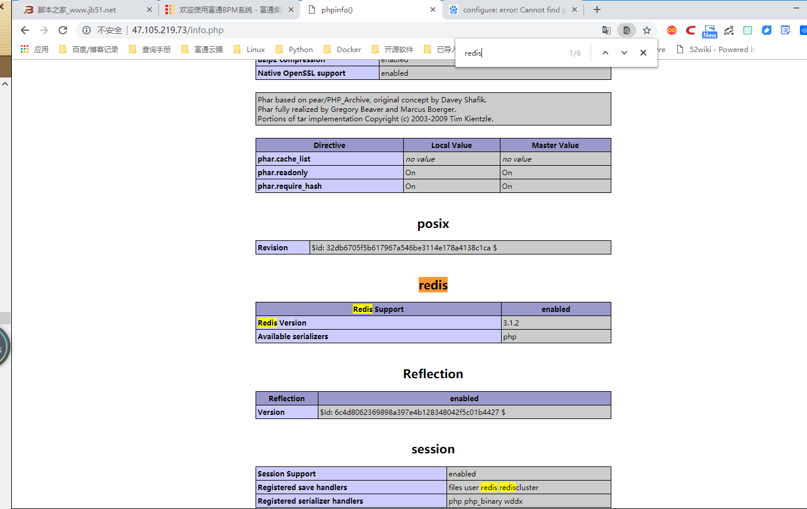

# LAMP+Radis企业实战

LAMP 在企业生产环境中，除了将MySQL 单独部署在其他服务器， 由于MySQL 数据库压力会很大，还会使用MySQL 主从复制及读写分离架构， 同时会对PHP 网站进行调优。
PHP 的优化手段包括： PHP 代码本身优化、PHP 配置文件优化、为PHP 添加缓存模块、将PHP 网站数据存人缓存等。


## LAMP+Radis工作机制
```
LAMP+Radis工作机制：用户通过浏览器访问LAMP网站，并以用户名和密码登录到网站，默认Redis缓存中没有该用户名和密码对应列表，PHP程序会读取MySQL数据库中的用户名和密码，
然后将用户名和密码缓存至Redis中，下次用户通过浏览器再次使用同样的用户名和密码登录网站，PHP无需从数据库中读取该用户和密码信息，而是直接优先从Redis缓存中读取并返回，从而减轻MySQL数据库的压力。

Redis除了可以缓存用户名、密码，还可以缓存PHP论坛各种数据，例如用户帖子、用户动态等。

要实现将LAMP PHP网站相关数据存入Redis，需要一台Redis服务器、PHP-Redis连接驱动、PHP代码配置等。
```

## LAMP+Redis操作案例


(1)环境说明：

```
* LAMP服务器：47.105.219.73
* Redis主库：47.105.218.36
* Redis从库：120.27.1.112  #暂不配置，主从架构在高可用章节有演示
```

(2) Redis主库上安装部署Redis服务，代码如下：

```
wget http://download.redis.io/releases/redis-2.8.13.tar.gz
tar zxvf redis-2.8.13.tar.gz 
cd redis-2.8.13
make PREFIX=/usr/local/redis install
cp redis.conf /usr/local/redis/

#将/usr/local/redis/bin目录加入至环境变量配置文件/etc/profile末尾
# 然后source /etc/profile让环境变量生效，代码如下：
export PATH=/usr/local/redis/bin/:$PATH >> /etc/profile
source /etc/profile

#nohup后台启动及停止Redis服务命令，代码如下
#启动
nohup /usr/local/redis/bin/redis-server /usr/local/redis/redis.conf &

#停止
[root@iZm5e5d49vjfft0t3en4l9Z redis-2.8.13]# /usr/local/redis/bin/redis-cli -p 6379 shutdown
[1]+  Done                    nohup /usr/local/redis/bin/redis-server /usr/local/redis/redis.conf

/usr/local/redis/bin/redis-cli  #登录redis客户端

vim /usr/local/redis/redis.conf   修改配置文件
bind 0.0.0.0     #在61行 原本是127.0.0.1 改为0.0.0.0 这样才可以让lamp调用redis
daemonize yes    #在128行 找到这一行 原本为no 改为yes，yes表示以守护进程的方式启动
 
编辑/etc/sysctl.conf 添加vm.overcommit_memory=1，然后sysctl -p 使配置文件生效 
#这个内核参数作用：表示内核允许分配所有的物理内存，而不管当前的内存状态如何。
/etc/init.d/redis start  #启动redis
``` 

(3) 在LAMP服务器上安装PHP-Redis 连接驱动。要确保PHP 能够连接Redis 缓存服务器， 需添加PHP-Redis 扩展程序， 也即是添加
PHP 安装ext扩展模块， 添加方法如下：
``` 
cd /usr/src/
wget -c -P /src https://github.com/phpredis/phpredis/archive/3.1.2.tar.gz && tar zxvf 3.1.2.tar.gz -C /src
cd  /src/phpredis-3.1.2
/usr/local/php/bin/phpize		#which phpize 或直接执行phpize
./configure --with-php-config=/usr/local/php/bin/php-config --enable-redis
make
make install
Installing shared extensions:     /usr/lib64/php/modules/


修改vim /usr/local/php5/lib/php.ini配置文件，添加redis.so模块，代码如下：
extension_dir = "/usr/lib64/php/modules/"
extension=redis.so  

重启Apache服务，写入phpinfo测试页面，通过浏览器访问，检查到存在Redis模块即可
```



```
[root@iZm5e5d49vjffsyzzdx9x7Z html]# php -m |  grep redis
redis

[root@iZ2zef16b22gl2ycc4pkblZ webdata]# ./configure  --with-php-config=/etc/php  --enable-redis 

[root@iZ2zef16b22gl2ycc4pkblZ webdata]# /etc/init.d/php-fpm restart


修改Discuz PHP网站发布/usr/local/apache/htdocs目录全局配置文件config_global.php
```


(4) LAMP+Redis缓存测试


```
    MariaDB [(none)]> use discuz;
    Reading table information for completion of table and column names
    You can turn off this feature to get a quicker startup with -A
    
    
    MariaDB [discuz]> select uid,email,username,password from pre_common_member;
    +-----+-------------------+----------+----------------------------------+
    | uid | email             | username | password                         |
    +-----+-------------------+----------+----------------------------------+
    |   1 | admin@admin.com   | admin    | 97e6193638198911ab0be475cf27e917 |
    |   2 | 1879324764@qq.com | aaa      | c946e586846eb6a17a487348f2bb0ada |
    |   3 | 962057147@qq.com  | hujianli | ad412759785df40ce5aa8e56850d34e4 |
    +-----+-------------------+----------+----------------------------------+

将aaa用户从mysql数据库中删除，然后验证是否可以从redis缓存记录中登录

    MariaDB [discuz]>  delete from pre_common_member where uid=2;
    Query OK, 1 row affected (0.00 sec)
    
    MariaDB [discuz]> select uid,email,username,password from pre_common_member;
    +-----+------------------+----------+----------------------------------+
    | uid | email            | username | password                         |
    +-----+------------------+----------+----------------------------------+
    |   1 | admin@admin.com  | admin    | 97e6193638198911ab0be475cf27e917 |
    |   3 | 962057147@qq.com | hujianli | ad412759785df40ce5aa8e56850d34e4 |
    +-----+------------------+----------+----------------------------------+
    
```


Redis缓存生效！

参考文献

https://www.cnblogs.com/hystj/articles/8849234.html