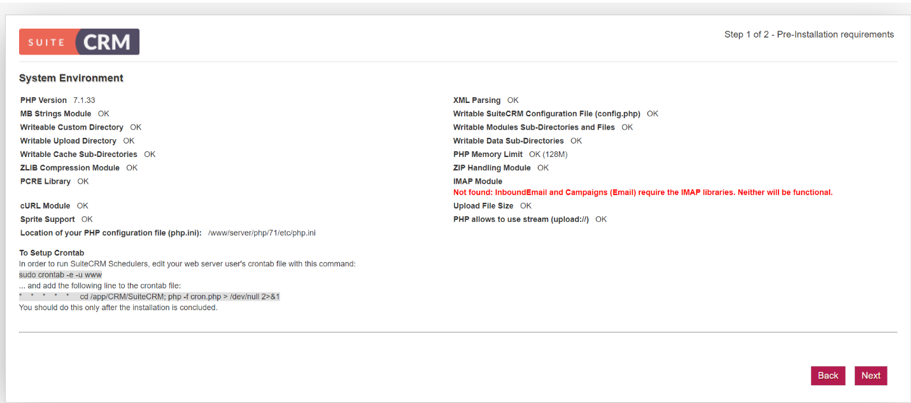

# 宝塔安装CRM系列软件

## 1.安装宝塔面板

使用 SSH 连接工具，如[堡塔SSH终端](https://download.bt.cn/ssh/BT-Term.exe)连接到您的 Linux 服务器后，[挂载磁盘](https://www.bt.cn/bbs/thread-5166-1-1.html)，根据系统执行相应命令开始安装（大约2分钟完成面板安装）：

Centos安装脚本 `*yum install -y wget && wget -O install.sh http://download.bt.cn/install/install_6.0.sh && sh install.sh*`

Ubuntu/Deepin安装脚本 `*wget -O install.sh http://download.bt.cn/install/install-ubuntu_6.0.sh && sudo bash install.sh*`

Debian安装脚本 `*wget -O install.sh http://download.bt.cn/install/install-ubuntu_6.0.sh && bash install.sh*`

Fedora安装脚本 `*wget -O install.sh http://download.bt.cn/install/install_6.0.sh && bash install.sh*`


## 2.安装LAMP环境


## 3.上传SuiteCRM安装包


## 4.安装相关依赖和插件


禁用函数中将putenv、exec禁用给去掉。

新增扩展imap、fileinfo

安装php74-php-pecl-zip

```
yum -y remove libzip5-devel-1.5.2-1.el7.remi.x86_64
yum -y remove libzip5-tools-1.5.2-1.el7.remi.x86_64
yum -y install epel-release
yum -y install http://dl.fedoraproject.org/pub/epel/epel-release-latest-7.noarch.rpm
yum -y install php74-php-pecl-zip.x86_64
yum -y install http://rpms.remirepo.net/enterprise/remi-release-7.rpm
yum install php-zip

# 参考文档
https://www.runoob.com/w3cnote/composer-install-and-usage.html

# 安装相关依赖包
composer install
或者
composer install --ignore-platform-reqs

# 报错处理
https://www.cnblogs.com/richerdyoung/p/10054236.html

# Composer 国内加速，修改镜像源
https://learnku.com/articles/15977/composer-accelerate-and-modify-mirror-source-in-china#replies
http://www.xiegangd.com/article/153440220332395
```


## 5. 添加站点





配置配置数据库信息和站点信息

文章来源于《傻猫网络日志》 https://www.samool.com/42278.html


## 6. 安装expocrm

linux上php下zmq扩展安装

https://blog.csdn.net/lizarel/article/details/91993671

参考文献：

https://www.howtoing.com/debian-espocrm

