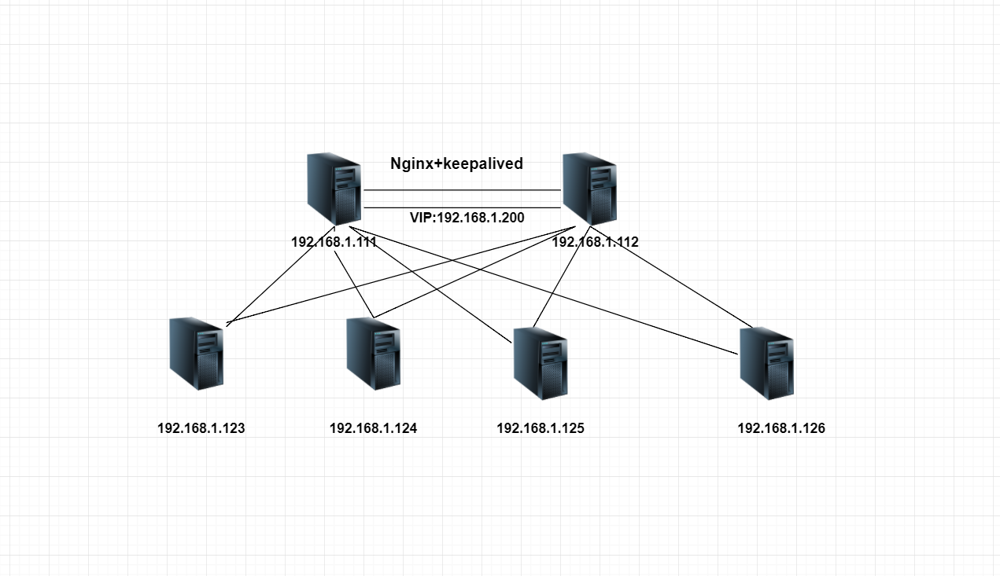
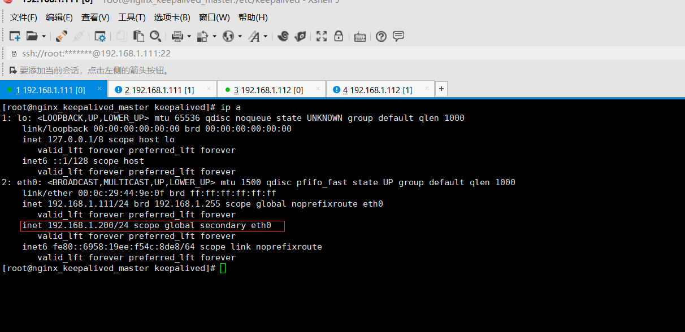

# 企业级Nginx+keepalived 集群实战
负载均衡技术对于一个网站尤其是大型网站的web服务器集群来说是至关重要的！做好负载均衡架构，可以实现故障转移和高可用环境，避免单点故障，保证网站健康持续运行。
关于负载均衡介绍，

由于业务扩展，网站的访问量不断加大，负载越来越高。现需要在web前端放置nginx负载均衡,同时结合keepalived对前端nginx实现HA高可用。
    
    1）nginx进程基于Master+Slave(worker)多进程模型，自身具有非常稳定的子进程管理功能。在Master进程分配模式下，Master进程永远不进行业务处理，只是进行任务分发，从而达到Master进程的存活高可靠性，Slave(worker)进程所有的业务信号都 由主进程发出，Slave(worker)进程所有的超时任务都会被Master中止，属于非阻塞式任务模型。
    2）Keepalived是Linux下面实现VRRP备份路由的高可靠性运行件。基于Keepalived设计的服务模式能够真正做到主服务器和备份服务器故障时IP瞬间无缝交接。二者结合，可以构架出比较稳定的软件LB方案。

## keepalived高可用简介
keepalived是一个类似与layer3、4和7交换机制的软件，keepalived软件有两种功能，分别是监控检查、VRRP(虚拟路由器冗余协议) 
keepalived的作用是检测Web服务器的状态，比如有一台Web服务器、MySQL服务器宕机或工作出现故障，
keepalived检测到后，会将故障的Web服务器或者MySQL服务器从系统中剔除，
当服务器工作正常后keepalived自动将服务器加入到服务器群中，这些工作全部自动完成，
不需要人工干涉，需要人工做的值是修复故障的Web和MySQL服务器。layer3、4、7工作在TCP/IP协议栈的IP层、传输层、应用层，实现原理为：

layer3：keepalived使用layer3的方式工作时，keepalived会定期向服务器群中的服务器发送一个ICMP数据包，如果发现某台服务的IP地址无法ping通，keepalived便报告这台服务器失效，并将它从服务器集群中剔除。layer3的方式是以服务器的IP地址是否有效作为服务器工作是否正常的标准
layer4：layer4主要以TCP端口的状态来决定服务器工作是否正常。例如Web服务端口一般为80，如果keepalived检测到80端口没有启动，则keepalived把这台服务器从服务器集群中剔除
layer7：layer7工作在应用层，keepalived将根据用户的设定检查服务器的运行是否正常，如果与用户的设定不相符，则keepalived将把服务器从服务器集群中剔除

VRRP协议：

    VRRP全称 Virtual Router Redundancy Protocol，即 虚拟路由冗余协议。
    可以认为它是实现路由器高可用的容错协议，即将N台提供相同功能的路由器组成一个路由器组(Router Group)，
    这个组里面有一个master和多个backup，但在外界看来就像一台一样，构成虚拟路由器，
    拥有一个虚拟IP（vip，也就是路由器所在局域网内其他机器的默认路由），
    占有这个IP的master实际负责ARP相应和转发IP数据包，组中的其它路由器作为备份的角色处于待命状态。
    master会发组播消息，当backup在超时时间内收不到vrrp包时就认为master宕掉了，
    这时就需要根据VRRP的优先级来选举一个backup当master，保证路由器的高可用。
    
    在VRRP协议实现里，虚拟路由器使用 00-00-5E-00-01-XX 作为虚拟MAC地址，
    XX就是唯一的 VRID （Virtual Router IDentifier），这个地址同一时间只有一个物理路由器占用。
    在虚拟路由器里面的物理路由器组里面通过多播IP地址 224.0.0.18 来定时发送通告消息。
    每个Router都有一个 1-255 之间的优先级别，级别最高的（highest priority）将成为主控（master）路由器。
    通过降低master的优先权可以让处于backup状态的路由器抢占（pro-empt）主路由器的状态，
    两个backup优先级相同的IP地址较大者为master，接管虚拟IP。

keepalived与heartbeat/corosync等比较：
Heartbeat、Corosync、Keepalived这三个集群组件我们到底选哪个好呢？
首先要说明的是，Heartbeat、Corosync是属于同一类型，Keepalived与Heartbeat、Corosync，根本不是同一类型的。

Keepalived使用的vrrp协议方式，虚拟路由冗余协议 (Virtual Router Redundancy Protocol，简称VRRP)；
Heartbeat或Corosync是基于主机或网络服务的高可用方式；
简单的说就是，Keepalived的目的是模拟路由器的高可用，Heartbeat或Corosync的目的是实现Service的高可用。
所以一般Keepalived是实现前端高可用，常用的前端高可用的组合有

        常见的LVS+Keepalived、
        Nginx+Keepalived、
        HAproxy+Keepalived。
        而Heartbeat或Corosync是实现服务的高可用，
        常见的组合有Heartbeat v3(Corosync)+Pacemaker+NFS+Httpd 
        实现Web服务器的高可用、Heartbeat v3(Corosync)+Pacemaker+NFS+MySQL 
        实现MySQL服务器的高可用。总结一下，Keepalived中实现轻量级的高可用，一般用于前端高可用，
        且不需要共享存储，一般常用于两个节点的高可用。而Heartbeat(或Corosync)一般用于服务的高可用，
        且需要共享存储，一般用于多节点的高可用。这个问题我们说明白了。

那heartbaet与corosync又应该选择哪个好？

    一般用corosync，因为corosync的运行机制更优于heartbeat，就连从heartbeat分离出来的pacemaker都说在以后的开发当中更倾向于corosync，所以现在corosync+pacemaker是最佳组合。

双机高可用一般是通过虚拟IP（飘移IP）方法来实现的，基于Linux/Unix的IP别名技术。
双机高可用方法目前分为两种：

    1）双机主从模式：即前端使用两台服务器，一台主服务器和一台热备服务器，正常情况下，主服务器绑定一个公网虚拟IP，提供负载均衡服务，热备服务器处于空闲状态；当主服务器发生故障时，热备服务器接管主服务器的公网虚拟IP，提供负载均衡服务；但是热备服务器在主机器不出现故障的时候，永远处于浪费状态，对于服务器不多的网站，该方案不经济实惠。
    2）双机主主模式：即前端使用两台负载均衡服务器，互为主备，且都处于活动状态，同时各自绑定一个公网虚拟IP，提供负载均衡服务；当其中一台发生故障时，另一台接管发生故障服务器的公网虚拟IP（这时由非故障机器一台负担所有的请求）。这种方案，经济实惠，非常适合于当前架构环境。
    
## Nginx+keepalived高性能web网络架构实战拓扑

## 1、原理及环境
    Nginx负载均衡一般位于整个架构的最前端或者中间层，如果为最前端时单台nginx会存在单点故障，
    一台nginx宕机，会影响用户对整个网站的访问。如果需要加入nginx备份服务器，nginx主服务器与备份服务器之间形成高可用，
    一旦发现nginx主宕机，能够快速将网站切换至备份服务器。

### 环境准备
    * Nginx版本 v1.12.0
    * keepalived版本 V1.2.1			
    * Nginx1:192.168.1.111（master）    主机名称：nginx_keepalived_master
    * Nginx2:192.168.1.111（backup）	主机名称：nginx_keepalived_backup
	
	软件下载地址
	http://nginx.org/download/nginx-1.12.0.tar.gz
	http://www.keepalived.org/software/keepalived-1.2.1.tar.gz
	
### (1)master和backup均安装nginx
    ##之前预编译需要的gcc、gcc-c++、openssl、openssl-devel等默认已经安装好
    yum install psmisc   #两台机器都安装killall命令
    yum -y install gcc pcre-devel zlib-devel openssl-devel  ##安装perl兼容的正则表达式库
    wget -c http://nginx.org/download/nginx-1.12.0.tar.gz
    cd nginx-1.12.0
    sed -i -e 's/1.12.0//g' -e 's/nginx\//TDTWS/g' -e 's/"NGINX"/"TDTWS"/g' src/core/nginx.h         ##sed修改Nginx版本信息为TDTWS
    ./configure --prefix=/usr/local/nginx --user=www --group=www --with-http_stub_status_module --with-http_ssl_module
    make && make install
    [root@keep1 ~]# vim /usr/local/nginx/conf/nginx.conf
    将该文件里面的user nobody的注释去掉
    [root@keep1 ~]# ln -s /usr/local/nginx/sbin/nginx /sbin/nginx  #创建命令快捷启动
    [root@keep1 ~]# nginx    
    
    /usr/local/nginx/sbin/nginx -t									#检查nginx状态
    nginx: the configuration file /usr/local/nginx/conf/nginx.conf syntax is ok
    nginx: configuration file /usr/local/nginx/conf/nginx.conf test is successful
    #没有报错表示启动成功
	

### (2)master和backup均安装keepalived
    cd /usr/src/
    wget -c http://www.keepalived.org/software/keepalived-1.2.1.tar.gz
    yum -y install libnl libnl-devel libnfnetlink libnfnetlink-devel popt-devel
    tar -zxvf keepalived-1.2.1.tar.gz 
    cd keepalived-1.2.1
    ./configure --prefix=/usr/local/keepalived --with-init=SYSV
    make && make install
    ln -s /usr/local/keepalived/etc/keepalived /etc/
    ln -s /usr/local/keepalived/etc/sysconfig/keepalived /etc/sysconfig/
    ln -s /usr/local/keepalived/etc/rc.d/init.d/keepalived /etc/init.d/
    ln -s /usr/local/keepalived/sbin/keepalived /sbin/
    chmod +x /usr/local/keepalived/etc/rc.d/init.d/keepalived
    chkconfig --add keepalived
    chkconfig keepalived on
    chkconfig --list | grep keepalived
	
	
### 主 keepalived 配置

    [root@nginx_keepalived_master keepalived]# cat keepalived.conf 
    ! Configuration File for keepalived
    
    global_defs {
        notification_email {
            root@localhost      #健康检查报告通知邮箱
        }
        notification_email_from keepalived@localhost         #发送邮件的地址
        smtp_server 127.0.0.1       #邮件服务器
        smtp_connect_timeout 30
        route_id LVS_DEVEL
    }
    
    #注意这个大括号放置下方
    vrrp_script check_nginx 
    {
         script "/data/sh/check_nginx.sh"  
         interval 2
         weight -20
    }
    
    vrrp_instance VI_1 {
        interface eth0
        state BACKUP
        nopreempt
        priority 100
        virtual_router_id 240
        lvs_sync_daemon_interface eth0
        advert_int 5             #健康检测频率
        garp_master_delay 1
        
        authentication {  
            auth_type PASS  
            auth_pass abcdefghijklmn
        }  
        
        track_interface {
           eth0
        }
    
        virtual_ipaddress {
            192.168.1.200/24
        }
    
        track_script {
           check_nginx
        }
    }

### 备keepalived配置

    [root@nginx_keepalived_master keepalived]# cat keepalived.conf 
    ! Configuration File for keepalived
    
    global_defs {
        notification_email {
            root@localhost      #健康检查报告通知邮箱
        }
        notification_email_from keepalived@localhost         #发送邮件的地址
        smtp_server 127.0.0.1       #邮件服务器
        smtp_connect_timeout 30
        route_id LVS_DEVEL
    }
    
    #注意这个大括号放置下方
    vrrp_script check_nginx 
    {
         script "/data/sh/check_nginx.sh"  
         interval 2
         weight -20
    }
    
    vrrp_instance VI_1 {
        interface eth0
        state BACKUP
        nopreempt
        priority 90
        virtual_router_id 240
        lvs_sync_daemon_interface eth0
        advert_int 5             #健康检测频率
        garp_master_delay 1
        
        authentication {  
            auth_type PASS  
            auth_pass abcdefghijklmn
        }  
        
        track_interface {
           eth0
        }
    
        virtual_ipaddress {
            192.168.1.200/24
        }
    
        track_script {
           check_nginx
        }
    }

### 监控脚本
    [root@nginx_keepalived_master sh]# cat /data/sh/check_nginx.sh 
    #!/bin/bash
    killall -0 nginx
    if [[ $? -ne 0 ]]; then
        /etc/init.d/keepalived stop
    fi

### 赋予执行权限
    chmod 755 /data/sh/check_nginx.sh 

###主机编写一个nginx显示的html文件

    echo "<h1>192.168.1.111</h1>" > /usr/local/nginx/html/index.html 
    cat /usr/local/nginx/html/index.html

###备机编写一个nginx显示的html文件

    echo "<h1>192.168.1.112</h1>" > /usr/local/nginx/html/index.html 
    cat /usr/local/nginx/html/index.html

### 实验结果

主机执行：service keepalived restart后成功切换到备机

备机执行：pkill nginx    后触发check_nginx.sh脚本，stop Keepalived.
虚拟IP切换到主机。

 

