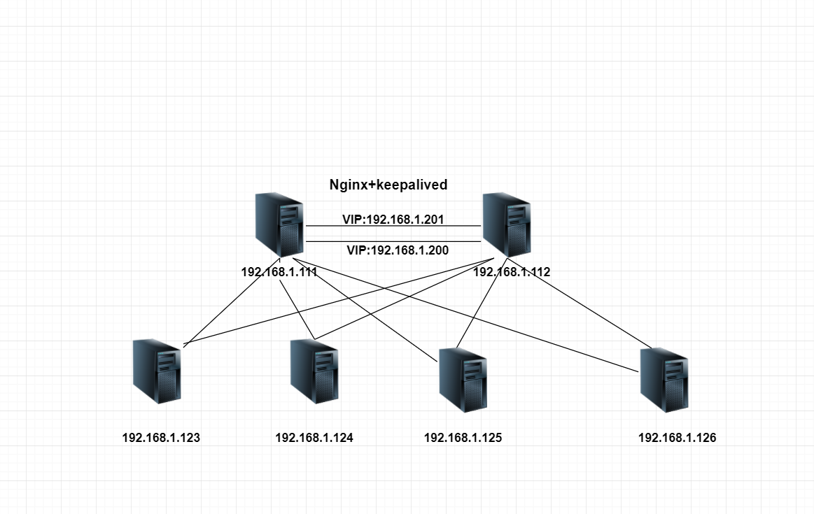
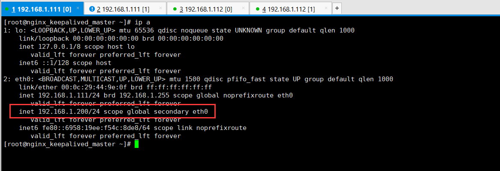
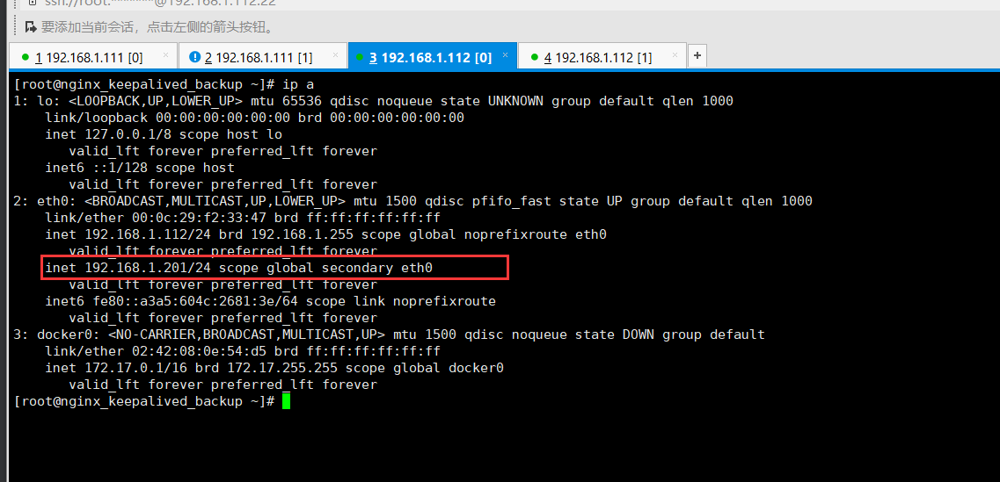

# Nginx+keepalived双主架构

nginx+keepalived主备模式，始终有一台服务器处于空闲状态。
为了更好地利用服务器，可以把它们设置为双主模式，另一台为这一台的备份，
同时它又是另外一个VIP的主服务器，两台同时对外提供不同服务，同时接收用户的请求。

## 双主模式拓扑图

## 环境说明
    nginx_keepalived1_master:192.168.1.111
    nginx_keepalived2_backup:192.168.1.112
    VIP1:192.168.1.200 主为keep1，从为keep2
    VIP2:192.168.1.201 主为keep2，从为keep1
    
## nginx_keepalived1_master

    cat /etc/keepalived/keepalived.conf 

    ! Configuration File for keepalived
    
    global_defs {
        notification_email {
            root@localhost      #健康检查报告通知邮箱
        }
        notification_email_from keepalived@localhost         #发送邮件的地址
        smtp_server 127.0.0.1       #邮件服务器
        smtp_connect_timeout 30
        route_id LVS_DEVEL
    }
    
    vrrp_script check_nginx 
    {
         script "/data/sh/check_nginx.sh"  
         interval 2
         weight -20
    }
    
    vrrp_instance VI_1 {
        interface eth0
        state BACKUP
        nopreempt
        priority 100
        virtual_router_id 240
        lvs_sync_daemon_interface eth0
        advert_int 5             #健康检测频率
        garp_master_delay 1
        
        authentication {  
            auth_type PASS  
            auth_pass abcdefghijklmn
        }  
        
        track_interface {
           eth0
        }
    
        virtual_ipaddress {
            192.168.1.200/24
        }
    
        track_script {
           check_nginx
        }
    }
    
    #VIP2
    vrrp_instance VI_2 {
        state BACKUP
        interface eth0
        lvs_sync_daemon_interface eth0
        virtual_router_id 152
        priority 90
        advert_int 5
        nopreempt
        authentication {
            auth_type PASS
            auth_pass 2222
        }
        virtual_ipaddress {
            192.168.1.201/24
        }
        track_script {
            chk_nginx
        }
    }

## nginx_keepalived2_backup
    cat /etc/keepalived/keepalived.conf 
    ! Configuration File for keepalived
    
    global_defs {
        notification_email {
            root@localhost      #健康检查报告通知邮箱
        }
        notification_email_from keepalived@localhost         #发送邮件的地址
        smtp_server 127.0.0.1       #邮件服务器
        smtp_connect_timeout 30
        route_id LVS_DEVEL
    }
    
    vrrp_script check_nginx 
    {
         script "/data/sh/check_nginx.sh"  
         interval 2
         weight -20
    }
    
    vrrp_instance VI_1 {
        interface eth0
        state BACKUP
        nopreempt
        priority 90
        virtual_router_id 240
        lvs_sync_daemon_interface eth0 
        advert_int 5             #健康检测频率
        garp_master_delay 1
        
        authentication {  
            auth_type PASS  
            auth_pass abcdefghijklmn
        }  
        
        track_interface {
           eth0
        }
    
        virtual_ipaddress {
            192.168.1.200/24
        }
    
        track_script {
           check_nginx
        }
    }
    
    #VIP2
    vrrp_instance VI_2 {
        state MASTER
        interface eth0
        lvs_sync_daemon_interface eth0
        virtual_router_id 152
        priority 100
        advert_int 5
        nopreempt
        authentication {
            auth_type PASS
            auth_pass 2222
        }
        virtual_ipaddress {
            192.168.1.201/24
        }
        track_script {
            chk_nginx
        }
    }

### 测试
正常情况下，两个虚拟网卡在它自己为主的那个主机上，如下图 
vip 200为master的主，为backup的从  vip201为backup的主，为master的从

当其中一台主服务器DOWN掉，则会发现宕掉的那个VIP的从机开始工作，那么两个VIP此时都会在同一个主机上 

### 管理与维护
nginx+keepalived双主架构，日常维护和管理需要从以下几个方面：

    keepalived主配置文件必须设置不同的VRRP名称，同时优先级和VIP也不相同
    该实验中用到了两台服务器，nginx网站访问量为两台服务器访问之和，可以用脚本来统计
    两个nginx都是master，有两个VIP地址，用户从外网访问VIP，需要配置域名映射到两个VIP上，可以通过外网DNS映射不同的VIP
    可以通过zabbix监控等实时监控VIP访问是否正常

参考文献

https://blog.csdn.net/lcl_xiaowugui/article/details/81712925

https://www.cnblogs.com/kevingrace/p/6138185.html