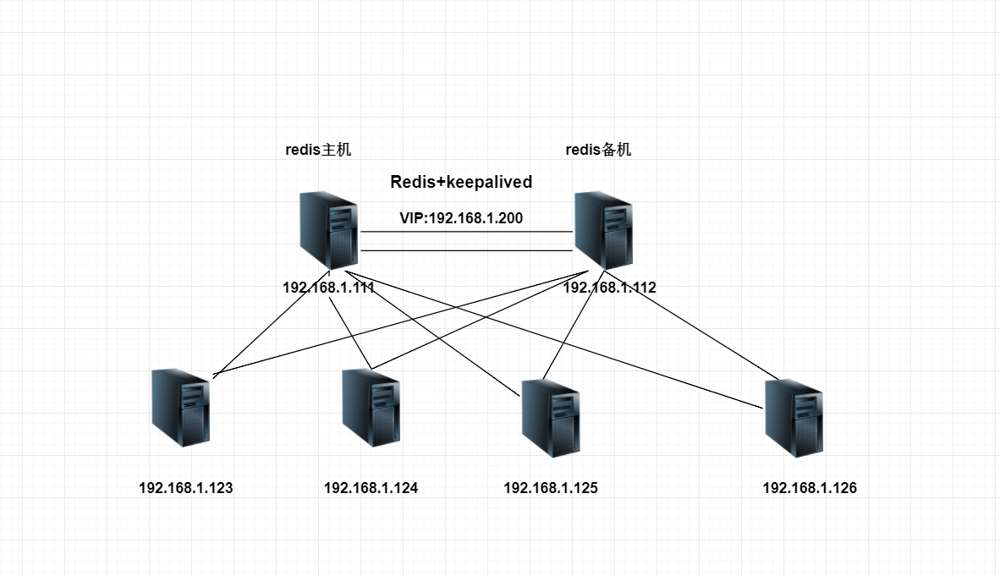
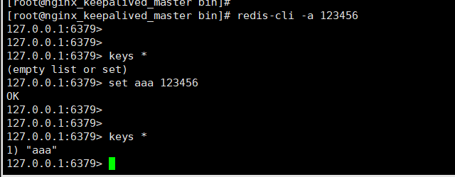

# Redis+keepalived高可用集群实战

Redis是我们当下比较流行使用的非关系数据库，可支持多样化的数据类型，多线程高并发支持，redis运行在内存拥有更快的读写。因为redis的表现如此出色，如何能保障redis在运行中能够应对宕机故障，

redis主从高可用的搭建，参考了网上一些大神的博客文章

## Redis特点
    Redis 是完全开源免费的，遵守BSD协议，是一个高性能的key-value数据库。
    Redis 与其他 key - value 缓存产品有以下三个特点：
    
    Redis支持数据的持久化，可以将内存中的数据保持在磁盘中，重启的时候可以再次加载进行使用。
    Redis不仅仅支持简单的key-value类型的数据，同时还提供如：字符串(String), 哈希(Map), 列表(list), 集合(sets) 和有序集合(sorted sets)等数据结构的存储。
    Redis支持数据的备份，即master-slave模式的数据备份。

## Redis 优势

    性能极高 – Redis能读的速度是100K+次/s,写的速度是80K+次/s 。
    丰富的数据类型 – Redis支持二进制案例的 Strings, Lists, Hashes, Sets 及 Ordered Sets 数据类型操作。
    原子 – Redis的所有操作都是原子性的，同时Redis还支持对几个操作全并后的原子性执行。
    丰富的特性 – Redis还支持 publish/subscribe, 通知, key 过期等等特性。

## 环境介绍
   
    
    Centos7 192.168.1.111 -->主Redis -->主Keepalived
    Centos7 192.168.1.112 -->从Redis -->备Keepalived
    VIP --> 192.168.1.200
    

## Redis的安装
 
    cd /usr/src   
    wget -c http://download.redis.io/releases/redis-2.8.13.tar.gz
    tar zxvf redis-2.8.13.tar.gz 
    cd redis-2.8.13
    make PREFIX=/usr/local/redis install
    cp redis.conf /usr/local/redis/
    export PATH=/usr/local/redis/bin:$PATH
    
    或者
    添加redis命令环境变量
    #vi /etc/profile
    #添加下一行参数
    exportPATH="$PATH:/usr/local/redis/bin"
    #环境变量生效
    source /etc/profile
    
    #手动开启redis进程
    nohup /usr/local/redis/bin/redis-server /usr/local/redis/redis.conf &
    
## Redis主从的配置

Master配置文件
    
    [root@nginx_keepalived_master redis]# cat /usr/local/redis/redis.conf | grep -v "^$"|grep -v "^#"
    daemonize yes
    pidfile /var/run/redis.pid
    port 6379
    tcp-backlog 511
    bind 0.0.0.0                    #访问权限
    requirepass 123456              #设置登录密码
    slave-serve-stale-data yes
    slave-read-only no
    timeout 0
    tcp-keepalive 0
    loglevel notice
    logfile "/var/log/redis.log"        #记录日志
    databases 16
    save 900 1
    save 300 10
    save 60 10000
    stop-writes-on-bgsave-error yes
    rdbcompression yes
    rdbchecksum yes
    dbfilename dump.rdb
    dir ./
    slave-serve-stale-data yes
    slave-read-only yes
    repl-disable-tcp-nodelay no
    slave-priority 100
    appendonly no
    appendfilename "appendonly.aof"
    appendfsync everysec
    no-appendfsync-on-rewrite no
    auto-aof-rewrite-percentage 100
    auto-aof-rewrite-min-size 64mb
    lua-time-limit 5000
    slowlog-log-slower-than 10000
    slowlog-max-len 128
    latency-monitor-threshold 0
    notify-keyspace-events ""
    hash-max-ziplist-entries 512
    hash-max-ziplist-value 64
    list-max-ziplist-entries 512
    list-max-ziplist-value 64
    set-max-intset-entries 512
    zset-max-ziplist-entries 128
    zset-max-ziplist-value 64
    hll-sparse-max-bytes 3000
    activerehashing yes
    client-output-buffer-limit normal 0 0 0
    client-output-buffer-limit slave 256mb 64mb 60
    client-output-buffer-limit pubsub 32mb 8mb 60
    hz 10
    aof-rewrite-incremental-fsync yes

Backup配置文件

    [root@nginx_keepalived_backup redis-2.8.13]# cat /usr/local/redis/redis.conf | grep -v "^$"|grep -v "^#"
    daemonize yes
    pidfile /var/run/redis.pid
    port 6379
    tcp-backlog 511
    bind 0.0.0.0 
    timeout 0
    tcp-keepalive 0
    loglevel notice
    logfile "/var/log/redis.log"
    databases 16
    save 900 1
    save 300 10
    save 60 10000
    stop-writes-on-bgsave-error yes
    rdbcompression yes
    rdbchecksum yes
    dbfilename dump.rdb
    dir ./
    slaveof 192.168.1.111 6379              #主机IP
    masterauth 123456
    slave-serve-stale-data yes
    slave-read-only no
    slave-serve-stale-data yes
    slave-read-only yes
    repl-disable-tcp-nodelay no
    slave-priority 100
    appendonly no
    appendfilename "appendonly.aof"
    appendfsync everysec
    no-appendfsync-on-rewrite no
    auto-aof-rewrite-percentage 100
    auto-aof-rewrite-min-size 64mb
    lua-time-limit 5000
    slowlog-log-slower-than 10000
    slowlog-max-len 128
    latency-monitor-threshold 0
    notify-keyspace-events ""
    hash-max-ziplist-entries 512
    hash-max-ziplist-value 64
    list-max-ziplist-entries 512
    list-max-ziplist-value 64
    set-max-intset-entries 512
    zset-max-ziplist-entries 128
    zset-max-ziplist-value 64
    hll-sparse-max-bytes 3000
    activerehashing yes
    client-output-buffer-limit normal 0 0 0
    client-output-buffer-limit slave 256mb 64mb 60
    client-output-buffer-limit pubsub 32mb 8mb 60
    hz 10
    aof-rewrite-incremental-fsync yes

## redis启动脚本
    [root@nginx_keepalived_master redis]# cat redis
    #!/bin/sh
    #chkconfig:2345 80 90
    # Simple Redisinit.d script conceived to work on Linux systems
    # as it doesuse of the /proc filesystem.
    
     
    #配置redis端口号
    REDISPORT=6379
    #配置redis启动命令路径
    EXE=/usr/local/redis/bin/redis-server
    #配置redis连接命令路径
    CLIEXE=/usr/local/redis/bin/redis-cli
    #配置redis运行PID路径
    PIDFILE=/var/run/redis_6379.pid
    #配置redis的配置文件路径
    CONF="/usr/local/redis/redis.conf"
    #配置redis的连接认证密码
    REDISPASSWORD=123456
    
    function start () {
            if [ -f $PIDFILE ]
    
            then
    
                    echo "$PIDFILE exists,process is already running or crashed"
    
            else
    
                    echo "Starting Redisserver..."
    
                    $EXE $CONF &
    
            fi
    }
    
    function stop () {
            if [ ! -f $PIDFILE ]
    
            then
    
                    echo "$PIDFILE does not exist, process is not running"
    
            else
    
                    PID=$(cat $PIDFILE)
    
                    echo "Stopping ..."
    
                    $CLIEXE -p $REDISPORT -a $REDISPASSWORD shutdown
    
                    while [ -x /proc/${PID} ]
    
                    do
    
                        echo "Waiting forRedis to shutdown ..."
    
                        sleep 1
    
                    done
    
                    echo "Redis stopped"
    
            fi
    }
    
    function restart () {
            stop
            
            sleep 3
            
            start
    }
    
    case "$1" in
        start)
        start
        ;;
        stop)
        stop
        ;;
        restart)
        restart
        ;;
        *)
        echo -e "\e[31m Please use $0 [start|stop|restart] asfirst argument \e[0m"
        ;;
    esac

授予执行权限：

    chmod +x /etc/init.d/redis
    cp -rf redis /etc/init.d/

添加开机启动：

    chkconfig --add redis
    chkconfig redis on
    chkconfig --list | grep redis

## 查看redis主从状态
主机

    [root@nginx_keepalived_master bin]# redis-cli -a 123456 info
    # Stats
    total_connections_received:2
    total_commands_processed:365
    instantaneous_ops_per_sec:1
    rejected_connections:0
    sync_full:1
    sync_partial_ok:0
    sync_partial_err:0
    expired_keys:0
    evicted_keys:0
    keyspace_hits:0
    keyspace_misses:0
    pubsub_channels:0
    pubsub_patterns:0
    latest_fork_usec:4457
    
    # Replication
    role:master
    connected_slaves:1
    slave0:ip=192.168.1.112,port=6379,state=online,offset=505,lag=1
    master_repl_offset:505
    repl_backlog_active:1
    repl_backlog_size:1048576
    repl_backlog_first_byte_offset:2
    repl_backlog_histlen:504

备机

    [root@nginx_keepalived_backup bin]# redis-cli -a 123456 info
    
    # Stats
    total_connections_received:2
    total_commands_processed:39
    instantaneous_ops_per_sec:0
    rejected_connections:0
    sync_full:0
    sync_partial_ok:0
    sync_partial_err:0
    expired_keys:0
    evicted_keys:0
    keyspace_hits:0
    keyspace_misses:0
    pubsub_channels:0
    pubsub_patterns:0
    latest_fork_usec:0
    
    # Replication
    role:slave
    master_host:192.168.1.111
    master_port:6379
    master_link_status:up
    master_last_io_seconds_ago:9
    master_sync_in_progress:0
    slave_repl_offset:505
    slave_priority:100
    slave_read_only:1
    connected_slaves:0
    master_repl_offset:0
    repl_backlog_active:0
    repl_backlog_size:1048576
    repl_backlog_first_byte_offset:0
    repl_backlog_histlen:0

## KeepAlived配置实现双机热备
keepalived主机配置

    [root@nginx_keepalived_master keepalived]# cat keepalived.conf 
    ! Configuration File for keepalived
    
    global_defs {
        notification_email {
            root@localhost      #健康检查报告通知邮箱
        }
        notification_email_from keepalived@localhost         #发送邮件的地址
        smtp_server 127.0.0.1       #邮件服务器
        smtp_connect_timeout 30
        route_id LVS_DEVEL
    }
    vrrp_script chk_redis 
    {
        script "/etc/keepalived/script/redis_check.sh"
        interval 2
    }
    
    vrrp_instance VI_1 {
        state BACKUP
        interface eth0
        virtual_router_id 51
        priority 100
        nopreempt
        advert_int 1
        authentication {
            auth_type PASS
            auth_pass 1111
        }
    
        track_script {
            chk_redis
        }
        virtual_ipaddress {
            192.168.1.200/24
        }
        
        notify_master /etc/keepalived/script/redis_master.sh
        notify_backup /etc/keepalived/script/redis_backup.sh
        notify_fault  /etc/keepalived/script/redis_fault.sh  
        notify_stop   /etc/keepalived/script/redis_stop.sh

/etc/keepalived/script/目录下的脚本如下
redis_check.sh 

    #!/bin/bash
    ALIVE=`/usr/local/redis/bin/redis-cli -a 123456 PING` 
    if [ "$ALIVE" == "PONG" ];then
        echo $ALIVE 
        exit 0 
    else
        echo $ALIVE 
    exit 1 
    fi

redis_master.sh 

    #!/bin/bash
    REDISCLI="/usr/local/redis/bin/redis-cli -a 123456"
    LOGFILE="/var/log/keepalived-redis-state.log"
    
    sleep 15
    
    echo "[master]" >> $LOGFILE
    
    date >> $LOGFILE
    
    echo "Being master...." >>$LOGFILE 2>&1
    
    
    echo "Run SLAVEOF cmd ...">> $LOGFILE
    
    $REDISCLI SLAVEOF 192.168.1.112 6379 >>$LOGFILE  2>&1
    if [ $? -ne 0 ];then
        echo "data rsync fail." >>$LOGFILE 2>&1
    else
        echo "data rsync OK." >> $LOGFILE  2>&1
    fi
    
    sleep 10 #延迟10秒以后待数据同步完成后再取消同步状态 
    
    echo "Run SLAVEOF NO ONE cmd ...">> $LOGFILE
    
    $REDISCLI SLAVEOF NO ONE >> $LOGFILE 2>&1
    if [ $? -ne 0 ];then
        echo "Run SLAVEOF NO ONE cmd fail." >>$LOGFILE 2>&1
    else
        echo "Run SLAVEOF NO ONE cmd OK." >> $LOGFILE  2>&1
    fi
redis_backup.sh

    #!/bin/bash 
    REDISCLI="/usr/local/redis/bin/redis-cli -a 123456"
    LOGFILE="/var/log/keepalived-redis-state.log"
    
     
    echo "[backup]" >> $LOGFILE
    date >> $LOGFILE
    echo "Being slave...." >>$LOGFILE 2>&1
    
    sleep 15 #延迟15秒待数据被对方同步完成之后再切换主从角色 
    echo "Run SLAVEOF cmd ...">> $LOGFILE
    $REDISCLI SLAVEOF 192.168.1.112 6379 >>$LOGFILE  2>&1
    
redis_fault.sh

        #!/bin/bash 
        LOGFILE=/var/log/keepalived-redis-state.log
        echo "[fault]" >> $LOGFILE
        date >> $LOGFILE
        [root@nginx_keepalived_master script]# cat redis_stop.sh
        #!/bin/bash 
        LOGFILE=/var/log/keepalived-redis-state.log
        echo "[stop]" >> $LOGFILE
        date >> $LOGFILE

keepalived备机配置

    [root@nginx_keepalived_backup keepalived]# cat keepalived.conf 
    ! Configuration File for keepalived
    
    global_defs {
        notification_email {
            root@localhost      #健康检查报告通知邮箱
        }
        notification_email_from keepalived@localhost         #发送邮件的地址
        smtp_server 127.0.0.1       #邮件服务器
        smtp_connect_timeout 30
        route_id LVS_DEVEL
    }
    vrrp_script chk_redis
    {
        script "/etc/keepalived/script/redis_check.sh"
        interval 2
    }
    
    vrrp_instance VI_1 {
        state BACKUP
        interface eth0
        virtual_router_id 51
        priority 90
        advert_int 1
        authentication {
            auth_type PASS
            auth_pass 1111
        }
    
        track_script {
            chk_redis
        }
        virtual_ipaddress {
            192.168.1.200/24
        }
        
        notify_master /etc/keepalived/script/redis_master.sh
        notify_backup /etc/keepalived/script/redis_backup.sh
        notify_fault  /etc/keepalived/script/redis_fault.sh  
        notify_stop   /etc/keepalived/script/redis_stop.sh

/etc/keepalived/script/目录下的脚本如下
redis_check.sh 

    #!/bin/bash
    ALIVE=`/usr/local/redis/bin/redis-cli -a 123456 PING` 
    if [ "$ALIVE" == "PONG" ];then
        echo $ALIVE 
        exit 0 
    else
        echo $ALIVE 
    exit 1 
    fi

redis_master.sh 

    #!/bin/bash
    REDISCLI="/usr/local/redis/bin/redis-cli -a 123456"
    LOGFILE="/var/log/keepalived-redis-state.log"
    
    sleep 15
    
    echo "[master]" >> $LOGFILE
    
    date >> $LOGFILE
    
    echo "Being master...." >>$LOGFILE 2>&1
    
    
    echo "Run SLAVEOF cmd ...">> $LOGFILE
    
    $REDISCLI SLAVEOF 192.168.1.111 6379 >>$LOGFILE  2>&1
    if [ $? -ne 0 ];then
        echo "data rsync fail." >>$LOGFILE 2>&1
    else
        echo "data rsync OK." >> $LOGFILE  2>&1
    fi
    
    sleep 10 #延迟10秒以后待数据同步完成后再取消同步状态 
    
    echo "Run SLAVEOF NO ONE cmd ...">> $LOGFILE
    
    $REDISCLI SLAVEOF NO ONE >> $LOGFILE 2>&1
    if [ $? -ne 0 ];then
        echo "Run SLAVEOF NO ONE cmd fail." >>$LOGFILE 2>&1
    else
        echo "Run SLAVEOF NO ONE cmd OK." >> $LOGFILE  2>&1
    fi
redis_backup.sh

    #!/bin/bash 
    REDISCLI="/usr/local/redis/bin/redis-cli -a 123456"
    LOGFILE="/var/log/keepalived-redis-state.log"
    
     
    echo "[backup]" >> $LOGFILE
    date >> $LOGFILE
    echo "Being slave...." >>$LOGFILE 2>&1
    
    sleep 15 #延迟15秒待数据被对方同步完成之后再切换主从角色 
    echo "Run SLAVEOF cmd ...">> $LOGFILE
    $REDISCLI SLAVEOF 192.168.1.111 6379 >>$LOGFILE  2>&1
    
redis_fault.sh

        #!/bin/bash 
        LOGFILE=/var/log/keepalived-redis-state.log
        echo "[fault]" >> $LOGFILE
        date >> $LOGFILE
        [root@nginx_keepalived_master script]# cat redis_stop.sh
        #!/bin/bash 
        LOGFILE=/var/log/keepalived-redis-state.log
        echo "[stop]" >> $LOGFILE
        date >> $LOGFILE

    

    进行主备切换，执行/usr/local/redis/bin/redis-cli -a 123456 info 查看redis主备的状态，
    默认情况下redis备机无法写入数据，同步主机数据