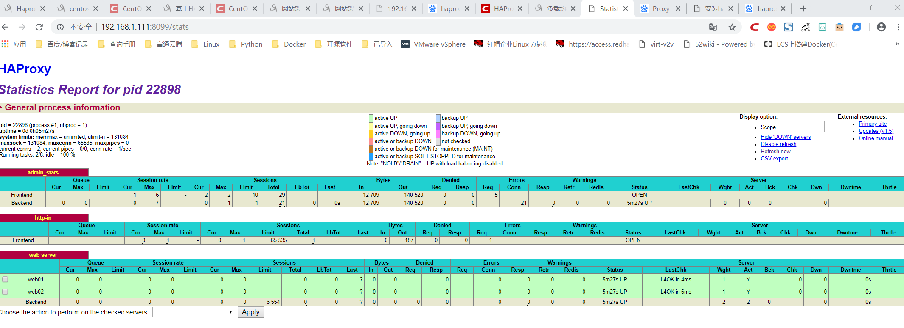

# Haproxy+keepalived主从-主主高可用架构
## Haproxy介绍

    1）HAProxy提供高可用性、负载均衡以及基于TCP和HTTP应用的代理，支持虚拟主机，它是免费、快速并且可靠的一种解决方案。
    2）HAProxy特别适用于那些负载特大的web站点，这些站点通常又需要会话保持或七层处理。
    3）HAProxy运行在当前的硬件上，完全可以支持数以万计的并发连接。并且它的运行模式使得它可以很简单安全的整合进您当前的架构中， 同时可以保护你的web服务器不被暴露到网络上。
    4）HAProxy实现了一种事件驱动, 单一进程模型，此模型支持非常大的并发连接数。多进程或多线程模型受内存限制 、系统调度器限制以及无处不在的锁限制，很少能处理数千并发连接。事件驱动模型因为在有更好的资源和时间管理的用户空间(User-Space) 实现所有这些任务，所以没有这些问题。此模型的弊端是，在多核系统上，这些程序通常扩展性较差。这就是为什么他们必须进行优化以 使每个CPU时间片(Cycle)做更多的工作。
    

## Haproxy与LVS的异同

    1.两者都是软件负载均衡产品，但是LVS是基于Linux操作系统实现的一种软负载均衡，
    而Haproxy是基于第三应用实现的软负载均衡
    
    2.LVS是基于四层的IP负载均衡技术，而HAProxy是基于四层和七层技术，
    可以提供TCP和HTTP应用的负载均衡综合解决方案
    
    3.LVS工作在ISO模型的第四层，其状态监控功能单一，而HAProxy在状态检测方面
    功能强大，可支持端口、URL、脚本等多种状态检测方式
    
    4.虽然HAProxy功能强大，整体的性能低于四层负载均衡模式的LVS，而LVS拥有
    接近硬件设备的网络吞吐和连接负载均衡能力
    
HAProxy和LVS各有优缺点，没有好坏之分，选择哪个作为负载均衡器，要以实际的应用环境来决定
    
    
## 快速安装HAProxy集群软件
    #安装haproxy
    yum install haproxy -y
    
    [root@haproxy02 etc]# which haproxy
    /usr/sbin/haproxy
    [root@haproxy02 etc]# whereis haproxy
    haproxy: /usr/sbin/haproxy /etc/haproxy /usr/share/haproxy /usr/share/man/man1/haproxy.1.gz

    [root@haproxy02 etc]# haproxy -v
    HA-Proxy version 1.5.18 2016/05/10
    
    

## Haproxy 主备机器配置文件详细如下

    root@haproxy01 haproxy]# cat haproxy.cfg
    
    global                              
       log 127.0.0.1 local3 info         #在本机记录日志
       maxconn 65535                     #每个进程可用的最大连接数
       chroot /var/lib/haproxy           #haproxy 安装目录
       uid 99                            #运行haproxy的用户uid（cat /etc/passwd 查看，这里是nobody的uid）
       gid 99                            #运行haproxy的用户组id（cat /etc/passwd 查看，这里是nobody组id）
       daemon                            #以后台守护进程运行
      # nbproc 2			     #进程数 
       pidfile     /var/run/haproxy.pid
     
    defaults
       log global
       mode http                         #运行模式 tcp、 http、 health
       retries 3                         #三次连接失败，则判断服务不可用
       option redispatch                 #如果后端有服务器宕机，强制切换到正常服务器
       stats uri /haproxy                #统计页面 URL 路径
       stats refresh 30s                 #统计页面自动刷新时间
       stats realm haproxy-status        #统计页面输入密码框提示信息
       stats auth admin:dxInCtFianKtL]36   #统计页面用户名和密码
       stats hide-version                 #隐藏统计页面上 HAProxy 版本信息
       maxconn 65535                     #每个进程可用的最大连接数
       timeout connect 5000              #连接超时
       timeout client 50000              #客户端超时
       timeout server 50000              #服务器端超时
    
    listen admin_stats
        bind 0.0.0.0:8099 #监听端口
        mode http         #http的7层模式
        option httplog    #采用http日志格式
        #log 127.0.0.1 local0 err
        maxconn 10
        stats refresh 30s #统计页面自动刷新时间
        stats uri /stats #统计页面url
        stats realm XingCloud\ Haproxy #统计页面密码框上提示文本
        stats auth admin:admin #统计页面用户名和密码设置
        stats auth admin1:admin1 #统计页面用户名和密码设置
        stats hide-version #隐藏统计页面上HAProxy的版本信息
        stats admin if TRUE
    
    frontend http-in                        #接收请求的前端虚拟节点
           bind *:80
           mode    http
           option  httplog
           log     global
           default_backend web-server     	 #静态服务器池
    
     
    backend web-server
       mode http
       balance roundrobin                #设置负载均衡模式，source 保存 session 值，roundrobin 轮询模式
       cookie SERVERID insert indirect nocache
       option httpclose
       option forwardfor
       server web01 192.168.1.106:80 weight 1 cookie 3 check inter 2000 rise 2 fall 5
       server web02 192.168.1.107:80 weight 1 cookie 4 check inter 2000 rise 2 fall 5

## 配置haproxy记录日志
    [root@Haproxy_Keepalived_Master ~]# vim /etc/rsyslog.conf
    .......
    $ModLoad imudp                       #取消注释 ，这一行不注释，日志就不会写
    $UDPServerRun 514                    #取消注释 ，这一行不注释，日志就不会写
    .......
    local0.*                                                /var/log/haproxy.log      #这一行可以没有，可以不用写
    local3.*                                                /var/log/haproxy.log      #这一行必须要写
     
    [root@Haproxy_Keepalived_Master ~]# vim /etc/sysconfig/rsyslog
    SYSLOGD_OPTIONS="-r -m 0"           #接收远程服务器日志
     
    [root@Haproxy_Keepalived_Master ~]# service rsyslog restart  
        

统计页面信息
    
    http://192.168.1.111:8099/stats  
    用户名：admin 密码:admin

    

haproxy 启动命令

    # 检查配置文件语法
    haproxy -c -f /etc/haproxy/haproxy.cfg
    
    # 以daemon模式启动，以systemd管理的daemon模式启动
    haproxy -D -f /etc/haproxy/haproxy.cfg [-p /var/run/haproxy.pid]
    haproxy -Ds -f /etc/haproxy/haproxy.cfg [-p /var/run/haproxy.pid]
    
    # 启动调试功能，将显示所有连接和处理信息在屏幕
    haproxy -d -f /etc/haproxy/haproxy.cfg

## Haproxy+keepalived主从

### 环境介绍
 
 
### haproxy主机keepalived配置
    [root@haproxy01 sh]# cat /etc/keepalived/keepalived.conf
    ! Configuration File for keepalived
    
    global_defs {
        notification_email {
            root@localhost      #健康检查报告通知邮箱
        }
        notification_email_from keepalived@localhost         #发送邮件的地址
        smtp_server 127.0.0.1       #邮件服务器
        smtp_connect_timeout 30
        route_id LVS_DEVEL
    }
    vrrp_script check_haproxy
    {
        script "/data/sh/check_haproxy.sh"
        interval 2
        weight 2
    }
    
    vrrp_instance VI_1 {
        state BACKUP
        interface eth0
        virtual_router_id 151
        priority 100
        nopreempt
        advert_int 1
        authentication {
            auth_type PASS
            auth_pass 1111
        }
    
        track_script {
            check_haproxy
        }
        virtual_ipaddress {
            192.168.1.200/24
        }
       
    } 

 
 
### haproxy备机keepalived配置

    [root@haproxy02 sh]# cat /etc/keepalived/keepalived.conf
    ! Configuration File for keepalived
    
    global_defs {
        notification_email {
            root@localhost      #健康检查报告通知邮箱
        }
        notification_email_from keepalived@localhost         #发送邮件的地址
        smtp_server 127.0.0.1       #邮件服务器
        smtp_connect_timeout 30
        route_id LVS_DEVEL
    }
    vrrp_script check_haproxy
    {
        script "/data/sh/check_haproxy.sh"
        interval 2
        weight 2
    }
    
    vrrp_instance VI_1 {
        state BACKUP
        interface eth0
        virtual_router_id 151
        priority 90
        nopreempt
        advert_int 1
        authentication {
            auth_type PASS
            auth_pass 1111
        }
    
        track_script {
            check_haproxy
        }
        virtual_ipaddress {
            192.168.1.200/24
        }
       
    } 

### 主备机 check_haproxy检测脚本
    [root@haproxy02 sh]# cat /data/sh/check_haproxy.sh 
    #!/bin/bash
    A=`ps -C haproxy --no-header | wc -l`
    if [ $A -eq 0 ];then
        /usr/sbin/haproxy -f /etc/haproxy/haproxy.cfg
        sleep 3
        if [ `ps -C haproxy --no-header | wc -l ` -eq 0 ];then
            /etc/init.d/keepalived stop
        fi
    fi

## Haproxy+keepalived主主

 
 
### haproxy主机keepalived配置
     
     [root@haproxy01 sh]# cat /etc/keepalived/keepalived.conf
    ! Configuration File for keepalived
    
    global_defs {
        notification_email {
            root@localhost      #健康检查报告通知邮箱
        }
        notification_email_from keepalived@localhost         #发送邮件的地址
        smtp_server 127.0.0.1       #邮件服务器
        smtp_connect_timeout 30
        route_id LVS_DEVEL
    }
    vrrp_script check_haproxy
    {
        script "/data/sh/check_haproxy.sh"
        interval 2
        weight 2
    }
    
    vrrp_instance VI_1 {
            interface eth0
            state MASTER
            nopreempt
            priority 100
            virtual_router_id 240
            lvs_sync_daemon_interface eth0
            advert_int 5             #健康检测频率
            garp_master_delay 1
            
            authentication {  
                auth_type PASS  
                auth_pass abcdefghijklmn
            }  
            
            track_interface {
               eth0
            }
        
            virtual_ipaddress {
                192.168.1.200/24
            }
        
            track_script {
               check_haproxy
            }
        }
        
    #VIP2
    vrrp_instance VI_2 {
        state BACKUP
        interface eth0
        lvs_sync_daemon_interface eth0
        virtual_router_id 152
        priority 90
        advert_int 5
        nopreempt
        authentication {
            auth_type PASS
            auth_pass 2222
        }
        virtual_ipaddress {
            192.168.1.201/24
        }
        track_script {
            check_haproxy
        }
    }

 
### haproxy备机keepalived配置
 
     [root@haproxy02 sh]# cat /etc/keepalived/keepalived.conf
    ! Configuration File for keepalived
    
    global_defs {
        notification_email {
            root@localhost      #健康检查报告通知邮箱
        }
        notification_email_from keepalived@localhost         #发送邮件的地址
        smtp_server 127.0.0.1       #邮件服务器
        smtp_connect_timeout 30
        route_id LVS_DEVEL
    }
    vrrp_script check_haproxy
    {
        script "/data/sh/check_haproxy.sh"
        interval 2
        weight 2
    }
    
    vrrp_instance VI_1 {
            interface eth0
            state BACKUP
            nopreempt
            priority 90
            virtual_router_id 240
            lvs_sync_daemon_interface eth0
            advert_int 5             #健康检测频率
            garp_master_delay 1
            
            authentication {  
                auth_type PASS  
                auth_pass abcdefghijklmn
            }  
            
            track_interface {
               eth0
            }
        
            virtual_ipaddress {
                192.168.1.200/24
            }
        
            track_script {
               check_haproxy
            }
        }
        
    #VIP2
    vrrp_instance VI_2 {
        state MASTER
        interface eth0
        lvs_sync_daemon_interface eth0
        virtual_router_id 152
        priority 100
        advert_int 5
        nopreempt
        authentication {
            auth_type PASS
            auth_pass 2222
        }
        virtual_ipaddress {
            192.168.1.201/24
        }
        track_script {
            check_haproxy
        }
    }

