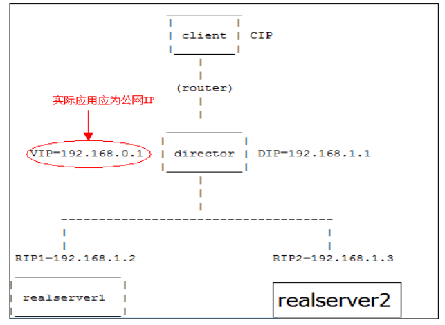
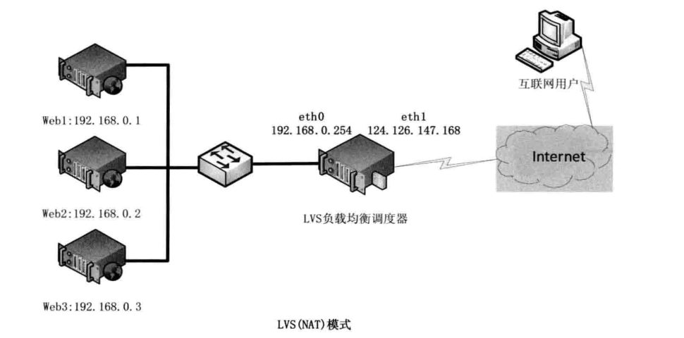
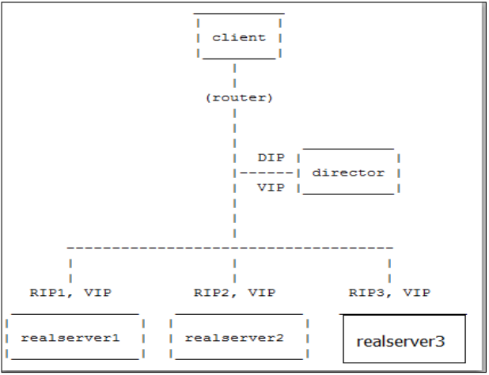

# LVS+keeplaived高可用集群

LVS工作原理：
        
        LVS简单工作原理为用户请求LVS VIP，LVS根据转发方式和算法，将请求转发到后端服务器，后端服务器接到请求
        返回给用户，对于用户来说看不到Web后端具体的应用
        

LVS特点：     
      
      可伸缩网络服务的几种结构，它们都需要一个前端的负载调度器（或者多个进行主从备
    份）。我们先分析实现虚拟网络服务的主要技术，指出 IP 负载均衡技术是在负载调度器的
    实现技术中效率最高的。在已有的 IP 负载均衡技术中，主要有通过网络地址转换（Network
    Address Translation）将一组服务器构成一个高性能的、高可用的虚拟服务器，我们称之
    为 VS/NAT 技术（Virtual Server via Network Address Translation）。

LVS三种负载均衡技术：

    LVS 转发方式有三种，分别是 NAT、DR、TUN 模式。
    
    常用算法：RR(round-robin)、LC(least_connection)、W(weight)RR、WLC 模式等（RR 为轮询模式，LC 为最少连接
    模式）
    
LVS NAT 原理：

    用户请求 LVS 到达 director,director 将请求的报文的目标 IP 地址改
    成后端的 realserver IP 地址，同时将报文的目标端口也改成后端选定的 realserver 相应
    端口，最后将报文发送到 realserver，realserver 将数据返给 director，director 再把数
    据发送给用户。（两次请求都经过 director，所以访问大的话，director 会成为瓶颈）
    




LVS DR 原理：

    用户请求 LVS 到达 director,director 将请求的报文的目标 MAC 地址
    改成后端的 realserver MAC 地址，目标 IP 为 VIP（不变），源 IP 为用户 IP 地址（保持
    不变），然后 Director 将报文发送到 realserver，realserver 检测到目标为自己本地 VIP，
    如果在同一个网段，然后将请求直接返给用户。如果用户跟 realserver 不在一个网段，则
    通过网关返回用户。（此种转发效率最高）
    



LVS TUN 原理：

    跟 LVS DR 类似，也是改变封装 MAC 地址，多了一层隧道加密。实
    施环境复杂，比 LVS DR 模式效率略低。（图一为 LVS 负载均衡图）


那为什么要用lvs呢？

    1.简单一句话，当并发超过了Nginx上限，就可以使用LVS了。
    
    2.日1000-2000W PV或并发请求1万以下都可以考虑用Nginx。
    
    3.大型门户网站，电商网站需要用到LVS。


相关参考文献：

http://www.linuxvirtualserver.org/zh/lvs3.html


## LVS+keepalived 主从高可用模式


环境
``` 
主机名         IP地址            软件                  系统版本
lvs01         172.17.252.34     lvs keepalived      CentOS Linux release 7.6.1810 (Core) 
lvs02         172.17.252.35     lvs keepalived      CentOS Linux release 7.6.1810 (Core) 
web03         39.106.40.172     tomcat              CentOS Linux release 7.6.1810 (Core) 
web04         39.107.137.111    tomcat              CentOS Linux release 7.6.1810 (Core) 

```

主机
``` 
[root@iZ2ze90qu1d4wtd3ngygfoZ ~]# cat /etc/redhat-release 
CentOS Linux release 7.6.1810 (Core) 

[root@iZ2ze90qu1d4wtd3ngygfoZ ~]# uname -a
Linux iZ2ze90qu1d4wtd3ngygfoZ 3.10.0-957.5.1.el7.x86_64 #1 SMP Fri Feb 1 14:54:57 UTC 2019 x86_64 x86_64 x86_64 GNU/Linux

[root@iZ2ze90qu1d4wtd3ngygfoZ ~]# getenforce 
Disabled

[root@iZ2ze90qu1d4wtd3ngygfoZ ~]# systemctl status firewalld.service
● firewalld.service - firewalld - dynamic firewall daemon
   Loaded: loaded (/usr/lib/systemd/system/firewalld.service; disabled; vendor preset: enabled)
   Active: inactive (dead)
     Docs: man:firewalld(1)
```

安装2台tomcat web服务器
```
java环境

先查看是否有java环境： rpm -qa | grep java
如果没有java环境的话，接着就去查找java-1.8.0的可以使用的安装包：yum list | grep java-1.8.0-openjdk

安装java-1.8.0-openjdk所有的文件
[root@yoyo ~]# yum -y install java-1.8.0-openjdk*

查看版本号：java -version

[root@yoyo ~]# java -version
openjdk version "1.8.0_191"


tomcat安装
tomcat安装可以先下载安装包，再解压。也可以直接用yum在线安装，这里我们直接用yum在线安装更方便

yum install tomcat
//或者
yum -y install tomcat

tomcat默认端口是8080，接下来浏览输入地址：http://服务器公网ip:8080/。这个页面暂时是无法访问
由于tomcat的web页面是需要安装插件的，这里继续用 tomcat-webapps 和 tomcat-admin-webapps 两个插件包

yum -y install tomcat-webapps tomcat-admin-webapps

启动tomcat服务、查看tomcat服务状态
[root@yoyo tomcat]#  systemctl start tomcat
[root@yoyo tomcat]# systemctl status tomcat
```


LVS基于Linux内核的模块ipvs与iptables一样是直接工作在内核中。

主流的linux已经默认集成了ipvs模块。
只需要安装管理工具ipvsadm，可以yum直接安装或者下载后编译安装。

安装ipvsadm管理工具

    yum -y install ipvsadm
    
    
    [root@bogon ~]# ipvsadm
    IP Virtual Server version 1.2.1 (size=4096)
    Prot LocalAddress:Port Scheduler Flags
      -> RemoteAddress:Port           Forward Weight ActiveConn InActConn
    [root@bogon ~]# lsmod | grep ip_vs
    ip_vs                 145497  0
    nf_conntrack          133095  1 ip_vs
    libcrc32c              12644  3 xfs,ip_vs,nf_conntrack


LVS集群搭建

    配置LVS负载均衡服务（在lb03操作）
    
    步骤1：在eth0网卡绑定VIP地址（ip）
    
    步骤2：清除当前所有LVS规则（-C）
    
    步骤3：设置tcp、tcpfin、udp链接超时时间（--set）
    
    步骤4：添加虚拟服务（-A），-t指定虚拟服务的IP端口，-s 指定调度算法 调度算法见man ipvsadm， rr wrr 权重轮询 -p 指定超时时间
    
    步骤5：将虚拟服务关联到真实服务上（-a） -r指定真实服务的IP端口 -g LVS的模式 DR模式 -w 指定权重
    
    步骤6：查看配置结果（-ln）


lvs_server.sh

``` 
#!/usr/bin/env bash
#usage:xxx
#scripts_name:xxx.sh
SNS_VIP=$2
SNS_RIP1=$3
SNS_RIP2=$4

if [ "$1" == "stop" -a -z "$2" ]; then
    echo "------------------------------------"
    echo -e "\033[32mPlease Enter $0 stop LVS_VIP\n\nEXample:$0 stop 192.168.1.111\033[0m"
    echo 
    exit
else
    if [  -z "$2" -a -z "$3" -a -z "$4" ]; then
        echo "------------------------------------"
        echo -e "\033[32mPlease Enter Input $0 start VIP REALSERVER1 REALSERVER2\n\nEXample:$0  start/stop  192.168.1.111  192.168.1.2 192.168.1.3\033[0m"
        echo
        exit 0

    fi
fi
. /etc/rc.d/init.d/functions
logger $0 called with $1

function IPVSADM(){
/sbin/ipvsadm --set 30 5 60
/sbin/ifconfig eth0:0 $SNS_VIP broadcast $SNS_VIP netmask 255.255.255.255 broadcast $SNS_VIP up
/sbin/route add -host $SNS_VIP dev eth0:0
/sbin/ipvsadm -A -t $SNS_VIP:8080 -s wlc -p 120
/sbin/ipvsadm -a -t $SNS_VIP:8080 -r $SNS_RIP1:8080 -g -w 1
/sbin/ipvsadm -a -t $SNS_VIP:8080 -r $SNS_RIP2:8080 -g -w 1
}

case "$1" in

start)
    IPVSADM
    echo "------------------------------------"
    /sbin/ipvsadm -Ln
    touch /var/lock/subsys/ipvsadm > /dev/null 2>&1
    ;;
stop)
    /sbin/ipvsadm -C
    /sbin/ipvsadm -Z
    ifconfig eth0:0 down >>/dev/null 2>&1
    route del $SNS_VIP >>/dev/null 2>&1
    rm -rf /var/lock/subsys/ipvsadm > /dev/null 2>&1
    echo "ipvsadm stopped!"
    ;;
status)
    if [ ! -e /var/lock/subsys/ipvsadm ]
    then
    echo "ipvsadm stopped!"
    exit 1
    else
    echo "ipvsadm started!"
    fi
    ;;

*)
    echo "Usage:$0(start|stop|status)"
    exit
    esac
    exit 0


```
LVS 单独执行绑定的 VIP：
```
VIP=192.168.111.200
ifconfig eth0:0 $VIP netmask 255.255.255.255 broadcast
$VIP
/sbin/route add -host $VIP dev eth0:

```


执行结果
``` 
[root@iZ2ze9tpl7iobi4d89ira2Z ~]# ./lvs_service.sh stop 172.17.252.38 39.106.40.172 39.107.137.111
ipvsadm stopped!


[root@lvs01 etc]# chmod 755 lvs_service.sh
[root@lvs01 etc]# ./lvs_service.sh start 172.17.252.38 39.106.40.172 39.107.137.111
SIOCADDRT: File exists
No such device or address
------------------------------------
IP Virtual Server version 1.2.1 (size=4096)
Prot LocalAddress:Port Scheduler Flags
  -> RemoteAddress:Port           Forward Weight ActiveConn InActConn
TCP  172.17.252.38:8080 wlc persistent 120
  -> 39.106.40.172:8080           Route   1      0          0
  -> 39.107.137.111:8080          Route   1      0          0


```

``` 
[root@lvs01 ~]# ip a
1: lo: <LOOPBACK,UP,LOWER_UP> mtu 65536 qdisc noqueue state UNKNOWN group default qlen 1000
    link/loopback 00:00:00:00:00:00 brd 00:00:00:00:00:00
    inet 127.0.0.1/8 scope host lo
       valid_lft forever preferred_lft forever
2: eth0: <BROADCAST,MULTICAST,UP,LOWER_UP> mtu 1500 qdisc mq state UP group default qlen 1000
    link/ether 00:16:3e:12:80:a4 brd ff:ff:ff:ff:ff:ff
    inet 172.17.252.34/20 brd 172.17.255.255 scope global dynamic eth0
       valid_lft 315359320sec preferred_lft 315359320sec
    inet 172.17.252.38/32 brd 172.17.252.38 scope global eth0:0
       valid_lft forever preferred_lft forever


```


客户端配置
``` 
ip addr add 10.0.0.13/32 dev lo

cat >>/etc/sysctl.conf<<EOF
net.ipv4.conf.all.arp_ignore = 1
net.ipv4.conf.all.arp_announce = 2
net.ipv4.conf.lo.arp_ignore = 1
net.ipv4.conf.lo.arp_announce = 2
EOF
```

lvs_client.sh

``` 
#!/usr/bin/env bash
#usage:xxx
#scripts_name:xxx.sh
VIP=172.17.252.38
case $1 in
start)
    ifconfig lo:0 $VIP netmask 255.255.255.255 broadcast $VIP
    /sbin/route add -host $VIP dev lo:0
    echo "1" >/proc/sys/net/ipv4/conf/lo/arp_ignore
    echo "2" >/proc/sys/net/ipv4/conf/lo/arp_announce
    echo "1" >/proc/sys/net/ipv4/conf/all/arp_ignore
    echo "2" >/proc/sys/net/ipv4/conf/all/arp_announce
    sysctl -p >/dev/null 2>&1
    echo "RealServer Start OK"
    exit 0
   ;;

stop)
    ifconfig lo:0 down
    route del $VIP >/dev/null 2>&1
    echo "0" >/proc/sys/net/ipv4/conf/lo/arp_ignore
    echo "0" >/proc/sys/net/ipv4/conf/lo/arp_announce
    echo "0" >/proc/sys/net/ipv4/conf/all/arp_ignore
    echo "0" >/proc/sys/net/ipv4/conf/all/arp_announce
    echo "RealServer Stoped OK"
    exit 1
   ;;

*)
    echo "Usage:$0 {start|stop}"
   ;;
esac

```


### 验证LVS的使用是否正常

在其他机器上访问VIP地址和端口

测试机1
``` 
[root@web01 ~]# curl 172.17.252.38:8080 | grep web
  % Total    % Received % Xferd  Average Speed   Time    Time     Time  Current
                                 Dload  Upload   Total   Spent    Left  Speed
100 11215    0 11215    0     0  4706k      0 --:--:-- --:--:-- --:--:-- 5476k
<h1> web01  </h1>
                        <p>For security, access to the <a href="/manager/html">manager webapp</a> is restricted.

........
```
测试机2
``` 
[root@web02 ~]# curl 172.17.252.38:8080| grep web
  % Total    % Received % Xferd  Average Speed   Time    Time     Time  Current
                                 Dload  Upload   Total   Spent    Left  Speed
100 11215    0 11215    0     0  7953k      0 --:--:-- --:--:-- --:--:-- 10.6M
<h1>  web02 </h1>
                        <p>For security, access to the <a href="/manager/html">manager webapp</a> is restricted.
```


### 安装keepalived
两台lvs服务器安装keepalived 

    yum -y install keepalived
    
    [root@lvs01 ~]# rpm -qa keepalived
    keepalived-1.3.5-8.el7_6.x86_64


lvs01
``` 
[root@lvs01 home]# cat /etc/keepalived/keepalived.conf
global_defs {
   router_id LVS_01
}

vrrp_instance VI_1 {
    state MASTER
    interface eth0
    virtual_router_id 51
    priority 150
    advert_int 1
    authentication {
        auth_type PASS
        auth_pass 1111
    }
    virtual_ipaddress {
     172.17.252.38/20
    }
}

virtual_server 172.17.252.38 8080 {
    delay_loop 6
    lb_algo wrr
    lb_kind DR
    nat_mask 255.255.240.0
    persistence_timeout 50
    protocol TCP

    real_server 39.106.40.172 8080 {
        weight 1
        TCP_CHECK {
        connect_timeout 8
        nb_get_retry 3
        delay_before_retry 3
        connect_port 80
        }
    }

    real_server 39.107.137.111 8080 {
        weight 1
        TCP_CHECK {
        connect_timeout 8
        nb_get_retry 3
        delay_before_retry 3
        connect_port 80
        }
    }
}

```

lvs02
``` 
[root@lvs02 home]# cat /etc/keepalived/keepalived.conf
global_defs {
   router_id LVS_02
}

vrrp_instance VI_1 {
    state BACKUP
    interface eth0
    virtual_router_id 51
    priority 100
    advert_int 1
    authentication {
        auth_type PASS
        auth_pass 1111
    }
    virtual_ipaddress {
     172.17.252.38/20
    }
}
virtual_server 172.17.252.38 8080 {
    delay_loop 6
    lb_algo wrr
    lb_kind DR
    nat_mask 255.255.240.0
    persistence_timeout 50
    protocol TCP

    real_server 39.106.40.172 8080 {
        weight 1
        TCP_CHECK {
        connect_timeout 8
        nb_get_retry 3
        delay_before_retry 3
        connect_port 80
        }
    }

    real_server 39.107.137.111 8080 {
        weight 1
        TCP_CHECK {
        connect_timeout 8
        nb_get_retry 3
        delay_before_retry 3
        connect_port 80
        }
    }
}

```


关闭lvs01，访问查看网页状态

    [root@lvs01 home]# reboot


    [root@web02 ~]# curl 172.17.252.38:8080 | grep web
      % Total    % Received % Xferd  Average Speed   Time    Time     Time  Current
                                     Dload  Upload   Total   Spent    Left  Speed
    100 11215    0 11215    0     0  4220k      0 --:-<h1>  web02 </h1>
    -:-- -                        <p>For security, access to the <a href="/manager/html">manager webapp</a> is restricted.
    -:--:-- --:--:-- 5476k


VIP 切换测试

手动停掉keepalived服务，VIP会自动切换到lvs02上
``` 

[root@lvs01 ~]# ip ad li eth0
2: eth0: <BROADCAST,MULTICAST,UP,LOWER_UP> mtu 1500 qdisc mq state UP group default qlen 1000
    link/ether 00:16:3e:12:80:a4 brd ff:ff:ff:ff:ff:ff
    inet 172.17.252.34/20 brd 172.17.255.255 scope global dynamic eth0
       valid_lft 315359683sec preferred_lft 315359683sec
    inet 172.17.252.38/32 brd 172.17.252.38 scope global eth0:0
       valid_lft forever preferred_lft forever
    inet 172.17.252.38/20 scope global secondary eth0
       valid_lft forever preferred_lft forever


[root@lvs01 ~]# pkill keepalived

[root@lvs01 ~]# ip ad li eth0
2: eth0: <BROADCAST,MULTICAST,UP,LOWER_UP> mtu 1500 qdisc mq state UP group default qlen 1000
    link/ether 00:16:3e:12:80:a4 brd ff:ff:ff:ff:ff:ff
    inet 172.17.252.34/20 brd 172.17.255.255 scope global dynamic eth0
       valid_lft 315359449sec preferred_lft 315359449sec
    inet 172.17.252.38/32 brd 172.17.252.38 scope global eth0:0
       valid_lft forever preferred_lft forever


```

启动服务后，VIP正常
``` 
[root@lvs01 ~]# !sys
systemctl start keepalived.service
[root@lvs01 ~]# ip a
1: lo: <LOOPBACK,UP,LOWER_UP> mtu 65536 qdisc noqueue state UNKNOWN group default qlen 1000
    link/loopback 00:00:00:00:00:00 brd 00:00:00:00:00:00
    inet 127.0.0.1/8 scope host lo
       valid_lft forever preferred_lft forever
2: eth0: <BROADCAST,MULTICAST,UP,LOWER_UP> mtu 1500 qdisc mq state UP group default qlen 1000
    link/ether 00:16:3e:12:80:a4 brd ff:ff:ff:ff:ff:ff
    inet 172.17.252.34/20 brd 172.17.255.255 scope global dynamic eth0
       valid_lft 315359367sec preferred_lft 315359367sec
    inet 172.17.252.38/32 brd 172.17.252.38 scope global eth0:0
       valid_lft forever preferred_lft forever
    inet 172.17.252.38/20 scope global secondary eth0
       valid_lft forever preferred_lft forever

```

## 參考文献

参考资料
[Keepalived + LVS/DR 安装配置](https://www.cnblogs.com/xiangsikai/p/8432963.html)

