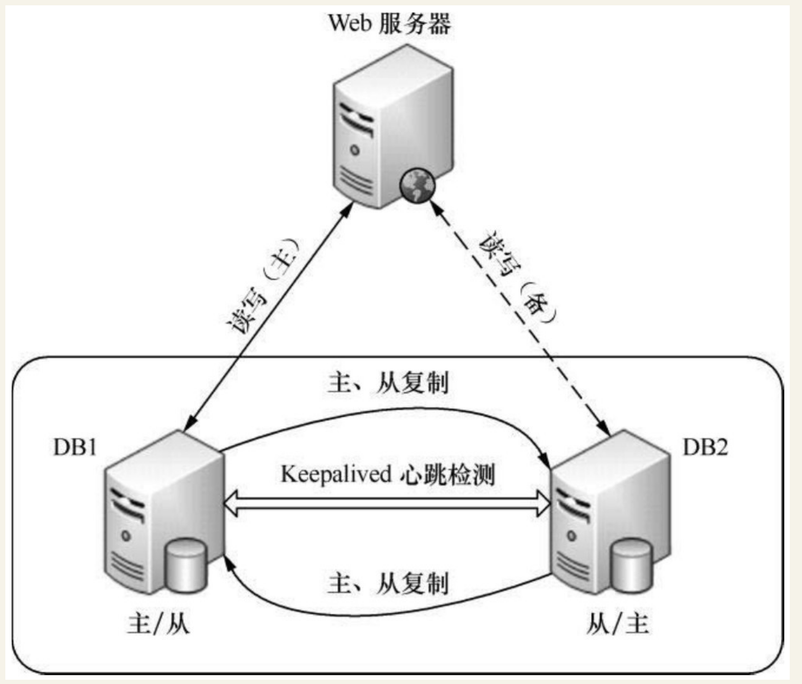

# Keepalived实现MySQL双主高可用

架构图：



## MySQL主主互备模式配置环境
主机名 | 操作系统版本| MySQL版本 |主机IP|MySQL VIP|
---|---|---|---|---|
DB1(主) | Centos6.3| mysql5.1.73|192.168.88.11|192.168.88.10|
DB1(备) | Centos6.3| mysql5.1.73|192.168.88.12|192.168.88.10|


##  MySQL主主互备模式配置

### 1.修改MySQL配置文件

**DB1 主机的配置文件**

在/etc/my.cnf文件中的“[mysqld]”段添加如下内容。

```
# 添加 主1 = 1  主2 = 2
server-id  =  1
# 添加 开启二进制文件
log-bin=mysql-bin
relay-log  =  mysql-relay-bin

# 添加 避免主键冲突
auto-increment-offset= 1
auto-increment-increment= 2
##过滤掉不需要复制的数据库或表
replicate-wild-ignore-table=mysql.%
replicate-wild-ignore-table=test.%
replicate-wild-ignore-table=information_schema.%
```

**DB2主机的配置文件**

在/etc/my.cnf文件中的“[mysqld]”段添加如下内容。

```
# 添加 主1 = 1  主2 = 2
server-id  =  2
# 添加 开启二进制文件
log-bin=mysql-bin
relay-log  =  mysql-relay-bin

# 添加 避免主键冲突
auto-increment-offset= 1
auto-increment-increment= 2
##过滤掉不需要复制的数据库或表
replicate-wild-ignore-table=mysql.%
replicate-wild-ignore-table=test.%
replicate-wild-ignore-table=information_schema.%
```

**replicate-wild-ignore-table 是个复制过滤选项，可以过滤掉不需要复制的数据库或表。**

例如“mysql.%”表示不复制MySQL库下的所有对象，其他依次类推。

**与此对应的是replicate_wild_do_table选项，用来指定需要复制的数据库或表。**

这里需要注意的是，不要在主库上使用binlog-do-db或binlog-ignore-db选项，也不要在从库上使用replicate-do-db或replicate-ignore-db选项，因为这样可能产生跨库更新失败的问题。推荐在从库上使用replicate_wild_do_table和replicate-wild-ignore-table两个选项来解决复制过滤问题。

### 2.手动同步数据库

```
mysql>FLUSH  TABLES  WITH  READ  LOCK;
Query  OK,  0  rows  affected  (0.00  sec)
不要退出这个终端，否则这个锁就失效了。在不退出终端的情况下，再开启一个终端直接打包压缩数据文件或使用mysqldump工具来导出数据。这里通过打包mysql文件来完成数据的备份，操作过程如下：

[root@DB1 ～]# cd /var/lib/
[root@DB1  lib]# tar zcvf mysql.tar.gz  mysql
[root@DB1 lib]# scp mysql.tar.gz  DB2:/var/lib/
```

将数据传输到DB2后，依次重启DB1和DB2上面的mysql。

### 3.创建复制用户并授权，并查看二进制文件

首先在DB1的mysql库中创建复制用户，

```
创建用户
# 1.创建用户名可被任意主机连接
mysql -uroot -p123456 -e "grant all on *.* to "root"@"%" identified by "123456";"

# 2.添加复制连接用户
GRANT REPLICATION SLAVE ON *.* TO 'RepUser'@'%'identified by 'beijing';

# 3.刷新
flush privileges;
```

查看二进制文件

```
# 进入主1数据库
mysql -uroot -p123456

MariaDB [(none)]> show master status;
+------------------+----------+--------------+------------------+
| File             | Position | Binlog_Do_DB | Binlog_Ignore_DB |
+------------------+----------+--------------+------------------+
| mysql-bin.000004 |      245 |              |                  |
+------------------+----------+--------------+------------------+
1 row in set (0.00 sec)


# 进入主2数据库
mysql -uroot -p123456

MariaDB [(none)]> show master status;
+------------------+----------+--------------+------------------+
| File             | Position | Binlog_Do_DB | Binlog_Ignore_DB |
+------------------+----------+--------------+------------------+
| mysql-bin.000005 |      335 |              |                  |
+------------------+----------+--------------+------------------+
1 row in set (0.00 sec)
```


### 4. 通过关联用户 关联两端position号 与 二进制文件 实现主主复制

```
# 主1
MariaDB [(none)]> CHANGE MASTER TO MASTER_USER='RepUser',MASTER_HOST='192.168.1.109',MASTER_PASSWORD='beijing',MASTER_PORT=3307,MASTER_LOG_FILE='mysql-bin.000005',MASTER_LOG_POS=335;

# 主2
MariaDB [(none)]> CHANGE MASTER TO MASTER_USER='RepUser',MASTER_HOST='192.168.1.108',MASTER_PASSWORD='beijing',MASTER_PORT=3307,MASTER_LOG_FILE='mysql-bin.000004',MASTER_LOG_POS=245;
```

### 5.两端开启复制功能

```
MariaDB [(none)]> start slave;
```

### 6.查看主主复制状态，双yes 为成功！！！

**主1**

```
MariaDB [(none)]> show slave status\G
*************************** 1. row ***************************
               Slave_IO_State: Waiting for master to send event
                  Master_Host: 192.168.1.109
                  Master_User: RepUser
                  Master_Port: 3307
                Connect_Retry: 60
              Master_Log_File: mysql-bin.000005
          Read_Master_Log_Pos: 335
               Relay_Log_File: mariadb-relay-bin.000015
                Relay_Log_Pos: 619
        Relay_Master_Log_File: mysql-bin.000005
             Slave_IO_Running: Yes
            Slave_SQL_Running: Yes
```

**主2**

```
MariaDB [(none)]>  show slave status\G
*************************** 1. row ***************************
               Slave_IO_State: Waiting for master to send event
                  Master_Host: 192.168.1.108
                  Master_User: RepUser
                  Master_Port: 3307
                Connect_Retry: 60
              Master_Log_File: mysql-bin.000004
          Read_Master_Log_Pos: 245
               Relay_Log_File: mariadb-relay-bin.000015
                Relay_Log_Pos: 529
        Relay_Master_Log_File: mysql-bin.000004
             Slave_IO_Running: Yes
            Slave_SQL_Running: Yes
```


## DB1和DB2上安装Keepalived 

安装和配置，安装过程如下:

```
[root@keepalived-master  app]#tar zxvf keepalived-1.2.12.tar.gz

[root@keepalived-master  app]#cd  keepalived-1.2.12
[root@keepalived-master keepalived-1.2.12]#./configure   --sysconf=/etc \
> --with-kernel-dir=/usr/src/kernels/2.6.32-431.5.1.el6.x86_64

[root@keepalived-master  keepalived-1.2.12]#make
[root@keepalived-master  keepalived-1.2.12]#make  install
[root@keepalived-master keepalived-1.2.12]#ln -s /usr/local/sbin/keepalived /sbin/
[root@keepalived-master  keepalived-1.2.12]#chkconfig   --add  keepalived
[root@keepalived-master  keepalived-1.2.12]#chkconfig   --level  35  keepalived  on
```

## DB1

DB1服务器上`/etc/keepalived/keepalived.conf`

``` 
 global_defs {
      notification_email {
        acassen@firewall.loc
        failover@firewall.loc
        sysadmin@firewall.loc
      }
      notification_email_from Alexandre.Cassen@firewall.loc
      smtp_server 192.168.200.1
      smtp_connect_timeout 30
      router_id MySQLHA_DEVEL
    }
    vrrp_script check_mysqld {
        script "/etc/keepalived/mysqlcheck/check_slave.pl 127.0.0.1" #检测mysql复制状态的脚本
    interval  2
    weight  21
        }
    vrrp_instance HA_1 {
      state BACKUP        #在DB1和DB2上均配置为BACKUP
    interface  eth0
        virtual_router_id 80
    priority  100
        advert_int 2
        nopreempt #不抢占模式，只在优先级高的机器上设置即可，优先级低的机器上不设置
    authentication  {
    auth_type PASS
    auth_pass qweasdzxc
        }
        track_script {
        check_mysqld
        }
        virtual_ipaddress {
          192.168.88.10/24 dev eth0    #mysql的对外服务IP，即VIP
        }
    }
```


/etc/keepalived/mysqlcheck/check_slave.pl文件的内容如下
``` 
#!/usr/bin/perl -w
use  DBI;
use  DBD::mysql;
#  CONFIG  VARIABLES
$SBM  =  120;
$db  =  "ixdba";
$host  =  $ARGV[0];
$port  =  3306;
$user  =  "root";
$pw  =  "xxxxxx";
#  SQL  query
$query  =  "show  slave  status";
$dbh  =  DBI->connect("DBI:mysql:$db:$host:$port",  $user,  $pw,  {  RaiseError  =>  0,
PrintError  =>  0  });
if  (!defined($dbh))  {
exit  1;
}
$sqlQuery  =  $dbh->prepare($query);
$sqlQuery->execute;
$Slave_IO_Running =  "";
$Slave_SQL_Running = "";
$Seconds_Behind_Master = "";
while (my $ref = $sqlQuery->fetchrow_hashref()) {
    $Slave_IO_Running = $ref->{'Slave_IO_Running'};
    $Slave_SQL_Running = $ref->{'Slave_SQL_Running'};
    $Seconds_Behind_Master = $ref->{'Seconds_Behind_Master'};
}
$sqlQuery->finish;
$dbh->disconnect();
if ( $Slave_IO_Running eq "No" || $Slave_SQL_Running eq "No" ) {
exit  1;
}  else  {
if ( $Seconds_Behind_Master > $SBM ) {
exit  1;
    }  else  {
exit  0;
    }
}
```

这是个用Perl写的检测mysql复制状态的脚本。ixdba是本例中的一个数据库名。读者只需修改文件中数据库名、数据库的端口、用户名和密码即可直接使用，但在使用前要保证对于此脚本有可执行权限


## DB2
接着将keepalived.conf文件和check_slave.pl文件复制到DB2服务器上对应的位置，
然后将DB2上keepalived.conf文件中`priority值修改为90`，同时去掉`nopreempt`选项。

在完成所有配置后，分别在DB1和DB2上启动Keepalived服务，在正常情况下VIP地址应该运行在DB1服务器上。

## 测试MySQL主从同步功能

**1.在远程客户端通过VIP登录测试**

**2.数据复制功能测试**

着上面的SQL操作过程，通过远程的mysql客户端连接VIP，进行读、写操作测试，登录DB2主机的mysql命令行，查询过程,看数据是否能够迅速同步了DB1的mysql写的数据。


## 相关参考文献：

### [MySQL + Keepalived 双主热备高可用操作记录](https://www.cnblogs.com/kevingrace/p/6710136.html)

