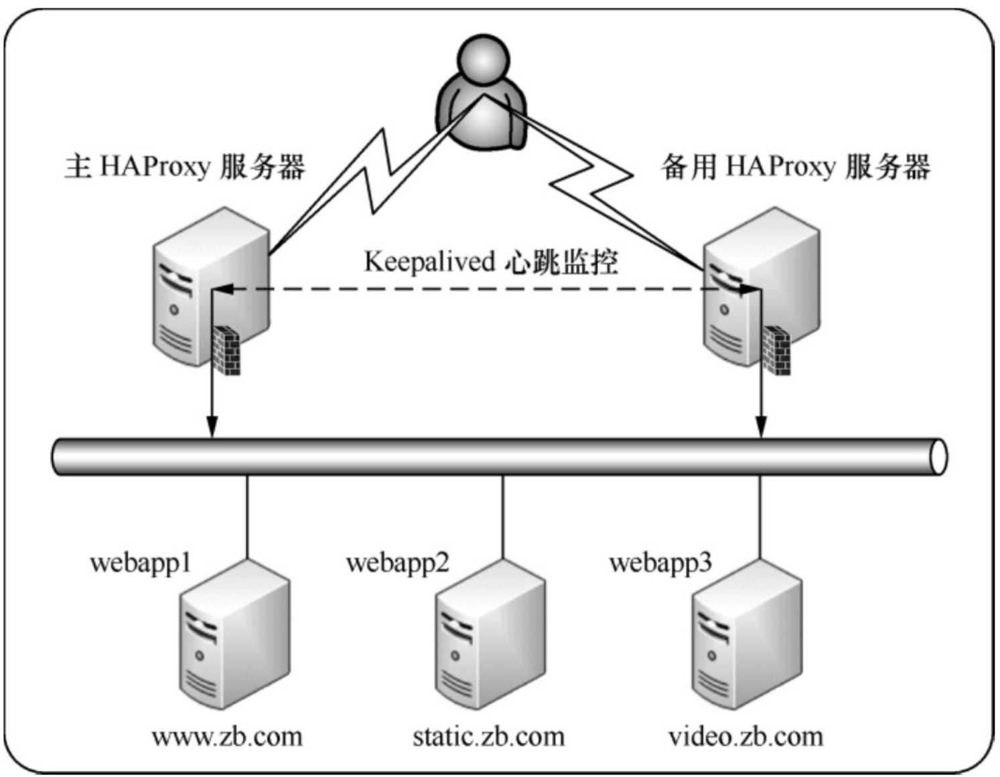

# 搭建HAProxy+Keepalived高可用负载均衡系统

Haproxy+Keepalived地址规划表

主机名 | 主机IP地址| 集群角色 |虚拟 VIP|
---|---|---|---|---
master-haproxy | 192.168.0.128| 主HAProxy服务|192.168.0.130|
backup-haproxy | 192.168.0.129| 备用HAProxy服务器|192.168.0.130|
webapp1 | 192.168.0.20| 后端服务器1|无|
webapp2 | 192.168.0.21| 后端服务器2|无|
webapp3 | 192.168.0.22| 后端服务器3|无|

此结构要实现的功能是：通过 HAproxy 实现三个站点的负载均衡，即当用户通过域名`www.zb.com`访问网站时，HAproxy要将请求发送到webapp1主机。同理，当用户通过域名static.zb.com 访问网站时，HAproxy 要将请求发送到 webapp2 主机。当用户通过域名video.zb.com访问网站时，HAproxy要将请求发送到webapp3主机。同时，当主HAProxy服务器发生故障后，能立刻将负载均衡服务切换到备用HAProxy服务器上。


为了实现HAproxy的高可用功能，这里采用Keepalived作为高可用监控软件。下面依次介绍高可用HAproxy的搭建过程。

高可用HAproxy集群系统拓扑结构



## 1.haproxy的配置
``` 
global
      log  127.0.0.1  local0  info
      maxconn  4096
      user  nobody
      group  nobody
      daemon
      nbproc  1
      pidfile /usr/local/haproxy/logs/haproxy.pid
defaults
      mode  http
      retries  3
      timeout  connect  5s
      timeout  client  30s
      timeout  server  30s
      timeout  check  2s
listen admin_stats
      bind  0.0.0.0:19088
      mode  http
      log  127.0.0.1  local0  err
      stats  refresh  30s
      stats uri /haproxy-status
      stats  realm  welcome  login\  Haproxy
      stats  auth  admin:xxxxxx
      stats  hide-version
      stats  admin  if  TRUE
frontend   www
      bind  192.168.66.10:80
      mode     http
      option   httplog
      option   forwardfor
      log       global
      acl host_www         hdr_dom(host)     -i   www.zb.com
      acl hostimg      hdr_dom(host)	 -i   static.zb.com
      acl host_video       hdr_dom(host)     -i   video.zb.com
      use_backend server_www   if   host_www
      use_backend serverimg    if   hostimg
	  use_backend server_video if   host_video
	  
    backend server_www
          mode           http
          option       redispatch
          option       abortonclose
          balance      roundrobin
          option     httpchk GET /index.jsp
          server        webapp1  192.168.0.20:80 weight 6  check  inter 2000 rise 2 fall 3
    backend serverimg
          mode           http
          option       redispatch
          option       abortonclose
          balance      roundrobin
          option     httpchk GET /index.html
          server        webapp2  192.168.0.21:80 weight 6  check  inter 2000 rise 2 fall 3
    backend server_video
          mode           http
          option       redispatch
          option       abortonclose
          balance      roundrobin
          option     httpchk GET /index.html
          server        webapp3  192.168.0.22:80  weight  6  check  inter  2000  rise  2  fall
```

在这个 HAProxy 配置中，通过 ACL 规则将三个站点分别转向 webapp1、webapp2 和webapp3 三个服务节点上，
这样变相地实现了负载均衡。
三个后端实例 server_www、serverimg和server_video虽然只有一台服务器，但是如果站点访问量增加，
可以很容易地增加后端服务器，实现真正的负载均衡。


## 2.配置主、备用Keepalived服务器

主机
`/etc/keepalived/keepalived.conf`
```
! Configuration File for keepalived

global_defs {
    notification_email {
        root@localhost     
    }
    notification_email_from keepalived@localhost
    smtp_server 127.0.0.1       
    smtp_connect_timeout 30
    script_user root
    enable_script_security
    route_id haproxy_keep
}
vrrp_script chk_haproxy {
    script  "/usr/bin/killall -0 haproxy"
    interval 5
    weight 21
}

vrrp_instance HAProxy_HA {
    state BACKUP
    interface ens32
    virtual_router_id 151
    priority 100
    nopreempt
    advert_int 2
    authentication {
        auth_type PASS
        auth_pass 1111
    }
    notify_master "/etc/keepalived/mail_notify.py master "
    notify_backup "/etc/keepalived/mail_notify.py backup"
    notify_fault "/etc/keepalived/mail_notify.py falut"
    track_script {
        chk_haproxy
    }
    virtual_ipaddress {
        192.168.0.130/24
    }

}

```

/etc/keepalived/mail_notify.py文件是一个邮件通知程序，
当KeepAlived进行master、backup、fault状态切换时，将会发送通知邮件给运维人员，
这样可以及时了解高可用集群的运行状态，以便在适当的时候人为介入故障处理。


`mail_notify.py`
``` python
#!/usr/bin/env python
# -*- coding:utf8 -*-
# auther; 18793
# Date：2020/3/28 15:22
# filename: mail_notify.py

import sys

reload(sys)

from email import encoders
from email.header import Header
from email.mime.text import MIMEText
from email.utils import parseaddr, formataddr
import smtplib

sys.setdefaultencoding('utf-8')
import socket


def _format_addr(s):
    name, addr = parseaddr(s)
    return formataddr((Header(name, 'utf-8').encode(), addr))


def send_mail(to_list, sub, content):
    mail_host = "smtp.qq.com"  # 设置验证服务器，这里以163.com为例
    mail_user = "1879324764"  # 设置验证用户名
    mail_pass = "rpesbfgwmqcycceh"  # 设置验证密码
    mail_postfix = "qq.com"  # 设置邮箱的后缀
    me = mail_user + "<" + mail_user + "@" + mail_postfix + ">"
    msg = MIMEText(content, 'plain', 'utf-8')
    msg['Subject'] = Header(sub, 'utf-8').encode()
    msg['From'] = _format_addr(me)
    msg['To'] = _format_addr(to_list)
    try:
        s = smtplib.SMTP(mail_host, 25)
        #s.set_debuglevel(1)
        s.login(mail_user, mail_pass)
        s.sendmail(me, to_list, msg.as_string())
        s.quit()
        return True
    except Exception as e:
        print(str(e))
        return False
    finally:
        s.close()


def get_local_hostname_ip():
    hostname = socket.gethostname()
    ip = socket.gethostbyname(hostname)
    return hostname, ip


if sys.argv[1] != "master" and sys.argv[1] != "backup" and sys.argv[1] != "fault":
    sys.exit()
else:
    notify_type = sys.argv[1]

if __name__ == '__main__':
    info = get_local_hostname_ip()
    strcontent = "主机名: " + str(info[0]) + "\n" + "IP地址：" + info[1] + "\n" + notify_type + "状态被激活，请确认HAProxy服务运行状态！"
    # 下面这段是设置接收报警信息的邮件地址列表，可设置多个
    #send_mail('13262662216@163.com', "HAproxy状态切换报警", strcontent.encode('utf-8'))
    mailto_list = ['13262662216@163.com', 'hujianli94@126.com']
    for mailto in mailto_list:
    	send_mail(mailto, "HAproxy状态切换报警", strcontent.encode('utf-8'))
```

最后，将keepalived.conf文件和mail_notify.py文件复制到备用HAProxy服务器上对应的位置，
并且将keepalived.conf文件中的`priority值修改为90`，由于配置的是不抢占模式，
因此，还需要在备用HAProxy服务器上去掉`nopreempt`选项。

## 3. 验证

在备机上，执行
``` 
[root@keepalived-backup keepalived]# systemctl stop haproxy
````
日志里面显示如下：
``` 
Mar 28 16:50:57 keepalived-backup Keepalived_vrrp[8266]: /usr/bin/killall -0 haproxy exited with status 1
Mar 28 16:50:57 keepalived-backup Keepalived_vrrp[8266]: VRRP_Script(chk_haproxy) failed
Mar 28 16:50:59 keepalived-backup Keepalived_vrrp[8266]: VRRP_Instance(HAProxy_HA) Entering FAULT STATE
Mar 28 16:50:59 keepalived-backup Keepalived_vrrp[8266]: VRRP_Instance(HAProxy_HA) removing protocol VIPs.
Mar 28 16:50:59 keepalived-backup Keepalived_vrrp[8266]: VRRP_Instance(HAProxy_HA) Now in FAULT state
Mar 28 16:51:02 keepalived-backup Keepalived_vrrp[8266]: /usr/bin/killall -0 haproxy exited with status 1
Mar 28 16:51:07 keepalived-backup Keepalived_vrrp[8266]: /usr/bin/killall -0 haproxy exited with status 1
Mar 28 16:51:12 keepalived-backup Keepalived_vrrp[8266]: /usr/bin/killall -0 haproxy exited with status 1
```

这段日志显示了chk_haproxy检测失败后，HAProxy服务器自动进入了BACKUP状态，同时释放了虚拟IP。由于执行了角色切换，因此mail_notify.py脚本应该会自动执行并发送状态切换邮件

此时新切换成的主机会会触发邮件脚本，如下：


备机haproxy服务恢复正常
``` 
[root@keepalived-backup keepalived]# systemctl start haproxy
```

日志显示如下：
``` 
Mar 28 16:55:57 keepalived-backup systemd: Started HAProxy Load Balancer.
Mar 28 16:56:02 keepalived-backup Keepalived_vrrp[8266]: VRRP_Script(chk_haproxy) succeeded
Mar 28 16:56:04 keepalived-backup Keepalived_vrrp[8266]: VRRP_Instance(HAProxy_HA) Entering BACKUP STATE
```


