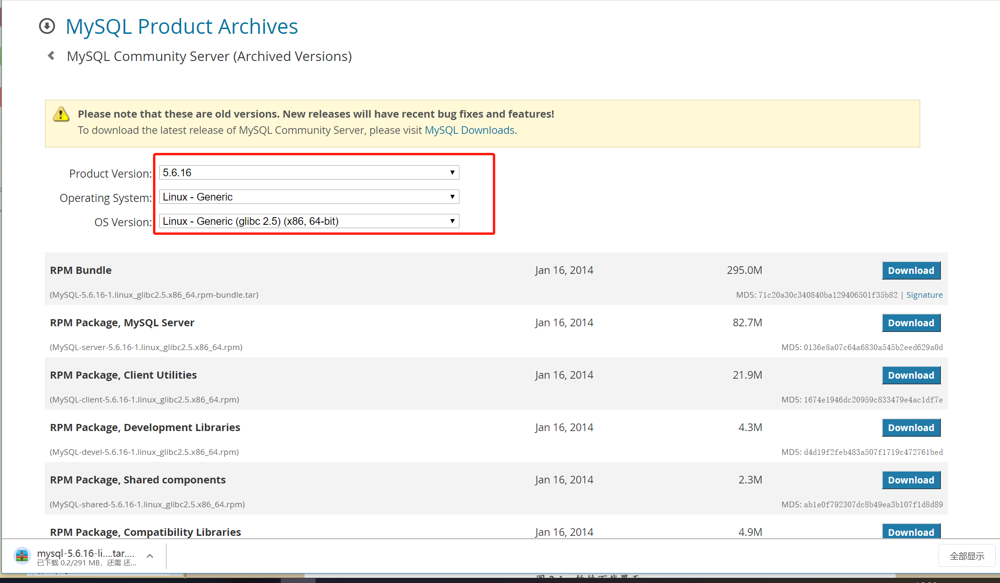
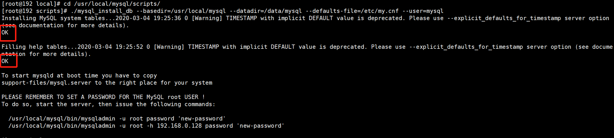
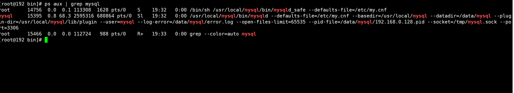

# 02.Mysql数据库的安装启动和关闭

## 下载MySQL二进制软件包
官网MySQL 有四个版本，分别为GA 版、DMR 版、RC 版和Beta版。
一般情况下,生产环境或者测试环境要选择GA版(常规可用的版本,经过bug 修复测试过)。

大家可以去MySQL官网下载软件包,官网链接地址为www.mysql.com。
``` 
wget https://cdn.mysql.com//Downloads/MySQL-5.7/mysql-5.7.22-linux-glibc2.12-x86_64.tar.gz
wget https://cdn.mysql.com//Downloads/MySQL-5.6/mysql-5.6.40-linux-glibc2.12-x86_64.tar.gz
```

``` 
https://dev.mysql.com/downloads/mysql/
```


校验MD5如下：
``` 
[root@192 ~]# md5sum mysql-5.6.16-linux-glibc2.5-x86_64.tar.gz 
41b4533f4fcec2d0132794f26f378f2a  mysql-5.6.16-linux-glibc2.5-x86_64.tar.gz
```


这里学习MySQL5.6和MySQL5.7版本的安装过程，是因为MySQL5.7之前版本
在数据库初始化过程中需要借助于/usr/local/mysql/scripts/mysql_install_db命令,
但在MySQL 5.7 之后版本mysql_install_db被废弃了。

## 安装前系统环境检测
``` 
1、SELinux和系统防火墙iptables需要关闭
2、I/O调度系统默认是cfq模式，强烈建议使用deadline模式
cat /sys/block/sda/queue/scheduler
#cfq完全公平队列；noop电梯式调度；deadline截止时间调度
3、swap分区的设置
不分配swap或分配4GB的swap
swappiness控制如何使用swap分区，0表示最大限度使用物理内存，然后才使用swap，可能导致内存溢出，导致MySQL被意外kill掉；100，积极使用swap，把内存数据及时搬到swap，不建议
cat /proc/sys/vm/swappiness
编辑 /etc/sysctl.conf 加入vm.swappiess的值
4、文件系统的选择 [xfs]
5、操作系统限制
ulinit -a
open files和max user processes，建议均设置为65535
vim /etc/security/limits.conf
* soft nproc 65535
* hard nproc 65535
* soft nofile 65535
* hard nofile 65535
6、numa需要关闭
numa --interleave=all /usr/local/mysql/bin/mysqld_safe -defaults-file=/etc/my.cnf &
关闭numa，可以更好地分配内存，不需要采用swap的方式来获取内存
可以在BIOS、操作系统或者在数据库启动过程中关闭
yum install numactl
numastat -H 、lscpu
```


## MySQL5.6版本的安装过程

1.第一步：创建MySQL用户，指定MySQL所在的用户组，如下：
``` 
[root@192 ~]# groupadd mysql
[root@192 ~]# useradd -g mysql mysql -s /sbin/nologin
[root@192 ~]# mv mysql-5.6.16-linux-glibc2.5-x86_64.tar.gz /usr/local/

[root@192 local]# tar -zxvf mysql-5.6.16-linux-glibc2.5-x86_64.tar.gz 
[root@192 local]# ln -s mysql-5.6.16-linux-glibc2.5-x86_64 mysql
[root@192 local]# chown mysql:mysql -R mysql

```


2.第二步，粗昂见mysql的虎数据库的数据目录（datadir），这里可以选择创建在/data/mysql下面。命令如下：
``` 
[root@192 local]# mkdir -p /data/mysql
[root@192 local]# chown mysql:mysql -R /data/mysql/
```

3.第三步，配置my.cnf配置文件
```
cat > /etc/my.cnf <<-EOF 
[client]
port = 3306
socket = /tmp/mysql.sock
default-character-set = utf8
[mysql]
default-character-set = utf8
[mysqld]
port = 3306
socket = /tmp/mysql.sock
basedir = /usr/local/mysql
datadir = /data/mysql
open_files_limit = 65535
back_log = 103
max_connections = 512
max_connect_errors = 100000
table_open_cache = 512
external-locking = FALSE
max_allowed_packet = 128M
sort_buffer_size = 2M
join_buffer_size = 2M
thread_cache_size = 51
query_cache_size = 32M
tmp_table_size = 96M
max_heap_table_size = 96M
slow_query_log = 1
slow_query_log_file = /data/mysql/slow.log
log-error = /data/mysql/error.log
long_query_time = 0.5
server-id = 1323306
log-bin = /data/mysql/mysql-bin
sync_binlog = 1
binlog_cache_size = 4M
max_binlog_cache_size = 128M
max_binlog_size = 1024M
expire_logs_days = 7
key_buffer_size = 32M
read_buffer_size = 1M
read_rnd_buffer_size = 16M
bulk_insert_buffer_size = 64M
character-set-server = utf8
default-storage-engine = InnoDB
binlog_format = row
#gtid_mode = on
#log_slave_updates = 1
#enforce_gtid_consistency = 1
interactive_timeout = 300
wait_timeout = 300
transaction_isolation = REPEATABLE-READ
innodb_buffer_pool_size = 1434M
innodb_data_file_path = ibdata1:1024M:autoextend
innodb_flush_log_at_trx_commit = 1
innodb_log_buffer_size = 16M
innodb_log_file_size = 256M
innodb_log_files_in_group = 2
innodb_max_dirty_pages_pct = 50
innodb_file_per_table = 1
innodb_locks_unsafe_for_binlog = 0
[mysqldump]
quick
max_allowed_packet = 32M
EOF
```


4.一步走
``` 
#初始化数据库
cd /usr/local/mysql/scripts/
#依赖 yum install perl-Data-Dumper
./mysql_install_db --basedir=/usr/local/mysql --datadir=/data/mysql --defaults-file=/etc/my.cnf --user=mysql
```
当出现两个“ok”的时候，证明初始化数据库成功了。



```
#启动MySQL
[root@192 bin]# /usr/local/mysql/bin/mysqld_safe --defaults-file=/etc/my.cnf &
[1] 14756


# 设置环境变量
echo 'PATH=$PATH':/usr/local/mysql/bin >> /etc/profile
source /etc/profile
```
查看MySQL进程验证是否启动成功



MySQL读取配置文件顺序
```
/etc/my.cnf -> /etc/mysql/my.cnf -> /usr/local/mysql/etc/my.cnf -> ~/.my.cnf


手动指定配置文件 --defaults-file
--defaults-extra-file，除读取默认配置文件，还读取额外的配置文件
--no-defaults，忽略所有配置文件
如果指定多个配置文件，以最后一次读取为准
```

### 创建密码
```
# 进入数据库 
./mysql

use mysql;
update user set password=password('root123') where user='root';
flush privileges;
```
正常管理Mysql
``` 
关闭MySQL数据库
正常关闭
cd /usr/local/mysql/bin
./mysqladmin -uroot -proot123 shutdown
非正常关闭
kill掉MySQL进程
```

基础数据库
```
information_schema是在安装MySQL过程中的初始化阶段自动生成的，提供访问数据库元数据的所有信息，只读。常用的表有
TABLES，记录所有表基本信息，访问该表可以收集表的统计信息
PROCESSLIST，查看当前数据库连接
GLOBAL_STATUS，查看数据库运行的各种状态值
GLOBAL_VARIABLES，查看数据库中的参数
PARTITIONS，数据库中表分分区情况
INNODB_LOCKS,INNODB_TRX,INNODB_LOCK_WAITS，监控数据库中锁情况
```

## MySQL 5.7版本的安装
唯一区别在初始化数据库那一步，因为5.7废弃了mysql_install_db这个初始化命令
``` 

cat /etc/my.cnf
[client]
port = 3306
socket = /tmp/mysql.sock
[mysql]
prompt = "\u@db \R:\m:\s [\d]> "
no-auto-rehash
[mysqld]
user = mysql
port = 3306
basedir = /usr/local/mysql
datadir = /data/mysql
socket = /tmp/mysql.sock
character-set-server = utf8mb4
skip_name_resolve = 1
open_files_limit = 65535
back_log = 1024
max_connections = 512
max_connect_errors = 1000000
table_open_cache = 1024
table_definition_cache = 1024
table_open_cache_instances = 64
thread_stack = 512K
external-locking = FALSE
max_allowed_packet = 32M
sort_buffer_size = 4M
join_buffer_size = 4M
thread_cache_size = 768
query_cache_size = 0
query_cache_type = 0
interactive_timeout = 600
wait_timeout = 600
tmp_table_size = 32M
max_heap_table_size = 32M
slow_query_log = 1
slow_query_log_file = /data/mysql/slow.log
log-error = /data/mysql/error.log
long_query_time = 0.5
server-id = 3306100
log-bin = /data/mysql/mysql-binlog
sync_binlog = 1
binlog_cache_size = 4M
max_binlog_cache_size = 1G
max_binlog_size = 1G
expire_logs_days = 7
master_info_repository = TABLE
relay_log_info_repository = TABLE
gtid_mode = on
enforce_gtid_consistency = 1
log_slave_updates
binlog_format = row
relay_log_recovery = 1
relay-log-purge = 1
key_buffer_size = 32M
read_buffer_size = 8M
read_rnd_buffer_size = 4M
bulk_insert_buffer_size = 64M
 
lock_wait_timeout = 3600
explicit_defaults_for_timestamp = 1
innodb_thread_concurrency = 0
innodb_sync_spin_loops = 100
innodb_spin_wait_delay = 30
transaction_isolation = REPEATABLE-READ
innodb_buffer_pool_size = 1024M
innodb_buffer_pool_instances = 8
innodb_buffer_pool_load_at_startup = 1
innodb_buffer_pool_dump_at_shutdown = 1
innodb_data_file_path = ibdata1:1G:autoextend
innodb_flush_log_at_trx_commit = 1
innodb_log_buffer_size = 32M
innodb_log_file_size = 2G
innodb_log_files_in_group =2
innodb_io_capacity = 2000
innodb_io_capacity_max = 4000
innodb_flush_neighbors = 0
innodb_write_io_threads = 8
innodb_read_io_threads = 8
innodb_purge_threads = 4
innodb_page_cleaners = 4
innodb_open_files = 65535
innodb_max_dirty_pages_pct = 50
innodb_flush_method = O_DIRECT
innodb_lru_scan_depth = 4000
innodb_checksum_algorithm = crc32
innodb_lock_wait_timeout = 10
innodb_rollback_on_timeout = 1
innodb_print_all_deadlocks = 1
innodb_file_per_table = 1
innodb_online_alter_log_max_size = 4G
internal_tmp_disk_storage_engine = InnoDB
innodb_stats_on_metadata = 0
innodb_status_file = 1
innodb_status_output = 0
innodb_status_output_locks = 0
#performance_schema
performance_schema = 1
performance_schema_instrument = '%=on'
#innodb monitor
innodb_monitor_enable="module_innodb"
innodb_monitor_enable="module_server"
innodb_monitor_enable="module_dml"
innodb_monitor_enable="module_ddl"
innodb_monitor_enable="module_trx"
innodb_monitor_enable="module_os"
innodb_monitor_enable="module_purge"
innodb_monitor_enable="module_log"
innodb_monitor_enable="module_lock"
innodb_monitor_enable="module_buffer"
innodb_monitor_enable="module_index"
innodb_monitor_enable="module_ibuf_system"
innodb_monitor_enable="module_buffer_page"
innodb_monitor_enable="module_adaptive_hash"
[mysqldump]
quick
max_allowed_packet = 32M
```

``` 
#初始化
cd /usr/local/mysql/bin
./mysqld --defaults-file=/etc/my.cnf --basedir=/usr/local/mysql --datadir=/data/mysql --user=mysql --initialize
#--initialize参数，生成一个临时数据库初始密码，记录在log-error里面
#--initialize-insecure参数，无密码进入#启动数据库
./mysqld_safe --defaults-file=/etc/my.cnf &

# 设置环境变量
echo 'PATH=$PATH':/usr/local/mysql/bin >> /etc/profile
source /etc/profile

#修改密码
cat /data/mysql/error.log |grep password
set password = 'root123';
alter user 'root'@'localhost' password expire never;
use mysql;
update user set host='%' where user='root';  #允许远程访问
flush privileges;#关闭数据库
./mysqladmin -uroot -proot123 shutdown
```
## MySQL数据库root密码丢失的问题

通过添加--skip-grant-tables跳过权限表
```
kill掉mysql进程(共两个进程)
./mysqld_safe --defaults-file=/etc/my.cnf --skip-grant-tables &
./mysql
设置新的密码并刷新权限
use mysql
update user set authentication_string=password('root123') where user='root';
flush privileges;
重启数据库
```

## MySQL数据库的连接方式
TCP/IP连接，socket连接，name pipe连接(windows)
``` 
mysql -u username -p password -P port -h IP
mysql -u username -p password -S /tmp/mysql.sock
```


## 经常还是要连接MySQL的客户端工具
· sqlyog

· navicat

## 用户权限管理
root用户避免作为web连接用，超管权限的用户(root和all privileges权限用户)只能归DBA管理

创建用户时，最好保证专库专帐号

主机IP避免使用%，可以分配一个IP地址段

只读权限只能查询，不能进行DML操作

读写权限包含insert/update/delete/select，没有create/alter等建表改表权限
``` 
select user,host,authentication_string from user;
create user 用户名@主机IP identified by '密码';
#只读用户
create user 'erp_read'@'192.168.56.%' identified by 'erp123';
grant select on erp.* to 'erp_read'@'192.168.56.%' identified by 'erp123';
flush privileges;
#读写用户
create user 'erp_user'@'192.168.56.*' identified by 'erp456';
grant select,insert,update,delete on erp.* to 'erp_user'@'192.168.56.%' identified by 'erp456';
flush privileges;
```


