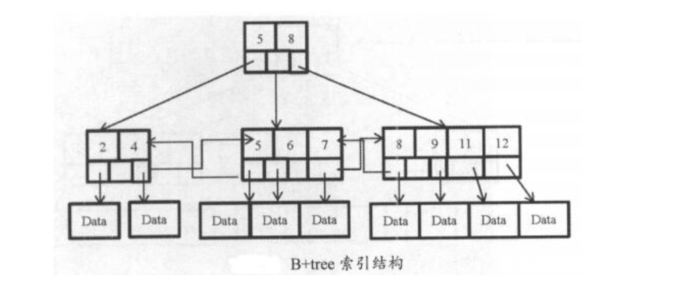
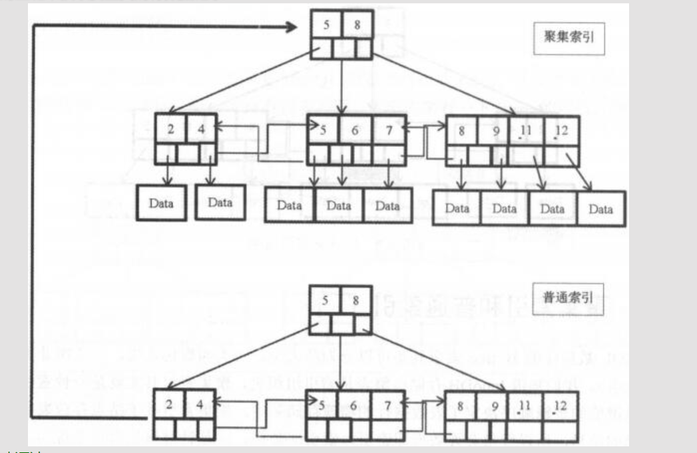
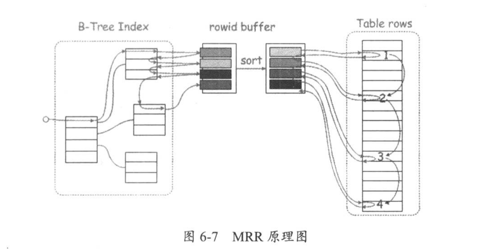
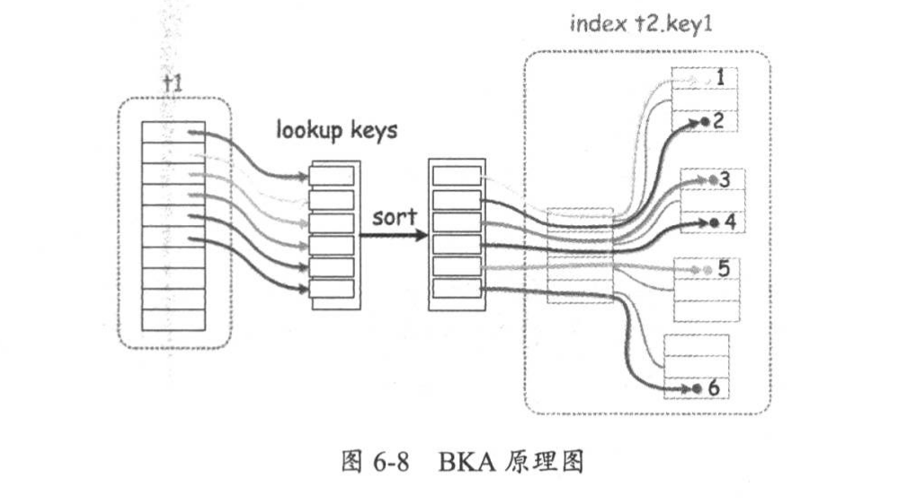
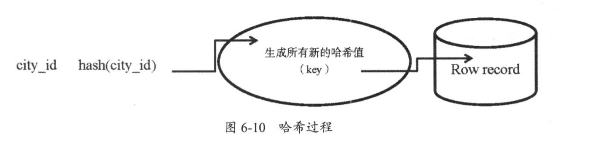

# 06.索引
索引是对数据库表中一列或多值值进行排序的一种结构。

MySQL数据库两个主要的索引是：B+tree索引和哈希索引

演化

二叉树 -> 平衡二叉树 -> B-tree ->B+tree

## B-tree结构
```
二叉树：左子树<根<右子树
平衡二叉树：左右两子树高度差绝对值不超过1
B-tree：又称Btree,一个结点可以拥有多个子结点，所有叶子结点位于同一层，叶子结点不包含任何关键字信息
B+tree：所有关键字信息都出现在叶子结点，并含有关键字记录的指针，所有数据都保存在叶子结点中
B+tree索引是双向链表结构
```



### 聚集索引和普通索引
``` 
对聚集索引，索引键值的逻辑决定了表数据行的物理存储顺序，叶子结点存放表中行数据，数据即索引、索引即数据
创建表时，要显式为表创建一个主键(聚集索引)，若不主动创建主键，InnoDB会选择第一个不包含null值的唯一索引作为主键索引，若没有唯一索引，则使用rowid作为主键对普通索引，叶子结点仅有自己本身的键值和主键的值，通过普通索引叶子结点上的主键来获取要查找的行数据记录
```

``` 
普通索引创建语法
alter table table_name add index index_name (索引字段);
create index index_name on table_name (索引字段);
查看表中的索引
show index from table_name
```

``` 
CREATE TABLE t (id int(11) NOT NULL AUTO_INCREMENT ,
name varchar(20) NOT NULL ,
address varchar(20) NOT NULL ,
PRIMARY KEY (id));

desc t;

select count(*) from t;

explain select * from t where name='cc';

#查看执行计划
type列出现ALL，代表全表扫描
key列，看是否使用了索引，null代表没有使用索引
row列，扫描的行数
extra列，若出现using filesort或者using temporary关键字，说明很影响性能
filtered列，返回结果行占需要读到行的百分比，估算值
```

* 优化思路
```
1）表的数据类型是否合理，要遵守选取数据类型越简单越小的原则

2）表中碎片是否整理

3）表的统计信息是否收集，只有统计信息准确，执行计划才能帮助优化SQL


4）查看执行计划，检查索引使用情况，没有用到索引，考虑创建

5）创建索引前，查看索引的选择性distinct，判断该字段是否适创建索引
索引选择性指不重复的索引值和数据记录总数的比值，越接近1越好；主键索引和唯一索引选择性是1

6）创建索引后，再查看执行计划，对比两次结果，查看效率是否提高
```

* 合理创建索引的三个经常
```
1）经常被查询的列(一般放在where条件后面)
2）经常用于表连接的列
3）经常排序分组的列(order by/group by后面的字段)
```

* 为name字段创建索引
```
查看name字段的索引选择性
select count(distinct name)/count(*) from t;
创建索引
create index idx_name on t(name);
show index from t\G
explain select * from t where name='cc'\G
```

### ICP、MRR和BKA

ICP，index condition pushdown是使用索引从表中检索行数据的一种优化方式，5.6开始支持，
如果where后的条件可以使用索引，则将过滤放到存储层执行，而不是原来的由server层处理，
可以减少基表访问次数和server层访问存储引擎次数，默认开启

```
show variables like "%optimizer_switch%"\G
index_merge=on,
index_merge_union=on,
index_merge_sort_union=on,
index_merge_intersection=on,
engine_condition_pushdown=on,
index_condition_pushdown=on,
mrr=on,
mrr_cost_based=on,
block_nested_loop=on,
batched_key_access=off,
materialization=on,
semijoin=on,
loosescan=on,
firstmatch=on,
duplicateweedout=on,
subquery_materialization_cost_based=on,
use_index_extensions=on,
condition_fanout_filter=on,
derived_merge=on
开关命令
set optimizer_switch="index_condition_pushdown=on|off";
当使用ICP优化时，执行计划extra列会显示Using index condition关键字
```

MRR，multi-range read optimization，5.6之后新增，通过optimizer_switch中的mrr和mrr_cost_based控制，默认均为开启状态
mrr_cost_based选项表示是否通过基于成本的算法来确定开启mrr特性，on为自动判断，off为强制开启mrr

``` 
#set global optimizer_switch="mrr=on|off,mrr_cost_based=on|off";
set optimizer_switch="mrr=on|off,mrr_cost_based=on|off";
当mrr=on，mrr_cost_based=off时，表示总是开启MRR优化
当使用MRR优化时，执行计划的extra列会显示Using MRR关键字

普通情况下，普通索引获取数据方式为，通过索引叶子结点找到对应的主键，再通过主键找到相对应的行数据记录。若普通索引有重复值，那么该字段做where条件时，每次取到的主键不是顺序的，会发生随机IO
MRR原理：将找到的主键值存储到read_rnd_buffer中，并对buffer进行排序，最后利用排序过的主键值，访问表中的数据，将原来的随机IO变成顺序IO，降低IO开销
生产环境中，read_rnd_buffer_size 可设置4~8MB之间
```



BKA，batched key access，提高表join性能的算法，作用是在读取join表的记录时使用顺序IO
原理：对于多表join语句，当使用索引访问第二个join表时，使用一个join buffer收集第一个操作对象生成的相关列值。BKA构建好key后，批量传给引擎层做索引查找，key是通过MRR接口提交给引擎的，这样使得查询更加高效

``` 
BKA默认是关闭的
要想开启该功能，要保证是在强制使用MRR的基础上才可以
set global optimizer_switch="mrr=on,mrr_cost_based=off";
set global optimizer_switch="batched_key_access=on";
当BKA被使用时，执行计划的extra列会显示Using join buffer(Batched Key Access)关键字
```



__MRR与BKA之间的关系__

`https://mariadb.com/kb/en/library/multi-range-read-optimization/`

存储引擎上端是MRR，范围扫描range access中将扫描到的数据存入read_rnd_buffer_size，对其按照主键rowid进行排序，然后使用排序后的数据顺序回表，转换随机读取为顺序读取
BKA中，被连接表使用ref、eq_ref索引方式扫描时，
第一个表中扫描的键值放到join_buffer_size中，
然后调用MRR接口进行排序并顺序访问且通过join条件得到数据，
这样连接条件成为顺序比对。

### 主键索引和唯一索引
**主键索引** 就是聚集索引，每张表有且仅有一个主键，可以由表中一个或多个字段组成
主键的条件：值唯一、没有null值、保证该值自增
使用自增列做主键，可以保证写入数据的顺序也是自增的，增高存取效率

``` 
创建主键
alter table table_name add primary key(colunm_name);
```

**唯一索引** 是约束条件的一种，不允许有重复的值，但可以有null值。
一个表可以有多个唯一索引
``` 
创建唯一索引
alter table table_name add unique(colunm_name);
```

### 覆盖索引
``` 
MySQL只需要通过索引就可以返回查询数据，而不必在查到索引后再回表查询数据，这样减少大量IO。在执行计划extra列中会出现Using index关键字
explain select id from t where name="cc"\G
普通索引相尖于（name,id)索引
#如果查询的是address字段，那么就不是覆盖索引了，因为拿到主键后，还需要回表
```
### 前缀索引
``` 
对blob、text或长的varchar类型的列，将其前几个字符(具体长度在建立索引时指定)建立索引，这样的索引叫做前缀索引
前缀索引较小，查询更快
前缀索引不能在order by 或 group by中使用，也不能用作覆盖索引创建前缀索引
alter table table_name add key(column_name(prefix_length));
#prefix_length是长度，根据实际需要设置
```

### 联合索引
``` 
联合索引，复合索引，对两个或以上的列创建索引，利用索引中的附加列，缩小检索的段池范围，更快地搜索到数据
创建语法和普通索引一样
create index idx_c1_c2 on table_name(c1,c2);
联合索引必须满足最左前缀原则，一般把选择性高的列放前面
一条查询语句可以只使用索引中的一部分，但必须从最左侧开始#可以使用到索引
select * from t where c1=某值;
select * from t where c2=某值 and c1=某值;
select * from t where c1=某值 and c2 in (某值,某值);
select * from t order by c1,c2;
select * from t where c1=某值 order by c2;#不能使用索引
select * from t where c2=某值;
select * from t where c2=某值 order by c1;
select * from t where c1=某值 or c2=某值;尽量在生产环境中，让程序多做一些判断，不要让数据库做各种运算
尽量避免在SQL语句中出现or，多列可以考虑使用union
```

## 哈希索引
哈希索引使用哈希算法，把键值换算成新的哈希值，只能进行等值查询，不能进行排序、模糊查找、范围查询等
检索时一次哈希算法立刻定位，速度非常快



## 索引的总结

索引优点
```
1）提高数据检索效率
2）提高聚合函数效率
3）提高排序效率
4）使用覆盖索引可以避免回表
```

索引创建四不要
```
1）选择性低的字段不要创建索引，如性别、状态字段
2）很少查询的列不要创建索引
3）大数据类型字段不要创建索引
4）尽量避免使用NULL，应指定列为NOT NULL
#含有空值的值很难进行查询优化，会使得索引、索引的统计及比较运算更加复杂。可以使用空字符串代替空值
```

使用不到索引的情况
```
1）通过索引扫描的行记录数超过全表30%，优化器不会走索引，变成全表扫描
2）联合索引中，第一个查询条件不是最左索引列
3）联合索引中，第一个索引列使用范围查询，只能使用到部分索引，有ICP出现
#范围指：< ,= ,<=, between and等
4）联合索引中，第一个查询条件不是最左前缀列
5）模糊查询中，最左以通配符%开始
6）两个单列索引，一个用于检索，一个用于排序，这种情况下只能使用一个索引
#查询语句中最多只能使用一个索引，考虑建立联合索引
7）查询字段上有索引，但使用了函数运算
```


