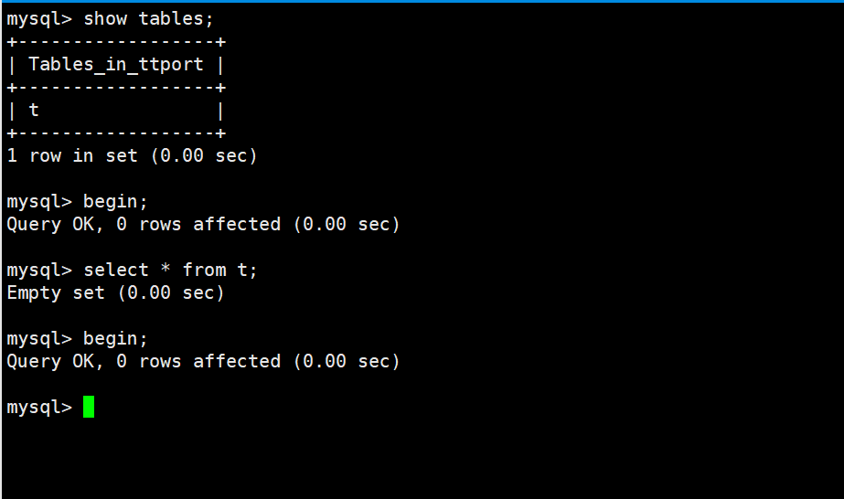
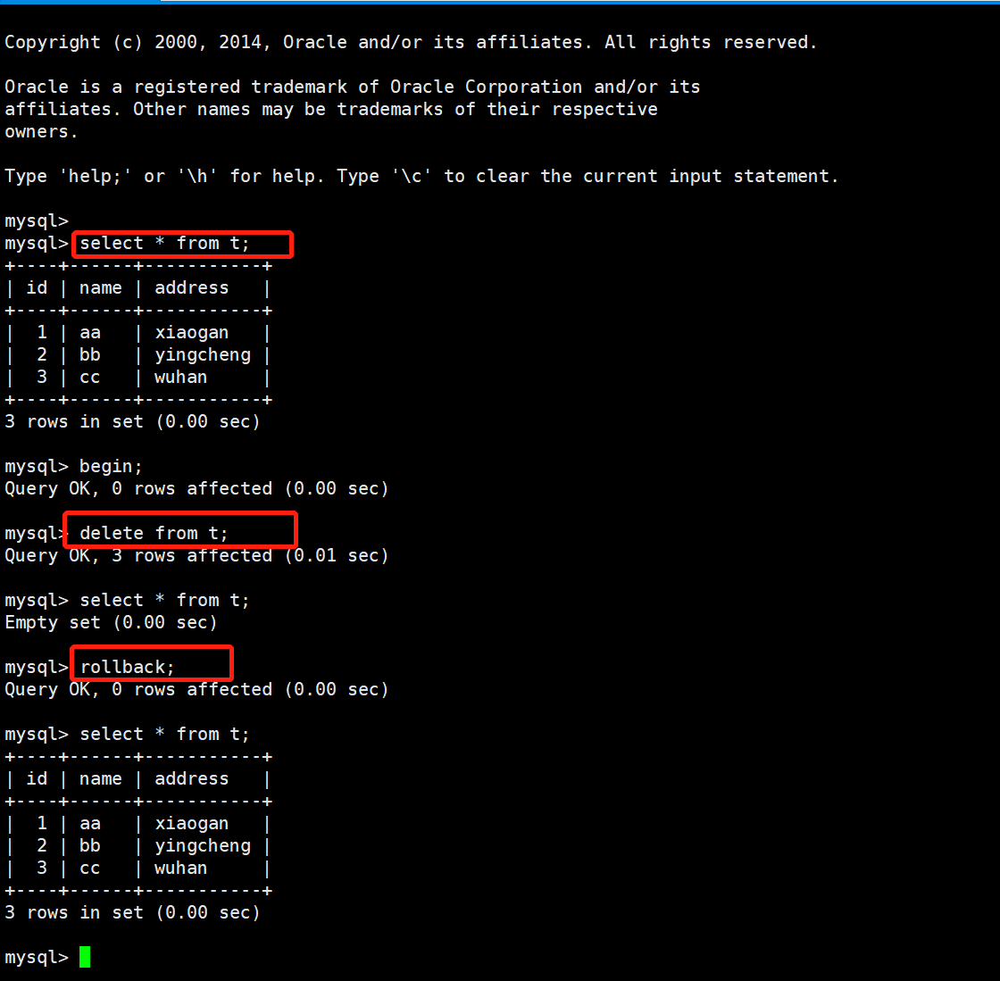
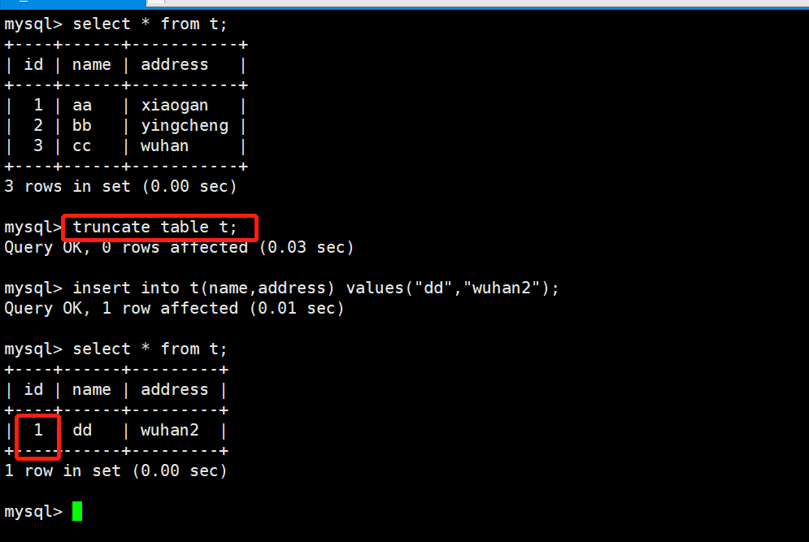

# 07.事务

事务是一组DML(insert、delete、update)语句的集合
InnoDB存储引擎支持事务；MyISAM不支持
MySQL事务默认是自提交模式，要开启事务，必须以begin命令开始，以commit/rollback结束

## 事务的特性

### 1.原子性atomicity
```
所有操作要么做，要么都不做,保证数据库是一致的
```

### 2.一致性(consistency)
一致性是指数据库中的数据在事务操作前和事务处理后必须满足业务规则约束。
甲乙账户的总金额在转账前和转账后必须一致，如有不一致，则必须是短暂的，且只有在事务提交前才会出现的。


### 3.隔离性(lsolation)
隔离性是数据库允许多个并发事务同时对数据进行读写和修改的能力，隔离性可以防止多个事务并发执行时由于交叉执行而导致数据的不一致。

在甲、乙之间转账时，丙同时向甲转账，若同时进行，则甲、乙之间的一致性不能得到满足。所以在甲、乙事务执行过程中，其他事务不能访问（修改）当前相关的数值。

### 4.持久性(Durability)
事务处理结束后，对数据的修改是永久的，即使系统发生故障也不丢失


## 事务语句

事务开启由begin或者start transaction (read write|read only)开始，或者把自提交特性关掉set autocommit=0
事务结束以commit或者rollback结束

隐式提交：DDL语句的操作(DDL语句，如建表命令，默认知带一个commit)；再次输入begin或start transaction命令
隐式回滚：退出会话；连接超时；关机



oracle中，事务不是自动提交的，而mysql中默认是自动提交的。
不建议关闭自提交模式，关闭后，不用一个事务一次提交，可以多个事务一起提交，可以提高每秒处理事务的能力，但是若这个过程中有一个事务一直没有提交，那么会导致行锁等待的现象，其他事务必须等这个事务提交后才能继续提交


## truncate和delete的区别
truncate是DDL语句操作，deltet是DML语句操作，它们的共同点都是清空表内的数据，但truncate在事务中不能被回滚，
而且truncate会清空表的自增属性。

(1)truncate在事务中不能被回滚,delete可以回滚




(2)truncate清空表的自增id属性，从1重新开始记录，而delete则不会





## 事务的隔离级别
InnoDB存储引擎实现SQL标准的4种隔离级别，用来限定事务内外的哪些改变是可见的，哪些是不可见的
低级别的隔离一般支持更高的并发并拥有更低的系统开销

```
查看当前隔离级别
show variables like "%tx_isolation%";
#REPEATABLE-READ
修改全局/会话事务隔离级别
SET [SESSION|GLOBAL] TRANSACTION ISOLATION LEVEL [READ UNCOMMITTED|READ COMMITTED|REPEATABLE READ|SERIALIZABLE]
set session|global transaction isolation level read uncommitted;
#四个级别：read uncommitted、read committed、repeatable read(默认)、serializable读未提交read uncommitted，简称RU
在其中一个事务中，可以读取其他事务未提交的数据变化，脏读。生产环境中不建议使用读已提交read committed，简称RC
在其中一个事务中，可以读取其他事务已提交的数据变化，不可重复读，允许幻读现象的发生，Oracle数据库默认事务隔离级别可重复读repetable read，简称RR
在其中一个事务中，直到事务结束前，都可以反复读取到事务刚开始看到的数据，并一直不会发生变化，避免了脏读、不可重复读和幻读的发生。默认串行serializable
在每个读的数据行上都需要加表级共享锁，在每次写数据时都要加表级排他锁
会造成并发能力下降，大量的超时和锁竞争，不建议使用到生产环境
```

## 脏读、不可重复读、幻读、可重复读

### 脏读
```
一个事务读取了其他事务还没有提交的数据

set global transaction isolation level read uncommitted;
show variables like "%tx_isolation%";
```

### 不可重复读与幻读
```
读已提交的数据
set global transaction isolation level read read committed;
show variables like "%tx_isolation%";

不可重复读是读取到了其他事务针对旧数据的修改记录(update/delete)

幻读读取到了其他事务新增的数据，仿佛出现了幻影(insert)
```

### 可重复读
````
MySQL默认级别
set global transaction isolation level repeatable read;
show variables like "%tx_isolation%";

读取到的还是事务一开始的数据，并不会读到新增的内容，要读取到新增的数据，可以在查询语句后添加for update
select * from t for update;
```


