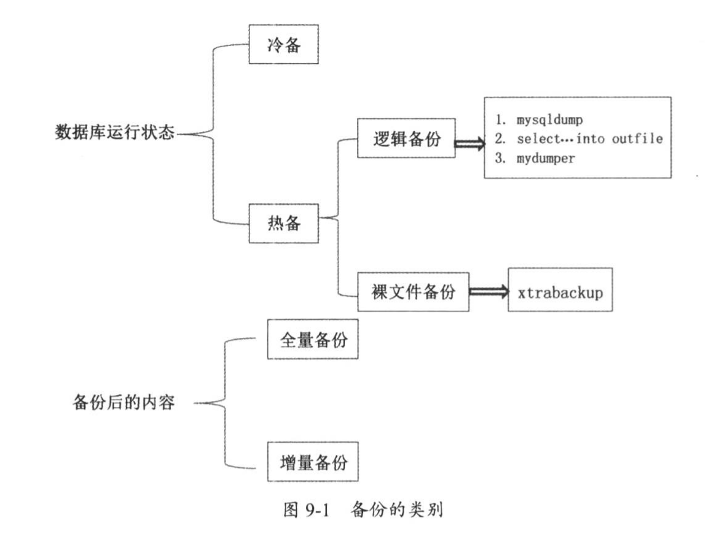

# 01.备份恢复

## 1.1 MySQL的备份方式
MySQL数据库按照其服务的运行状态（即停库和非停库）分为冷备和热备。
热备份又可以分为逻辑备份和裸文件备份。
按照备份后的内容量又可以分为全量备份和增量备份。

如下图所示：



## 1.2冷备及恢复

MySQL备份的方式方法有两种，一种叫冷备，另一种叫热备。

冷备：数据库处于关闭状态下的备份，好处是可以保证数据库的完整性，
备份过程简单并且恢复速度相对快一些。但是数据的关闭也就意味着会影响现有业务的进行。
用户不能再访问你的网站。

``` 
#先停掉MySQL服务
./mysqladmin -uroot -proot123 shutdown
#备份整个数据目录到远端或本地磁盘
scp -r /data/mysql/ root@192.168.1.100:/backup
copy -r /data/mysql /backup
#恢复
把备份的文件替换原目录，然后重启服务
```


## 1.3热备及恢复
热备细分为逻辑备份和裸文件备份。逻辑备份就是备份SQL语句


### mysqldump备份与恢复
先从buffer中找到需要备份的数据进行备份，若buffer中没有，则去磁盘中数据文件中查找并调回到buffer里面再备份，最后形成一个可编辑的备份文件
``` 
./mysqldump --help 获取帮助
重要参数：
--single-transaction
用于保证InnoDB备份数据时的一致性，配合RR隔离级别一起使用
当发起事务时，读取一个数据快照，直到备份结束时，都不会读取到本事务开始之后提交的任何数据

--all-databases -A
备份所有数据库

--master-data
值有1和2，为1时，备份出来的文件中会添加change master语句；为2时，change master语句添加注释符号

--dump-slave
用于在从库端备份数据，在搭建新的从库时使用。值有1和2，为1时，备份出来的文件中会添加change master语句；为2时，change master语句添加注释符号

--no-create-info -t
只备份数据，不备份表结构

--no-data -d
只备份表结构，不备份表数据

--complete-insert -c
使用完整的insert语句，会包含表中的列信息，可以提高插入效率

--databases -B
备份多个数据库，如--database db1 db2

--default-character-set
字符集，默认为utf8，需要与备份出的表的字符集保持一致

--quick -q
相当于加sql_no_query，并不会读取缓存中的数据

--where=name -w
按条件备份出想要的数据

示例
#备份全库
./mysqldump --single-transaction -uroot -proot123 -A > all_20180702.sql

#若数据库中已开启gtid选项，但备份过程中不想带gtid信息，可以这样
./mysqldump --single-transaction -uroot -proot123 -A --set-gtid-purged=OFF > all_20180702.sql

#恢复全库
./mysql -uroot -proot123 < all_20180702.sql

#备份单个库
./mysqldump --single-transaction --set-gtid-purged=OFF -uroot -proot123 test >test_2018_07_02.sql

#恢复单个库(若test库存在，可直接恢复，若不存在，需创建test)
#create database test;
./mysql -uroot -proot123 test < test_2018_07_02.sql

#备份单表，test库下aa表
./mysqldump --single-transaction --set-gtid-purged=OFF -uroot -proot123 test aa > aa_2018_07_02.sql

#恢复单表(恢复单表时，只需写库的名字，不用写表的名字)
./mysql -uroot -proot123 test<aa_2018_07_02.sql

#备份test库aa表结构信息
./mysqldump --single-transaction --set-gtid-purged=OFF -uroot -proot123 test aa -d>aa.sql

#备份test库aa表数据信息
./mysqldump --single-transaction --set-gtid-purged=OFF -uroot -proot123 test aa -t>aa.sql

#备份test库tt表中id>3的记录(条件中必须使用双引号)
./mysqldump --single-transaction --set-gtid-purged=OFF -uroot -proot123 test tt --where="id>3" > tt.sql
```
mysqldump备份时，可能会出现数据库性能抖动的问题，性能急剧下降。
原因是buffer中无需备份数据时，要读盘到buffer，可能会冲掉内存中的热数据，从而影响业务访问。
innodb_buffer_pool_dump_pct = 25，innodb buffer pages的比例，默认25%


## select ... into outfile
恢复速度非常快，比insert的插入速度要快很多。只能备份表中的数据，并不能包含表的结构。
备份出的数据可以通过load data的方式实现还原操作
```
语法：
select col1,col2... from table_name into outfile '/path/to/filename';
load data infile '/path/to/filename' into table db.table_name;

ERROR 1290 (HY000): The MySQL server is running with the --secure-file-priv option so it cannot execute this statement
解决：
secure_file_priv = NULL  #需要在配置文件中设置，并重启服务
#mysqld段中添加secure_file_priv = /data/mysql
./mysqladmin -uroot -proot123 shutdown
./mysqld_safe &
show variables like '%secure%';
#导出数据
select * from tt into outfile '/data/mysql/aa.sql'; #70W记录1.25sec，纯文本数据
#导入数据
load data infile '/data/mysql/aa.sql' into table test.tt; #70W记录12.83秒
##若不知道load data的语法，可以在命令前加？获取帮助
##？ load data
```

``` 
mysql> select * from t;
+----+------+---------+
| id | name | address |
+----+------+---------+
|  1 | dd   | wuhan2  |
+----+------+---------+
1 row in set (0.00 sec)

mysql> select * from t into outfile '/tmp/tt.sql';
Query OK, 1 row affected (0.00 sec)

mysql> exit
Bye
[root@192 bin]# cat /tmp/tt.sql 
1	dd	wuhan2

# 用load data的方式导入已备份的数据文件
mysql> LOAD DATA INFILE '/tmp/tt.sql' INTO TABLE ttport.t;
Query OK, 1 row affected (0.01 sec)
Records: 1  Deleted: 0  Skipped: 0  Warnings: 0

mysql> select * from t;
+----+------+---------+
| id | name | address |
+----+------+---------+
|  1 | dd   | wuhan2  |
+----+------+---------+
1 row in set (0.00 sec)

```

## load data与insert插入速度对比

mysql -e 可以调用数据库的命令行命令
load data速度快于insert
``` 
time ./mysqldump -uroot -proot123 --single-transaction --set-gtid-purged=OFF test tt>tt.sql  #用时1.828s
time ./mysql -uroot -proot123 test < tt.sql #用时16.9s
truncate test.tt;
time ./mysql -uroot -proot123 -e "load data infile '/data/mysql/aa.sql' into table test.tt" #用时14.1s
```

## mydumper
mysqldump是单线程的工具，只能逐个导出表
mydumper是针对MySQL和Drizzle的高性能多线程备份工具，速度远高于mysqldump，逻辑备份，还原使用myloader工具

``` 
项目地址：https://github.com/maxbube/mydumper/releases

编译安装需要的依赖：yum install glib2-devel mysql-devel zlib-devel pcre-devel openssl-devel cmake
安装：yum install https://github.com/maxbube/mydumper/releases/download/v0.9.5/mydumper-0.9.5-2.el7.x86_64.rpm


# 若上面安装失败了，采用下面的方式
yum install glib2-devel mysql-devel zlib-devel pcre-devel openssl-devel cmake
wget https://launchpad.net/mydumper/0.9/0.9.1/+download/mydumper-0.9.1.tar.gz
tar zxvf mydumper-0.9.1.tar.gz
cd mydumper-0.9.1/
cmake .
make
make install

安装后生成两个文件：/usr/bin/mydumper、/usr/bin/myloader
注意：mydumper导出数据时需要有服务器reload权限(用于执行flash类语句)，导出过程中会加全局锁！
# Couldn't acquire global lock, snapshots will not be consistent: Access denied; you need (at least one of) the RELOAD privilege(s)
GRANT RELOAD ON *.* TO 'user'@'localhost';
参数说明：
mydumper --help  查看帮助
-B,--database 需要备份的数据库
-T,--tables-list 需要备份的表，多表用逗号分隔
-o,--outputdir 输出文件的目录
-s,--statement-size 生成insert语句的字节数，默认为1000000
-r,--rows 将表按行分块时，指定的块行数，指定该选项会关闭--chunk-filesize
-F,--chunk-filesize 将表按大小分块时，指定块的大小，单位MB
-c,--compress 压缩
-e,--build-empty-files 即使表没有数据，还是会生成一个空文件
-x,--regex 正则表达式 ‘db.table'
-i,--ignore-engines 忽略的存储引擎，用逗号分隔
-m,--no-schemas 不导出表结构
-k,--no-locks 不执行共享读锁，警告，这将导致不一致的备份
-l,--long-query-guard 设置长查询时间，默认60s
-K,--kill-long-queries kill掉长时间执行的查询
-D,--daemon 启用守护进程模式
-I,--snapshot-interval 快照间隔时间，默认60s，需要在daemon模式下
-L,--logfile 日志文件
-h,--host -u,--user -p,--password -P,--port -S,--socket 连接参数
-t,--threads 线程数，默认4
-C,--compress-protocol 在MySQL连接上使用压缩协议

myloader --help
-d,--directory 备份文件的目录
-q,--queries-per-transaction 每次事务执行的查询数量，默认1000
-o,--overwrite-tables 若要恢复的表存在，先drop掉该表
-B,--database 需恢复的备用数据库
-s,--source-db 要恢复的数据库
-e,--enable-binlog 启用还原数据的二进制日志
-h,--host -u,--user -p,--password -P,--port -S,--socket 连接参数
-t,--threads 还原使用的线程数，默认为4
-C,--compress-protocol 压缩协议
注意，还原时若max_binlog_cache_size不够大，会报错

#备份全库
mydumper -u root -p root123 -o /data/backup/
##每个表两个文件，一个是schema表结构，一个是数据
##备份目录下有个metadata文件，记录了当前binlog和position号，方便搭建slave库
#备份test库
mydumper -u root -p root123 -B test -o /data/backup2/
#备份test库下tt表
mydumper -u root -p root123 -B test -T tt -o /data/backup3/
#备份test库下tt、aa表
mydumper -u root -p root123 -B test -T tt,aa -o /data/backup3/
#备份表数据不备份表结构
mydumper -u root -p root123 -B test -T tt -m -o /data/backup4/
#备份表并压缩
mydumper -u root -p root123 -B test -T tt -c -o /data/backup4/  #备份过程会自动创建目录
注意：还原时还原目录必须要有metadata文件 否则报错：the specified directory is not a mydumper backup
#还原test库
myloader -u root -p root123 -B test -d /data/backup2/ #用时18s
#还原test库下tt表
myloader -u root -p root123 -B test -o tt -d /data/backup3/

mydumper优点
1）多线程备份
2）支持文件压缩功能
3）支持多线程恢复
4）保证数据一致性
5）比mysqldump速度快
```
实际使用效果：
数据表t_schedule大小3千万行，t_schedule.ibd 文件 8.3GB

备份：
```
time mydumper -u xxx -p xxx -h 192.168.1.10 -P 3306 -t 2 -B test -T t_schedule -o .   # 用时1m27.633s

```
还原：
```
time myloader -u xxx -p xxx -h 192.168.1.10 -P 3306 -q 100 -s test -o -d .                   # 用时33m8.014s
set global max_binlog_cache_size=536870912; 512MB 设置 -q 500 正常
set global max_binlog_cache_size=134217728; 128MB 设置 -q 100 正常
-q 设置的值大小对总耗时几乎没有影响
-q 过大会报错：
Multi-statement transaction required more than 'max_binlog_cache_size' bytes of storage
```


## 裸文件备份XtraBackup
裸文件备份比逻辑备份在速度上更快

XtraBackup是唯一一款开源的能够对InnoDB和XtraDB数据库进行热备的工具，优点是备份和恢复过程速度很快，安全可靠，且在备份过程中不会锁表，不影响现有业务。但它目前不能对表结构文件。备份MyISAM这类非事务表时，会加锁

原理：XtraBackup是基于InnoDB的crash recovery功能进行备份的。InnoDB内部维护一个redo log，即事务日志，它包含InnoDB数据的所有更改信息，InnoDB启动时，会先检查datafile和redo log，前滚所有已提交的事务并回滚未提交的事务。XtraBackup备份时不锁表，而是一页页复制InnoDB数据，同时监控redo log。
``` 
下载地址：https://www.percona.com/downloads/XtraBackup/LATEST/
文件1：https://www.percona.com/downloads/XtraBackup/Percona-XtraBackup-2.4.12/binary/redhat/7/x86_64/percona-xtrabackup-24-2.4.12-1.el7.x86_64.rpm
文件2：https://www.percona.com/downloads/XtraBackup/Percona-XtraBackup-2.4.12/binary/tarball/percona-xtrabackup-2.4.12-Linux-x86_64.libgcrypt11.tar.gz
安装1：yum install percona-xtrabackup-24-2.4.12-1.el7.x86_64.rpm 依赖 libev 4.15
安装2：tar zxf percona-xtrabackup-2.4.12-Linux-x86_64.libgcrypt11.tar.gz 依赖 libgcrypt  1.5.3
./xtrabackup --help 查看帮助
```

``` 
1、全备过程
#创建备份帐号
create user 'zsbak'@'192.168.%' identified by 'zsbak';
grant reload,lock tables,replication client,process on *.* to 'zsbak'@'192.168.%';
flush privileges;
#创建备份目录
mkdir -p /data/backup/
#备份
./xtrabackup --defaults-file=/etc/my.cnf --no-timestamp --user=zsbak --password=zsbak --host=192.168.158.139 --target-dir=/data/backup/all-20170921bak --backup
##--no-timestamp 自己指定备份文件夹的名称，不使用系统默认的时间格式
##备份文件中
##xtrabackup_checkpoints 记录备份完成时检查点的lsn号和该备份文件类型，full-backuped全量备份
##xtrabackup_binlog_info 记录二进制日志和偏移量，若开启gtid，还会记录gtid位置，为在线搭建从库做准备
##xtrabackup_info 记录备份详细信息，如备份命令、开始结束时间、版本等
```

``` 
2、全备的恢复
#准备数据，回滚日志
./xtrabackup --target-dir=/data/backup/all-20170921bak --prepare
##xtrabackup_checkpoints backup_type = full-prepared
#停掉MySQL实例，重命名原来的数据目录，替换文件，修改权限，启动MySQL
./mysqladmin -uroot -proot123 shutdown
--------------------------------------------------
rm -fr /data/mysql
./xtrabackup --target-dir=/data/backup/all-20170921bak --move-back
./xtrabackup --target-dir=/data/backup/all-20170921bak --copy-back
--------------------------------------------------
mv /data/mysql/ /data/mysql_bak/
cd /data/backup/
mv all-20170921bak/ /data/
cd /data/
mv all-20170921bak/ mysql
chown mysql:mysql -R mysql
./mysqld_safe --defaults-file=/etc/my.cnf &搭建MySQL主从时，以xtrabackup_binlog_info为准还是以xtrabackup_binlog_pos_innodb为准？
xtrabackup_binlog_pos_innodb是prepare后生成的，position比xtrabackup_binlog_info中的小，因为有回滚操作
应当以xtrabackup_binlog_info为准
若都是InnoDB引擎，可以以xtrabackup_binlog_pos_innodb为准
若是混合引擎，建议(官方)以xtrabackup_binlog_info为准
```

``` 
3、XtraBackup增备
原理：全备中有xtrabackup_checkpoints文件，记录了完成备份时的检查点lsn，增备时比较表空间中每页的lsn号，进行备份
第一次的增备基于上一次的全备，之后的增备基于上一次的增备#做一次全备
./xtrabackup --defaults-file=/etc/my.cnf --user=zsbak --password=zsbak --host=192.168.158.139 --target-dir=/data/backup/20180704 --backup
#第一次增量备份
./xtrabackup --defaults-file=/etc/my.cnf --user=zsbak --password=zsbak --host=192.168.158.139 --incremental-basedir=/data/backup/20180704 --target-dir=/data/backup/20180705 --backup
##查看xtrabackup_checkpoints ：backup_type = incremental 类型为增备
#第二次增量备份
./xtrabackup --defaults-file=/etc/my.cnf --user=zsbak --password=zsbak --host=192.168.158.139 --incremental-basedir=/data/backup/20180705 --target-dir=/data/backup/20180706 --backup
```

``` 
4、增备的恢复
操作步骤：先进行全备恢复，再进行增备的恢复，除最后一个外，需添加--apply-log-only
第一步，准备全备
./xtrabackup --prepare --apply-log-only --target-dir=/data/backup/20180704
第二步，合并第一份增备
./xtrabackup --prepare --apply-log-only --target-dir=/data/backup/20180704 --incremental-dir=/data/backup/20180705
第三步，合并最后一份增备
./xtrabackup --prepare --target-dir=/data/backup/20180704 --incremental-dir=/data/backup/20180706
第四步，停服、清空目录、还原文件、修改权限、重启服务
./mysqladmin -uroot -proot123 shutdown
rm -fr /data/mysql/*
./xtrabackup --move-back --target-dir=/data/backup/20180704
chown -R mysql:mysql /data/mysql
./mysqld_safe &
```


## Mariabackup 热备工具
MariaDB 10.2.7(含)以上版本，不再支持Percona XtraBackup工具做在线物理备份，因为MariaDB引入了InnoDB页面压缩和静态数据加密等功能
Mariabackup工具基于Percona XtraBackup 2.3.8版本改写扩展
mariabackup工具包含在二进制tar包bin目录下

``` 
1、备份
shell> mariabackup --defaults-file=/etc/my.cnf -S /tmp/mysql3306.sock --backup --target-dir=/data/bak/ --user=root --password=123456
2、恢复备份期间增量数据 类似innobackupex --apply-log
shell> mariabackup --prepare --target-dir=/data/bak/
# /data/bak/xtrabackup_binlog_pos_innodb文件，记录主库show master status的POS点
3、恢复
关闭mysqld进程
确保datadir目录为空
恢复
shell> mariabackup --defaults-file=/etc/my.cnf --copy-back --target-dir=/data/bak/
更改目录属性
shell> chown -R mysql:mysql /var/lib/mysql/
4、在从库上备份，并想记录从库的show slave status的POS点，以便后续再接一个从库
shell> mariabackup --defaults-file=/etc/my.cnf -S /tmp/mysql3306.sock --backup --slave-info --safe-slave-backup --target-dir=/data/bak/ --user=root --password=123456
```


## 流式化备份XtraBackup
流式化备份有两种输出格式，一种是基于tar，另一种是基于xbstream

主要是介绍基于tar格式的备份

### 非压缩模式的备份
``` 
./xtrabackup --defaults-file=/etc/my.cnf --user=zsbak --password=zsbak --host=192.168.158.139 --stream=tar --backup >/data/backup/20180801.tar
```

### 压缩模式的备份
``` 
./xtrabackup --defaults-file=/etc/my.cnf --user=zsbak --password=zsbak --host=192.168.158.139 --stream=tar --backup |gzip - >/data/backup/20180801.tar.gz
```

### 远程备份
``` 
./xtrabackup --defaults-file=/etc/my.cnf --user=zsbak --password=zsbak --host=192.168.158.139 --stream=tar --backup |gzip |ssh root@192.168.1.100 "cat - >/data/backup/20180801.tar.gz"
192.168.1.100需要能免密登录，且创建好/data/backup目录
```

## 表空间传输
5.6版本开始，可以把一张表从一个数据库移到另一个数据库或者另一台机器上。做数据迁移时很方便，相比mysqldump方式，表空间传输要快很多，且更加灵活

限制条件：
```
1）5.6以上版本
2）使用独立表空间方式，开启innodb_file_per_table
3）源库与目标库page size必须一致
4）当表做导出操作时，该表只能进行读操作
```

``` 
目标：将test库下面tt表传输到tzy库下tt表中
#创建tzy库，并创建tt表，表结构与test库tt表一样
create database tzy;
#卸载tzy库下tt表的表空间
use tzy;
alter table tt discard tablespace;  #文件tt.ibd将移除
#在test库下执行表空间导出操作
use test;
flush table tt for export; #生成tt.cfg文件
#将test库的tt.cfg和tt.ibd文件复制到tzy库下，修改mysql权限
cp tt.cfg tt.ibd ../tzy/
chown mysql:mysql tt.cfg tt.ibd
[test]> unlock tables; #因为目前处于只读，需要执行解锁操作
#在tzy库执行表空间导入操作
use tzy;
alter table tt import tablespace;
神奇的事情发生了，数据已经迁移过去了
数据是存储于表空间中的！
```

## 利用binlog2sql进行闪回
mysqlbinlog可以进行基于位置或者时间点的数据恢复操作

binlog2sql可以实现数据的快速回滚，从binlog中提取SQL，并生成回滚SQL语句。对于insert会生成delete，对于delete会生成insert，对update会生成相反的update语句，该工具只能使用binlog格式为row

``` 
项目地址：https://github.com/danfengcao/binlog2sql
安装：
git clone https://github.com/danfengcao/binlog2sql.git && cd binlog2sql
curl https://bootstrap.pypa.io/get-pip.py -o get-pip.py
python get-pip.py
pip install -r requirements.txt
用途：从MySQL binlog解析出SQL，可得到原始SQL、回滚SQL、去除主键的insert SQL等
前置条件：my.cnf中需要有这些配置
[mysqld]
server_id = 1
log_bin = /var/log/mysql/mysql-bin.log
max_binlog_size = 1G
binlog_format = row
binlog_row_image = full
最小授权：
grant select,replication slave,replication client on *.* to 'testuser'@'%' identified by 'testpasswd';flush privileges;
select，读取information_schema.COLUMNS表，获取表结构元信息，拼接成可视化的sql语句
replication client，执行show master status，获取binlog列表
replication slave，通过binlog_dump协议获取binlog内容
限制：
离线模式不能解析
binlog_row_image必须为FULL，不支持MINIMAL
解析速度不如mysqlbinlog
优点：
纯python，自带flashback、no-primary-key，解析标准SQL，代码更易改造

连接参数：
-h host;-P port;-u user;-p password 连接参数
解析模式：
--stop-never，持续解析binlog，可选，默认false，同步至执行命令时最新位置
-K,--no-primary-key，对insert语句去除主键，可选，默认false
-B,--flashback，生成回滚sql，可解析大文件，不受内存限制，可选，默认false，与stop-never或no-primary-key不能同时添加
--back-interval，-B模式下，每打印一千行回滚sql，加一句sleep，可选，默认为1.0s
解析范围控制：
--start-file，起始解析文件，只需文件名，不需要全路径，必选
--start-position/--start-pos，起始解析位置，可选，默认为start-file起始位置
--stop-file/--end-file，终止解析文件，可选，默认为start-file同一文件，若解析模式为stop-never，此选项失效
--stop-position/--stop-pos，终止解析位置，可选，默认为stop-file最末位置，若解析模式为stop-never，此选项失效
--start-datetime/--stop-datatime，起始解析时间，可选，格式:%Y-%m-%d %H:%M:%S
对象过滤：
-d,--database，指定库，多库用空格隔开，可选，默认为空
-t,--tables，指定表，多表用空格隔开，可选，默认为空
--only-dml，只解析dml，忽略ddl，可选，默认false
--sql-type，只解析指定类型，支持INSERT/UPDATE/DELETE，多个类型用空格隔开，可选，默认全部

实操：
#查看当前binlog文件
show master status;
#获取正向SQL
python binlog2sql.py -h127.0.0.1 -P3306 -utestuser -ptestpasswd -dtest -ttbl --start-file='mysql-binlog.000002'
python binlog2sql.py -h127.0.0.1 -P3306 -utestuser -ptestpasswd -dtest -ttbl --start-file='mysql-binlog.000002' --start-datetime='2018-07-04 23:36:40' --stop-datetime='2018-07-04 23:37:30'
##得到准确位置1626-1852
#获取正向SQL
python binlog2sql.py -h127.0.0.1 -P3306 -utestuser -ptestpasswd -dtest -ttbl --start-file='mysql-binlog.000002' --start-pos=1626 --stop-pos=1852 --flashback > rollback.sql
#恢复
./mysql -uroot -proot123 test < /root/rollback.sql
```

## binlog server

利用mysqlbinlog命令把远程机器binlog备份到本地
``` 
重点参数：
-R --read-from-remote-server 从远程MySQL服务器上读取binlog
-raw 以binlog格式存储，方便后期使用
--stop-never 一直连接，除非远程服务关闭或者被kill
mysql-bin.***  代表从那个日志开始备份
--stop-never-slave-server-id 相当于从库拉主库的日志，需要server-id做唯一标识命令：
#创建备份目录
mkdir -p /data/binbak
#开始备份
./mysqlbinlog --raw --read-from-remote-server --stop-never --host=192.168.158.139 --port=3306 --user=testuser --password=testpasswd mysql-binlog.000001
```


