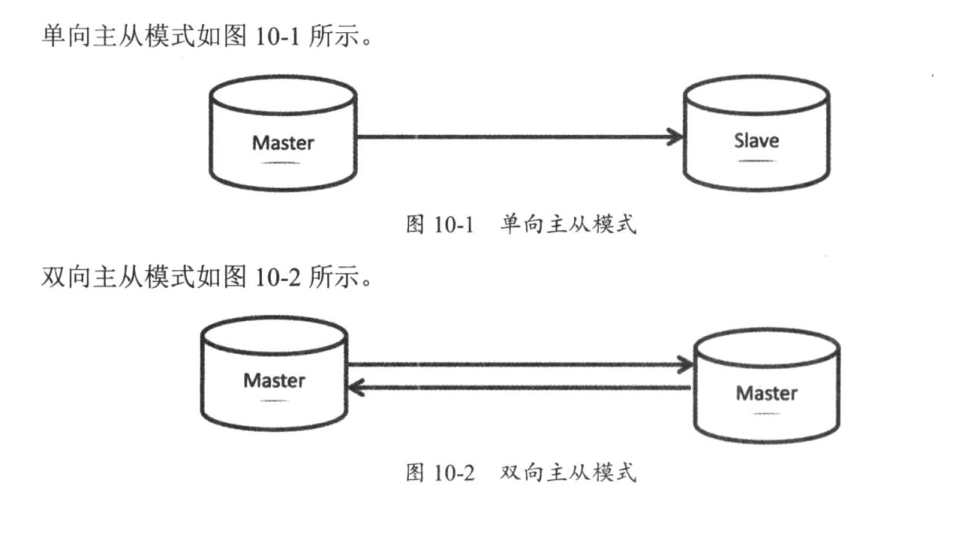
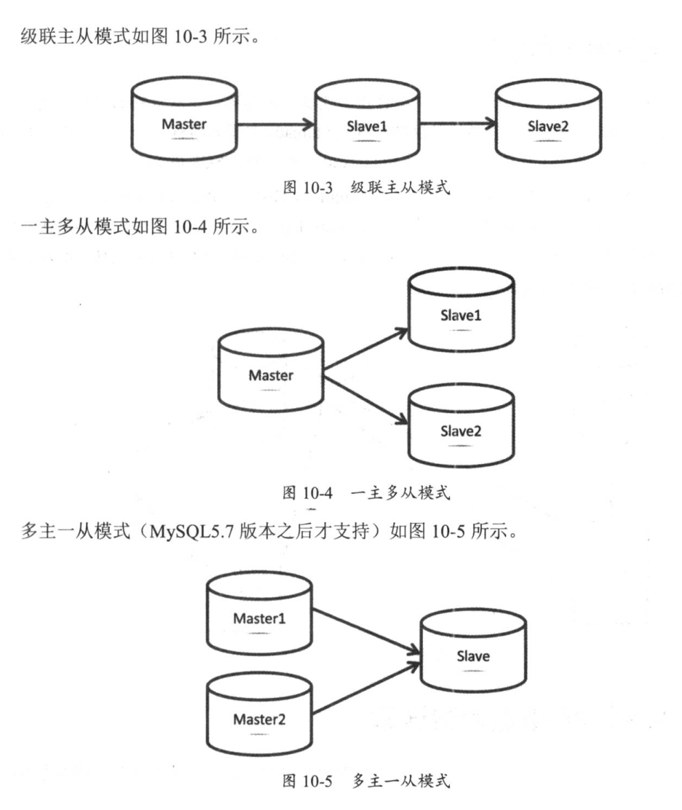
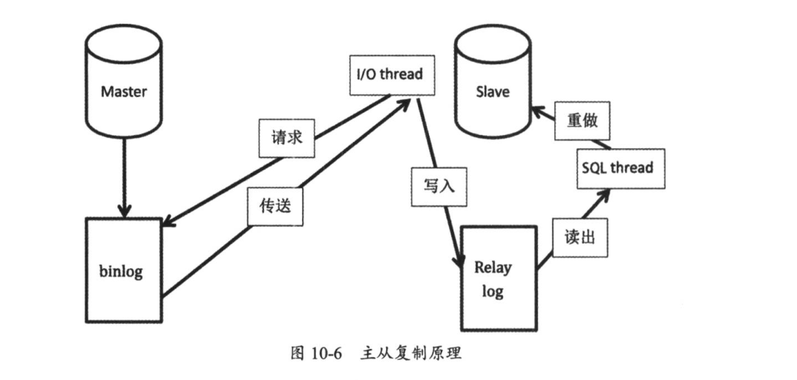

# 01.主从复制概述

## 主从复制
MySQL支持单向/双向/链式级联/异步复制
5.5加入半同步复制
5.6加入GTID复制
5.7加入多源复制/并行复制/loss-less复制

## 主从架构模式
单向主从
双向主从
级联主从
一主多从
多主一从(5.7)





## 主从复制原理

线程：
```
主服务器：一个工作线程I/O dump thread
从服务器：两个工作线程I/O thread，SQL thread主库记录binlog日志，从库I/O thread请求主库binlog日志，并将得到的binlog日志写到自己的relay log(中继日志)文件中，然后在从库上应用中继日志中的SQL语句，主库通过I/O dump thread给从库I/O thread传送binlog日志
```

主从复制原理图：


## 复制中的重点参数详解
复制中的重点参数
``` 
#开启二进制日志
log-bin

#MySQL服务唯一标识
server-id

#数据库启动过程中自动生成，存放在数据目录auto.cnf文件下
server-uuid

#设置从库为只读状态，避免从库上进行写操作。注：对超管权限super帐号没有效果，5.7后新增super_read_only参数，开启后超管也没有权限写入
read only

#二进制日志格式，建议row
binlog_format

#将从master上获取的数据变更再记录到从服务器的二进制日志文件中
log_slave_updates 

#控制当不能写binlog时，server将会怎样。5.7后新增，有ABORT_SERVER(默认)和IGNORE_ERROR两个值
binlog_error_action 

#ABORT_SERVER表示写binlog无法写入时服务退出；IGNORE_ERROR代表在错误日志中记录错误并强制关闭binlog功能

#选择启用binlog的数据库(在主库上使用)。应尽量保证复制的过滤规则不在主库上添加
binlog-do-db

#忽略某个库的复制
binlog-ignore-db

#决定gtid模式是否开启，使用gtid，设置gtid_mode=on
gtid_mode

#使用gtid复制模式时，要开启该参数，用来保证gtid的一致性，设置enforce-gtid-consistency=on
enforce-gtid-consistency 

gtid_next，session级别的变量，下一个gtid，默认AUTOMATIC
gtid_purged，#丢弃掉的gtid

#记录从库的I/O thread从主库读取来的binlog内容
relay log

#只复制指定的表，从库上使用
replicate_do_table

#不复制指定的表，从库上使用
replicate_ignore_table

#只复制指定的库，从库上使用
replicate_do_db

#不复制指定的库，在从库上使用
replicate_ignore_db

#使用通配符复制指定的表，通配符为%，如test.aa%
replicate-wild-do-table
#使用通配符不复制指定的表
replicate-wild-ignore-table

#把master.info主从状态和配置信息记录下来，默认记录到文件里，建议使用表记录：master_info_repository=table
master_info_repository 

# 应用二进制日志的内容，将binlog应用到的位置记录到relay.info，默认记录到file，建议用表记录
relay_log_info_repository

#为了让从库是crash safe的，必须设置relay_log_recovery=1
relay_log_recovery

#当从库崩溃或重启时，会把未执行完的中继日志删除，并会向主库重新获取binlog，再次生成relay log来完成中继日志的恢复。建议开启
relay_log_purge  #消除已执行过的relay log，建议从库开启

slave_net_timeout，在多少秒没收到主库传来的binlog后，从库认为网络超时，从库的I/O thread会重新连接主库，默认60s

slave_parallel_type，5.7引入，两个值：DATABASE和LOGICAL_CLOCK。

#基于组提交的并行复制，通过设置slave_parallel_workers>0且slave_parallel_type='LOGICAL_CLOCK'实现
#设置多个线程来并发执行relay log中主库提交的事务，最大值1024
slave_parallel_workers

master_info_repository=TABLE  默认为 FILE
relay_log_info_repository=TABLE 默认为 FILE

将主从复制信息存储到innodb表中 默认存于文件中 若从服务器宕机 易出现文件记录和实际同步信息不一致情况 存储到innodb中则可借助innodb的崩溃恢复机制保证记录的一致性
```

