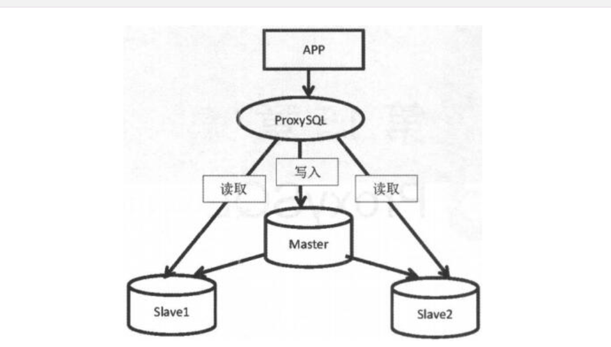

# 04.ProxySQL

ProxySQL是MySQL中间件，是灵活的MySQL代理层，可以实现读写分离，
支持Query路由，支持动态指定某个SQL进行缓存，
支持动态加载配置、故障切换和一些SQL过滤功能。

```
同类产品：DBproxy、MyCAT、OneProxy等
项目地址：https://github.com/sysown/proxysql
官网：http://www.proxysql.com/
文档：https://github.com/sysown/proxysql/wiki
```

## 环境配置


| IP地址 | 节点 | server_id | 读写方式 |
| :--- | :----: | ----: | ----: |
| 192.168.10.110 | Master(node1) | server_id:3306110 | 写 |
| 192.168.10.120 | Slave(node2)read_only=on | server_id:3306120 | 读 |
| 192.168.10.130 | Slave(node3)read_only=on | server_id:3306130 | 读 |
| 192.168.10.140 | ProxySQL中间件 | server_id | 代理 |


## ProxySQL安装与启动

https://pdf.us/2018/07/24/1600.html


