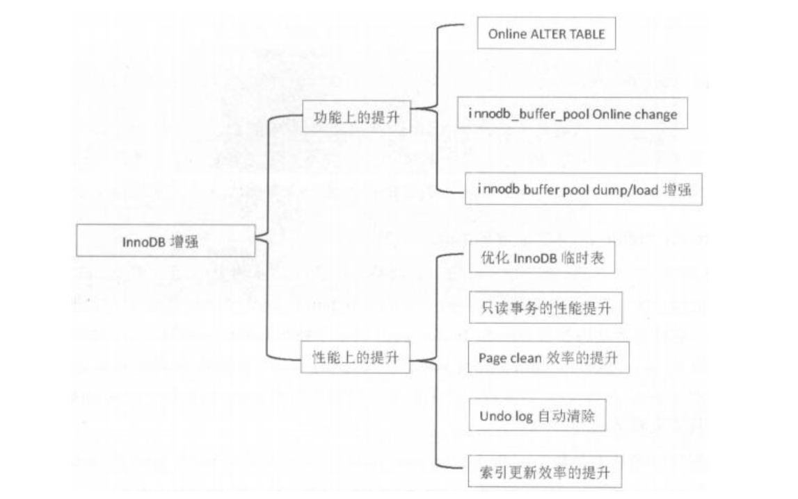

# 01.MySQL5.7新特性

InnoDB存储引擎的增强



## 1、Online ALTER TABLE

支持索引重命名
```
alter table talbe_name rename index old_index_name to new_index_name;
```

支持在线调整varchar列大小
```
alter table t1 algorithm=inplace, change column c1 c1 varchar(255);
#不支持缩减长度，分区间0~255，256~更大，不能跨区间调整，不支持的条件使用copy算法
```

## 2、innodb_buffer_pool 在线修改
``` 
set global innodb_buffer_pool_size=1073741824;
#128MB的整数倍
```

**帐户密码自动过期策略，密码过期必须强制进行修改**
```
default_password_lifetime =90 #90天后过期
```


**sys**库用来诊断问题
了解哪些语句使用了临时表，哪个用户请求了最多的IO，哪个线程占用了最多的内存，哪些索引是无用索引等
以host开头的视图，记录主机相关统计信息

以innodb开头的视图，记录innodb buffer相关信息

以io开头的视图，记录IO相关信息，如等待IO、IO使用等

以memory开头的视图，记录各个维度的内存使用情况

metrics视图，记录数据库内部统计数值

processlist和session视图，记录连接会话相关信息

以schema开头的视图，记录表统计信息

以statement开头的视图，统计用户执行语句、IO使用等信息

以user开头的视图，统计用户执行语句、IO使用等信息

以wait开头的视图，记录等待事件相关情况


查看数据库中索引使用情况
``` 
select index_name,rows_selected,rows_inserted,rows_deleted,rows_updated from schema_index_statistics where table_schema='DB_name' and table_name='**' and index_name='**';
```

查看数据库中冗余索引
``` 
select * from sys.schema_redundant_indexes;
```
查看数据库中未使用到的索引
``` 
select * from sys.schema_unused_indexes;
```

查看IO使用最多的表
``` 
select * from io_global_by_file_by_bytes limit 1;
```

查看实例消耗的内存
``` 
select * from sys.memory_global_tatal;
```

查看每个库占用多少buffer pool
``` 
select * from innodb_buffer_stats_by_schema;
```

前5位占用最多buffer pool表
```
select * from innodb_buffer_stats_by_table order by pages desc limit 5; 
```


**设置查询SQL超时**
``` 
max_execution_time 防止因一条SQL语句的长时间执行，导致数据库雪崩
show variables like '%max_execution_time%';
```

**执行计划增强**
``` 
查看正在执行的SQL线程号
show full processlist

查看当前语句的执行计划
explain for connection **

in语句子查询优化，in查询能够使用index range scan方式
union all不再产生临时表
```


