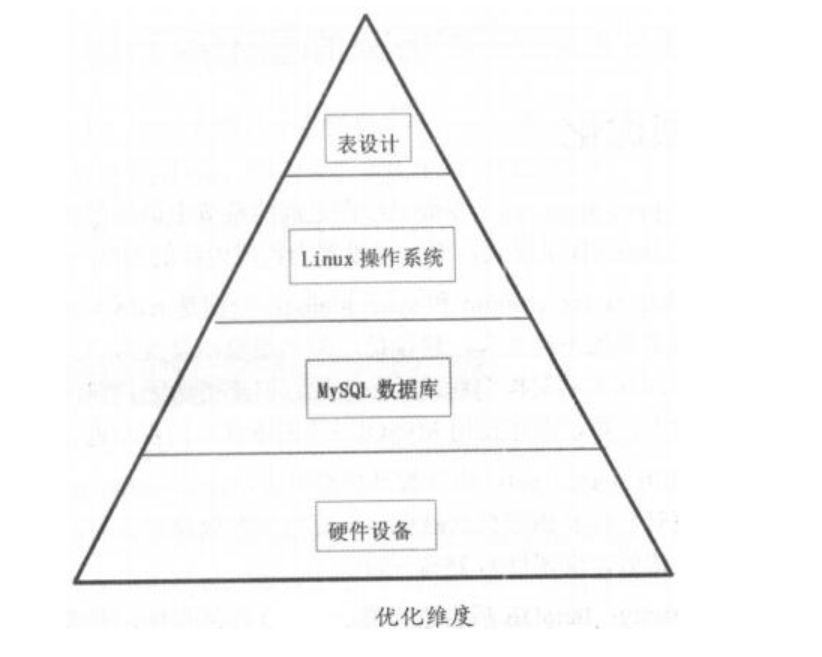

# 02.MySQL全面优化

不要存图片、附件，不要在数据库上进行大量复杂运算，不要当成全文检索工具

每个SQL语句只能用一个CPU核心

每个连接会话连接到数据库时，都会为其分配内存，分配的内存大小一定要控制好，不宜过大，防止业务高峰时，连接数过高，出现OOM现象

关闭query cache需要同时设置query_cache_size=0和query_cache_type=0




## 硬件优化
``` 
影响数据库最大的性能问题是磁盘IO，可以使用SSD或PCIE-SSD，可以获得上百倍或上万倍的IOPS性能提升
当数据库TPS过高或者业务量较大时，要配置阵列卡，且要使用cache模块，并要配置BBU模块持续供电，防止出现数据丢失的现象
选择阵列卡cache策略时，建设设置为Write Back(WB)，千万不要使用Write Through，不经过cache直接写盘
阵列卡的cache不是太大，建立关闭预读功能，仅使用cache
阵列级别，RAID 1+0

BIOS层面，CPU选择performance per watt optimized最大性能模式，关闭C1E和C stats这类节能选项
内存也选择最大性能模式maximum performance
禁掉NUMA功能，将Node Interleaving设置为Enabled模式，让内存在多个CPU节点之间进行循环使用，且无论OS层面numa是否打开，都不影响数据库性能
```


## 配置参数优化
``` 
MySQL参数：
innodb_buffer_pool_size，若是单实例且绝大多数是InnoDB引擎表，可设置为物理内存的50%~80%左右

innodb_flush_log_at_trx_commit和sync_binlog，分别是redo log刷新和binlog刷新参数，若要求数据不丢失，可都设置为1(双一概念，可保证主从架构中数据一致性)。若要保证强一致性，主从故障切换中不丢失数据，可使用增强半同步功能

innodb_max_dirty_pages_pct，脏页占innodb buffer pool的比例，不建议设置太大，脏页过多会影响数据库TPS，建议调整为25%~50%

innodb_io_capacity，InnoDB后台进程最大IO性能指标，影响脏页和插入缓冲数量，默认值为200，在高转速磁盘下，可适当增大该值。SSD可调整为5000~20000，PCIE-SSD更高50000+

innodb_data_file_path=ibdata1:1G:autoextend ，不要使用默认的10MB大小，通常设置为1G，防止高并发下，数据库受到影响

long_query_time，0.1~0.5秒，记录较慢的SQL，方便后续优化

binlog_format，设置为row模式，复制过程中不会丢失数据

interactive_timeout,wait_timeout，交互式等待时间和非交互式等待时间，两参数要设置一致，且必须同时修改，建议300~500秒，不要使用默认的8小时

max_connections，不应该一味调大连接数，易发生OOM现象，在调高该值的同时，应调低interactive_timeout和wait_timeout的值

innodb_log_file_size，redo log值不要太大，若值太大，当实例恢复时，会消耗大量时间；值太小也会造成日志切换过于频繁

general log，全量日志，建议关闭，否则该日志文件会越来越大，造成磁盘空间紧张，MySQL性能也会下降
```
## 操作系统层面的优化
``` 
IO调度，建议选择deadline或noop模式，不能使用cfq，会严重影响数据库性能
#查看当前IO调度方式，中括号中是当前使用方式
#cat /sys/block/sda/queue/scheduler

方件系统选择，优选XFS，其次ext4，放弃ext3

内核参数vm.swappiness
表示使用swap的意向，值较高代表当内存快用尽时，倾向使用swap，而不是特意释放内存中的数据
参数值建议在1~10范围内，不建议设置为0，为0容易导致系统内存溢出OOM，从而MySQL被意外Kill掉
#查看swappiness参数
#cat /proc/sys/vm/swappiness
#要修改swappiness值，编辑/etc/sysctl.conf，加入vm.swappiness值即可
#为0时，禁用swap，1时，尽量不使用swap，60(30)默认，100，积极使用swap，很影响性能

vm.dirty_backgroud_ratio，指定当文件系统缓存脏页数量达到系统内存百分比多少时，触发后台回写进程运行，将一定缓存脏页异步刷入磁盘，建议不要超过10

vm.dirty_ratio，指定当文件系统缓存脏页达到系统内存比例多少时，系统不得不开始处理缓存脏页，建议不超过20
```


## 表设计及其他优化
``` 
18个建议：
1）创建业务表时，库名、表名、字段名必须使用小写字母，采用_分割
2）lower_case_table_names参数区分表名大小写，默认0，大小写敏感，若为1，大小写不敏感，以小写存储。为字段选择数据类型时，简单、够用的原则，表中字段和索引数量不宜过多
3）表存储引擎选择InnoDB
4）要显式为表创建使用自增列int或bigint类型为主键，保证写入顺序是自增的，和B+树叶子节点分裂顺序一致，写入更高效
5）金钱、日期时间、IPv4尽量使用int存储。int存储金钱，单位为分，避免四舍五入，更精确。日期时间可以使用datetime，范围比timestamp大，物理存储上仅多占一个字节，整体性能消耗差别不大。IPv4使用inet_aton和inet_ntoa实现
6）text和blob要尽量避免使用，不要与业务表放在一起。sql中避免使用or子句，避免使用union，尽量采用union all，减少去重和排序工作
7）select查询时只获取必要字段，避免使用select *，可减少网络带宽消耗，还有可能利用到覆盖索引。建立索引时，不要在选择性低的字段上创建
#索引选择性计算方法select count(distinct coll)/count(*) from table_name;值越接近1，选择性越高
8）很长的字符串可以考虑建前缀索引，提高索引利用率。单表索引数不要太多，不建议超过4~5个，执行DML语句操作时，会更新索引，若索引数太多，会造成索引树分裂，性能会下降
9）所有字段定义中，默认都加上not null约束，避免出现null，在对字段进行select count()统计时，可以让统计结果更准确，因为值为null的数据不会被计算进去
10）表字符集默认使用UTF8，汉字占3字节，遇到表情存储可使用UTF8mb4
11）模糊查询尽量少用，可以使用搜索引擎sphinx代替
12）索引字段上不要使用函数，否则使用不到索引，也不要创建函数索引
13）join列类型要保持一致，包括长度、字符集都要一致
14）当在执行计划的extra看到Using filesort或者Using temporary时，优先考虑创建排序索引和分组索引。排序、分组字段上都需要创建索引
15）limit语句上的优化，建议使用主键进行范围检索，缩短结果集大小，便查询更高效
16）可使用mysqldumpslow或pt-query-digest来分析影响业务的慢查询
17）还可以使用MySQL提供的可用来分析当前会话中语句执行资源消耗的命令show profile
show variables like 'profiling';
set profiling=1;#注意不要设置成全局的，仅针对当前会话设置，查看完成后关闭会话会还原为默认值，不要set global profiling=1;
create index name_idx on user(name);
select count(*) from user;
show profiles; 可以查看每条语句的执行时间
通过show profile for query 7;可以查看每条查询的细节时间
通过show profile block io,cpu for query 7;可以查看IO和CPU情况


18）可以使用show global status查看数据库运行状态，通过得出的数值优化MySQL运行效率
重点参数项：
Aborted_client，因客户端未正确关闭连接导致的客户端终止而中断的连接数，连接时间超过超时时间就会退出，该值加1
Aborted_connects，试图连接到MySQL服务器而失败的连接数，如密码错误等
Binlog_cache_disk_use，使用临时二进制日志缓存但超过binlog_cache_size值并使用临时文件来保存事务中语句的事务数量
Binlog_stmt_cache_disk_use，非事务语句使用二进制日志缓存，但超出binlog_stmt_cache_size大小时，会使用一个临时文件来保存这些语句
Binlog_stmt_cache_use，使用二进制日志缓存文件的非事务语句数量
Created_tmp_disk_tables，服务器执行语句时，在磁盘上自动创建的临时表的数量
#排序中，内存不够用，就会在磁盘上创建临时表完成排序工作
Created_tmp_files，创建在内存中的临时表数量，若Created_tmp_disk_tables值较大，可能要增加tmp_table_size值，使临时表基于内存而不基于磁盘
Handler_commit，内部提交语句数量，执行update或delete语句该值加2，执行select语句加1
Handler_rollback，内部rollback语句数量
Handler_read_rnd，根据固定位置读一行的请求数，若正执行大量查询并需要排序，则该值较高
Handler_read_rnd_next，在数据文件中读取下一行的请求数，若正在进行大量表扫描操作，该值较高，通常说明表索引不正确或写入的查询没有利用索引
Handler_read_first，索引中第一条被读取的次数，若较高，说明服务器正执行大量全索引扫描
Handler_read_key，根据索引读一行的请求数，若较高，说明查询和表的索引正确

MySQL InnoDB存储引擎中三个重要等待事件
Innodb_buffer_pool_wait_free，若已适当设置缓冲池大小，该值应小，若值大于0，需要添加innodb buffer pool大小
Innodb_log_waits，若不为0，证明当前redo log buffer size太小，需要增大
Innodb_row_lock_waits，若值较高，需通过show engine innodb status\G或information_schema库下INNODB_LOCKS、INNODB_TRX、INNODB_LOCK_WAITS进一步分析锁等待过程
Open_tables，当前打开表数量
Opened_tables，已经打开表的数量，若该值非常大，说明table_open_cache值太小，导致频繁地open table
#show variables like '%table_open_cache%';
Threads_cached，线程缓存内的线程数量
Threads_connected，当前打开的连接数量
Threads_created，创建的连接数量，若该值较大，可能要增加thread_cache_size值
Threads_running，非睡眠的线程数
Select_full_join，没有使用索引的连接的数量，若值不为0，应仔细检查表索引
Select_full_range_join，在引用的表中使用范围搜索的连接的数量
Select_range，在第一个表中使用范围的连接的数量，一般情况下即使值相当大，也不是关键问题
Select_range_check，在每一行数据后对键值进行检查，检查不带键值的连接的数量，若不为0，应仔细检查表索引
Select_scan，对第一个表进行完全扫描的连接的数量
Sort_merge_passes，排序算法已经执行的全并的数量，若值较大，应考虑增加sort_buffer_size值
Sort_range，在范围内执行的排序的数量
Sort_range，已经排序的行数
Sort_scan，通过扫描表完成的排序的数量
```