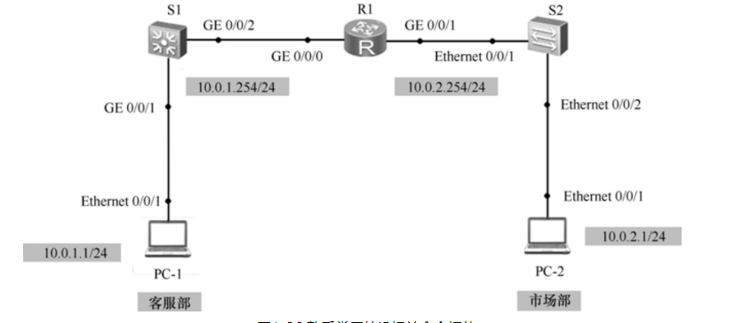
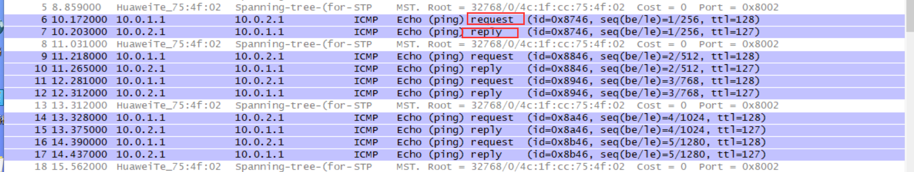
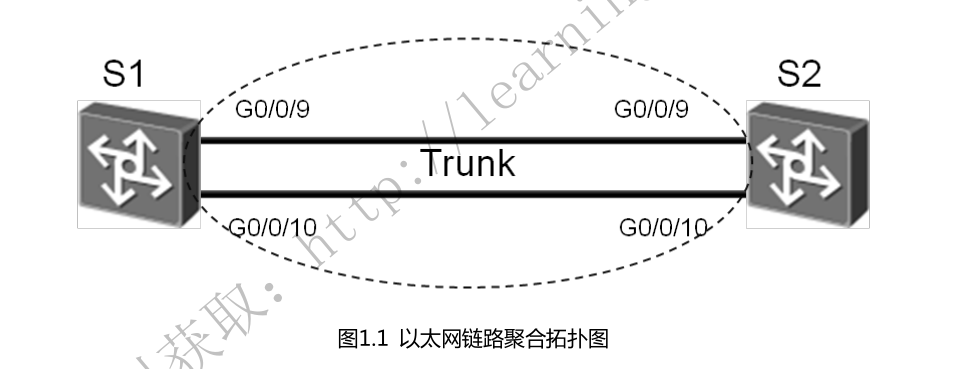
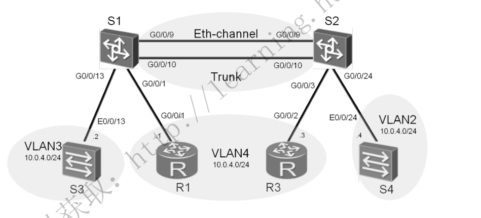
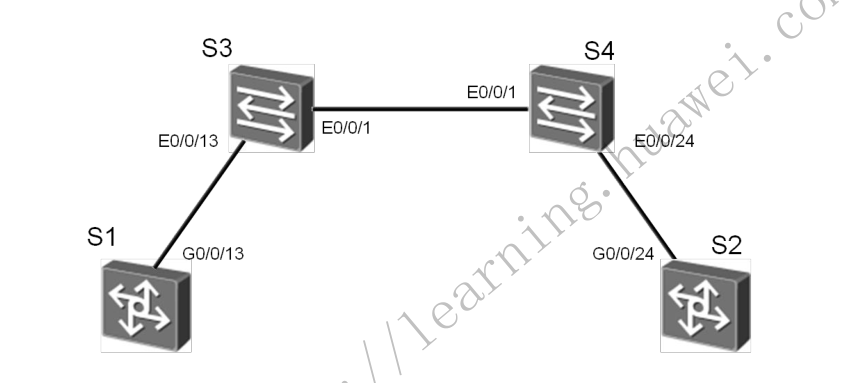
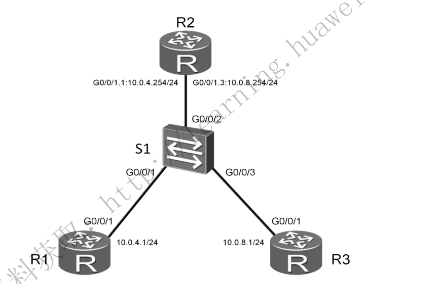
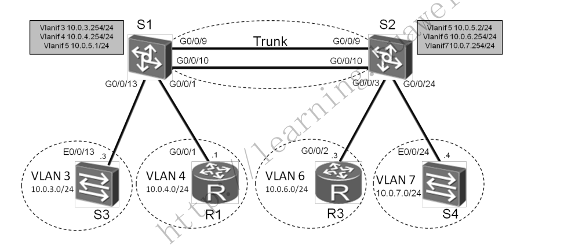
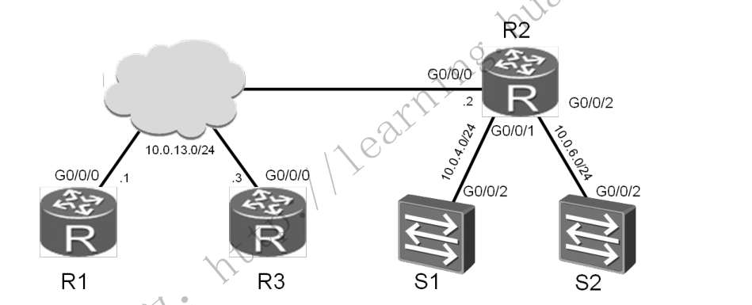

# HCNA网络技术实验指南 

## 熟悉VRP基本操作

### 1．命令视图切换


使用display version 命令显示系统软件版本及硬件等信息。

```
<Huawei>display version
```

用户视图下使用 system-view 命令可以切换到系统视图

```
<Huawei>system-view 
Enter system view, return user view with Ctrl+Z
[Huawei]quit
<Huawei>
```

进入接口视图

```
[Huawei]interface GigabitEthernet 0/0/0
[Huawei-GigabitEthernet0/0/0]
[Huawei-GigabitEthernet0/0/0]ip address 10.1.1.1 24
```

return命令可以使用户从任意非用户视图退回到用户视图，也可以用组合快捷键<Ctrl+Z>完成

### 2．命令行帮助

（1）完全帮助：在任意命令视图下，输入“？”获取该命令视图下所有的命令及其简单描述。


（2）部分帮助：输入一字符串，其后紧接“？”，列出以该字符串开头的所有关键字。


### 3．快捷键使用

```
■退格键<BackSpace>表示删除光标位置的前一个字符；

■左光标键<←>或<Ctrl+B>表示光标向左移动一个字符位置；

■右光标键<→>或<Ctrl+F>表示光标向右移动一个字符位置；

■删除键<Delete>表示删除光标位置字符；

■上下光标键<↑>、<↓>表示显示历史命令；

■当用户输入不完整的关键字后按下<Tab>键，系统自动执行部分帮助，将命令补全。比如输入“dis”后，按<Tab>键可以将命令补全为“display”。
```

### 4．修改路由器名称

```
[Huawei]sysname R1
[R1]
```

### 5．设置路由器时钟

```
例如：在用户视图下，使用clock datetime 命令修改系统日期和时间为2011 年9 月15日12时。

<R1>clock datetime 12:00:00 2011-09-15

例如：在用户视图下，使用clock timezone 命令，设置所在的时区为北京。

<R1>clock timezone BJ add 08:00:00
```

### 6．设置标题信息

```
[R1]header login information "hello"
[R1]header shell information "Welcome to Huawei certification lab"
[R1]quit
<R1>quit

  Configuration console exit, please press any key to log on

Welcome to Huawei certification lab
<R1>
```

### 7．查看路由器基本信息

```
<R1>display version

#使用display current-configuration命令查看路由器当前配置。
<R1>display current-configuration

#使用display interface GigabitEthernet 0/0/0命令查看路由器GE 0/0/0接口的状态信息。
[R1]display interface GigabitEthernet 0/0/0

#查看IPv4路由表的信息。
<R1>display ip routing-table
```

## 熟悉常用的IP 相关命令

实验拓扑

常用的IP相关命令的拓扑如图




```
[R1]display ip interface brief 
*down: administratively down
^down: standby
(l): loopback
(s): spoofing
The number of interface that is UP in Physical is 3
The number of interface that is DOWN in Physical is 1
The number of interface that is UP in Protocol is 3
The number of interface that is DOWN in Protocol is 1

Interface                         IP Address/Mask      Physical   Protocol  
GigabitEthernet0/0/0              10.0.1.254/24        up         up        
GigabitEthernet0/0/1              10.0.2.254/24        up         up        
GigabitEthernet0/0/2              unassigned           down       down      
NULL0                             unassigned           up         up(s)  
```

```
[R1]display ip routing-table
Route Flags: R - relay, D - download to fib
------------------------------------------------------------------------------
Routing Tables: Public
         Destinations : 10       Routes : 10       

Destination/Mask    Proto   Pre  Cost      Flags NextHop         Interface

       10.0.1.0/24  Direct  0    0           D   10.0.1.254      GigabitEthernet
0/0/0
     10.0.1.254/32  Direct  0    0           D   127.0.0.1       GigabitEthernet
0/0/0
     10.0.1.255/32  Direct  0    0           D   127.0.0.1       GigabitEthernet
0/0/0
       10.0.2.0/24  Direct  0    0           D   10.0.2.254      GigabitEthernet
0/0/1
     10.0.2.254/32  Direct  0    0           D   127.0.0.1       GigabitEthernet
0/0/1
     10.0.2.255/32  Direct  0    0           D   127.0.0.1       GigabitEthernet
0/0/1
      127.0.0.0/8   Direct  0    0           D   127.0.0.1       InLoopBack0
      127.0.0.1/32  Direct  0    0           D   127.0.0.1       InLoopBack0
127.255.255.255/32  Direct  0    0           D   127.0.0.1       InLoopBack0
255.255.255.255/32  Direct  0    0           D   127.0.0.1       InLoopBack0
```

```
[R1]ping 10.0.1.1
  PING 10.0.1.1: 56  data bytes, press CTRL_C to break
    Reply from 10.0.1.1: bytes=56 Sequence=1 ttl=128 time=120 ms
    Reply from 10.0.1.1: bytes=56 Sequence=2 ttl=128 time=50 


[R1]ping 10.0.2.1
  PING 10.0.2.1: 56  data bytes, press CTRL_C to break
    Reply from 10.0.2.1: bytes=56 Sequence=1 ttl=128 time=90 ms
```

在PC1上ping  PC2，开始抓包查看数据包信息

```
PC>ping 10.0.2.1

Ping 10.0.2.1: 32 data bytes, Press Ctrl_C to break
From 10.0.2.1: bytes=32 seq=1 ttl=127 time=63 ms
```



## 交换机基础配置

### 以太网接口和配置

```
1.掌握接口速率和双工模式的配置方法

2.掌握实验手段模式配置链路聚合的方法

3.掌握实验静态LACP模式配置链路聚合的方法
```


拓扑图



### 1.配置手工模式的链路聚合（关闭自协商、接口速率为100,，全双工）

- 方式一

```
[sw1]interface Eth-Trunk 1
[sw1]interface GigabitEthernet 0/0/9
[sw1-GigabitEthernet0/0/9]eth-trunk 1
```

- 方式二

```
#创建Eth-Trunk 1，将接口0/0/9 - 0/0/10一次加入Eth-Trunk 1中
[sw1]interface Eth-Trunk 1
[sw1-Eth-Trunk1]trunkport GigabitEthernet 0/0/9 to 0/0/10

interface GigabitEthernet0/0/9
 undo negotiation auto
 speed 100
 eth-trunk 1
#
interface GigabitEthernet0/0/10
 undo negotiation auto
 speed 100
 eth-trunk 1
```

- 查看Eth-trunk的配置结果

```
[sw1]display eth-trunk 1
Eth-Trunk1's state information is:
WorkingMode: NORMAL         Hash arithmetic: According to SIP-XOR-DIP
Least Active-linknumber: 1  Max Bandwidth-affected-linknumber: 8
Operate status: up          Number Of Up Port In Trunk: 2
--------------------------------------------------------------------------------
PortName                      Status      Weight
GigabitEthernet0/0/9          Up          1
GigabitEthernet0/0/10         Up          1


[sw2]display eth-trunk 1
Eth-Trunk1's state information is:
WorkingMode: NORMAL         Hash arithmetic: According to SIP-XOR-DIP
Least Active-linknumber: 1  Max Bandwidth-affected-linknumber: 8
Operate status: up          Number Of Up Port In Trunk: 2
--------------------------------------------------------------------------------
PortName                      Status      Weight
GigabitEthernet0/0/9          Up          1
GigabitEthernet0/0/10         Up          1
```

### 2.配置静态LACP

- 配置文件如下：

```
[SW1]display current-configuration
#
sysname SW1
#
lacp priority 100   #设置SW1为LACP主动端

interface Vlanif1

#
interface Eth-Trunk1
 mode lacp-static

#
interface GigabitEthernet0/0/9
 undo negotiation auto
 speed 100
 eth-trunk 1
 lacp priority 100   #配置接口优先级确定活动链路
#
interface GigabitEthernet0/0/10
 undo negotiation auto
 speed 100
 eth-trunk 1
 lacp priority 100   #配置接口优先级确定活动链路
[SW2]display current-configuration
#
sysname SW2

interface GigabitEthernet0/0/9
 undo negotiation auto
 speed 100
 eth-trunk 1
#
interface GigabitEthernet0/0/10
 undo negotiation auto
 speed 100
 eth-trunk 1
```

- 查看Eth-trunk的配置结果

```
[SW1]display eth-trunk 1
Eth-Trunk1's state information is:
Local:
LAG ID: 1                   WorkingMode: STATIC
Preempt Delay: Disabled     Hash arithmetic: According to SIP-XOR-DIP
System Priority: 100        System ID: 4c1f-ccf3-0486
Least Active-linknumber: 1  Max Active-linknumber: 8
Operate status: up          Number Of Up Port In Trunk: 2
--------------------------------------------------------------------------------
ActorPortName          Status   PortType PortPri PortNo PortKey PortState Weight
GigabitEthernet0/0/9   Selected 1GE      100     10     305     10111100  1
GigabitEthernet0/0/10  Selected 1GE      100     11     305     10111100  1

Partner:
--------------------------------------------------------------------------------
ActorPortName          SysPri   SystemID        PortPri PortNo PortKey PortState
GigabitEthernet0/0/9   32768    4c1f-ccaa-681d  32768   10     305     10111100
GigabitEthernet0/0/10  32768    4c1f-ccaa-681d  32768   11     305     10111100
[SW2]display eth-trunk 1
Eth-Trunk1's state information is:
Local:
LAG ID: 1                   WorkingMode: STATIC
Preempt Delay: Disabled     Hash arithmetic: According to SIP-XOR-DIP
System Priority: 32768      System ID: 4c1f-ccaa-681d
Least Active-linknumber: 1  Max Active-linknumber: 8
Operate status: up          Number Of Up Port In Trunk: 2
--------------------------------------------------------------------------------
ActorPortName          Status   PortType PortPri PortNo PortKey PortState Weight
GigabitEthernet0/0/9   Selected 1GE      32768   10     305     10111100  1
GigabitEthernet0/0/10  Selected 1GE      32768   11     305     10111100  1

Partner:
--------------------------------------------------------------------------------
ActorPortName          SysPri   SystemID        PortPri PortNo PortKey PortState
GigabitEthernet0/0/9   100      4c1f-ccf3-0486  100     10     305     10111100
GigabitEthernet0/0/10  100      4c1f-ccf3-0486  100     11     305     10111100
```

## VLAN配置

学习目的

```
1.掌握vlan的创建方法 
2.掌握Access和Trunk类型接口的配置方法 
3.掌握Hybird接口的配置 
4.掌握将接口与VLAN关联的配置方法
```

拓扑图


VLAN配置实验拓扑图



### 配置文件

- SW1

  

  ```
  [SW1]display current-configuration
  #
  sysname SW1
  #
  vlan batch 3 to 4
  #
  lacp priority 100
  
  interface Eth-Trunk1
   port link-type trunk
   port trunk allow-pass vlan 2 to 4094
   mode lacp-static
  #
  interface GigabitEthernet0/0/1
   port link-type access
   port default vlan 4
  
  interface GigabitEthernet0/0/9
   undo negotiation auto
   speed 100
   eth-trunk 1
   lacp priority 100
  #
  interface GigabitEthernet0/0/10
   undo negotiation auto
   speed 100
   eth-trunk 1
   lacp priority 100
  
  interface GigabitEthernet0/0/13
   port link-type access
   port default vlan 3
  ```

  

- SW2

  ```
  [SW2]display current-configuration
  #
  sysname SW2
  #
  vlan batch 2 4
  
  interface Eth-Trunk1
   port link-type trunk
   port trunk allow-pass vlan 2 to 4094
   mode lacp-static
  #
  interface GigabitEthernet0/0/1
   port link-type access
   port default vlan 4
  
  interface GigabitEthernet0/0/9
   undo negotiation auto
   speed 100
   eth-trunk 1
  #
  interface GigabitEthernet0/0/10
   undo negotiation auto
   speed 100
   eth-trunk 1
  
  interface GigabitEthernet0/0/13
   port link-type access
   port default vlan 2
  ```

  

- SW3

  ```
  [sw3]dis current-configuration
  #
  sysname sw3
  
  interface Vlanif1
   ip address 10.0.4.2 255.255.255.0
  ```

  

- SW4

  ```
  [Huawei]display current-configuration
  #
  sysname Huawei
  
  interface Vlanif1
   ip address 10.0.4.4 255.255.255.0
  ```

  

- R1

  ```
  interface GigabitEthernet0/0/1
   ip address 10.0.4.1 255.255.255.0
  ```

  

- R3

  ```
  interface GigabitEthernet0/0/1
   ip address 10.0.4.3 255.255.255.0
  ```

  

  R1和R3在同一vlan，可以互通，如下：

```
[R4-GigabitEthernet0/0/1]ping 10.0.4.1
  PING 10.0.4.1: 56  data bytes, press CTRL_C to break
    Reply from 10.0.4.1: bytes=56 Sequence=1 ttl=255 time=110 ms
    Reply from 10.0.4.1: bytes=56 Sequence=2 ttl=255 time=70 ms

[R3]ping 10.0.4.3
  PING 10.0.4.3: 56  data bytes, press CTRL_C to break
    Reply from 10.0.4.3: bytes=56 Sequence=1 ttl=255 time=80 ms
    Reply from 10.0.4.3: bytes=56 Sequence=2 ttl=255 time=70 ms
```

实现效果; R3、R4、SW4之间互通，Vlan2和Vlan4打通通信

​    SW1

```
[SW1]display current-configuration
#
sysname SW1
#
vlan batch 2 to 4

interface Eth-Trunk1
 port link-type trunk
 port trunk allow-pass vlan 2 to 4094
 mode lacp-static
                        #
                        interface GigabitEthernet0/0/1
                         port hybrid pvid vlan 4
                         port hybrid untagged vlan 2 4

interface GigabitEthernet0/0/9
 undo negotiation auto
 speed 100
 eth-trunk 1
 lacp priority 100
#
interface GigabitEthernet0/0/10
 undo negotiation auto
 speed 100
 eth-trunk 1
 lacp priority 100

interface GigabitEthernet0/0/13
 port link-type access
 port default vlan 3
```

SW2

```
[SW2]display current-configuration
#
sysname SW2
#
vlan batch 2 4
#
interface Eth-Trunk1
 port link-type trunk
 port trunk allow-pass vlan 2 to 4094
 mode lacp-static
                    #
                    interface GigabitEthernet0/0/1
                     port hybrid pvid vlan 4
                     port hybrid untagged vlan 2 4

interface GigabitEthernet0/0/9
 undo negotiation auto
 speed 100
 eth-trunk 1
#
interface GigabitEthernet0/0/10
 undo negotiation auto
 speed 100
 eth-trunk 1

#
                    interface GigabitEthernet0/0/13
                     port hybrid pvid vlan 2
                     port hybrid untagged vlan 2 4
```

## GVRP配置

```
1.掌握GVRP的配置方法
2.掌握GVRP不同注册模式的配置方法
```

拓扑图



**场景**

企业网绍中往会使用大量的交换机目需要在网络中划分不同的VLAN ， 若
网络管理员采用手工配置VLAN 的创建和删除，工作量极大而目容易出错。这种
情况下迎可以通过GVRP 的VLAN 动态注册功能来自动完成VLAN 的配置。

### 配置文件

sw1

```
[Sw1]display current-configuration
#
sysname Sw1
#
vlan batch 2
#
gvrp

#
interface Ethernet0/0/1
 port link-type trunk
 port trunk allow-pass vlan 2 to 4094
 gvrp

interface Ethernet0/0/13
 port link-type trunk
 port trunk allow-pass vlan 2 to 4094
 gvrp
```

sw1查看学习到的vlan

```
[Sw1]display  vlan
Dec 21 2018 15:24:05-08:00 Sw1 DS/4/DATASYNC_CFGCHANGE:OID 1.3.6.1.4.1.2011.5.25
.191.3.1 configurations have been changed. The current change number is 20, the
change loop count is 0, and the maximum number of records is 4095. vlan
The total number of vlans is : 4
--------------------------------------------------------------------------------
U: Up;         D: Down;         TG: Tagged;         UT: Untagged;
MP: Vlan-mapping;               ST: Vlan-stacking;
#: ProtocolTransparent-vlan;    *: Management-vlan;
--------------------------------------------------------------------------------

VID  Type    Ports
--------------------------------------------------------------------------------
1    common  UT:Eth0/0/1(U)     Eth0/0/2(D)     Eth0/0/3(D)     Eth0/0/4(D)
                Eth0/0/5(D)     Eth0/0/6(D)     Eth0/0/7(D)     Eth0/0/8(D)
                Eth0/0/9(D)     Eth0/0/10(D)    Eth0/0/11(D)    Eth0/0/12(D)
                Eth0/0/13(U)    Eth0/0/14(D)    Eth0/0/15(D)    Eth0/0/16(D)
                Eth0/0/17(D)    Eth0/0/18(D)    Eth0/0/19(D)    Eth0/0/20(D)
                Eth0/0/21(D)    Eth0/0/22(D)    GE0/0/1(D)      GE0/0/2(D)

2    common  TG:Eth0/0/1(U)     Eth0/0/13(U)

100  dynamic TG:Eth0/0/1(U)     Eth0/0/13(U)

200  dynamic TG:Eth0/0/1(U)     Eth0/0/13(U)


VID  Status  Property      MAC-LRN Statistics Description
--------------------------------------------------------------------------------

1    enable  default       enable  disable    VLAN 0001
2    enable  default       enable  disable    VLAN 0002

100  enable  default       enable  disable    VLAN 0100
200  enable  default       enable  disable    VLAN 0200
```

sw2

```
[SW2]display current-configuration
#
sysname SW2
#
vlan batch 2
#
gvrp

interface Ethernet0/0/1
 port link-type trunk
 port trunk allow-pass vlan 2 to 4094
 gvrp

interface Ethernet0/0/22
 port link-type trunk
 port trunk allow-pass vlan 2 to 4094
 gvrp
```

查看sw2 学习到的vlan

```
[SW2]display vlan
The total number of vlans is : 4
--------------------------------------------------------------------------------
U: Up;         D: Down;         TG: Tagged;         UT: Untagged;
MP: Vlan-mapping;               ST: Vlan-stacking;
#: ProtocolTransparent-vlan;    *: Management-vlan;
--------------------------------------------------------------------------------

VID  Type    Ports
--------------------------------------------------------------------------------
1    common  UT:Eth0/0/1(U)     Eth0/0/2(D)     Eth0/0/3(D)     Eth0/0/4(D)
                Eth0/0/5(D)     Eth0/0/6(D)     Eth0/0/7(D)     Eth0/0/8(D)
                Eth0/0/9(D)     Eth0/0/10(D)    Eth0/0/11(D)    Eth0/0/12(D)
                Eth0/0/13(D)    Eth0/0/14(D)    Eth0/0/15(D)    Eth0/0/16(D)
                Eth0/0/17(D)    Eth0/0/18(D)    Eth0/0/19(D)    Eth0/0/20(D)
                Eth0/0/21(D)    Eth0/0/22(U)    GE0/0/1(D)      GE0/0/2(D)

2    common  TG:Eth0/0/1(U)     Eth0/0/22(U)

100  dynamic TG:Eth0/0/1(U)     Eth0/0/22(U)

200  dynamic TG:Eth0/0/1(U)     Eth0/0/22(U)


VID  Status  Property      MAC-LRN Statistics Description
--------------------------------------------------------------------------------

1    enable  default       enable  disable    VLAN 0001
2    enable  default       enable  disable    VLAN 0002
100  enable  default       enable  disable    VLAN 0100
200  enable  default       enable  disable    VLAN 0200
```

sw3

```
[SW3]display current-configuration
#
sysname SW3
#
vlan batch 2 100 200
#
gvrp

interface GigabitEthernet0/0/13
 port link-type trunk
 port trunk allow-pass vlan 2 to 4094
 gvrp
```


sw4

```
[SW4]displa cu
#
sysname SW4
#
vlan batch 2 100 200
#
gvrp

interface GigabitEthernet0/0/22
 port link-type trunk
 port trunk allow-pass vlan 2 to 4094
 gvrp
```

需要手动的设置vlan SW3：vlan 100 SW4：vlan 200
使得sw1和sw2交换机两端都能动态的学习到vlan信息，这样报文就能够双向通信


### 修改交换机接口的注册模式

- sw1

```
[SW2-Ethernet0/0/1]gvrp registration fixed


[Sw1]display gvrp statistics
  GVRP statistics on port Ethernet0/0/1
    GVRP status             : Enabled
    GVRP registrations failed       : 45
    GVRP last PDU origin        : 4c1f-cc40-0f86
    GVRP registration type      : Fixed

  GVRP statistics on port Ethernet0/0/13
    GVRP status             : Enabled
    GVRP registrations failed       : 0
    GVRP last PDU origin        : 4c1f-ccbe-3f53
    GVRP registration type      : Normal


[Sw1]display vlan
The total number of vlans is : 4
--------------------------------------------------------------------------------
U: Up;         D: Down;         TG: Tagged;         UT: Untagged;
MP: Vlan-mapping;               ST: Vlan-stacking;
#: ProtocolTransparent-vlan;    *: Management-vlan;
--------------------------------------------------------------------------------

VID  Type    Ports
--------------------------------------------------------------------------------
1    common  UT:Eth0/0/1(U)     Eth0/0/2(D)     Eth0/0/3(D)     Eth0/0/4(D)
                Eth0/0/5(D)     Eth0/0/6(D)     Eth0/0/7(D)     Eth0/0/8(D)
                Eth0/0/9(D)     Eth0/0/10(D)    Eth0/0/11(D)    Eth0/0/12(D)
                Eth0/0/13(U)    Eth0/0/14(D)    Eth0/0/15(D)    Eth0/0/16(D)
                Eth0/0/17(D)    Eth0/0/18(D)    Eth0/0/19(D)    Eth0/0/20(D)
                Eth0/0/21(D)    Eth0/0/22(D)    GE0/0/1(D)      GE0/0/2(D)


2    common  TG:Eth0/0/1(U)     Eth0/0/13(U)


100  dynamic TG:Eth0/0/13(U)
200  dynamic TG:Eth0/0/13(U)
```


- sw2

```
[SW2-Ethernet0/0/1]gvrp registration fixed


[SW2]display gvrp statistics

  GVRP statistics on port Ethernet0/0/1
    GVRP status             : Enabled
    GVRP registrations failed       : 2
    GVRP last PDU origin        : 4c1f-cce9-6d23
    GVRP registration type      : Fixed

  GVRP statistics on port Ethernet0/0/22
    GVRP status             : Enabled
    GVRP registrations failed       : 0
    GVRP last PDU origin        : 4c1f-ccac-22b1
    GVRP registration type      : Normal


[SW2]display vlan
The total number of vlans is : 4
--------------------------------------------------------------------------------
U: Up;         D: Down;         TG: Tagged;         UT: Untagged;
MP: Vlan-mapping;               ST: Vlan-stacking;
#: ProtocolTransparent-vlan;    *: Management-vlan;
--------------------------------------------------------------------------------

VID  Type    Ports
--------------------------------------------------------------------------------
1    common  UT:Eth0/0/1(U)     Eth0/0/2(D)     Eth0/0/3(D)     Eth0/0/4(D)
                Eth0/0/5(D)     Eth0/0/6(D)     Eth0/0/7(D)     Eth0/0/8(D)
                Eth0/0/9(D)     Eth0/0/10(D)    Eth0/0/11(D)    Eth0/0/12(D)
                Eth0/0/13(D)    Eth0/0/14(D)    Eth0/0/15(D)    Eth0/0/16(D)
                Eth0/0/17(D)    Eth0/0/18(D)    Eth0/0/19(D)    Eth0/0/20(D)
                Eth0/0/21(D)    Eth0/0/22(U)    GE0/0/1(D)      GE0/0/2(D)

2    common  TG:Eth0/0/1(U)     Eth0/0/22(U)


100  dynamic TG:Eth0/0/22(U)
200  dynamic TG:Eth0/0/22(U)
```


回显信息中灰色阴影标注的部分表明端口E0/0/1无法注册动态VLAN100和200

配置S1、S2 E0/0/1接口的注册模式为Forbidden

- sw1

```
[Sw1-Ethernet0/0/1]gvrp registration forbidden
Info: This operation may take a few seconds. Please wait for a moment...done.

[Sw1]display gvrp statistics

  GVRP statistics on port Ethernet0/0/1
    GVRP status             : Enabled
    GVRP registrations failed       : 87
    GVRP last PDU origin        : 4c1f-cc40-0f86
    GVRP registration type      : Forbidden

  GVRP statistics on port Ethernet0/0/13
    GVRP status             : Enabled
    GVRP registrations failed       : 0
    GVRP last PDU origin        : 4c1f-ccbe-3f53
    GVRP registration type      : Normal

[Sw1]display vlan
The total number of vlans is : 4
--------------------------------------------------------------------------------
U: Up;         D: Down;         TG: Tagged;         UT: Untagged;
MP: Vlan-mapping;               ST: Vlan-stacking;
#: ProtocolTransparent-vlan;    *: Management-vlan;
--------------------------------------------------------------------------------

VID  Type    Ports
--------------------------------------------------------------------------------
1    common  UT:Eth0/0/1(U)     Eth0/0/2(D)     Eth0/0/3(D)     Eth0/0/4(D)
                Eth0/0/5(D)     Eth0/0/6(D)     Eth0/0/7(D)     Eth0/0/8(D)
                Eth0/0/9(D)     Eth0/0/10(D)    Eth0/0/11(D)    Eth0/0/12(D)

                Eth0/0/13(U)    Eth0/0/14(D)    Eth0/0/15(D)    Eth0/0/16(D)
                Eth0/0/17(D)    Eth0/0/18(D)    Eth0/0/19(D)    Eth0/0/20(D)
                Eth0/0/21(D)    Eth0/0/22(D)    GE0/0/1(D)      GE0/0/2(D)
2    common  TG:Eth0/0/13(U)

100  dynamic TG:Eth0/0/13(U)
200  dynamic TG:Eth0/0/13(U)
```

- sw2

```
[SW2-Ethernet0/0/1]gvrp registration forbidden

[SW2]display gvrp statistics

  GVRP statistics on port Ethernet0/0/1
    GVRP status             : Enabled
    GVRP registrations failed       : 63
    GVRP last PDU origin        : 4c1f-cce9-6d23
    GVRP registration type      : Forbidden

  GVRP statistics on port Ethernet0/0/22
    GVRP status             : Enabled
    GVRP registrations failed       : 0
    GVRP last PDU origin        : 4c1f-ccac-22b1
    GVRP registration type      : Normal

[SW2]display vlan
The total number of vlans is : 4
--------------------------------------------------------------------------------
U: Up;         D: Down;         TG: Tagged;         UT: Untagged;
MP: Vlan-mapping;               ST: Vlan-stacking;
#: ProtocolTransparent-vlan;    *: Management-vlan;
--------------------------------------------------------------------------------

VID  Type    Ports
--------------------------------------------------------------------------------
1    common  UT:Eth0/0/1(U)     Eth0/0/2(D)     Eth0/0/3(D)     Eth0/0/4(D)
                Eth0/0/5(D)     Eth0/0/6(D)     Eth0/0/7(D)     Eth0/0/8(D)
                Eth0/0/9(D)     Eth0/0/10(D)    Eth0/0/11(D)    Eth0/0/12(D)
                Eth0/0/13(D)    Eth0/0/14(D)    Eth0/0/15(D)    Eth0/0/16(D)
                Eth0/0/17(D)    Eth0/0/18(D)    Eth0/0/19(D)    Eth0/0/20(D)
                Eth0/0/21(D)    Eth0/0/22(U)    GE0/0/1(D)      GE0/0/2(D)

2    common  TG:Eth0/0/22(U)

100  dynamic TG:Eth0/0/22(U)
200  dynamic TG:Eth0/0/22(U)
```

- 在 Forbidden模式下E0/0/1接口只允许VLAN1的报文通过，禁止任何其他VLAN的报文通过

## VLAN间路由

### 掌握知识

```
1 掌握用于VLAN间路由的Trunk接口的配置方法
2 掌握单个物理接口上配置多个子接口的方法
3 掌握VLAN间实现ARP通信的配置方法
```

单臂路由



- R1配置

```
[R1]display current-configuration
[V200R003C00]
#
 sysname R1

interface GigabitEthernet0/0/1
 ip address 10.0.4.1 255.255.255.0

ip route-static 0.0.0.0 0.0.0.0 10.0.4.254
```

- R2配置

```
[R2]display current-configuration
[V200R003C00]
#
 sysname R2
#
interface GigabitEthernet0/0/1
 ip address 10.0.8.1 255.255.255.0
#

ip route-static 0.0.0.0 0.0.0.0 10.0.8.254
```

- R3配置

```
[R3]display current-configuration
[V200R003C00]
#
 sysname R3
interface GigabitEthernet0/0/1.1
 dot1q termination vid 4
 ip address 10.0.4.254 255.255.255.0
 arp broadcast enable
#
interface GigabitEthernet0/0/1.2
 dot1q termination vid 8
 ip address 10.0.8.254 255.255.255.0
 arp broadcast enable

#查看路由条目
[R3]display ip routing-table
Route Flags: R - relay, D - download to fib
------------------------------------------------------------------------------
Routing Tables: Public
         Destinations : 10       Routes : 10

Destination/Mask    Proto   Pre  Cost      Flags NextHop         Interface

       10.0.4.0/24  Direct  0    0           D   10.0.4.254      GigabitEthernet0/0/1.1
     10.0.4.254/32  Direct  0    0           D   127.0.0.1       GigabitEthernet0/0/1.1
     10.0.4.255/32  Direct  0    0           D   127.0.0.1       GigabitEthernet0/0/1.1
       10.0.8.0/24  Direct  0    0           D   10.0.8.254      GigabitEthernet0/0/1.2
     10.0.8.254/32  Direct  0    0           D   127.0.0.1       GigabitEthernet0/0/1.2
     10.0.8.255/32  Direct  0    0           D   127.0.0.1       GigabitEthernet0/0/1.2
      127.0.0.0/8   Direct  0    0           D   127.0.0.1       InLoopBack0
      127.0.0.1/32  Direct  0    0           D   127.0.0.1       InLoopBack0
127.255.255.255/32  Direct  0    0           D   127.0.0.1       InLoopBack0
255.255.255.255/32  Direct  0    0           D   127.0.0.1       InLoopBack0
```

- SW配置

```
[SW1]display current-configuration
#
sysname SW1
#
vlan batch 4 8

interface GigabitEthernet0/0/1
 port link-type access
 port default vlan 4
#
interface GigabitEthernet0/0/2
 port link-type trunk
 port trunk allow-pass vlan 4 8
#
interface GigabitEthernet0/0/3
 port link-type access
 port default vlan 8
```

- vlan4和vlan8之间可以互通

#### 配置三层交换

```
- 掌握三层交换机实现VLAN通信的方法
- 通过Trunk链路实现VLAN间通信的配置方法
- 配置不同VLAN间动态路由协议OSPF的方法
```

拓扑图

三层交换实验拓扑



- SW1

```
[sw1-ospf-1]display current-configuration
#
sysname sw1
#
vlan batch 3 to 7

interface Vlanif3
 ip address 10.0.3.254 255.255.255.0
#
interface Vlanif4
 ip address 10.0.4.254 255.255.255.0
#
interface Vlanif5
 ip address 10.0.5.1 255.255.255.0


interface Eth-Trunk1
 port link-type trunk
 port trunk allow-pass vlan 2 to 4094
#
interface GigabitEthernet0/0/1
 port link-type access
 port default vlan 4

interface GigabitEthernet0/0/9
 eth-trunk 1
#
interface GigabitEthernet0/0/10
 eth-trunk 1

interface GigabitEthernet0/0/13
 port link-type access
 port default vlan 3

ospf 1
 area 0.0.0.0
  network 10.0.0.0 0.255.255.255


 [sw1]display ip routing-table
Route Flags: R - relay, D - download to fib
------------------------------------------------------------------------------
Routing Tables: Public
         Destinations : 10       Routes : 10

Destination/Mask    Proto   Pre  Cost      Flags NextHop         Interface

       10.0.3.0/24  Direct  0    0           D   10.0.3.254      Vlanif3
     10.0.3.254/32  Direct  0    0           D   127.0.0.1       Vlanif3
       10.0.4.0/24  Direct  0    0           D   10.0.4.254      Vlanif4
     10.0.4.254/32  Direct  0    0           D   127.0.0.1       Vlanif4
       10.0.5.0/24  Direct  0    0           D   10.0.5.1        Vlanif5
       10.0.5.1/32  Direct  0    0           D   127.0.0.1       Vlanif5
       10.0.6.0/24  OSPF    10   2           D   10.0.5.2        Vlanif5
       10.0.7.0/24  OSPF    10   2           D   10.0.5.2        Vlanif5
      127.0.0.0/8   Direct  0    0           D   127.0.0.1       InLoopBack0
      127.0.0.1/32  Direct  0    0           D   127.0.0.1       InLoopBack0
```

- SW2

```
[SW2-ospf-1-area-0.0.0.0]display current-configuration
#
sysname SW2
#
vlan batch 3 to 7

interface Vlanif5
 ip address 10.0.5.2 255.255.255.0
#
interface Vlanif6
 ip address 10.0.6.254 255.255.255.0
#
interface Vlanif7
 ip address 10.0.7.254 255.255.255.0

interface GigabitEthernet0/0/3
 port link-type access
 port default vlan 6
#
i
interface GigabitEthernet0/0/9
 eth-trunk 1
#
interface GigabitEthernet0/0/10
 eth-trunk 1

interface GigabitEthernet0/0/12
 port link-type access
 port default vlan 7
#

 area 0.0.0.0
  network 10.0.0.0 0.255.255.255


  [SW2-GigabitEthernet0/0/3]display ip routing-table
Route Flags: R - relay, D - download to fib
------------------------------------------------------------------------------
Routing Tables: Public
         Destinations : 10       Routes : 10

Destination/Mask    Proto   Pre  Cost      Flags NextHop         Interface

       10.0.3.0/24  OSPF    10   2           D   10.0.5.1        Vlanif5
       10.0.4.0/24  OSPF    10   2           D   10.0.5.1        Vlanif5
       10.0.5.0/24  Direct  0    0           D   10.0.5.2        Vlanif5
       10.0.5.2/32  Direct  0    0           D   127.0.0.1       Vlanif5
       10.0.6.0/24  Direct  0    0           D   10.0.6.254      Vlanif6
     10.0.6.254/32  Direct  0    0           D   127.0.0.1       Vlanif6
       10.0.7.0/24  Direct  0    0           D   10.0.7.254      Vlanif7
     10.0.7.254/32  Direct  0    0           D   127.0.0.1       Vlanif7
      127.0.0.0/8   Direct  0    0           D   127.0.0.1       InLoopBack0
      127.0.0.1/32  Direct  0    0           D   127.0.0.1       InLoopBack0
```

- R1

```
[R1]display current-configuration
[V200R003C00]
#
 sysname R1

interface GigabitEthernet0/0/1
 ip address 10.0.4.1 255.255.255.0
#

#
ip route-static 0.0.0.0 0.0.0.0 10.0.4.254
```

- R2

```
[R2]display current-configuration
[V200R003C00]
#
 sysname R2

interface GigabitEthernet0/0/2
 ip address 10.0.6.1 255.255.255.0

ip route-static 0.0.0.0 0.0.0.0 10.0.6.254
```

- SW3

```
[SW3]display current-configuration
#
sysname SW3
interface Vlanif1
 ip address 10.0.3.1 255.255.255.0

ip route-static 0.0.0.0 0.0.0.0 10.0.3.254
```

- SW4

```
[SW4]display current-configuration
#
sysname SW4
interface Vlanif1
 ip address 10.0.7.1 255.255.255.0

ip route-static 0.0.0.0 0.0.0.0 10.0.7.254
```

## IP安全配置(ACL)

```
- 掌握高级ACL的配置方法
- 掌握ACL在接口下的应用方法
```

拓扑图

配置ACL过滤企业数据实验拓扑图



- R1

```
[R1]display current-configuration
[V200R003C00]
#
 sysname R1


interface GigabitEthernet0/0/0
 ip address 10.0.13.1 255.255.255.0

#
ospf 1
 area 0.0.0.0
  network 10.0.13.0 0.0.0.255
```

- R2

```
[R2]display current-configuration
[V200R003C00]
#
 sysname R2
#
 snmp-agent local-engineid 800007DB03000000000000
 snmp-agent
#
 clock timezone China-Standard-Time minus 08:00:00
#
portal local-server load portalpage.zip
#
 drop illegal-mac alarm
#
 set cpu-usage threshold 80 restore 75
#
acl number 3000
 rule 5 permit tcp source 10.0.13.1 0 destination 10.0.4.254 0 destination-port
eq telnet
 rule 10 permit tcp source 10.0.13.3 0 destination 10.0.6.254 0 destination-port
 range ftp-data ftp
 rule 15 deny ip
#
aaa
 authentication-scheme default
 authorization-scheme default
 accounting-scheme default
 domain default
 domain default_admin
 local-user admin password cipher %$%$K8m.Nt84DZ}e#<0`8bmE3Uw}%$%$
 local-user admin service-type http
#
firewall zone Local
 priority 15
#
interface GigabitEthernet0/0/0
 ip address 10.0.13.2 255.255.255.0
#
interface GigabitEthernet0/0/1
 ip address 10.0.4.2 255.255.255.0
#
interface GigabitEthernet0/0/2
 ip address 10.0.6.2 255.255.255.0
 traffic-filter inbound acl 3000
#
interface NULL0
#
ospf 1
 area 0.0.0.0
  network 10.0.4.0 0.0.0.255
  network 10.0.6.0 0.0.0.255
  network 10.0.13.0 0.0.0.255
#
user-interface con 0
 authentication-mode password
user-interface vty 0 4
user-interface vty 16 20
```

- R3

```
[R3]display current-configuration
[V200R003C00]
#
 sysname R3

aaa
 authentication-scheme default
 authorization-scheme default
 accounting-scheme default
 domain default
 domain default_admin
 local-user admin password cipher %$%$K8m.Nt84DZ}e#<0`8bmE3Uw}%$%$
 local-user admin service-type http
#
firewall zone Local
 priority 15
#
interface GigabitEthernet0/0/0
 ip address 10.0.13.3 255.255.255.0


ospf 1
 area 0.0.0.0
  network 10.0.13.0 0.0.0.255
```

- SW1 telnet服务器

```
<SW1>display current-configuration
#
sysname SW1
#
vlan batch 4


interface Vlanif4
 ip address 10.0.4.254 255.255.255.0

#
interface GigabitEthernet0/0/2
 port link-type trunk
 port trunk pvid vlan 4
 port trunk allow-pass vlan 2 to 4094

#
ip route-static 0.0.0.0 0.0.0.0 10.0.4.2
user-interface con 0
user-interface vty 0 4
 set authentication password cipher Zm~.C3k[ND`S/0Rb{DzNkSg#
```

- SW2 ftp服务器

```
[SW2]display current-configuration
#
sysname SW2
#
FTP server enable
#
vlan batch 6

aaa
 authentication-scheme default
 authorization-scheme default
 accounting-scheme default
 domain default
 domain default_admin
 local-user admin password simple admin
 local-user admin service-type http
 local-user huawei password cipher $K&%QCXM$NYNZPO3JBXBHA!!
 local-user huawei ftp-directory flash:
 local-user huawei service-type ftp

interface Vlanif6
 ip address 10.0.6.254 255.255.255.0

interface GigabitEthernet0/0/2
 port link-type trunk
 port trunk pvid vlan 6
 port trunk allow-pass vlan 2 to 4094

ip route-static 0.0.0.0 0.0.0.0 10.0.6.2
#
user-interface con 0
user-interface vty 0 4
```

**R1可以访问S1的telnet服务器** **R2可以访问S2的ftp服务器**


## NAT的配置

学习目标

```
* 掌握动态NAT的配置方法
* 掌握Easy IP的配置方法
```