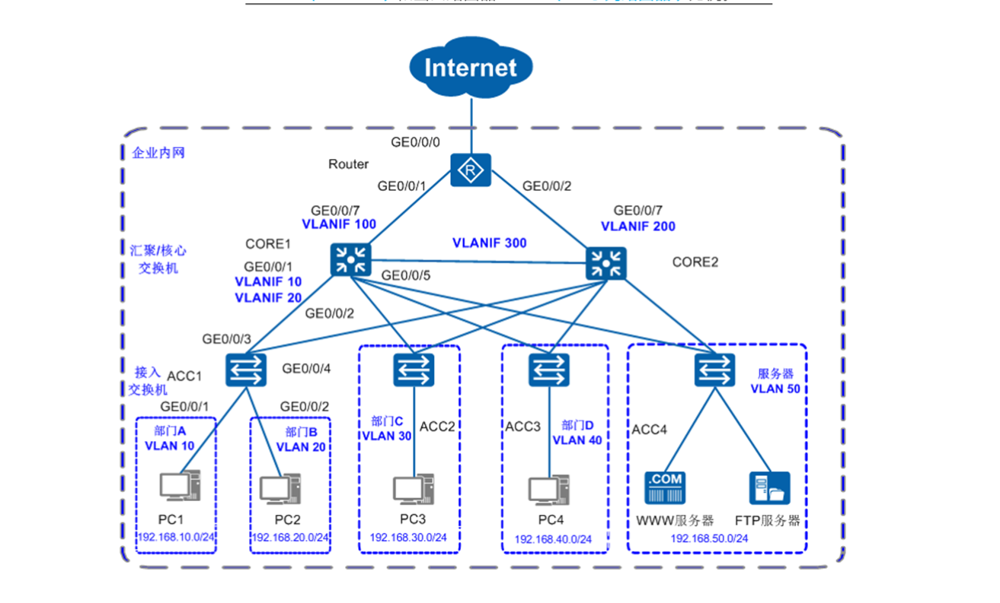

# 中小园区组网场景


## Core1 配置
``` 
[HX1]display current-configuration 
#
sysname HX1
#
vlan batch 10 20 30 40 50 100 300
#
lacp priority 100
#
cluster enable
ntdp enable
ndp enable
#
drop illegal-mac alarm
#
dhcp enable
#
diffserv domain default
#
drop-profile default
#
ip pool 10
 gateway-list 192.168.10.3
 network 192.168.10.0 mask 255.255.255.0
 excluded-ip-address 192.168.10.128 192.168.10.254
 lease day 0 hour 20 minute 0
 dns-list 202.101.111.195                 
#
ip pool 20
 gateway-list 192.168.20.3
 network 192.168.20.0 mask 255.255.255.0
 excluded-ip-address 192.168.20.128 192.168.20.254
 lease day 0 hour 20 minute 0
 dns-list 202.101.111.195
#
ip pool 30
 gateway-list 192.168.30.3
 network 192.168.30.0 mask 255.255.255.0
 excluded-ip-address 192.168.30.128 192.168.30.254
 lease day 0 hour 20 minute 0
 dns-list 202.101.111.195
#
ip pool 40
 gateway-list 192.168.40.3
 network 192.168.40.0 mask 255.255.255.0
 excluded-ip-address 192.168.40.128 192.168.40.254
 lease day 0 hour 20 minute 0
 dns-list 202.101.111.195
#
ip pool 50
 gateway-list 192.168.50.3                
 network 192.168.50.0 mask 255.255.255.0
 excluded-ip-address 192.168.50.128 192.168.50.254
 lease day 0 hour 20 minute 0
 dns-list 202.101.111.195
#
aaa
 authentication-scheme default
 authorization-scheme default
 accounting-scheme default
 domain default
 domain default_admin
 local-user admin password simple admin
 local-user admin service-type http
#
interface Vlanif1
#
interface Vlanif10
 ip address 192.168.10.1 255.255.255.0
 vrrp vrid 1 virtual-ip 192.168.10.3
 vrrp vrid 1 priority 120
 vrrp vrid 1 preempt-mode timer delay 20
 vrrp vrid 1 track interface GigabitEthernet0/0/5 reduced 100
 dhcp select global
#                                         
interface Vlanif20
 ip address 192.168.20.1 255.255.255.0
 vrrp vrid 1 virtual-ip 192.168.20.3
 vrrp vrid 1 priority 120
 vrrp vrid 1 preempt-mode timer delay 20
 vrrp vrid 1 track interface GigabitEthernet0/0/5 reduced 100
 dhcp select global
#
interface Vlanif30
 ip address 192.168.30.1 255.255.255.0
 vrrp vrid 1 virtual-ip 192.168.30.3
 vrrp vrid 1 priority 120
 vrrp vrid 1 preempt-mode timer delay 20
 vrrp vrid 1 track interface GigabitEthernet0/0/5 reduced 100
 dhcp select global
#
interface Vlanif40
 ip address 192.168.40.1 255.255.255.0
 vrrp vrid 1 virtual-ip 192.168.40.3
 vrrp vrid 1 priority 120
 vrrp vrid 1 preempt-mode timer delay 20
 vrrp vrid 1 track interface GigabitEthernet0/0/5 reduced 100
 dhcp select global
#                                         
interface Vlanif50
 ip address 192.168.50.1 255.255.255.0
 vrrp vrid 1 virtual-ip 192.168.50.3
 vrrp vrid 1 priority 120
 vrrp vrid 1 preempt-mode timer delay 20
 vrrp vrid 1 track interface GigabitEthernet0/0/5 reduced 100
 dhcp select global
#
interface Vlanif100
 ip address 172.16.1.1 255.255.255.0
#
interface Vlanif300
 ip address 172.16.3.1 255.255.255.0
#
interface MEth0/0/1
#
interface Eth-Trunk1
 port link-type access
 port default vlan 300
#
interface GigabitEthernet0/0/1
 port link-type trunk
 port trunk allow-pass vlan 10 20
#                                         
interface GigabitEthernet0/0/2
 port link-type trunk
 port trunk allow-pass vlan 30
#
interface GigabitEthernet0/0/3
 port link-type trunk
 port trunk allow-pass vlan 40
#
interface GigabitEthernet0/0/4
 port link-type trunk
 port trunk allow-pass vlan 50
#
interface GigabitEthernet0/0/5
 port link-type access
 port default vlan 100

#                                         
interface GigabitEthernet0/0/10
 eth-trunk 1
#
interface GigabitEthernet0/0/11
 eth-trunk 1
#

#
ospf 100 router-id 2.2.2.2
 area 0.0.0.0
  network 172.16.1.0 0.0.0.255
  network 172.16.3.0 0.0.0.255
  network 192.168.10.0 0.0.0.255
  network 192.168.20.0 0.0.0.255
#
user-interface con 0
user-interface vty 0 4
#
return
[HX1]display ip interface brief 
*down: administratively down
^down: standby
(l): loopback
(s): spoofing
The number of interface that is UP in Physical is 9
The number of interface that is DOWN in Physical is 1
The number of interface that is UP in Protocol is 8
The number of interface that is DOWN in Protocol is 2

Interface                         IP Address/Mask      Physical   Protocol  
MEth0/0/1                         unassigned           down       down      
NULL0                             unassigned           up         up(s)     
Vlanif1                           unassigned           up         down      
Vlanif10                          192.168.10.1/24      up         up        
Vlanif20                          192.168.20.1/24      up         up        
Vlanif30                          192.168.30.1/24      up         up        
Vlanif40                          192.168.40.1/24      up         up        
Vlanif50                          192.168.50.1/24      up         up        
Vlanif100                         172.16.1.1/24        up         up        
Vlanif300                         172.16.3.1/24        up         up        


```

## Core2配置
``` 
[HX2]display current-configuration 
#
sysname HX2
#
vlan batch 10 20 30 40 50 200 300
#
cluster enable
ntdp enable
ndp enable
#
drop illegal-mac alarm
#
dhcp enable
#
diffserv domain default
#
drop-profile default
#
ip pool 10
 gateway-list 192.168.10.3
 network 192.168.10.0 mask 255.255.255.0
 excluded-ip-address 192.168.10.1 192.168.10.2
 excluded-ip-address 192.168.10.4 192.168.10.127
 lease day 0 hour 20 minute 0
 dns-list 202.101.111.195
#                                         
ip pool 20                                
 gateway-list 192.168.20.3
 network 192.168.20.0 mask 255.255.255.0
 excluded-ip-address 192.168.20.128 192.168.20.254
 lease day 0 hour 20 minute 0
 dns-list 202.101.111.195
#
ip pool 30
 gateway-list 192.168.30.3
 network 192.168.30.0 mask 255.255.255.0
 excluded-ip-address 192.168.30.1 192.168.30.2
 excluded-ip-address 192.168.30.4 192.168.30.127
 lease day 0 hour 20 minute 0
 dns-list 202.101.111.195
#
ip pool 40
 gateway-list 192.168.40.3
 network 192.168.40.0 mask 255.255.255.0
 excluded-ip-address 192.168.40.1 192.168.40.2
 excluded-ip-address 192.168.40.4 192.168.40.127
 lease day 0 hour 20 minute 0
 dns-list 202.101.111.195
#
ip pool 50
 gateway-list 192.168.50.3                
 network 192.168.50.0 mask 255.255.255.0
 excluded-ip-address 192.168.50.1 192.168.50.2
 excluded-ip-address 192.168.50.4 192.168.50.127
 lease day 0 hour 20 minute 0
 dns-list 202.101.111.195
#
aaa
 authentication-scheme default
 authorization-scheme default
 accounting-scheme default
 domain default
 domain default_admin
 local-user admin password simple admin
 local-user admin service-type http
#
interface Vlanif1
#
interface Vlanif10
 ip address 192.168.10.1 255.255.255.0
 vrrp vrid 1 virtual-ip 192.168.10.3
 vrrp vrid 1 track interface GigabitEthernet0/0/5 reduced 100
 dhcp select global
#
interface Vlanif20                        
 ip address 192.168.20.1 255.255.255.0
 vrrp vrid 1 virtual-ip 192.168.20.3
 vrrp vrid 1 track interface GigabitEthernet0/0/5 reduced 100
 dhcp select global
#
interface Vlanif30
 ip address 192.168.30.1 255.255.255.0
 vrrp vrid 1 virtual-ip 192.168.30.3
 vrrp vrid 1 track interface GigabitEthernet0/0/5 reduced 100
 dhcp select global
#
interface Vlanif40
 ip address 192.168.40.1 255.255.255.0
 vrrp vrid 1 virtual-ip 192.168.40.3
 vrrp vrid 1 track interface GigabitEthernet0/0/5 reduced 100
 dhcp select global
#
interface Vlanif50
 ip address 192.168.50.1 255.255.255.0
 vrrp vrid 1 virtual-ip 192.168.50.3
 vrrp vrid 1 track interface GigabitEthernet0/0/5 reduced 100
 dhcp select global
#
interface Vlanif200                       
 ip address 172.16.2.1 255.255.255.0
#
interface Vlanif300
 ip address 172.16.3.1 255.255.255.0
#
interface MEth0/0/1
#
interface Eth-Trunk1
 port link-type access
 port default vlan 300
#
interface GigabitEthernet0/0/1
 port link-type trunk
 port trunk allow-pass vlan 10 20
#
interface GigabitEthernet0/0/2
 port link-type trunk
 port trunk allow-pass vlan 30
#
interface GigabitEthernet0/0/3
 port link-type trunk
 port trunk allow-pass vlan 40
#
interface GigabitEthernet0/0/4            
 port link-type trunk
 port trunk allow-pass vlan 50
#
interface GigabitEthernet0/0/5
 port link-type access
 port default vlan 200

#
interface GigabitEthernet0/0/10
 eth-trunk 1
#
interface GigabitEthernet0/0/11
 eth-trunk 1
#
                         
#
ospf 100 router-id 3.3.3.3
 area 0.0.0.0
  network 172.16.2.0 0.0.0.255
  network 172.16.3.0 0.0.0.255
  network 192.168.10.0 0.0.0.255
  network 192.168.20.0 0.0.0.255
#
user-interface con 0
user-interface vty 0 4
#
return
[HX2]display ip interface brief 
*down: administratively down
^down: standby
(l): loopback
(s): spoofing
The number of interface that is UP in Physical is 9
The number of interface that is DOWN in Physical is 1
The number of interface that is UP in Protocol is 8
The number of interface that is DOWN in Protocol is 2

Interface                         IP Address/Mask      Physical   Protocol  
MEth0/0/1                         unassigned           down       down      
NULL0                             unassigned           up         up(s)     
Vlanif1                           unassigned           up         down      
Vlanif10                          192.168.10.1/24      up         up        
Vlanif20                          192.168.20.1/24      up         up        
Vlanif30                          192.168.30.1/24      up         up        
Vlanif40                          192.168.40.1/24      up         up        
Vlanif50                          192.168.50.1/24      up         up        
Vlanif200                         172.16.2.1/24        up         up        
Vlanif300                         172.16.3.1/24        up         up        


```

## R1配置
``` 

[R1]display current-configuration 
#
sysname R1
#
 dns resolve
 dns server 202.101.111.195
 dns proxy enable
#
acl number 2000
 rule 5 permit source 192.168.10.0 0.0.0.255
 rule 10 permit source 192.168.20.0 0.0.0.255
 rule 15 permit source 172.16.1.0 0.0.0.255
 rule 20 permit source 172.16.2.0 0.0.0.255
 rule 25 permit source 192.168.30.0 0.0.0.255
 rule 30 permit source 192.168.40.0 0.0.0.255
 rule 35 permit source 192.168.50.0 0.0.0.255
#
aaa
 authentication-scheme default
 authorization-scheme default
 accounting-scheme default
 domain default
 domain default_admin
 local-user admin password cipher OOCM4m($F4ajUn1vMEIBNUw#
 local-user admin service-type http
#                                         
firewall zone Local
 priority 16
#

interface GigabitEthernet0/0/0
 ip address 172.16.1.2 255.255.255.0
#
interface GigabitEthernet0/0/1
 ip address 172.16.2.2 255.255.255.0      
#
interface GigabitEthernet0/0/2
 ip address 202.101.111.2 255.255.255.252
 nat outbound 2000

#
ospf 100 router-id 1.1.1.1
 default-route-advertise always
 area 0.0.0.0
  network 172.16.1.0 0.0.0.255
  network 172.16.2.0 0.0.0.255
#
ip route-static 0.0.0.0 0.0.0.0 202.101.111.1
#
user-interface con 0
user-interface vty 0 4
user-interface vty 16 20
#

[R1]display IP interface brief 
*down: administratively down
!down: FIB overload down
^down: standby
(l): loopback
(s): spoofing
(d): Dampening Suppressed
The number of interface that is UP in Physical is 4
The number of interface that is DOWN in Physical is 7
The number of interface that is UP in Protocol is 4
The number of interface that is DOWN in Protocol is 7

Interface                         IP Address/Mask      Physical   Protocol  
Ethernet0/0/0                     unassigned           down       down      
Ethernet0/0/1                     unassigned           down       down      
GigabitEthernet0/0/0              172.16.1.2/24        up         up        
GigabitEthernet0/0/1              172.16.2.2/24        up         up        
GigabitEthernet0/0/2              202.101.111.2/30     up         up        
GigabitEthernet0/0/3              unassigned           down       down      
NULL0                             unassigned           up         up(s)     
Serial0/0/0                       unassigned           down       down      
Serial0/0/1                       unassigned           down       down      
Serial0/0/2                       unassigned           down       down      
Serial0/0/3                       unassigned           down       down      
[R1]

```