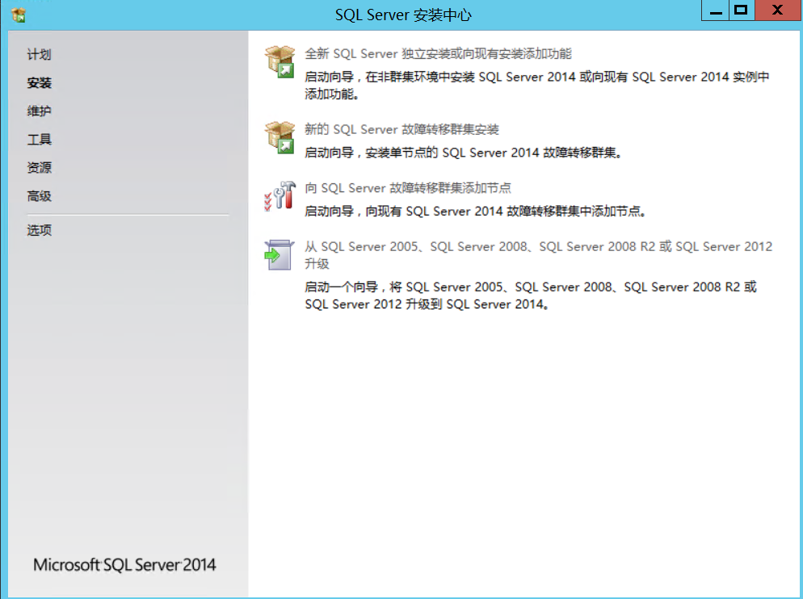
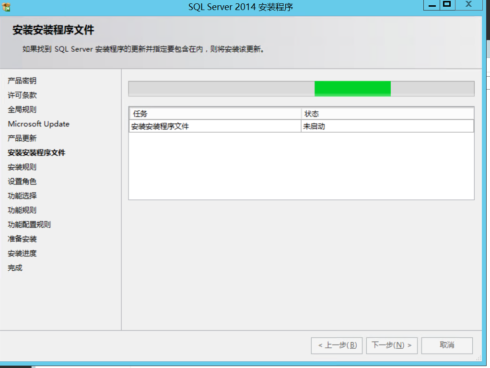
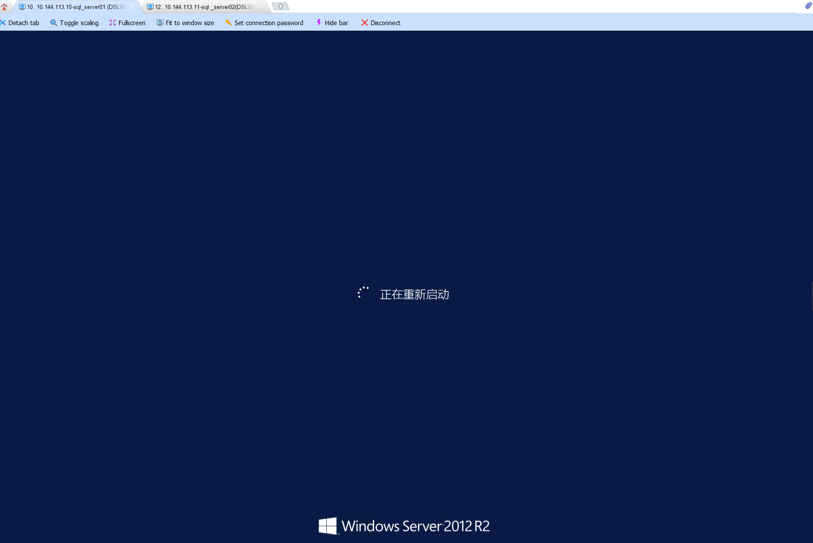

# SQL-Server安装最佳实践

## 全新安装（单机安装）

最简单、最常见的SQL-Server部署方式是使用安装向导提供的GUI进行手动。手动安装需要用户频繁参与，以提供完成SQL Server2014安装所需的信息和参数值。

    (1)从SQL-Server2014安装媒介中启动Setup.exe。“SQL Server安装中心”将会打开

    (2)单击左侧的“ 安装” 选项卡， 然后单击右侧的第一个选项， 其标题为“ 全新SQL Server
    独立安装或向现有安装添加功能” 。SQL Server 2014 安装向导将会启动。
    
    (3)初始化安装操作会需要一点时间
    
    (4)对于某些安装媒体和许可协议， 可能需要选择SQL Server 的版本， 并在下一个屏幕中
    输入产品密钥。单击“ 下一步” 按钮继续。
    
    (5)“ 许可条款” 屏幕将会打开。接受许可条款， 然后单击“ 下一步” 。
    
    (6)“ 全局规则” 屏幕将会打开， 并自动前进到下一个屏幕。
    
    (7)“ Microsoft Update " 屏幕将会打开。组织应该确定一个最小版本号。不要选中这个复
    选框。单击“ 下一步” 。根据组织的指导原则将更新应用到SQL Server 。
    
    (8)“ 产品史新” 屏幕将会打开。单击“ 下一步” 继续。
    
    (9)“ 安装安装程序文件" 屏幕将会打开， 并进行到下一个屏幕。
    
    

    
    (10)“ 安装规则” 屏幕标识了安装支持文件时可能发生的问题。这一步完成后， 如果所有
    状态均通过， 就单击“ 下一步” 。
    (11)“ 设置角色” 屏幕将会打开。选择"SQLServer 功能安装” 选项， 然后单击“ 下一步” 。
    (12)“ 功能选择” 屏幕将会打开。选择“ 数据库引擎服务” 和“ 管理工具． 基本” ， 然后单
    击“ 下一步" 。如下图显示了SQL Server 2014 中可以安装的功能列表。

SQL Server安装完毕之后如下图所示：

## 安装SQL Server集群

① 挂载华为的OceanStor 5600 V3 存储磁盘

② 在第一台机器上插入光驱和SQL-Sever2014光盘，点击setup.exe进行安装

③ 检测故障转移集群规则是否满足SQL Server集群的规则

④ 安装SQL Server实例名和设置网络名称，实例配置

⑤ 集群资源组

⑥ 集群磁盘选择

⑦ 集群网络配置

⑧ 服务器配置

⑨ 数据库引擎配置

⑩ Analysis Services 配置

* 安装进度

* 安装完成

## 添加SQL Server集群

1.向集群中添加SQL Server节点

2.安装程序文件、添加节点规则

3.群集节点配置

4.集群网络配置

5.服务账户

6.添加节点进度

## SQL Server集群测试切换
### 10.144.113.10（WIN-SQL01） 节点1

故障转移节点情况,存储实例的磁盘在节点1（WIN-SQL01）上。

实例的运行状态为

存储磁盘状态

### 10.144.113.11 （WIN-SQL02）节点2

故障转移节点情况,存储实例的磁盘在节点1（WIN-SQL01）上。

实例的运行状态为

存储磁盘状态

节点1上使用SQL Server客户端连接8个实例，进行登录测试，如图：

### 验证切换1
    重启节点1，模拟机器宕机
    前提：两台服务器之间网络正常访问
    

（WIN-SQL02）节点2上查看故障转移集群和磁盘纳管情况如下：

（WIN-SQL02）节点2上实例状态全部变成运行中，如图：

节点2上使用SQL Server客户端连接8个实例，进行登录测试，如图：

### 验证切换2
    重启节点2，模拟机器宕机
    前提：节点1服务器已经启动，修复硬件完成。

群集目前在节点2，如图：

* 进行重启节点2

* 故障转移已经将SQL集群切换到节点1，如图：

* 所有实例的运行状态，全部为运行中

    

验证结果：

    当群集在节点 1 时，我们可以正常访问数据库，
    如果节点1的服务器出现宕机时候，存储数据实例的磁盘会通过故障转移集群自动切换到节点2.
    同时数据库集群实例也自动进行切换，节点2实例全部启动，客户端访问无明显感知后端数据库的变化。

