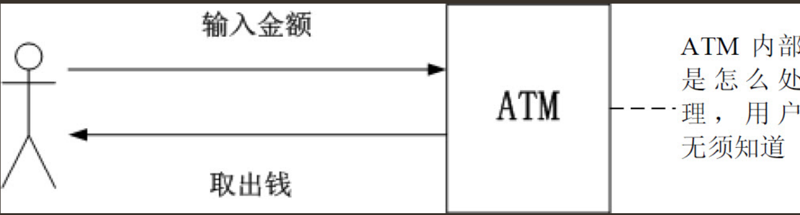
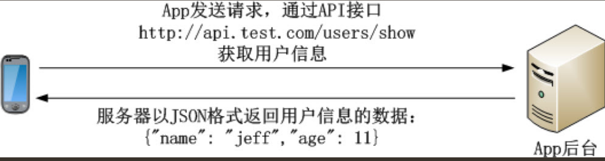

# APP后台入门

## App和App后台的通信

### 1．用HTTP协议还是私有协议？
``` 
使用私有协议就相当于使用暗语通信，其类似于开发一套新的语言。
私有协议对协议的封装和拆解工作量大，App程序员和后台程序员都要增加额外的工作量，
而且私有协议对程序员的设计能力要求高，从Web网站转向移动开发的开发者上手有一定的困难。
除非开发者对App的安全性和性能要求高，不然选择HTTP协议就足够。
```
### 2．App和App后台通信使用长连接还是短连接？
``` 
假设读者通过手机拨打另外一个人的手机，手机通话费用非常便宜（甚至可以忽略），但这个打电话过程有两个特点。

（1）一部手机同一时间只能接听一个电话。
（2）一部手机接听电话前非常麻烦，要拨号，要等接接听，这些过程需要耗费一段时间。

App和服务器通信使用长连接还是短连接这个问题，
可以使用上述的手机拨打电话的模型理解：是一直保持着通话，还是有需要时才拨号通话？


当App和服务器通信使用长连接，就相当于一直保持着通话，服务器能保持的通信数量有限，
如果达到通信数量的限制，必须增加服务器才能让其他App继续和后台通信。
这种通信方式，多数是使用Socket或WebSocket连接长时间连接，对程序员的素质要求高，开发困难，除了手游和聊天推送服务外，不建议使用。


当App和服务器通信使用短连接，就相当于需要时才拨号通话。
这种通信方式主要是HTTP协议，是现在主流的通信方式，开发效率高，有大量的第三方软件可供开发人员使用，
而且大多数开发人员对HTTP协议有一定的了解，能大大减少开发人员的认知成本，推荐使用这种方式。
```

### 3．App和后端是怎么通信的？
``` 
相信读者都用过银行的柜员机（ATM）的查询余额、转账、取款等功能。

当用户在ATM取款时只需要输入取款的金额，隔一会儿钱就出来，如果因为有什么问题不能取款（例如超过取款金额的限制），屏幕上也会显示出错误的信息。

在整个过程中，用户只要输入金额就能获得结果（取出钱或屏幕提示不成功），至于柜员机内部是怎么处理，用户不需要知道。
ATM这种把内部的处理遮蔽的做法极大方便了用户的使用。
```


同样在App后台也只提供了一系列的功能给App使用，这系列的功能以API的形式提供。

API的定义：

```
API（Application Programming Interface，应用程序编程接口）是一些预先定义的函数，
目的是提供应用程序与开发人员基于某软件或硬件得以访问一组例程的能力，而又无须访问源码，
或理解内部工作机制的细节。
```

用户使用ATM的流程



当App调用后端提供API的时候，只需要明确下面3点：
```
（1）这个API的用途：在ATM的例子中，是取款，还是查询余额，还是转账？

（2）输入什么：在ATM的例子中，使用取款功能要输入金额。

（3）结果是什么：在ATM的例子中，取款是成功还是失败？

至于API内部是怎么处理，App无须知道。
```

### 4．后端是返回给API的数据格式
API一般是以HTTP的形式调用的，通过HTTP传入参数返回数据。那么，App后台以什么样的格式返回数据呢？
```
JSON（JavaScript Object Notation）是一种轻量级的数据交换格式。 
JSON采用完全独立于语言的文本格式，但是也使用了类似于C语言家族的习惯（包括C、C++、C#、Java、JavaScript、Perl、Python等），这些特性使JSON成为理想的数据交换语言。同时JSON易于阅读和编写，也易于机器解析和生成
```

App和App后台的通信过程



## App后台和Web后端的区别

### 1．App后台要慎重考虑网络传输的流量，主要在API设计、图片处理上
``` 
API的返回结果一般是JSON格式，使用JSON格式的一个重要原因是，同样的内容，用JSON格式更省流量。

App下载的图片也一样，一个节省流量的处理方法是让App下载经过压缩的图片（一般是几十KB以下），
当用户需要查看原图时才下载原图。
```

### 2．移动手机弱网络环境
因此App后台发给App的信息是无法保证一定到达App的，极有可能的情况是：当App后台发送信息的时候App是连接网络的，但发送的过程中网络断开了，这样App就无法收到消息。

### 3．手机电量有限
```
普通的手机电池被充满后能用一天左右，如果在App端做大量的网络请求和运算，手机的电量将消耗得很快。
但如果把所有的运算都集中在App后台，也会增加App后台的负担，严重的话会造成服务器宕机。
```
这两者之间的平衡，需要研发人员在项目中仔细斟酌。

## 选择服务器

### 1．是选择传统的IDC还是云服务器

#### 传统的IDC
``` 
App产品经常会出现在毫无征兆的App访问量爆发的情况。如果出现了App访问量爆发的情况，解决访问的压力最快、最有效的方法是升级服务器的硬件，如升级CPU，升级内存容量或者升级带宽。

传统的IDC要升级CPU或升级内存容量的流程如下。

· 和客户经理商谈所需硬件的价格或在线选择具体的配置。
· 在线支付或银行转账。
· 确认钱到账后，等待IDC安排工作人员升级硬件。
在这个流程中由于需要人工的介入，很难做到几分钟内完成升级硬件。
```
#### 云服务
``` 
使用云服务器升级硬件就很简单，流程如下。

· 在用户后台选择升级后的硬件配置。
· 通过网络支付。
· 重启服务器，升级就完成了。如果只是升级带宽，甚至不用重启服务器。
整个过程算起来不用5分钟，简单、快捷、方便。

而且现在的云服务提供商除了提供服务器外，还提供下面这些服务。

· 负载均衡。
· 云数据库。
· 云内存存储。
```
App上线初期，一般开发者都在一台服务器上搭建所有的服务，但随着App的发展，
这些服务需要部署在不同的服务器上。

云服务器的优点：
``` 
云服务的优点，由云服务器的提供商来负责运维，高可用、高并发、监控报警等方面都能靠云服务器提供商保障，
企业使用云服务就能大大减轻运维方面的压力和研发的成本。
```

### 建议
不过笔者建议项目初期的硬件配置可以稍为逊色点，随时监控主机资源的状态，
当预估当前的配置不能应付业务上的需求时就考虑升级硬件，毕竟现在升级或者购买云服务器都非常方便。


## 选择编程语言

### 1．每种编程语言都有自己擅长的业务场景和性能特性
``` 
例如开发聊天服务器，选择了PHP开发那真的太不合适，PHP这种语言怎么能适合聊天服务？

假如选择开发Web网站的编程语言，PHP比Golang合适多了。
```

### 2．选择开发效率最高的编程语言
``` 
笔者的答案是，选择开发效率最高的编程语言。开发效率高意味着能快速推进产品的研发，有利于产品的迭代，大大减少资金和时间成本，在项目初期，确保产品能活下去是开发人员考虑的第一要点。
```

### 3.一个大忌是用两套不同的编程语言维护一个相同的业务逻辑
```
不要用多种编程语言重复造轮子。业务逻辑一样就使用一种编程语言
```

### 4．一个系统中，不同的业务逻辑可以用不同的编程语言实现
``` 
例如，Web网站部分可以使用PHP，推送服务器部分可以使用Golang或者Erlang实现等。
```

## 快速入门新技术
在认识一个新的事物时，一个特点就是“从整体到局部”。如果只是“只见树木不见森林”，就容易迷失在无数的细节当中。

对于软件技术来说，核心问题就2个。
```
· 软件的适用场景。
· 软件的运行原理。
```

### 4种快速入门新技术的方法

1．阅读软件安装的README文件和INSTALL文件
``` 
很多软件的安装包中都有个“README”文件，顾名思义，其名字已经提示让开发者去阅读，
这个文件是非常重要的。这个文件中有关于这款软件的详细的功能说明。

INSTALL文件是关于这款软件最简单的安装方法，里面描述了这款软件是怎么运行起来的。
```

2．阅读官网的文档

3．阅读源码里的example文件夹
``` 
某些开源软件的开发者会在源码中附上代码例子，放在example文件夹、test文件夹，或其他文件夹里。开发人员仔细阅读这些代码也能快速入门新的技术。
```

4．在搜索引擎网站中搜索
``` 
例如需要搜索Redis的入门教程，那就使用关键字“Redis入门教程”或“Redis教程”
在搜索引擎网站中搜索相关的教程。
```


## App是怎样炼成的

### 1.项目启动阶段

产品经理根据以上的这些想法画出原型图。
``` 
原型图一般是用Axure这款软件制作的。
产品经理用Axure制作完原型图后把原型图导出为一堆HTML文件，
在浏览器中打开index.html文件就能看到原型图。
```

原型图只是简单描述了App的基本界面，界面极其简陋。
开发人员依靠这份原型图是很难开发App的（如果完成了原型图就着手开发也行，只是研发人员在估算开发界面所需的工作时间上会非常不准确）。


原型图出来后，产品经理就把原型图交给UI设计师出设计稿。

UI设计师开始根据自己的美术功底美化原型图：
```
给里面的每个元素都配上合适的颜色；调整整个界面的布局，
按钮的大小、位置、颜色等，务必使整个界面看起来更美观；标示里面的文字的坐标、使用的字体等。

甚至有的UI设计师还要负责设计交互，例如，A界面是怎么跳到B界面，是从上往下跳转，还是从下往上跳转。

```
当UI设计师出了设计稿后，产品经理和整个项目相关的人员开产品会议。
产品会议里，产品经理亲自介绍原型图，把整个产品的业务逻辑用原型图向相关的人员演示，
还有回复大家对产品的疑问。

`此会议非常重要！保证整个团队对这个产品的理解一致，从而确保接下来开发工作顺利进行。`

产品会议后，相关的人员领取属于自身的任务（或者由上级分派），相关的人员同时估算研发时间，
研发总监或技术总监根据各估算时间制定安排工作计划。


### 2.研发阶段

后台开发人员根据产品和业务的需求设计后台的架构。

当后端的架构设计完成后，后端开发人员通过下面3点先初步设定API接口。
``` 
· API是有什么用的？
· API的输入参数是什么？
· API返回什么数据？
```

后台研发人员对Android研发人员和iOS研发人员说明其设定的API接口，让其了解相关内容。

这些API接口初期先不用实现其功能，只需要返回一些测试的数据以便前端人员开发，后台研发人员在研发的过程中慢慢把这些接口的功能实现。这样前端和后端的开发进度都不会耽误。

```
当然，这些API接口以后不排除有改动的可能，为了保证信息的通畅，
任何对API接口的改动请及时通知相关人员。
```
### 3.测试阶段
当制订开发计划时就应该规划功能测试周期，一般是一个月测试一次为宜。

如果开发了两三个月才测试一次，那么积累的问题会非常多，如果对某个业务理解错误，那么过长的研发周期也会使建立在错误业务上的其他业务难以修复。
``` 
创业团队中大多数情况下没有配备专门的测试人员，更多的情况是“人人都是测试员”。
```

## 3.正式推出阶段

App测试完毕后就开始准备上架。

如果是iOS应用，就提交到App store审核，需要7～15个工作日。

如果是Android应用，就提交到各个应用市场，例如，小米应用市场、豌豆荚、应用宝等。

``` 
· 提交到各个应用市场，潜在用户也未必发现这个App？
· 怎么让更多的用户了解这个App？
· 用户了解这个App后怎么让用户下载？
· 怎么保证用户经常使用App，增加用户的黏性？
```

创业团队中的职权很难分清，例如在创业团队中，
App后台人员都要兼职做运维，甚至是前端，理由很现实：没额外的资金聘请人员负责这些工作，
但这些工作总要做，最后就只能由App后台人员兼任。

在创业团队中工作能力成长快，大量的问题都要开发人员处理，同时在创业团队里对人员技能要求比较高，要一专多长，
可能需要经常加班。


