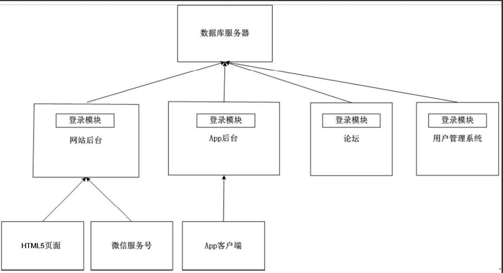
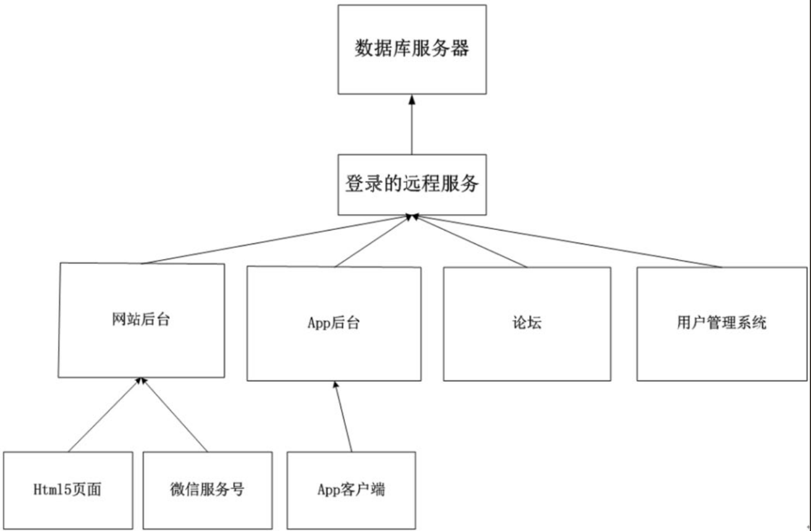

# APP后台基础技术

## 如何选择合适的数据库产品
在App后台开发中经常面临的问题是：用什么数据库产品存储数据?是选择MySQL ？Redis？还是MongoDB？

### Redis，MongoDB，MySQL读写数据的区别
数据涉及读和写这两个问题。出于性能的考虑，当然希望读和写的速度越快越好。

计算机中常见的存储设备是内存和硬盘，其特性如下。

``` 
·内存的读取速度大概是硬盘的80倍。因此为了获得更快的读写速度，数据尽可能放在内存。
·内存的容量有限。例如UCloud服务器最多只能拥有64G的内存，而UCloud服务器上的单个硬盘可高达1000G。
```

Redis的数据是存放在服务器的内存，当内存用满了后需要扩容，就只能使用Redis的分布式方案。
为了防止断电或Redis程序重启造成内容数据的丢失，可调整Redis配置文件，按照一定的策略把数据持久化传到硬盘。


 
MongoDB同时使用了硬盘和内存，其使用了操作系统提供的MMAP（内存文件映射）机制进行数据文件的读写，MMAP可以把文件直接映射到进程的内存空间中，
这样文件就会在内存中有对应的地址，这时对文件的读写是能通过操作内存进行的，
而不需要使用传统的如fread、fwrite文件操作方式。


MySQL的数据是放在硬盘中。虽然MySQL也有缓存，但MySQL缓存的是查询的结果，而不是缓存数据。

### Redis，MongoDB，MySQL查找数据的区别
``` 
如果读者需要在一栋大楼里找某个房间，但是读者不知道这个房间的门牌号，只记得这个房间的门是非常特别的，那找到这个房间唯一的方式只能每层楼逐个房间找一次，比较一下房间的门和记忆中房间的门是否相同。

如果读者知道这个房间的门牌号，那很简单，直奔那个楼层就行了。
```
```
Redis的数据是基于“键值对”存储，“键”相当于门牌号，“值”相当于房间。
Redis查找数据，每次都是直奔目标，读写速度当然快。
```

```
MongoDB和MySQL中，每组数据都有一个id（或者可以为每组数据建立索引），这个id或索引就相当于门牌号。
```

``` 
MongoDB和MySQL中查找数据，有两种模式：知道id或索引，不知道id或索引。知道id或索引的情况就相当于知道门牌号，直奔目标就行，效率高。
如果不知道id或索引的情况下查找数据，那就相当于在每层楼逐个房间找，效率低。
```

### Redis，MongoDB，MySQL适用场景
#### 1．Redis适用场景
``` 
数据读写速度快，但由于Redis数据只存放在服务器的内存（可采用Redis的分布式方案扩容），内存的价格高，所以用内存存储数据成本高。

同时由于Redis存放的数据必须是键值对（key-value）的形式，在读写Redis数据时必须要知道所读写数据的键，这点读者在使用Redis时需要考虑。

所以在App后台中，读写频率高的数据一般都会放在Redis中（当然这部分数据也可以同时存放于MySQL或者MongoDB，Redis中的数据是以缓存的形式存在的，当数据更新的时候，两部分都要更新以保持数据的一致性）。
```
例如API中附带了用户的身份信息，由于每次API操作都需要验证用户的身份信息，这些身份信息的数据存放在Redis中就非常合适，因为验证用户信息是个频率非常高的操作。

#### 2．MongoDB适用场景
MongoDB适用于下面的场景。
``` 
·网站数据：MongoDB非常适合实时的插入、更新与查询，并具备网站实时数据存储所需的复制及高度伸缩性。
·大尺寸、低价值的数据：使用传统的关系数据库存储一些数据时可能会比较贵，在此之前，很多程序员往往会选择传统的文件进行存储。
·高伸缩性的场景：MongoDB非常适合由数十或者数百台服务器组成的数据库。
·存储地理坐标的数据：MongoDB的地理坐标查询功能非常强大，例如，MongoDB可以查找在某个矩形范围内的所有坐标，因此MongoDB非常适合于LBS应用。
```
MongoDB不适用于下面的场景
```
·MongoDB不支持事务
·传统的商业智能应用：针对特定问题的BI数据库会产生高度优化的查询方式。对于此类应用，数据仓库可能是更合适的选择。
·需要SQL的问题：虽然MongoDB支持类似于SQL的查询方式，但它的查询比起MySQL还是有一定的差距。
```

#### 3.MySQL适用场景
``` 
·事物性的系统。例如，在MongoDB中举的转账例子。
·需要复杂SQL的问题。
```


## 如何选择消息队列软件

### 为什么要用消息队列？
在某个公司里，一个管理者接到上级的任务。管理者在完成这个任务时，把这个任务分解为几个小任务，只要分别完成了这几个小任务，整个任务也就完成了。

在上面的例子中，管理者就是App后台，下属就是消息队列，当后台系统发现完成某些小任务需要花很多时间，而且迟点完成也不影响整个任务的完成进度时，就会把这些小任务交给消息队列。

```
在App后台中，发送邮件、发送短信、推送消息等任务都非常适合在消息队列中处理。
读者想想这些任务是不是都需要花比较多的时间，而且迟点完成也不影响的。
把这些任务放在消息队列中，可加快App后台请求的响应时间。

同时消息队列也能把大量的并发请求变成串行的请求，来减轻服务器的负担。
```

### 消息队列的工作流程
消息队列一般都包含3个角色：`队列服务端`，`队列生产者`，`队列消费者`。


现在有大量开源的应用可作为消息队列的服务端，例如`RabbitMQ` ，`ZeroMQ` ，`Redis`等。

App后台把消息推入到消息队列，这里App后台是充当队列生产者。

守护进程（可以理解为专门处理消息的工人，即队列消费者）不断地检测消息队列中有没有新的消息，
没有消息就休息一会儿再检测消息队列中有没有新的消息（这样做能避免消息队列占据过多的服务器资源），
有消息的话就从消息队列取出消息，用新的线程处理相关的业务，在主进程中继续检测消息队列是否有新消息。

消息处理流程如图

消息处理流程


### 常见的一些消息队列产品

#### 1．RabbitMQ
RabbitMQ是使用Erlang编写的一个开源消息队列，其支持大量的协议：AMQP、XMPP、SMTP、STOMP。
也正是如此，使得它变得非常重量级，更适合于企业级的开发。
RabbitMQ同时实现了一个经纪人（Broker）架构，这意味着消息在发送给客户端时先在中心队列排队。
RabbitMQ对路由（Routing）、负载均衡（Load balance）或者数据持久化都有很好的支持。

同时RabbitMQ自带了一个Web监控界面，可方便监控队列的情况。

#### 2．Redis
Redis虽然是一个key-value系统，但其也支持队列这种数据结构，可看作是一个轻量级的消息队列。
在App后台架构中Redis被广泛使用，如果把其作为消息队列，能减少项目中的运维成本。

#### 3．ZeroMQ

ZeroMQ号称为最快的消息队列，尤其针对大吞吐量的需求场景。

#### 4．ActiveMQ
ActiveMQ是Apache软件基金会下的一个子项目，类似于ZeroMQ，它能够以代理人和点对点的技术实现队列。


## 使用分布式服务实现业务的复用
随着业务不断增加，后台系统由一个单一的应用慢慢膨胀为一个巨无霸系统，
具体表现为系统中聚合了大量的应用和服务，各个模块之间有很多功能重复实现，造成了开发、运维、部署的麻烦。

### 巨无霸系统的危害

#### 1．维护上的麻烦
系统里面有许多行代码，可能因为历史的原因同一个功能在不同的模块上重新实现了一次。

如图下图所示是一个已经膨胀起来的系统，在网站后台、App后台、论坛、用户管理系统中都分别实现了用户登录功能。


如果是一个新任职的员工，其不熟悉这4个模块，这表示程序员需要去分别读懂这4个模块的代码中用户登录的逻辑才能修改。

更悲观的情况是，如果有的模块是用Java语言实现，有的是用Python语言实现，有的是用PHP语言实现，这表示还需要一个了解这3种语言的程序员才能修改其代码，那就更加麻烦了。


#### 2．代码管理上的不方便
模块由多个团队维护很容易造成MERGE时代码的冲突。当发布的时候，因为代码的冲突，
往往会造成整个团队紧张兮兮，还要找相关的开发人员去搞明白冲突应该怎么处理，造成了极大的不便。


#### 3．数据库连接资源的耗尽
大量应用中的重复模块会带来大量的访问，而每个应用与数据库的连接，一般是使用数据库的连接池，
这个连接池的资源一般是不释放且一直保留着。假设连接池中有10个连接，在一个数百的服务器集群中，
就占用了数据库1000个连接。数据库中的每个连接都是十分珍贵的资源，在资源有限的情况下，这里被占用了，
其他能用的资源就少了。


### 远程服务的优点
解决这些问题的方法是把重复实现的模块独立部署为远程服务，新增的业务调用远程服务所提供的功能实现相关的业务，不依赖于里面具体的代码实现。当远程服务里面的业务需要发生变化时，只要接口的传入参数和返回值保持不变，就不会影响到调用这些远程服务的业务。

使用远程服务后的系统


如图登录模块已经独立出来，如果业务上修改登录的逻辑，只需要修改登录模块中的代码，不影响到网站后台、App后台、论坛、用户管理系统这4个模块。


### 远程服务的实现

#### 1．REST
这个服务不太懂，后续百度查


### 2．PRC

RPC（Remote Procedure Call Protocol）——远程过程调用协议，其是一种通过网络从远程计算机程序上请求服务，而不需要了解底层网络技术的协议。它假定某些传输协议的存在，如TCP或UDP，以便为通信程序之间携带信息数据。通过其可以使函数调用模式网络化。

在OSI网络通信模型中，RPC跨越了传输层和应用层。RPC使得开发包括网络分布式多程序在内的应用程序更加容易。RPC的原理如图

RPC的调用过程如下。
```
（1）客户端通过接口传送参数，把参数传送到网络。
（2）服务端的对外接口通过网络接收参数。
（3）服务端把参数传递到实现函数。
（4）实现函数实现相关的功能，把返回的数据返回到对外接口。
（5）对外接口把返回数据传送到网络。
（6）客户端接口接收到网络返回的数据。
```

### 3．开源的RPC库
先介绍一个轻量级的RPC库：`Hprose`（High Performance Remote Object Service Engine，http://hprose.com/）是一款先进的轻量级、跨语言、跨平台、无侵入式、高性能动态远程对象调用引擎库。其不仅简单易用，而且功能强大。

这个开源的PRC库已经实现了所有主流语言的服务端和客户端的RPC，开发者只需要简单地调用就能构建RPC服务。


另外一个是阿里巴巴的开源的`Dubbo`，其是一个分布式服务框架，致力于提供高性能和透明化的RPC远程调用服务和SOA服务治理方案。

当当网在Dubbo的基础上实现了如下的新功能，并将其命名为`Dubbox`。

```
·支持REST风格远程调用（HTTP + JSON/XML)。
·支持基于Kryo和FST的Java高效序列化实现。
·支持基于嵌入式Tomcat的HTTP remoting体系。
·将Dubbo中Spring由2.x升级到目前最常用的3.x版本。
·将Dubbo中的ZooKeeper客户端升级到最新的版本，以修正老版本中包含的bug。
```

## 搜索技术入门
App最常见的搜索情景就是搜索用户。只有几百、几千的用户量时，可以直接用MySQL like这种模糊查询，但是，如果数据有几百万，甚至上千万的时候，一次like查询就能让数据库堵了。因此数据到了一定量级的时候，不得不考虑使用搜索技术。


### 常见的开源搜索软件介绍
搜索技术一点都不简单，如果要研发人员从头开始做，不知道要到哪年哪月才能用给App加上搜索功能。幸好，计算机高手们已经开源大量的搜索软件，只要读者会使用这些搜索软件提供的API，就能给App后台加上搜索技术。下面简单介绍一下常见的搜索软件。

#### 1．Lucene
Lucene是一套用于全文检索和搜寻的开源程式库，由Apache软件基金会支持和提供。
Lucene的目的是为软件开发人员提供一个简单易用的工具包，以方便在目标系统中实现全文检索的功能，或者是以此为基础建立起完整的全文检索引擎。Lucene提供了一个简单却强大的应用程式接口，能够做全文索引和搜寻。在Java开发环境里Lucene是一个成熟的免费开源工具。就其本身而言，Lucene是最近几年很欢迎的免费Java信息检索程序库。


#### 2.Solr
Solr是一个高性能，采用Java5开发，基于Lucene的全文搜索软件，同时对其进行了扩展，提供了比Lucene更为丰富的查询语言，同时实现了可配置、可扩展并对查询性能进行了优化，并且提供了一个完善的功能管理界面，是一款非常优秀的全文搜索引擎。
它对外提供类，它对外提供类似于Web-Service的API接口，用户可以通过HTTP请求向搜索引擎服务器提交一定格式的XML文件，生成索引；也可以通过HTTP Get操作提出查找请求，并得到XML格式的返回结果。

#### 3．ElasticSearch
ElasticSearch是一个基于Lucene的搜索服务器。它提供了一个分布式多用户的全文搜索引擎，基于RESTful Web接口。ElasticSearch是用Java开发的，并作为Apache许可条款下的开放源码发布，是第二流行的企业搜索引擎。

#### 4．Sphinx
Sphinx是一个基于SQL的全文检索引擎，其结合MySQL、PostgreSQL做全文搜索，可以提供比数据库本身更专业的搜索功能，使得应用程序更容易实现专业化的全文检索。Sphinx特别为一些脚本语言设计搜索API接口，如PHP、Python、Perl、Ruby等，同时为MySQL也设计了一个存储引擎插件。

## 定时任务

### Linux定时任务Crontab
在Linux使用`“Crontab–e”`就能创建定时任务。
定时任务写入到/var/spool/cron/中

Crontab命令的语法如下。

    crontab [-u username] [-l|-e|-r]
    参数：
    -u ：只有 root 才能进行这个任务，编辑某个用户的crontab
    -e ：编辑 crontab 的工作内容
    -l ：查阅 crontab 的工作内容
    -r ：移除所有的 crontab 的工作内容。
 
 
数字栏特殊字符的含义
```
特殊的符号                       含义  
*                   任何时刻都接受，例如：* * * * * cmd表示每分钟都运行cmd |
，                  表示有多个时间段，例如：2,4 * * * * cmd表示第2，第4分钟都运行cmd |
-                   表示时间间隔，例如：2-4 * * * * cmd表示第2至第4分钟每分钟都运行cmd |
/n                  表示隔n个时间单位，例如*/5 * * * * cmd表示每隔5分钟运行cmd |

```

运行定时任务的最少单位是分钟，如果需要运行秒级的定时任务.

一个取巧的方法

下面就是每20秒运行一次cmd的Crontab的做法。
``` 
    * * * * * cmd
    * * * * * sleep 20; cmd
    * * * * * sleep 40; cmd
```

### 在后台轻松管理各种各样的定时任务

#### 新的定时任务框架：

`Java下的Quartz或者Python下的APScheduler。`


