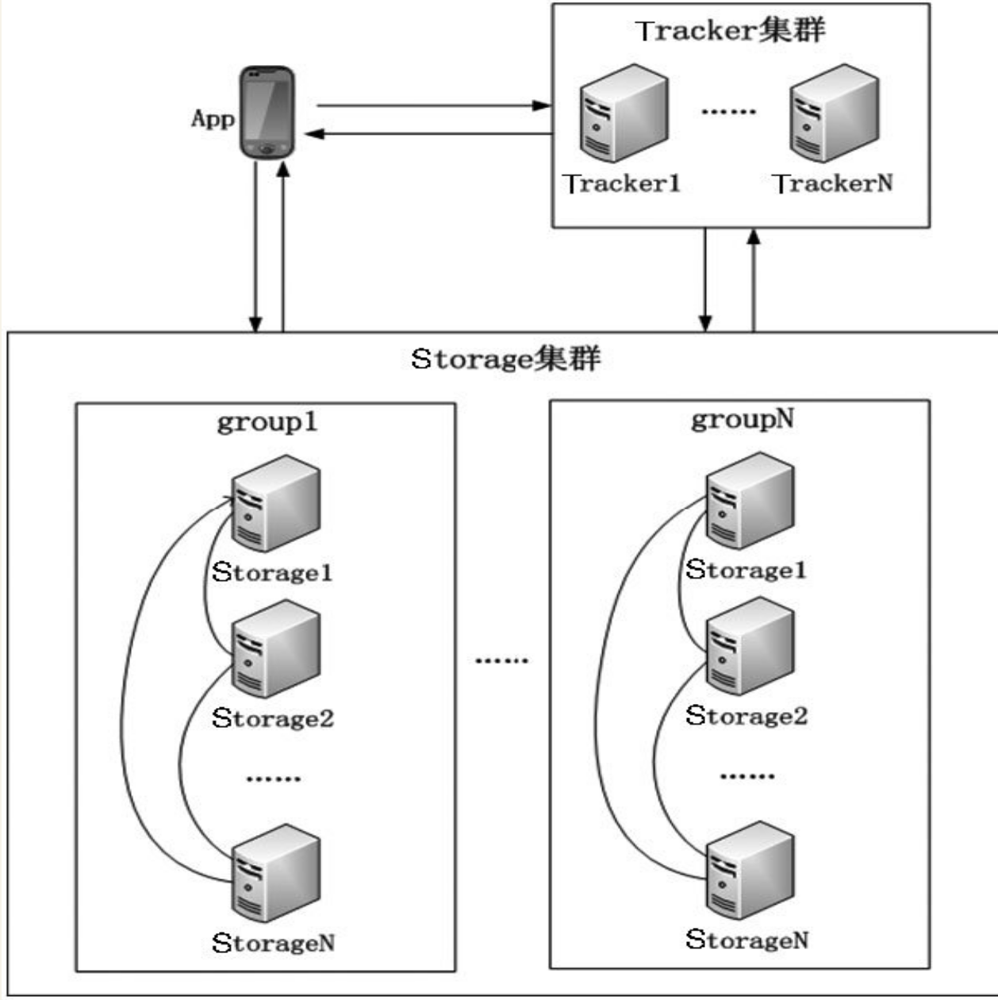
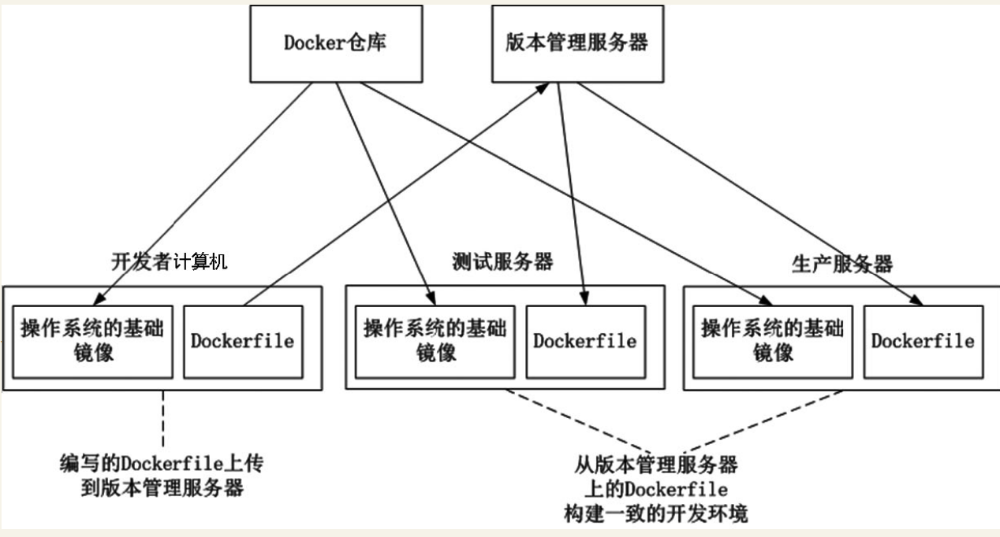

# APP后台核心技术


## 用户验证方案

### 使用HTTPS协议
可以把HTTPS大致理解为“HTTP over SSL”或“HTTP over TLS”。其是一个安全通信通道，基于HTTP开发，用于在客户计算机和App后台之间交换信息。其使用安全套接字层(SSL)进行信息交换，简单来说其是HTTP的安全版。HTTPS实际上应用了安全套接字层（SSL）作为HTTP应用层的子层。


### 基本的用户登录方案

传统Web网站使用Cookie+Session保持用户的登录状态，那么在App后台怎么实现类似的功能呢？在App后台怎么避免每次验证用户身份都需要传输用户名和密码呢？

计算机的操作如下：
``` 
（1）App后台接收到App发送的用户名和密码后，验证用户名和密码是否正确。如果错误则返回错误信息。如果App后台验证正确，生成一个随机的不重复的token字符串（例如“daf32da456hfdh”），token字符串作为用户的唯一标识（token就是上面例子中提到的钥匙）。在Redis中建立token字符串和用户信息的对应关系，例如，把token字符串“daf32da456hfdh”和id为“5”的用户对应。
（2）App后台把token字符串和用户信息返回给App，App保存这些数据作为以后身份验证的必备数据。
（3）需要验证用户身份的操作必须要把token字符串传给App后台验证身份。
（4）当用户退出登录时，通过调用退出登录的API，让App后台把这个用户对应的token字符串删除。
```
### App通信安全


#### URL签名
身份验证是依赖于token字符串。如果用户泄露了自己的URL,那很大程度上token也被别人泄露了。
因此不在网络上传输token就能在很大程度上防止token泄露。
不在网络上传输token的方案称为URL签名

URL签名的验证流程如下图所示。


URL防止黑客反复调用的改进。
改进方法是在传递的参数中增加时间戳，当App后台发现这个时间戳相隔当前时间很久的，就判断这个URL已经失效。

``` 
App端使用时间戳的一个问题是：App端的时间有可能和App后台的时间不一致。
保证App端时间和App后台时间同步的方法为：App每次启动时通过API获取App后台的时间，
保存App端时间和App后台的时间差，以后App端用这个时间差调整其生成的时间戳。
例如，某一刻API获取App后台的时间是1444692778，App端时间是1444692775，两者的时间差是3。
当App在本地时间1425860754准备向App后台发送API请求时，加上时间差3，
即可得到App后台的时间为1425860754+3=1425860757，1425860757即为参数中传递的时间戳。
```

## 短信服务
App后台发送短信的流程如图所示


UCloud、阿里云、腾讯云、青云、七牛云、紫光云等一系列云厂商都支持短信服务平台的提供

各位开发者在选择短信平台时一定要先试用，短信平台可以提供给开发者一定免费数量的短信，
记住，一定要亲自试用短信平台，别人推荐的平台，可能只是暂时有效，毕竟事物是不断变化的。

### 建立可靠的短信服务
推荐最可靠的做法是App后台必须要接入最少两个短信平台，当前使用的短信平台变得不可靠时，
立刻切换到另外一个短信平台发送短信，主要做法是通过配置文件控制App后台使用哪个短信平台。


## 处理表情的一些技巧

### 表情在MySQL的存储
表情UTF-8编码有的是3个字节，有的是4个字节，所以一般的UTF编码（长度只有3个字节）是没法存储表情数据的。

在网上看到一个常用的解决方案：

·把MySQL升级到5.5以上，然后把字符编码改为utf8mb4_general_ci。

·MySQL 5.1的表情存储方法：把含有表情数据的字段类型变为blob，没错，就是用二进制存储，这样就能在改动MySQL最少的情况下支持表情数据。


## 高效更新数据

### 内容的推拉
``` 
平常的App设计中，如果App需要知道首页是否有内容更新，通过一个轮询机制访问获取数据API，从API是否返回更新的数据得知是否有内容更新。

但是轮询的缺点也很明显。

·耗电。
·耗流量。

轮询是很典型的拉模式，每隔一段时间App向App后台发送请求获取数据。这样会耗费大量的网络流量，同时也增大了服务器的压力。
```

怎么才能减少轮询的次数？答案是通过推模式。每当App后台有数据更新，就通过推送系统通知App，当App收到这个数据更新的通知后再调用API获取相应的数据。


`推拉结合保证消息的完善`
当然了不能只用推模式，因为手机网络环境的复杂性，不能保证数据更新的通知一定能到达App，
所以也要采用轮询的方式定期拉数据。使用推拉结合时轮询的时间间隔可以设置得比较长，主要是为了以防万一。


## 图片处理

App上线后不断接收用户反馈，有的App经过一段时间的反馈和产品调整后会面临App改版的问题。

App改版一般会有比较大的UI改动，改动UI，那么图片的尺寸也必须改变。

建议是：
```
直接使用七牛或又拍等文件云存储服务，文件云存储不但可以加速图片的下载/上传，
也能实现图片的大量操作（例如图片裁剪、加水印等常用的操作）。图片的上传/下载速度是影响用户体验的一个重要部分！
````


## 视频处理
介绍一个视频处理最常用的工具：FFmpeg。

### FFmpeg简介
FFmpeg可以实现的功能有。
```
·视频采集。
·音/视频格式转换。
·视频抓图。
·加视频水印。
```

App后台要快速处理视频就需要高性能的服务器集群，但是对于创业型公司来说，
在服务器这方面的开支是非常不合算的。因此创业型公司可充分运用云服务，
例如七牛提供的服务就包含音/视频格式的转换，调用非常方便。


## 文件系统
笔者一向推崇创业公司的架构原则是`“尽量使用成熟可靠的云服务和开源软件，自身只专注于业务逻辑”`。

文件云存储服务的另外一个优势是上传/下载速度非常快，记得笔者第一次使用云存储下载文件时被吓住了，居然达到了10MB/s的下载速度，读者想想这么快的下载速度是多美好的用户体验！


### 架设文件系统

#### 1．分布式文件存储系统
推荐的分布式文件存储系统是`FastDFS`。

FastDFS是一个开源的轻量级分布式文件系统，其对文件管理功能包括：文件存储、文件同步、文件访问（文件上传、文件下载）等，解决了大容量存储和负载均衡的问题。
据笔者了解，FastDFS已经在UC、56、Kugou等互联网企业被广泛使用。


FastDFS的基本原理可以类比生活中的仓库：仓库里面有很多货柜用来存放货物，怎么能保证仓库里无论增加了多少货柜，货柜都能被合理使用呢？核心是每个仓库里都有一个仓库管理员，仓库管理员知道新增了多少货柜。当工人需要向仓库里放货物时，先问仓库管理员哪个货柜有足够的空间存放货物，仓库管理员在综合考虑货物的大小和各个货柜的剩余空间后，告知工人应该把货物搬到哪个货柜。

FastDFS就是上面例子中的仓库, FastDFS里有两大角色：
`跟踪器（Tracker）`和`存储节点（Storage）`。

跟踪器（Tracker）就是仓库管理员，主要做调度工作，在访问上起负载均衡的作用，

存储节点（Storage）就是货柜，工人就是向FastDFS存储文件的客户端。

```
存储系统由一个或多个group组成，不同的group之间文件相互独立，
所有group的文件容量累加就是整个存储系统中的文件容量。
一个group可以由一台或多台存储服务器组成，一个group下的存储服务器中的文件是相同的，
group中的多个Storage起到了冗余备份和负载均衡的作用。
```
FastDFS的架构如图:


#### 2．图片水印，缩放和裁剪
开发人员在App后台实现图片的裁切等功能，必须考虑图片操作是非常消耗CPU、内存等资源和占用大量的磁盘IO，所以选择图片处理工具要慎重！

笔者推荐使用GraphicsMagick作为图片处理软件，其是一个久经考验的软件，支持多个平台，支持多种语言客户端，处理速度快，消耗资源少，并且规模较大的图片网站如Flickr都在使用GraphicsMagick。


#### 3.CDN
CDN最大的作用是使图片、音频、视频等静态文件下载速度更快，用户体验更好。

App后台访问量大时通过CDN，可以把图片、音频、视频等静态文件请求提前响应，不让其到达应用服务器，也是一种应付高并发的方法。

现在除了传统的CDN服务商外，阿里云和UCloud等服务商也提供了CDN服务，同时七牛、又拍等文件云存储服务也具备了CDN的功能，上面这些服务都极大地方便开发者。

另外很多CDN服务商都提供图片的水印、缩放和裁剪功能，开发者直接使用这些功能就不需要在图片处理上投入开发成本。


## ELK日志分析平台
``` 
读者想象一下下面的场景：有个应用服务器集群里面有10台服务器，每台服务器都提供了API的接口业务，
其使用了负载均衡技术把API请求平均分发到每台服务器上，服务器会把处理流程记录在日志中。
由于应用服务器集群使用了负载均衡技术，当查找问题时开发人员根本不知道问题出现在哪台服务器，
因此开发人员不得不登录所有服务器去逐一查看日志，在这个集群中，开发人员需要分别查看10台服务器的日志。
如果集群中机器的规模达到100台，开发人员需要登录100台服务器查看日志，这太麻烦了！
```


### 基本模块

这个日志系统各模块功能如下。
```
·Logstash：收集处理解析日志。其中有两个角色：
·shipper，在产生日志的机器上运行，发送日志至indexer；
·indexer：接收并索引化事件。
·ElasticSearch：一个基于Lucene的分布式搜索服务，用来提供存储搜索。
·Kibana：一个开源和免费的工具，其可以汇总、分析和搜索重要数据日志并提供友好的Web界面，用来报警统计展示。
```


ELK收集和分析日志的流程如下。
```
（1）在需要收集日志的机器上运行Logstash（shipper），其用于监控、过滤并收集日志。
（2）Logstash（shipper）把符合条件的日志发送到缓冲队列Redis。
（3）Logstash（indexer）从缓冲队列Redis读取日志，将日志收集在一起交给搜索服务ElasticSearch。
（4）ElasticSearch把收集到的日志结合自定义搜索的规则索引起来。
（5）当用户需要在Kibana获取数据时，Kibana向ElasticSearch发送请求，在ElasticSearch的自定义搜索返回数据的基础上，以友好的页面展示给用户。
```

## Docker构建一致的开发环境
Docker是一个用于统一开发和部署的轻量级容器，让开发者打包其应用及相关的依赖包到一个可移植的容器，发布该容器到其他机器，就能很容易地实现应用的部署。


使用Docker构建一致的开发环境是依赖于Dockerfile：把编写完成的Dockerfile放置在版本管理服务器中，在不同的服务器上获取这个Dockerfile并运行就能构建相同的镜像，从而得到一致的开发环境。

用Docker构建开发环境流程



