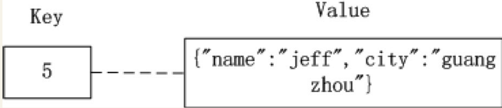
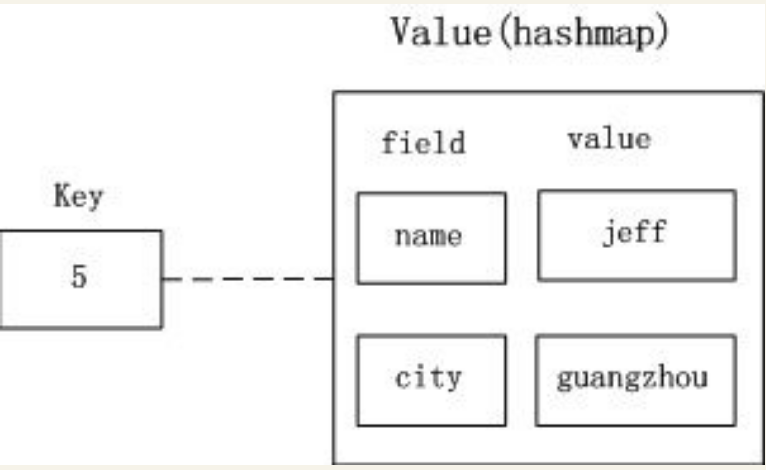
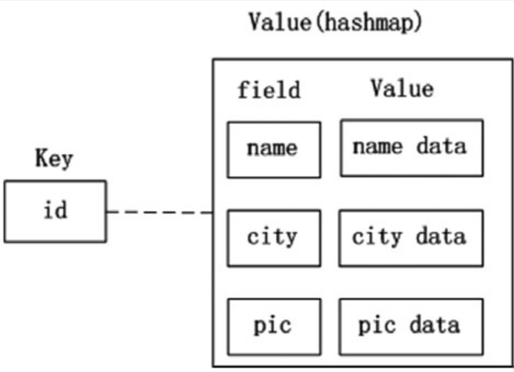
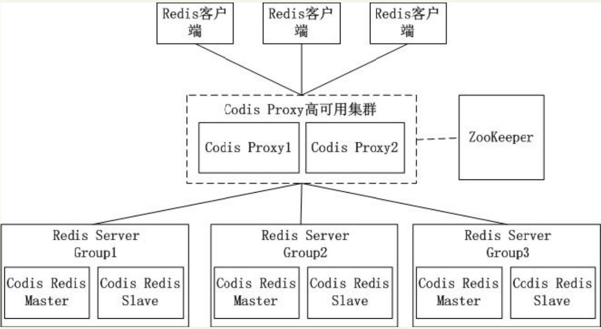
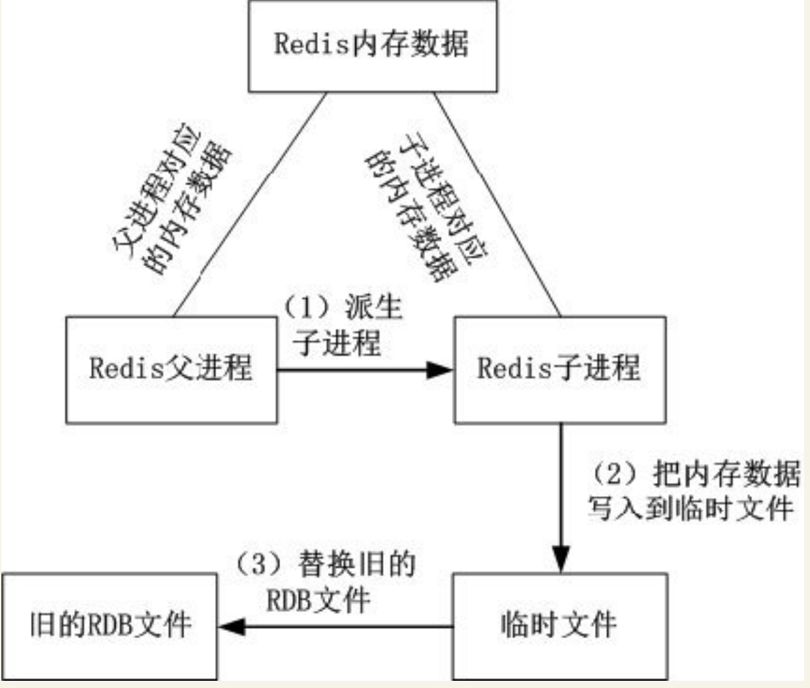

# Redis—App后台高性能的缓存系统
用户对App后台的响应速度要求越来越高。把数据存储在硬盘上，由于受到硬盘读写速度的限制，因此数据读写的速度有限。内存比硬盘的读写速度高了一个数量级，因此基于内存的数据读取也比硬盘提高了一个数量级，而Redis正是基于内存存储数据，保证了数据快速的读写速度。同时Redis提供了丰富的数据类型（string、hash、list、set及zset），给开发者带来了很大的便利。


## Redis简介

MySQL被广泛用于数据存储，但MySQL读写速度慢，随着移动互联网的发展，越来越多的业务场景需要满足下面的需求。
``` 
·少量数据需要被经常读写，同时对读写速度要求非常高。
·能提供丰富的数据结构。
·提供数据落地的功能。
```

所下表所展示了计算机中主要存储介质的访问速度。

计算机中主要存储介质的访问速度

介质 | 时间
---|---
内存寻址 | 100纳秒
从内存中顺序读取1MB的数据 | 	250000纳秒
磁盘寻址 | 	250000纳秒
从磁盘中顺序读取1MB的数据 | 	20000000纳秒

从内存中顺序读取1MB的数据耗时250000纳秒，从磁盘中顺序读取1MB的数据耗时20000000纳秒，内存的读取速度是硬盘的读取速度的80倍。因此可以通过把内存数据存储在内存来提升系统的性能

Redis就是一个满足上面需求的开源Key-Value内存存储系统。Key-Value存储系统在写入的时候，通过指定Key及其对应的Value；读取的时候，通过指定Key就能读取Value的值。Redis有以下的特点

``` 
·全部的数据操作在内存，保证了高速的读写速度。
·提供丰富多样的数据类型：string、hash、list、set、sorted set、bitmap和hyperloglog。

MySQL被广泛用于数据存储，但MySQL读写速度慢，随着移动互联网的发展，越来越多的业务场景需要满足下面的需求。

少量数据需要被经常读写，同时对读写速度要求非常高。
能提供丰富的数据结构。
提供数据落地的功能。
如表7-1所示展示了计算机中主要存储介质的访问速度。

表7-1　计算机中主要存储介质的访问速度

介质	时间
内存寻址	100纳秒
从内存中顺序读取1MB的数据	250000纳秒
磁盘寻址	10000000纳秒
从磁盘中顺序读取1MB的数据	20000000纳秒
读者在表7-1中可了解，从内存中顺序读取1MB的数据耗时250000纳秒，从磁盘中顺序读取1MB的数据耗时20000000纳秒，内存的读取速度是硬盘的读取速度的80倍。因此可以通过把内存数据存储在内存来提升系统的性能。

Redis就是一个满足上面需求的开源Key-Value内存存储系统。Key-Value存储系统在写入的时候，通过指定Key及其对应的Value；读取的时候，通过指定Key就能读取Value的值。Redis有以下的特点。

·全部的数据操作在内存，保证了高速的读写速度。
·提供丰富多样的数据类型：string、hash、list、set、sorted set、bitmap和hyperloglog。
·提供了AOF和RDB两种数据的持久化方式，保证了Redis重启后数据不丢失。
·Redis的所有操作都是原子性，同时Redis还支持对几个操作合并后的原子性操作，也即支持事务。
```
Redis丰富多样的数据类型给数据存储提供了一种新的思路，其让广大的开发者存储数据的时候，不用再面对功能单一的数据库，开发者能利用Redis提供的灵活多变的数据结构和数据操作更巧妙地存储数据。

## Redis的常用数据结构及应用场景
Redis 5种常用的数据结构（string、hash、list、set、sorted s et），以及这些数据结构所适用的业务场景。

### string——存储简单的数据

#### 1．简介
string类型是Redis中最基本的数据类型，其在Redis中是二进制安全，意味着这种数据类型可以接受任何格式的二进制数据，例如一张JPEG格式的图片或者JSON格式的字符串。在Redis中字符串类型最多可以容纳的数据长度是512MB。

#### 2．数据模型
string类型是基本的Key-Value结构，Key可以看作某个数据在Redis中的唯一标识，Value是具体的数据。下表展示了基本Key-Value数据模型：

基本Key-Value数据模型

Key | Value
---|---
“name” | "hujianli"
“city” | "wuhan"


#### 3．应用场景

由于string类型灵活，可以存储大量的数据，所以在App后台中，string类型经常会用来缓存数据。例如App中常见的商品分类栏，这类界面的特点是：访问频率高，数据不经常变动（可能几天）。所以为了提高这个界面的访问速度，把这个界面的数据放在Redis的一个Key-Value结构中，一般情况下App后台就从这个Key读取数据；当这个界面的数据发生变化时，用新的数据覆盖这个Key的数据。

假设这个界面的数据对应的Key是“category”，Value为这个界面的JSON数据
则Redis中对应的模型如表

分类界面对应的Key-Value

Key | Value
---|---
“category” | {"常用分类":......，"潮流女装":......，...}

当App端需要通过API获取这个界面的JSON数据时，API请求到达App后台通过Redis获取Key“category”对应的值，命令如下。
``` 
get category
```
一般来说，App端为了在网络不可用的时候也有良好的用户体验，会在App本地也缓存一份数据，整个流程如图


string这种数据类型可以用如下的两种模式的string表示，在这里分析这两种方式的问题所在。

#### 第一种用string表示的数据模型


第一种方式，Key是用户的id为5，Value是一个JSON格式的字符串，这种方式的缺点是存储或获取Value时，
把对象变为JSON格式或者把JSON格式变为对象需要额外的性能开销。
另外如果开发者只需要修改Value中的name值，在这种格式中，开发人员必须要先获得city值，
才能把其转化为符合Value格式的JSON值，增加了没必要的性能开销和复杂性。

#### 第二种用string表示的数据模型如图

第二种方式，有多少组用户属性就用多少个Key-Value对象，用户id“5”加上对应的属性名来作为Key，属性值作为Value。这种方式存取或获取数据，虽然免去了如第一种方式JSON/反JSON的开销，但是在内存方面的开销还是比hash的大（通过在Redis配置文件中优化“hash-max-zipmap-entries”和“hash-max-zipmap-value”这两个参数可以让hash更省内存）。 


### hash——存储对象的数据
#### 1．简介
hash类型很接近数据库模型，hash的Key是个唯一值，Value部分是个hashmap的结构。

#### 2．数据模型
在数据库中有这样一行用户数据，如表

用户数据

id | name| city
---|---|---|
id | hujianli| wuhan|


如果要在Redis中用hash结构存储，则数据模型如图

hash数据模型


在这个hash数据模型中，Key是用户id为5，Value是个hashmap，
hashmap的field（在Redis称内部hashmap的Key为field）
为表中的属性名（name，city），hashmap的Value为表7-4中的属性值（jeff和guangzhou）。
后台对hash数据的保存和存储，可以通过Key （用户id）+field（属性名）来操作。

#### 3.应用场景
App后台常见的功能是根据用户的id获取用户的信息。例如，根据用户的id获取用户的昵称、头像、所在地等信息。一般用户的信息是存储在数据库中，对于这种高频的数据访问，不可能每次获取这些信息都读取数据库，自然而然开发人员会考虑到把用户的信息存储在Redis的hash中.

如图

获得用户id后需要获取用户的数据，用hgetall命令获取id下所有的field和value，命令如下：
``` 
hgetall id
```
注意： 如果修改了数据库的用户数据，也要把这些数据同步更新到Redis，用来防止Redis和数据库的数据不一致。

### list——模拟队列操作
#### 1．简介
Redis中list是按照插入顺序排序的字符串链表，可以在头部和尾部插入新的元素（即队列结构）。插入元素时如果该Key不存在，Redis会为该Key创建一个新的链表，如果链表中所有的元素都被移除，该Key也会从Redis中移除。

**注意：** 
```
由于list在Redis中是链表结构，如果在头部或尾部插入新的元素，
即使链表中存储了上百万的数据，性能也非常高效。如果在链表中插入元素，
由于需要根据头部或尾部的指针遍历到链表指定的位置，Redis的插入效率很低。
```

#### 2．数据模型
list的数据模型如图

链表的数据模型


常见的操作是用lpush命令在list头部插入元素，用rpop命令在list尾取出数据。

#### 3．应用场景
在App后台中，Redis也经常被用来作为消息队列，理由如下。
``` 
·因为App后台中已经使用了Redis，消息队列也使用Redis可以减少开发人员的维护成本和学习新知识的成本。
·Redis的读写速度能达到每秒上万次，能满足大多数系统的性能要求。
```

App后台常见的发送短信功能就需要用到队列，因为发送短信的速度慢，所以需要用到队列来实现异步操作

发送短信的架构图


发送短信的过程如下。
``` 
（1）应用程序把短信相关的信息（包括手机号、内容）转换为JSON字符串后放入“发送短信消息队列”。
（2）发送短信的守护进程是个在后台不断运行的程序，其不断地检测“发送短信消息队列”是否为空，如果不为空，就把信息从消息队列中取出。
（3）发送短信的守护进程把短信的内容发送短信平台的接口。
```

### set——无序且不重复的元素集合
#### 1.简介

在Redis中set类型可以看作是没有排序、不重复的元素集合，可以在该类型上添加、删除元素或者判断某一元素存在等操作（这些操作的时间复杂度是O(1)）。

set集合中不允许出现重复的元素，换句话说，如果多次添加相同的元素，set中只保留一份。当用户需要存储很多的数据，但又希望不出现重复的数据，这个特性就非常有用。

另外set类型还提供多个set之间的聚合计算，如求set之间的交集、差集或并集，这些操作是在Redis内部完成，效率特别高。

#### 2.数据模型

set类型的数据模型如图 

set的数据模型


set类型的Value部分是一系列不重复的数据集合。

#### 3.应用场景
社交类型的App中，有的App当用户进入了一个用户的主页后会提示共同好友的信息，以方便用户扩展社交关系。提示共同好友的页面如图

```
获取共同好友的算法如下：把用户a的所有好友取出来遍历，
和用户b的所有好友一一比较，如果相同的话就是共同好友。 
```


上面描述的算法其实就是求两个集合交集。在Redis的set类型的操作中已经包含了求交集的操作sinter。
如果把用户a的好友存储在集合a中，把用户b的好友存储在集合b中，通过求集合a和集合b的交集，
就能获取用户a和用户b的共同好友。


如图中，Redis中用户a的好友集合是“Jeff，Tom，Jack”，用户b的好友集合是“Jack，Terry，Mike”，对用户a和用户b的好友集合求交集，就能得到用户a和用户b的共同好友是Jack。


### sorted set——有序且不重复的元素集合

#### 1.简介
sorted-set类型与set类型非常相似，不允许出现重复的元素。
其主要区别是sorted-set中提供了一个分数（score）与每一个成员对应，Redis根据score对成员进行排序，
而且插入是有序的，即插入后就自动排序。当App后台开发者需要有序且不重复的数据，
选择sorted-set这种数据结构就非常合适。


需要特别注意：sorted-set中的成员是不允许重复，但score是允许重复的。

#### 2.数据模型

sorted-set的数据模型如图

sorted-set的数据模型


#### 3.应用场景
sorted-set类型适用于各种类型的排行榜。


用户如果需要使用sorted-set实现如图的用户人气榜，首先通过下面的命令把用户的数据添加到Redis中。
``` 
ZADD key score member
```
本例中sorted-set的Key是“userTop”，添加数据的过程如下所示。
``` 
    127.0.0.1:6379>zadd userTop 112 mike
    (integer) 1
    127.0.0.1:6379>zadd userTop 111 ekin
    (integer) 1
    127.0.0.1:6379>zadd userTop 104 terry
    (integer) 1
    127.0.0.1:6379>zadd userTop 179 jeff
    (integer) 1
    127.0.0.1:6379>zadd userTop 127 tom
    (integer) 1
```

接着通过下面的命令返回索引在start和stop之间的成员列表。
``` 

    zrevrange key start stop [withscores]
```
其中start为0表示第一个成员，stop为-1表示最后一个成员，WITHSCORES表示返回的结果中包含每个成员的分数），排序命令如下。
``` 

    127.0.0.1:6379>zrevrange userTop 0 -1 WITHSCORES
     1) "jeff"
     2) "179"
     3) "tom"
     4) "127"
     5) "mike"
     6) "112"
     7) "ekin"
     8) "111"
     9) "terry"
    10) "104"
```

上面的返回结果已按照分数从大到小排序了。


## 内存优化

由于Redis在内容中存储数据的特性，Reids会占用大量的内存，
Redis的开发者也考虑到这一点，因此在Redis中提供了一系列的参数和方法来监控、控制和优化内存。


### 监控内存使用的状况
在通过Redis的终端命令redis-cli中输入命令“info”可查看Redis的各种统计信息，其中有关内存的统计信息如下。
``` 
   # Memory
    used_memory:12660096
    used_memory_human:12.07M
    used_memory_rss:14299136
    used_memory_peak:15534680
    used_memory_peak_human:14.82M
    used_memory_lua:31744
    mem_fragmentation_ratio:1.13
    mem_allocator:jemalloc-3.2.0
```

在上面展示的参数中，3个重要的内存统计信息的说明如下。
```
·used_memory_human :以可读格式返回Redis分配的内存总量。
·used_memory_rss :从操作系统的角度，返回Redis已分配的内存总量。这个值的结果，和top命令的输出一致。
·used_memory_peak_human :以可读格式返回Redis的内存消耗峰值。
```

如果开发者在这里的统计数据中查看到内存使用过多，在不考虑使用Redis分布式存储的情况下，开发者务必要想办法优化Redis内存的使用情况。


### 优化存储结构
Redis的开发者在配置文件中提供了一组参数来控制hash、list、set、sorted-set这些结构的内存存储方式。

在正常的情况下，hash中的value是以hashmap的方式存储，如果hashmap的成员较少，或者hashmap的值的长度较少，会以类似于线性压缩表的方式（Redis中称为ziplist）的方式保存hash的数据，该控制参数对应于Redis配置文件中的下面两项：
``` 
    hash-max-ziplist-entries 512
    hash-max-ziplist-value 64
```

·hash-max-ziplist-entries：当hashmap内部的成员不超过512时，就采用ziplist的形式存储数据；当hashmap内部的成员超过512时，就采用hashmap的形式存储数据。

·hash-max-ziplist-value：当hashmap内部的成员的长度不超过64时，就采用ziplist的形式存储数据；当hashmap内部的成员的长度超过64时，就采用hashmap的形式存储数据。

注意： 以上两个值任意一个超过了，hash的存储方式就会转换为hashmap。


当hash采用ziplist存储数据时，数据模型如下


Redis配置文件中下面这些参数的含义也是类似，分别控制list和zset是否采用ziplist的存储方式，set是否使用intset的存储方式来节省内存。
``` 
list-max-ziplist-entries 512
list-max-ziplist-value 64
set-max-intset-entries 512
zset-max-ziplist-entries 128
zset-max-ziplist-value 64
```

当list采用ziplist存储数据时，数据模型如下。


当zset采用ziplist存储数据时，数据模型如下。


注意： set使用了intset的结构来节省内存，intset数据模型如图

上面的这些参数值不是设置得越大越好，例如，hash的数据结构中如果用hashmap存储数据，查找和操作的时间复杂度都是O(1)，采用了ziplist后，由于ziplist是个线性表结构，查找和操作的时间复杂度会变成O(n)。如果数据成员量不大，则影响不大，当数据成员量变大后，则会严重影响性能。开发者需要在时间和空间之间认真衡量怎么设置上面所述的参数。


### 限制使用的最大内存
如果Redis因为使用了过多的物理内存而导致使用交换分区后，很容易导致Redis崩溃。为了防止Redis使用过多的物理内存，可以通过配置文件中“maxmemory”的参数限制Redis使用的物理内存。

当Redis使用的物理内存达到了限制值，任何write操作（比如set）会触发“数据清除策略”，
通过配置文件中的“maxmemory-policy”来采用特定的“数据清除策略”，
Redis中定义的数据清除策略如下。
``` 
·volatile-lru：对设置了过期时间的数据，将过期的数据移除，或者按照LRU（先进先出）算法移除。如果移除后的空闲内存还不满足写入数据所需的内存空间，则提示写入异常。
·allkeys-lru：对所有的数据采用LRU（先进先出）算法。
·volatile-random:：对设置了过期时间的数据，采取“随机选取”算法移除数据。如果移除后的空闲内存还不满足写入数据所需的内存空间，则提示写入异常。
·allkeys-random：对所有的数据采取“随机选取”算法移除数据，直到空闲内存满足写入数据所需的内存空间为止。
·volatile-ttl：对设置了过期时间的数据采取TTL算法(最小存活时间) ，移除即将过期的数据。
·noeviction：不做任何干扰操作，直接返回写入异常。
```

### 设置过期时间

Redis中可以通过下面的命令设置Key的超时时间。
``` 
EXPIRE key seconds
```
超过超时时间后，该Key与对应的数据会被Redis删除。通过删除过期的Key，可以在一定程度上优化内存的使用。

当设置了超时时间的数据被修改后，设置的超时时间会失效。


在Redis的每个数据库中（Redis有16个db，默认是使用db0），会使用下面的数据模型记录下所有设置了过期时间的Key和过期的时间（用时间戳表示，时间戳精确到毫秒），
如图：

设置了过期的Key


Redis用如下的步骤检查某个Key是否过期。
``` 
（1）检查Key是否存在于设置了过期时间的Key中，如果存在，则取出过期时间。
（2）检查当前时间的时间戳是否大于Key的过期时间，如果是的话，则表示Key已过期，否则，Key未过期。
```


设置了Key的过期时间后，Redis采用下面的两种策略删除过期的Key。

**1．惰性删除**
``` 
Redis操作Key时，如果发现Key已经过期了，则删除过期的Key。

这种策略的好处是不占用过多的CPU资源，只有Redis操作Key时才检查，保证不会在其他Key上消耗CPU资源。

坏处是只有操作Key时才检查该Key是否过期，这样过期的Key的数据依然长期存储在内存中，占据内存的空间。

使用惰性删除策略时，如果内存中存在大量的过期的Key，而这些Key没有被访问过会占用大量的内存空间，操作系统无法释放内存。这种删除策略对于数据都存储于内存的Redis来说非常糟糕。

如果App后台把Redis作为一个存储系统，App业务当中肯定会存储一些冷数据，例如一些不活跃的用户数据，这些用户注册后不再打开App，就变成冷数据。这些冷数据的特点是当写入后很长时间内都不会被访问。如果只依赖于Redis的惰性删除，这部分冷数据一直占用着内存，没法清理内存空间。
```

**2．定期删除**

``` 
Redis为了补救惰性删除策略的不足，释放更多的内存，也对过期的Key同时采用了定期删除的策略。

定期删除策略是每隔一段时间，Redis检查所有设置了过期时间的Key，如果发现当前时间已经超过了该Key的过期时间，就把Key和对应的数据删除。为了保证Redis的高性能，Redis执行定期删除策略的频率和时长都有限制。
```


## 集群

### 1.客户端分片

不推荐使用，可运维性差


### 2.Twemproxy
Twemproxy是由Twitter开源的Redis代理，其基本原理是：Redis客户端把请求发送到Twemproxy，Twemproxy根据路由规则发送到正确的Redis实例，最后Twemproxy把结果汇集返回给客户端。

Twemproxy通过引入了一个代理层，将多个Redis实例进行统一管理，
使Redis客户端只需要在Twemproxy上进行操作，而不需要关心后面有多少个Redis实例，
从而实现了Redis的集群。

Twemproxy集群架构如图

Twemproxy集群架构


Twemproxy的优点如下。

``` 
·客户端像连接Redis实例一样连接Twemproxy，不需要改任何的代码逻辑。
·支持无效Redis实例的自动删除。
·Twemproxy与Redis实例保持连接，减少了客户端与Redis实例的连接数。
```

Twemproxy有如下不足。
``` 
·由于Redis客户端的每个请求都经过Twemproxy代理才能到达Redis服务器，这个过程中会产生性能损失。
·没有友好的监控管理后台界面，不利于运维监控。
·最大的问题是Twemproxy无法平滑地增加Redis实例。对于运维人员来说，当因为业务需要增加Redis实例时工作量非常大。
```

wemproxy作为最被广泛使用、最久经考验、稳定性最高的Redis代理，在业界被广泛使用。


### 3.Codis
Twemproxy不能平滑增加Redis实例的问题带来了很大的不便，于是豌豆荚自主研发了Codis，一个支持平滑增加Redis实例的Redis代理软件，其基于Go和C语言开发，并于2014年11月在Github上开源。

Codis包含下面4个部分。
``` 
·Codis Proxy：Redis客户端连接到Redis实例的代理，实现了Redis的协议，Redis客户端连接到Codis Proxy进行各种操作。Codis Proxy是无状态的，可以用Keepalived等负载均衡软件部署多个Codis Proxy实现高可用。

·CodisRedis：Codis项目维护的Redis分支，添加了slot和原子的数据迁移命令。Codis上层的Codis Proxy和Codisconfig只有与这个版本的Redis通信才能正常运行。

·Codisconfig：Codis管理工具。可以添加删除CodisRedis节点，添加删除Codis Proxy，数据迁移等操作。另外，Codisconfig自带了HTTP server，里面集成了一个管理界面，方便运维人员观察Codis集群的状态和进行相关的操作，极大提高了运维的方便性，弥补了Twemproxy的缺点。

·ZooKeeper：分布式的、开源的应用程序协调服务，是Hadoop和Hbase的重要组件，其为分布式应用提供一致性服务，提供的功能包括：配置维护、名字服务、分布式同步、组服务等。Codis依赖于ZooKeeper存储数据路由表的信息和Codis P roxy节点的元信息。另外，Codisconfig发起的命令都会通过ZooKeeper同步到Codis P roxy的节点。
```

Codis的架构如图


Codis引入了Redis Server G roup，其通过指定了一个主CodisRedis和一个或多个从CodisRedis，实现了Redis集群的高可用。当一个主CodisRedis挂掉时，Codis不会自动把一个从CodisRedis提升为主CodisRedis，这涉及到数据的一致性问题（Redis本身的数据同步是采用主从异步复制，当数据在主CodisRedis写入成功时，从CodisRedis是否已读入这个数据是没法保证的），需要管理员在管理界面上手动把从CodisRedis提升为主CodisRedis。

如果觉得麻烦，豌豆荚也提供了一个工具Codis-ha，这个工具会在检测到主CodisRedis挂掉的时候将其下线并提升一个从CodisRedis为主CodisRedis。

Codis最大的优势在于支持平滑增加（减少）Redis Server Group（Redis实例），能安全、透明地迁移数据，这也是Codis有别于Twemproxy等静态的分布式Redis解决方案的地方。


### 4.Redis 3.0集群

Redis 3.0集群采用了P2P的模式，完全去中心化。Redis把所有的Key分成了16384个slot，每个Redis实例负责其中一部分slot。集群中的所有信息（节点、端口、slot等），都通过节点之间定期的数据交换而更新。

Redis客户端在任意一个Redis实例发出请求，如果所需数据不在该实例中，通过重定向命令引导客户端访问所需的实例。

Redis 3.0集群的工作流程如图


如上图所示Redis集群内的机器定期交换数据，工作流程如下。
``` 
1.Redis客户端在Redis2实例上访问某个数据。
2.在Redis2内发现这个数据是在Redis3这个实例中，给Redis客户端发送一个重定向的命令。
3.Redis客户端收到重定向命令后，访问Redis3实例获取所需的数据。
```

Redis 3.0的集群方案有以下两个问题。
``` 
1.一个Redis实例具备了“数据存储”和“路由重定向”，完全去中心化的设计。这带来的好处是部署非常简单，直接部署Redis就行，不像Codis有那么多的组件和依赖。但带来的问题是很难对业务进行无痛的升级，如果哪天Redis集群出了什么严重的Bug，就只能回滚整个Redis集群。

2.对协议进行了较大的修改，对应的Redis客户端也需要升级。升级Redis客户端后谁能确保没有Bug？而且对于线上已经大规模运行的业务，升级代码中的Redis客户端也是一个很麻烦的事情。
```
综合上面所述的两个问题，Redis 3.0集群在业界并没有被大规模使用。


### 5.云服务器上的集群服务
国内的云服务器提供商阿里云、UCloud等均推出了基于Redis的云存储服务。这个服务的特性如下。

#### 1．动态扩容
``` 
用户可以通过控制面板升级所需的Redis存储空间，扩容的过程中服务部不需要中断或停止，整个扩容过程对用户透明、无感知，这点是非常实用的，在前面介绍的方案中，解决Redis平滑扩容是个很烦琐的任务，现在按几下鼠标就能搞定，大大减少了运维的负担。
```

#### 2.数据多备
``` 
数据保存在一主一备两台机器中，其中一台机器宕机了，数据还在另外一台机器上有备份。
```

#### 3.自动容灾
``` 
主机宕机后系统能自动检测并切换到备机上，实现服务的高可用。
```

#### 4．实惠
``` 
很多情况下为了使Redis的性能更高，需要购买一台专门的服务器用于Redis的存储服务，但这样子CPU、内存等资源就浪费了，购买Redis云存储服务就很好地解决了这个问题。
```
有了Redis云存储服务，能使App后台开发人员从烦琐运维中解放出来。App后台要搭建一个高可用、高性能的Redis服务，需要投入相当的运维成本和精力。如果使用云存储服务，就没必要投入这些成本和精力，可以让App后台开发人员更专注于业务。


## 持久化

Redis是一个支持持久化操作的内存数据库，通过持久化机制把内存中的数据保存在硬盘文件。当Redis重启后通过把硬盘文件重新加载到内存，就能达到恢复数据的目的。

Redis常用的持久化机制有下面两种。
``` 
· RDB
· AOF
```

### RDB

RDB是Redis默认的持久化方式，
这种方式是按照一定的时间周期策略把内存的数据以`快照`的形式写入到硬盘的二进制文件。
`RDB默认的数据文件是dump.rdb，该数据文件能在配置文件中修改。`

下面是Redis配置文件中有关RDB的主要参数。
``` 
    dbfilename dump.rdb #快照的文件名
    dir /var/lib/redis/6379 #快照保存的路径
    save 900 1              #当有1 个数据被改变时，900 秒刷新到硬盘一次
    save 300 10             #当有10 个数据被改变时，300 秒刷新到硬盘一次
    save 60 10000           #当有10000 数据被改变时，60 秒刷新到硬盘一次
```

执行RDB持久化的过程如图


RDB持久化的过程如下。
``` 
1．根据配置文件中执行RDB的时机，Redis调用fork生成子进程，这样就有了Redis的子进程和父进程。
2．父进程继续处理客户端发送的请求，子进程把其内存的数据写入到临时文件。由于Linux操作系统的特性，父进程和子进程会共享相同的内存空间，所以子进程的数据是和fork时Redis中内存的数据一样的。
3．子进程写入临时文件完毕后，用临时文件替换RDB的数据文件，子进程退出。
```
需要注意的是，每次持久化的过程都是把Redis内存数据完整地写入到磁盘，并不是只写入修改的数据，因此，如果Redis内存数据量大，那么就会造成频繁的写入操作，可能会严重影响性能。

由于RDB的方式是每隔一段时间才把内存数据持久化，
如果Redis意外退出会丢失最后一次持久化后的所有数据。为了防止这个问题，
可以采用下面介绍的另外一种持久化方式—AOF。


### AOF
使用AOF的持久化方式，Redis会把每个写入命令通过write函数追加到持久化文件中（默认文件是Appendonly.aof），当Redis重启的时候会通过执行持久化文件的写命令重建内存数据。


由于Linux会把对文件的写入数据通过buffer缓冲，因此Linux可能不是立即写入到文件，有丢失数据的风险。在Redis的配置文件中，可以通过相应的配置选项告诉Redis需要通过fsync函数强制Linux写入到磁盘的时机。

下面是Redis配置文件中有关AOF持久化的主要参数。
``` 
  Appendonly no                    #是否开启AOF 的持久化方式
    Appendfilename "Appendonly.aof"  #AOF 文件的名称，默认为Appendonly.aof
    # Appendfsync always              #每次收到写命令就立即强制写入到磁盘，能保证完全持久化，但速度也最慢，不推荐
    Appendfsync everysec              #每秒钟强制写入磁盘一次，在性能和持久化方面做了很好的折中，推荐
    # Appendfsync no                  #完全依赖Linux，性能最好，但持久化没保证
```

用AOF的持久化方式慢慢会出现一个问题：AOF文件会变得越来越大。
例如，有一个写命令“set n um 1”，然后执行了100次写命令“incr num”，这时num的值为101，
这100次“incr”操作都会记录到持久化文件，但重建内存数据时，
实际只需要执行“set nu m 101”就可以了，无须先执行“set num 1”再执行100次“incr num”。


为了压缩AOF文件，Redis提供了bgrewriteaof命令，Redis收到这个命令后会以类似创建RDB文件的方式将内存数据以命令的形式保存到临时文件中，最后替换原文件。

下面是Redis配置文件中有关bgrewriteaof命令的主要参数。
``` 
   no-Appendfsync-on-rewrite yes     #在日志重写时，不进行命令追加，而将其放在缓冲区中
   auto-aof-rewrite-percentage 100   #当前AOF 文件大小是上次日志重写的AOF 文件大小的二倍时，自动启动新的日志重写过程。
   auto-aof-rewrite-min-size 64mb    #当前AOF 文件重写的最少值
```


当“auto-aof-rewrite-percentage”和“auto-aof-rewrite-min-size”这两个条件都满足时，才会触发bgrewriteaof命令。


执行bgrewriteaof命令过程如图


执行bgrewriteaof命令过程如下。
``` 
1．Redis调用fork生成子进程，这样就有了Redis的子进程和父进程。
2．父进程继续处理客户端发送的请求，子进程把内存数据以命令的形式写入到临时文件。由于Linux操作系统的特性，父进程和子进程会共享相同的内存空间，所以子进程的数据是和fork时Redis中内存的数据一致的。
3．在子进程写临时文件的过程中，父进程把收到的写命令缓存起来。
4．子进程写入临时文件完毕，子进程通知父进程，父进程把缓存中的写入命令追加到临时文件。
5．临时文件替换AOF文件，父进程继续把新增的写命令追加到AOF文件，子进程退出。
```


## 故障排除案例

### Redis崩溃的故障

**故障现象**：   在测试某个业务的过程中，发现Redis偶尔会崩溃。

**查找故障**： 这个现象不是经常会出现，查找Redis的错误日志也没有记录什么消息。该业务写Redis的操作非常频繁，Redis占用的内存高，操作系统已经使用了Swap分区。

**原因分析**：这是由于Redis的持久化文件过大引起的故障。 Redis的持久化文件过大并要对其进行读写时，操作系统把这个文件加载到物理内存中。加载持久化文件所占用的内存加上Redis本身占用的内存，操作系统会认为Redis使用了两倍的内存。这样就会造成了当如果Redis实际占用了大概一半的物理内存时，操作系统就认为内存不足，开始使用liunx的Swap分区，造成Redis不稳定甚至是崩溃。

**经验教训**：
持久化操作需要合理地规划内存。


