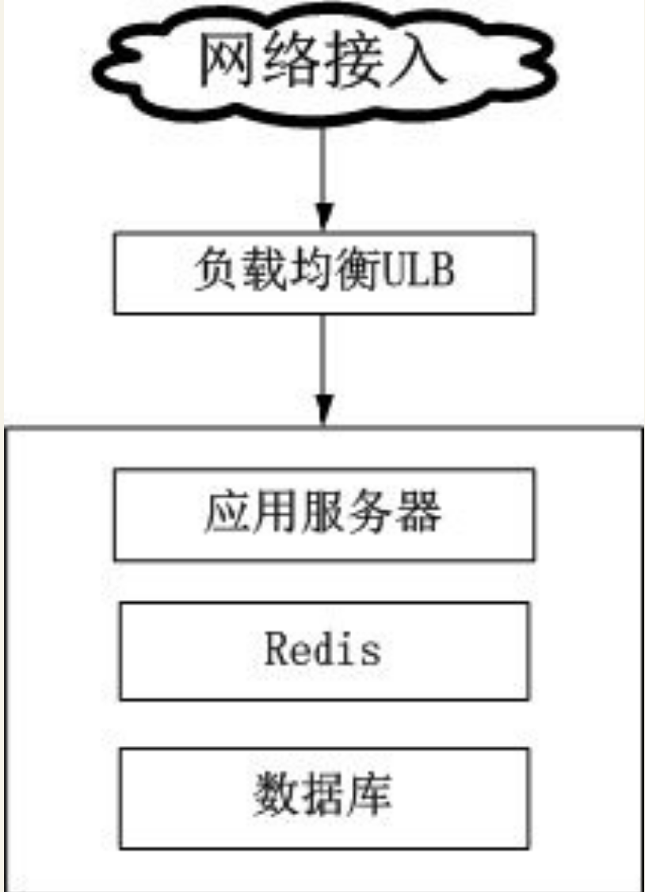
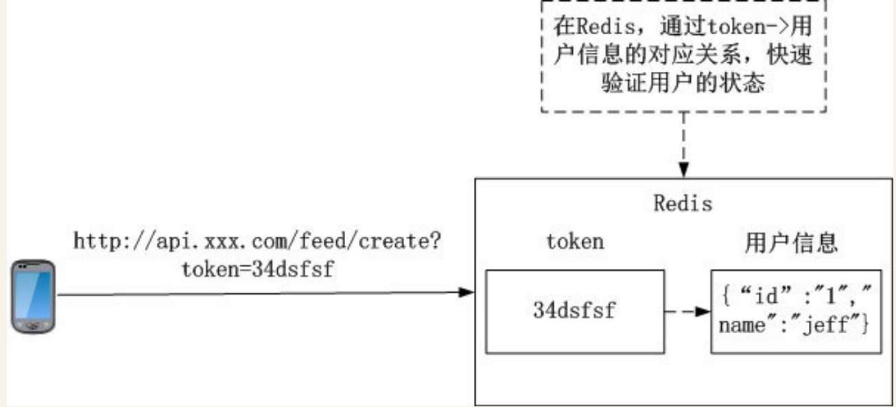
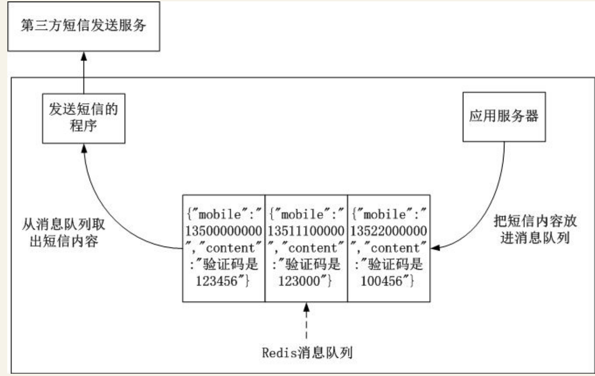
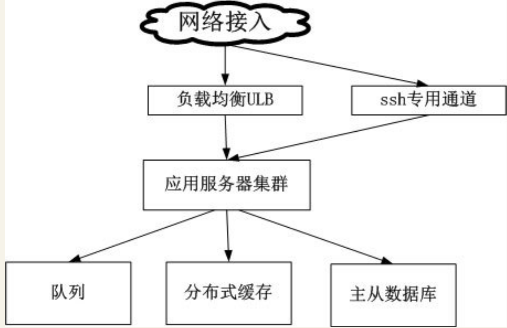
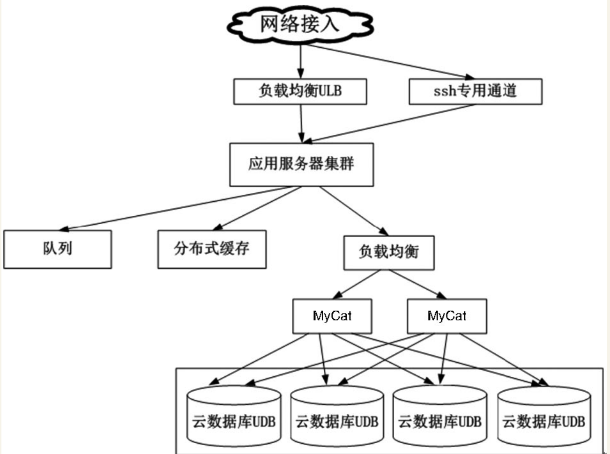
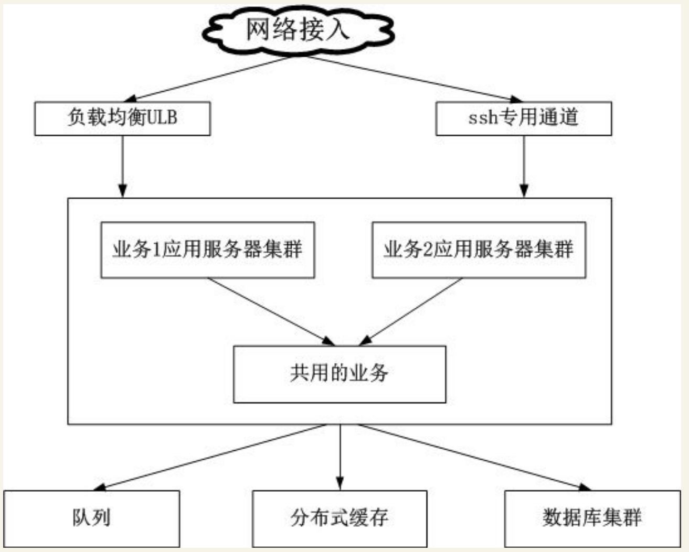
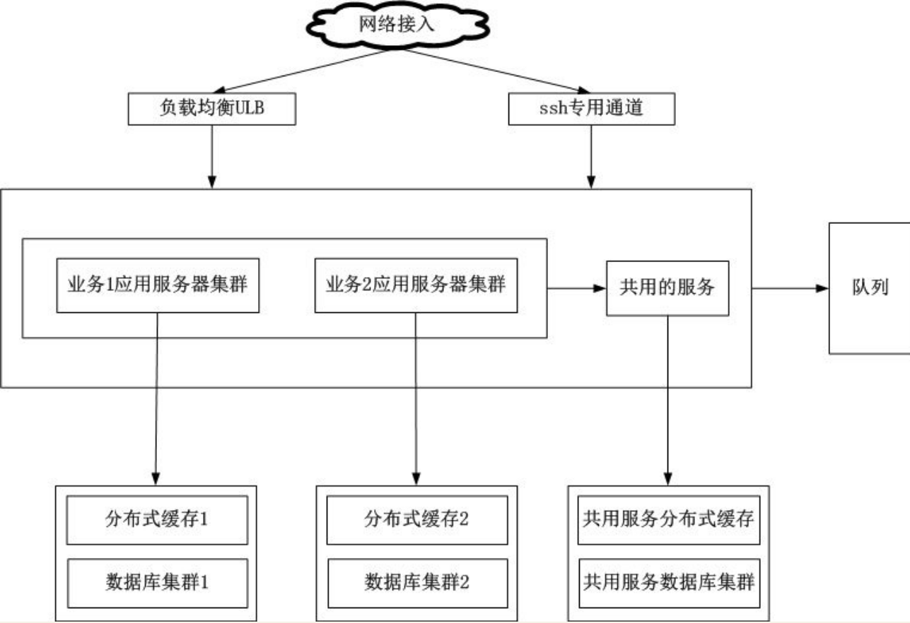

# 架构选型的要点


开发App后台，当需求初步确定后，就要考虑用什么技术去实现架构。基于架构设计的递进关系，笔者认为架构选型有如下两个要点。

·用成熟稳定的开源软件。

·优先选择云服务。


## 用成熟稳定的开源软件

用开源软件方案有下面两个原因。
``` 
·节省资金。
·非开源方案，如果不是被广泛使用而且没提供技术支持的话，出了问题也很难从代码层面查找。
```

以前由于开源软件的不成熟，没法满足公司业务上的需求，某些大型公司的基础组件需要采用自研的方案。随着时间的发展，众多开发者（甚至是公司）参与到开源软件的编写与反馈迭代工作，开源软件越来越成熟，众多开发者对其也越来越熟悉，使用开源软件在短时间内就能搭建一个成熟稳定的App后台。


当然也有不少的公司在开源软件的基础上，结合自身的业务特点对开源软件进行改造，
例如，淘宝就把其定制开发的`Nginx`版本命名为`Tengine`，并对其开源。

笔者之所以一直强调用成熟稳定的开源软件，是基于以下几点理由。
``` 
·由于成熟稳定的开源软件用户基数足够大，其内部出现的各种代码错误和功能缺陷极大可能已经被其他开发者反馈给开源软件团队修复。
·在使用开源软件的过程中出现的各种在使用者认知水平之外的问题，由于开源软件用户基数足够大，可能别的开发者也曾经遇过并解决了这些问题，能通过搜索引擎在网络上找到合适的解决方案。
  当使用非成熟稳定的开源软件时，出了什么问题在搜索无效的情况下，只能查看源码来定位问题，或者和软件的开发者沟通，看看有哪些解决问题的方案。
  但一般软件的开发者只留下E-Mail等非即时沟通方式，沟通并解决一个问题所需的时间周期很漫长。

·由于成熟稳定的开源软件被广大开发者所熟悉，也有庞大的用户群。在移动互联网行业人员的流动性比较大，如果采用自研的软件方案，新招聘的人员需要花大量的时间熟悉自研的软件方案，而采用成熟稳定的开源软件就不存在这个成本。

```


下面以这个具备了基本社交功能的App为例，列举其功能和项目管理中可供选择的开源软件方案。
``` 
·使用手机号、微博、QQ注册和登录。
·手机号注册需要使用验证码。
·用户之间能互相添加为好友。
·能搜索App内的用户。
·能查看附近的人。
·用户能发表类似微博的东西（包括文字、图片、声音和地理位置），并在App首页显示所有好友发表的内容。
·用户可以把内容分享到社交网络。
·聊天功能，能发送文字、图片、声音和地理位置。
·运营方可以给App用户推送各种产品消息、最新的通知等。
```

从上面这个App的功能实现和项目管理中可供选择的开源软件方案如下表所示。


可供选择的开源软件方案

功能 | 可使用的开源软件
---|---
项目管理工具 | Mantis、BugFree
代码管理工具 | SVN、GIT
编程语言 | PHP、Java、Python等
服务器软件 | CentOS、Ubuntu
HTTP服务 | Nginx、Tomcat、Apache
负载均衡 | Nginx、LVS、HAProxy
邮件服务| Postfix、Sendmail
消息队列| RabbitMQ、ZeroMQ、Redis
文件系统| Fastdfs、mogileFS、TFS（Taobao FileSystem）
Android推送| Androidpn、gopush
iOS推送| Javapns、Pyapns
LBS| MongoDB
聊天| Openfire、ejobberd
监控| ngios、zabbix
缓存| Memcache、Redis
关系型数据库| MySQL、postgreSQL
NoSQL数据库| Redis、MongoDB、Cassandra
搜索| Coreseek、Solr、ElasticSearch
图片处理|GraphicsMagick、ImageMagick
分布式访问服务|dubbo、dubbox


## 尽可能使用云服务

移动互联网时代涌现了大量小而美的创业型公司，这些公司由于受到资金的限制，研发人员的配置非常精简，典型的研发人员配置如下。
``` 
·Android开发1～2人。
·iOS开发1～2人。
·App后台开发1～2人。
```
用表列举了开发这个App所需要使用的开源软件，里面所需要使用的开源软件多达20个，想想都觉得可怕，一个开发人员掌握20个开源软件需要付出多少精力！这里的掌握还是指基本的配置和使用，如果需要对其原理和运作机制有深入的理解，所付出的精力更是无法评估。


随着云平台的不断发展，越来越多可复用场景的需求以云的形式提供服务，云服务也越来越完善。云服务和使用复杂多样的开源软件进行配置、运维相比，能极大地减少开发人员认知成本和运维成本，从而把精力专注于业务。


因此，笔者推崇创业公司的App后台的架构原则是，`“尽量使用成熟可靠的云服务和开源软件，自身只专注于业务逻辑”`。

功能实现和项目管理中可供选择的云服务如表

功能 | 可使用的云服务
---|---
项目管理工具 | Teambition、Tower
代码管理工具 | GitHub
负载均衡 | 阿里云负载均衡服务SLB，UCloud负载均衡服务ULB
邮件服务 | SendCloud、MailGun
消息队列 | 阿里云消息通知服务MNS
文件系统| 七牛、又拍云，阿里云对象存储OSS，UCloud对象存储UFile
Android推送| 极光、个推、百度推送
iOS推送| 极光、个推、百度推送
聊天| 融云、环信
监控| 监控宝、云服务器自带的监控服务
缓存| 阿里云开放缓存服务OCS，UCloud云内存存储UMem
关系型数据库| 阿里云云数据库RDS，UCloud云数据库UDB
NoSQL数据库| 阿里云开放结构化数据服务OTS，UCloud云内存存储UMem
搜索| 阿里云开放搜索服务OpenSearch
图片处理| 七牛、又拍云，阿里云对象存储OSS，UCloud对象存储Ufile等
分布式访问服务| 阿里云企业级分布式应用服务EDAS
防火墙| 阿里云云盾，UCloud防火墙
短信发送| bmob、shareSDK、Luosimao
社交登录分享| shareSDK


由于现在云服务的提供商越来越多，搜索相应的云服务比较麻烦，现在有网站把云服务收录起来并做了分类，以方便开发者查找。

### 列举两个提供这类服务的网站。

1．DevStore（http://www.devstore.cn/）

这个网站除了收集常用的开发者需要的云服务外，还收集设计、产品等相关的工具。这个网站的云服务分类界面如下图所示。

2．百度APIstore（http://apistore.baidu.com/）


## 架构的演进

### 单机部署

搭建一个能满足业务需求的最简化App后台架构。

App后台极简化架构



App后台极简化架构把HTTP服务器、应用服务器、Redis、数据库都部署在一台云服务器。


这个架构设计有3个关键点需要解释一下。

1．为什么要加入负载均衡ULB？
```
一般来说，只有在访问量达到一定的程度时，才需要使用负载均衡把请求分发到集群中的服务器，减轻单台服务器的压力。

因为UCloud的负载均衡ULB是免费的，在这个阶段提前使用负载均衡ULB，把外网的请求转发到云服务器，云服务器就不需要直接暴露在外网，增加整个架构的安全性，同时也不会增加额外的资金支出。

开发人员需要连接云服务器的ssh服务，只需要在负载均衡ULB中把ssh端口的请求转发到云服务器的ssh端口，就能通过ssh操作云服务器。
```

2. 为什么一开始就使用Redis？

因为Redis既能用作缓存，又能充当队列服务，使用同样的软件减轻运维的负担。同时其并发性能高，能在长时间内应对业务压力，非常适于初期的项目。

在这个业务时期，Redis具有下面的作用。

（1）验证用户信息

在需要用户登录的App中，为了保持应用服务器的无状态，在需要验证用户信息的场景，每次App的请求附带用户的信息来验证用户的状态，由于每次App的请求都要验证信息，这种访问频次非常高的用户信息行为应该在Redis中进行，如图


在Redis中验证用户信息示意图


（2）充当消息队列
这个阶段架构的要求是极简化设计，但极简化设计不能牺牲用户体验。

在App中，有个常见的响应时间比较长的功能需求：发送验证码。

用户注册的时候，App为了获取用户真实的社交关系，需要获取用户的手机号和手机通信录信息，获取手机号时为了验证手机号的真伪，要通过手机验证码验证手机号，但由于发送手机验证码只能通过第三方的短信发送平台发送，因此发送验证码功能有可能响应时间比较长。

为了使发送手机验证码这个功能不影响API接口的响应时间，通常的做法是把发送验证码的功能放在消息队列中处理，在这里Redis充当消息队列的角色，

如图



3．架构中不包含文件服务
文件服务作为App后台中使用得非常频繁的服务，在服务器中搭建文件服务有下面一系列运维和开发成本。

```
·当容量不足时，要及时给文件系统扩容。
·图片的缩略、剪裁、水印等常见功能都需要研发。
·为了保证文件服务的高可用，最少需要两台文件服务器做互备。
·为了获得更快的文件上传和下载速度，需要更大的带宽，但带宽的成本非常高（视频网站的财务报表显示，带宽的支出占总收入的30%以上），为了提升用户体验投入这么多的资金不划算。
```

开发人员在架构App后台、涉及文件服务的时候，都应该考虑以上的问题。

笔者一向推崇的架构原则是，`“尽量使用成熟可靠的云服务和开源软件，自身只专注于业务逻辑”` ，使用文件云存储服务后以上的问题都能解决。文件云存储服务有如下的优点。
``` 
·全网加速，根据使用场景选择最优的加速线路。
·云端数据处理，图片缩略、剪裁、水印等常见操作都能通过相应的API实现，无须再重复造轮子。
·安全存储，多机房互相备份，保证数据安全性。
·存储无上限、支持高并发访问。
·按下载量计费的付费模式更加灵活，节省更多的流动资金。
```

#### 笔者以CentOS系统为例，列举4种能快速安装Nginx+PHP+Redis+MySQL的方法。

（1）使用yum i nstall命令，很快就能把Nginx+PHP+Redis+MySQL环境安装完。但这种方法不推荐，因为这种方法安装的软件无法配置具体的编译参数，太多不可控的因素。

（2）在使用云服务器提供的镜像市场中选择镜像安装。

（3）使用一键安装包

```
网络上有很多一键安装包，只要输入相应的软件版本和安装路径后，能很方便地安装相应的软件，例如lnmp一键安装包（http://www.lnmp.org/）和ezhttp一键安装包（https://github．com/centos-bz/ezhttp）。
如果安装某个软件需要修改其编译参数，则查找安装脚本对应的部分修改就行。
```

（4）Docker
```
Docker是用于统一开发和部署的轻量级Linux容器，让开发者打包其应用及相关的依赖包到一个可移植的容器中，再发布到生产环境。
通过Docker能保证开发者机器和生产服务器上的软件环境是一致的。
```


在这一阶段，随着业务的发展，云服务器的性能慢慢不能应对增长的访问量，这时就有两种升级选择。
``` 
·硬件升级（scale up）
·独立部署、集群或分布式（scale out）
```

在这个阶段，笔者认为应该是优先选择硬件升级（scale up）的方案，通过升级相应硬件（CPU、内存、带宽等）来解决性能问题。

优先使用硬件升级（scale up）有下面几点原因。
``` 
·云服务器升级硬件非常方便，在控制台选择相应的配置、付款、重启云服务器，5分钟不用就完成升级。
·如果选择独立部署、集群或分布式（scale out），需要额外的运维成本。这是个野蛮生长的时期，产品处于不断摸索的阶段，开发人员应该把精力专注于业务和打磨产品上，尽量保持极简化架构，不应该花费太多的精力在运维。
```

由于每个App的业务不一样，可能某些App后台把硬件配置升级到极限也没法应付访问量上的压力，
这时就要根据具体的业务情况选择独立部署、集群或分布式（scale out）这些架构升级的方案。
而这些方案中，独立部署是成本最低的，集群或分布式的成本较高，优先考虑低成本的升级方案。

这个阶段的总结如下。
``` 
·优先考虑使用云服务和熟悉的开源软件，降低人力和时间成本。
·重视迭代速度，避免过度设计，务必先让后台能用。
·优先考虑硬件升级（scale up）。
```

### 分布式部署
分布式部署阶段研发任务依然很重，架构特点是原有的单机部署架构已经不足以支撑业务的发展和高性能、高可用的要求，需要考虑某些组件独立部署、集群或分布式等架构方案，依然优先考虑云服务完成这些架构方案。
在这个阶段，架构演进如图


当业务不断发展，数据库分表后的读写性能也可能没法满足业务上的需求，
这时只能采用进一步的拆分策略：分库。用`Cobar`或`MyCat`等关系型数据的分布式处理系统后，
分库的架构如图


关于MySQL的主从、分表、分库等优化策略

如果数据库是使用MongoDB，则可以采用其原生的副本集、分片等优化策略

这个阶段的总结如下。
``` 
·开始考虑高性能和高可用，优先使用云服务商提供的基础组件来确保高性能和高可用，当云服务无法满足需求时，才考虑使用第三方开源软件。
·继续保持快速迭代速度。
```

### 服务化
随着业务越来越复杂，App后台聚合了大量的应用和服务，各个模块之间有很多功能重复实现，造成了开发、运维、部署的麻烦。同时，业务发展伴随着研发人员增加，代码变得更多，使用的技术和语言也会越来越多，App后台维护成本高。


为了应对越来越复杂的业务，通过分而治之的方法把App后台根据业务拆分为不同的模块，各个模块之间，互相独立，功能明确。同时把一些各自模块共同的业务需求提炼为公共的服务。按业务拆分后，
架构如图


随着业务越来越大，App后台对读写的性能要求越来越高，所有服务器都需要和数据库以及缓存连接，
在数百、数千台规模的服务器集群中，频繁的数据库读写请求有可能造成数据库连接资源不足，
同时为了避免不同业务之间的相互影响（例如某个业务有慢查询导致整个数据库的性能急剧下降，从而影响到其他业务的查询），因此为了取得更好的稳定性，把缓存和数据库集群按照业务继续拆分，不同的业务使用不同的缓存和数据库。

这个阶段的总结如下。
``` 
·架构的核心要素（高性能、高可用等）逐渐成为主角。
·迭代速度放慢，业务渐渐趋于稳定。
```

架构如图

**注意**： 本节描述的是一般的App后台架构的发展，由于每个App的业务特性不一样，不一定适用于每个App。


不同的业务模块使用不用的缓存和数据库



