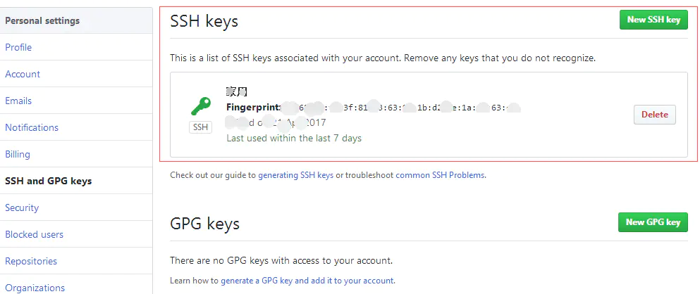
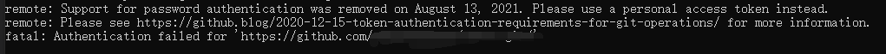
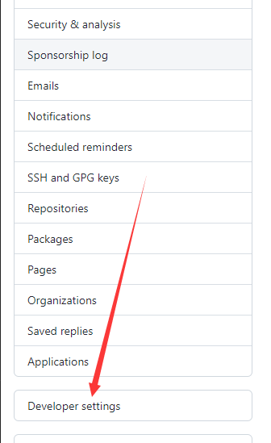
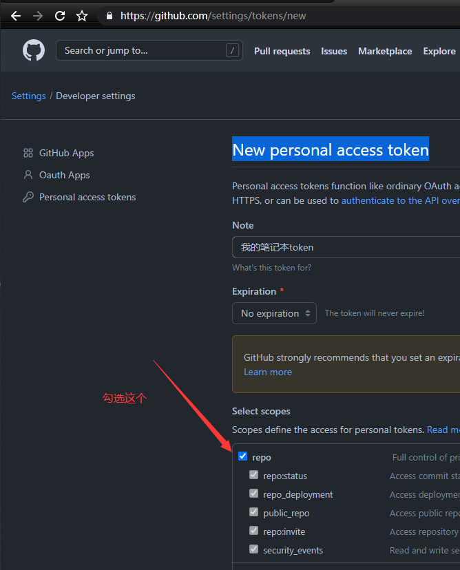
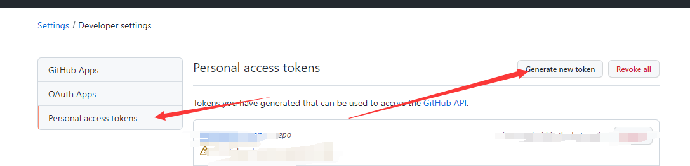

## 一、Linux下安装部署MySQL

## 二、Windows下安装部署MySQL
1. 秘钥配置

```
# 清除之前的用户邮箱配置
git config --global --unset user.name "YourName"
git config --global --unset user.email "YourEmail"
# 生成Github秘钥
ssh-keygen -t rsa -C "YourGIthubEmail@mail.com" -f "github_id_rsa"
# 生成Gitee秘钥
ssh-keygen -t rsa -C "YourGiteeEmail@mail.com" -f "gitee_id_rsa"
```  
上述代码执行完成后，会连续多次要求输入密码。注意：此时请不要输入密码。


打开.ssh文件夹下的.pub文件的内容，全部复制。然后登录你的git服务器个人账户设置中，寻找ssh key菜单项，然后粘贴即可。


2. 用户配置
在`~/.ssh`文件夹下新建`config`文件，添加以下内容

```
# gitee
Host gitee.com
HostName gitee.com
PreferredAuthentications publickey
IdentityFile ~/.ssh/gitee_id_rsa

# github
Host github.com
HostName github.com
PreferredAuthentications publickey
IdentityFile ~/.ssh/github_id_rsa
```

3. 异常处理
推送时遇到密码登录不对，从github获取新的`token`当做密码登录



