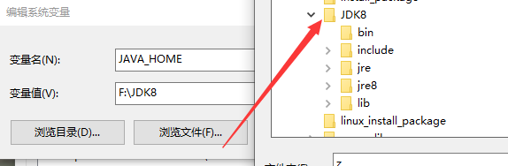

## 一、Linux下安装配置JDK
1. 准备安装包，在`/usr/local/`下创建`java`目录并进入

```
cd /usr/local/
mkdir java
cd java
```
2. 将准备好的安装包解压到当前

```
tar -zxvf /root/installpck/jdk-8u161-linux-x64.tar.gz -C ./
```
3. 编辑`/etc/profile`⽂件，在⽂件尾部加⼊环境配置变量

```
vim /etc/profile
```
```
JAVA_HOME=/usr/local/java/jdk1.8.0_161
CLASSPATH=$JAVA_HOME/lib/
PATH=$PATH:$JAVA_HOME/bin
export PATH JAVA_HOME CLASSPATH
``` 
4. 刷新环境变量

```
source /etc/profile
```
5. 检查安装结果

```
java -version
javac
```


## 二、Windows下安装配置JDK
1. 下载安装包运行安装，自行选择安装路径
2. 配置环境变量`JAVA_HOME`,选择安装Java的路径



3. 配置环境变量`CLASSPATH`
变量值：

```
.;%JAVA_HOME%\lib\dt.jar;%JAVA_HOME%\lib\tools.jar;
```
4. 环境变量`Path`中新增变量

```
%JAVA_HOME%\bin
%JAVA_HOME%\jre\bin
```
注意：后边这个jre的目录，必须去看看是不是在JAVA_HOME下，不是的话自己更正为jre下的bin目录即可！！！！！！！


