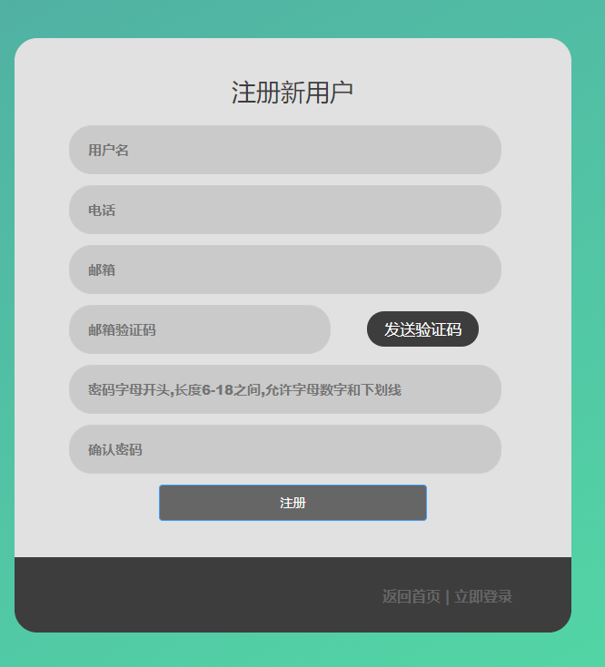

# 校园二手交易市场

## 详细描述
```
SpringBoot+MyBatis+Vue+MySQl原创校园二手交易市场（网上商城、电商平台），有需求可以有开发文档以及相关的基数说明。
基本功能如下（包运行成功，其他环境部署如Java、IDEA、MySQl、Nodejs\vue环境安装配置加20：
┌── 用户
│   ├── 注册登录
│   ├── 随机图片验证码登陆 
│   ├── 邮箱验证码注册 
│   ├── 邮箱验证码找回密码 
│   ├── 主页商品展示、查找 
│   ├── 商品分类查找 
│   ├── 商品分类查找 
│   ├── 商品分类查找 
│   ├── 商品详情展示 
│   ├── 收藏商品 
│   ├── 我的订单 
│   ├── 个人中心修改密码 
│   ├── 个人中心修改个人信息 
│   ├── 个人中心修改申请学生认证
│   ├── 个人中心修改申请商家认证
│   ├── 个人中心修改申请商家认证
│   ├── 商家服务管理我的寄售 
│   ├── 商家服务新增我的寄售 
│   ├── 商家服务查看我的店铺订单
│   ├── 投诉某用户   
│   └── 查看某用户评价、商品  
└── 管理员
    ├── 登陆  
    ├── 用户信息管理  
    ├── 用户信息查看  
    ├── 用户身份审核  
    ├── 主页轮播图管理
    ├── 商品种类管理  
    ├── 商品信息管理  
    ├── 订单信息查看  
    ├── 用户评论管理  
    ├── 用户投诉管理  
    ├── 用户申诉管理  
    └── 系统日志查看  
```

## 主要图片展示





