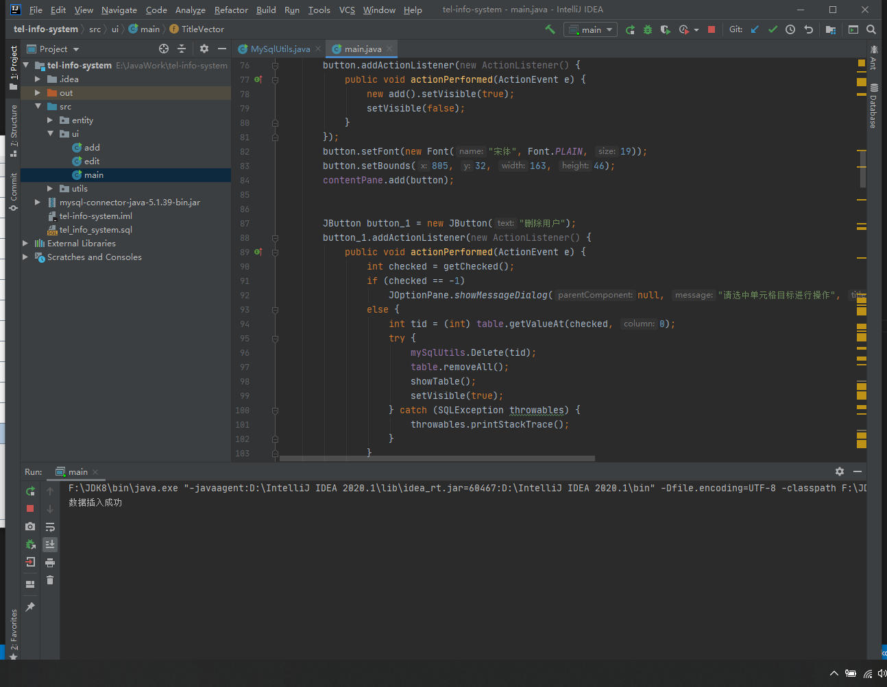
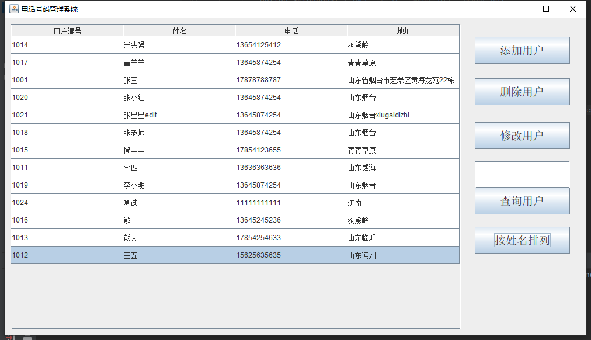
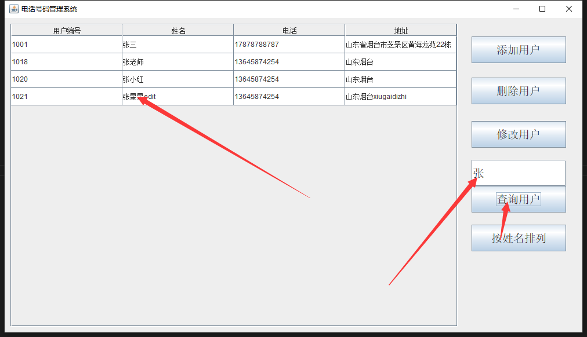

# 基于JavaSwing的电话号码管理系统


## 技术栈
基于JavaSwing+MySQL的电话号码管理系统(窗口界面)
## 功能描述
```
基于JavaSwing+MySQL的电话号码管理系统(窗口界面)
（包运行成功，其他环境部署如Java、MySQL安装配置加20）
购买须知：纯原创，页面比较简陋，适合新学Java的参考，有较高美观要求提前私聊说一下。

开发环境：
Java:JDK1.8
IDE:intellij IDEA 
数据库：Mysql5.7

功能描述：
┌── 用户电话列表展示
├── 添加用户信息
├── 删除用户信息
├── 修改用户信息
├── 查询用户信息
└── 按名称进行排序
```



