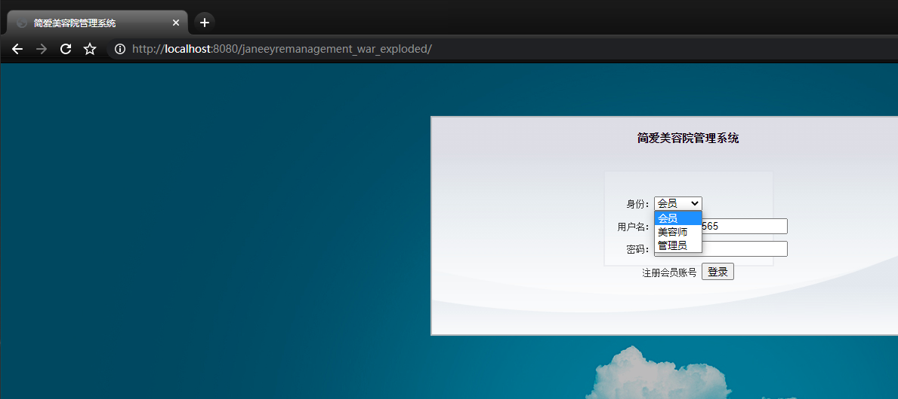
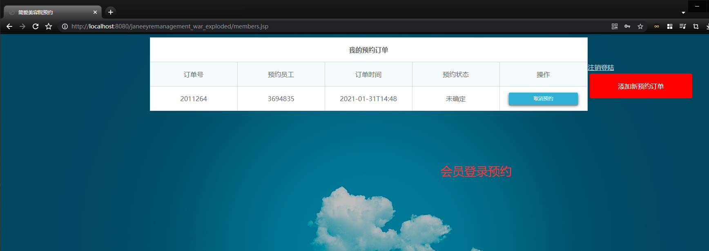
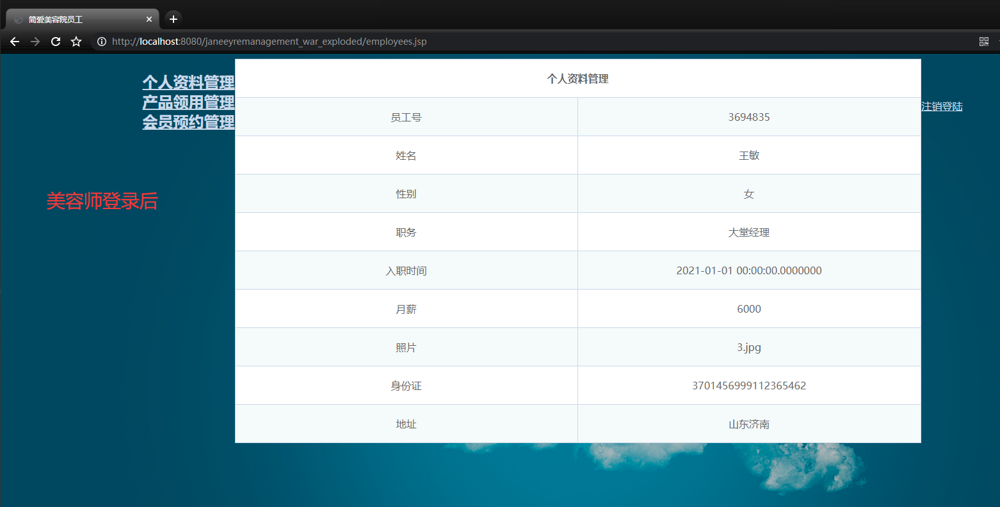
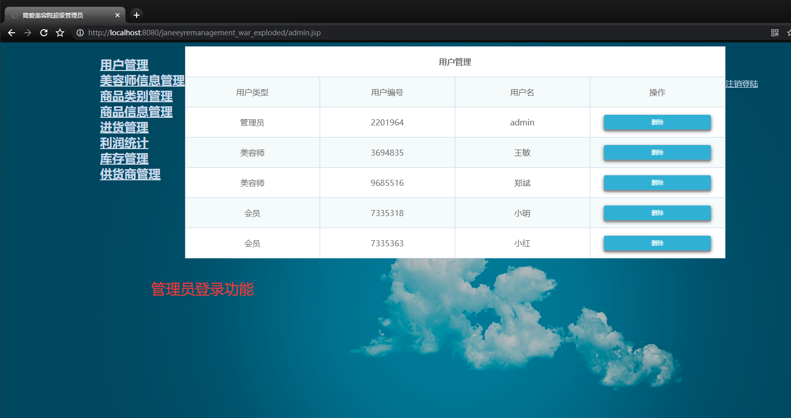
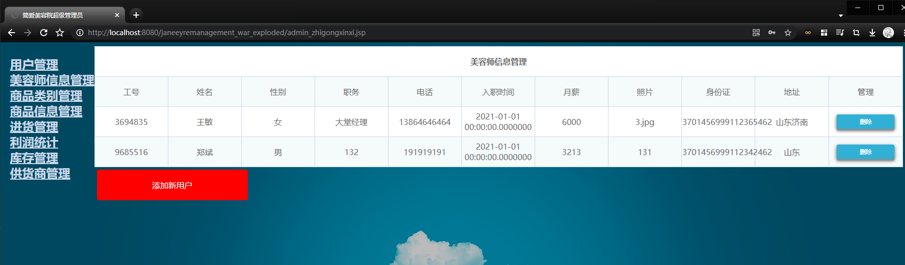
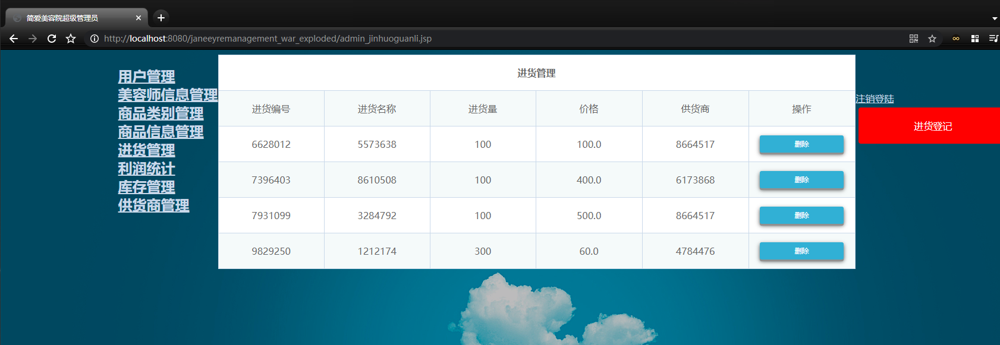
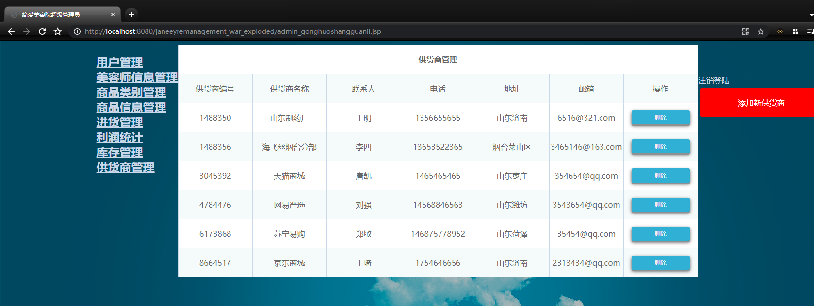
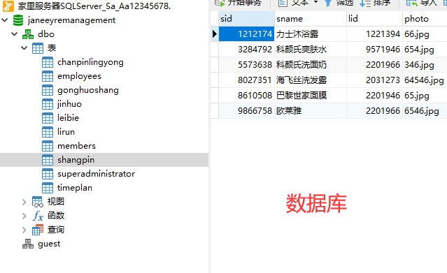

# 美容院管理系统

## 详细描述
```
Servlet+SQLServer原生前端页面的美容院管理系统,初学Java适用的技术，没有新技术

基本功能如下（包运行成功，其他环境部署如Java、IDEA、SQLServer环境安装配置加20，因为是原生前端，所以做的不好看但是功能全部都是完整的，需要美观的就看下别的叭）：
┌── 会员
│   ├── 注册登录
│   ├── 预约美容师
│   └── 退出登录
├── 美容师
│   ├── 登录
│   ├── 个人信息管理
│   ├── 产品领用管理
│   ├── 会员预约确认
│   └── 退出登录
└── 管理员
    ├── 登录
    ├── 用户账号管理
    ├── 美容师信息管理
    ├── 商品类别管理
    ├── 商品信息管理
    ├── 进货管理
    ├── 库存管理
    ├── 供货商管理
    └── 退出登录
```

## 主要图片展示








